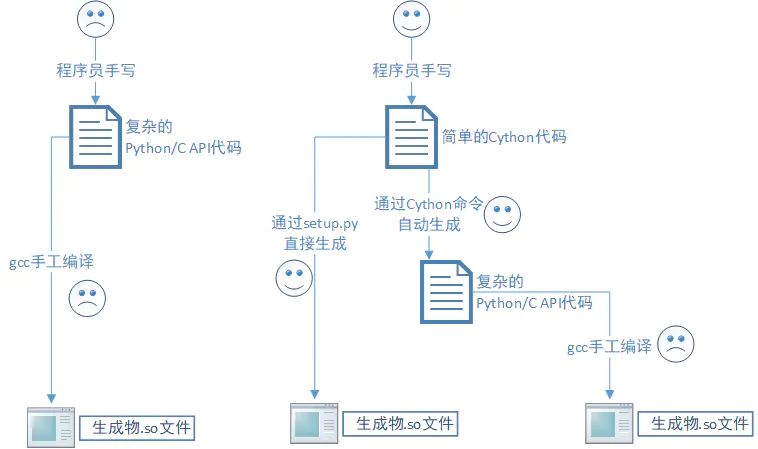

## 目录
[toc]

## 1 `Pillow`
`Pillow` 是第三方图像处理标准库`PIL`（Python Imaging Library）的兼容版本的名字。

### 1.0 图像概念

参考来源：[Concepts](https://pillow.readthedocs.io/en/stable/handbook/concepts.html#concept-modes)

#### 1.0.1 Bands

图像可以**由一个或多个通道（bands）组成**。Python 图像库允许在一个图像中存储多个 bands，前提是它们都具有相同的尺寸和深度。例如，PNG图像可能具有 “R”、“G”、“B” 和 “A” 四个通道，分别表示红色、绿色、蓝色和 alpha 透明度值。

许多操作分别作用于每个波段，例如直方图，因此把每个像素看作是**具有多个通道值的向量**通常是更佳。

要获取图像中通道的数目和名称，可以使用 `getbands()` 方法。

#### 1.0.2 Modes

图像的模式（mode）是一个字符串，它定义了**图像中像素的类型和深度**。

每个像素使用位深度的所有范围，所以 1-bit 像素的范围是 `0-1`，8-bit 像素的范围是 `0-255`，依此类推。

当前版本支持以下 `mode`：

* `1` (1-bit pixels, black and white, stored with one pixel per byte)
* `L` (8-bit pixels, black and white)
* `P` (8-bit pixels, mapped to any other mode using a color palette)
* `RGB` (3x8-bit pixels, true color)
* `RGBA` (4x8-bit pixels, true color with transparency mask)
* `CMYK` (4x8-bit pixels, color separation)
* `YCbCr` (3x8-bit pixels, color video format)

### 1.1 图像模块

`PIL.Image` - 图像模块，包含一系列工厂函数，一般<u>不直接构造</u>其中的 `PIL.Image.Image`类，而是使用下面几个库函数产生。

**图像构造函数：**

* `PIL.Image.open(file_name, mode='r')` - 打开图片文件对象，返回 `PIL.Image.Image` 对象

* `PIL.Image.new(mode, (width, height), color=0)` - 创建纯色图像，`mode` 表示图像的像素类型与深度模式（如 `RGB`），返回 `PIL.Image.Image` 对象

* `PIL.Image.fromarray(obj, mode=None)` - 从数组中创建图像，返回 `PIL.Image.Image` 对象

  * `obj` - 有数组接口的对象
  * `mode` - 使用的图像模式，见 `1.0.2 Modes`

  例子：图像 NumPy 数组与 `PIL.Image.Image` 直接的转换，见 `1.5 类型转换`。

* `PIL.Image.frombytes(mode, size, data, decoder_name='raw', *args)` - 从二进制数据中创建图像，返回 `PIL.Image.Image` 对象

  * `mode` - 使用的图像模式，见 `1.0.2 Modes`
  * `size` - 图像大小
  * `data` - bytes 数据
  * `decoder_name` - 解码器类型，`str`
  * `args` - 传入 `decoder_name` 所指向的 `decoder` 的参数

  【注】该函数**只解码能表示为图像的数据部分**，如果有完整的图像数据字符串，请封装为 `BytesIO` 对象，然后使用 `open` 载入。

* `PIL.Image.frombuffer(mode, size, data, decoder_name='raw', *args)` - 从二进制数据缓存中创建图像，返回 `PIL.Image.Image` 对象

  * 类似 `PIL.Image.frombytes()`

**图像类及其方法：**

`PIL.Image.Image` - 图像支持<u>类</u>，提供 open、save 的支持函数，下面的实例方法都返回修改后的 `PIL.Image.Image` 对象

* `size` - 返回图像的长宽二元组，`PIL.Image.Image` 对象属性

* `format` - 返回图像格式，`PIL.Image.Image` 对象属性

* `save(file_name, type)` - 按照指定名字和格式存储图片

* `show(title=None, command=None)` - 显示图片

* `thumbnail(width, height)` - 用于**缩放**文件，直接修改对象

* `filter(filter)` - 使用指定的**滤波器（`PIL.ImageFilter`中）**对图像像素点进行过滤

* `convert(mode=None, matrix=None, dither=None, palette=0, colors=256)` - 转换图像的模式

  * `mode` - 使用的图像模式，见 `1.0.2 Modes`
  * `matrix` - 可选的转换矩阵，必须是保存浮点数的 `4-` 或 `12-` tuple 数据
  * `dither` - 抖动方法，在 `RGB-P` 或 `RGB->1` 或 `RGB->L` 的过程中使用，与 `matrix` 不同时使用
  * `palette` - 当 `RGB->P` 时的调色板，可选 `'WEB'` 或 `'ADAPTIVE'`
  * `colors` - 对 `'ADAPTIVE'` 的 `palette` 值可用的颜色数，默认 `256`

  ```python
  rgb2xyz = (
      0.412453, 0.357580, 0.180423, 0,
      0.212671, 0.715160, 0.072169, 0,
      0.019334, 0.119193, 0.950227, 0)
  out = im.convert("RGB", rgb2xyz)
  ```

* **其他功能**：切片、旋转、滤镜、输出文字、调色板等等，详细信息参考 `Pillow` 帮助文档

### 1.2 滤波器模块

`PIL.ImageFilter` - 滤波器模块，包含预先定义的滤波器

* `PIL.ImageFilter.BLUR` - 预定义的模糊滤波器

### 1.3 绘图模块

`PIL.ImageDraw` - 绘图模块，用于绘制新图像或修改已有的图像

* `PIL.ImageDraw.Draw(image, mode=None)` - 包装 `PIL.Image.Image` 对象，返回可绘制对象
* `point((x,y), fill=None)` - `draw` 对象的实例方法，填充指定像素点
* `fill((x, y), text, fill=None, font=None` - `draw` 对象的实例方法，在指定位置绘制字符串

### 1.4 字体模块

`PIL.ImageFont` - 字体模块，此类实例存储字体文件的二进制数据，以便操作

* `PIL.ImageFont.truetype(font=None, size=10)` - 读取 ttf 或 otf 字体文件，返回字体对象

例如：

```python
from PIL import Image

im = Image.open('photo.png') # 打开图像文件
w, h = im.size # 获取图像尺寸m
print('Original image to size: %s %s' % (w, h))
im.thumbnail((w//2, h//2)) # 缩放50%
print('Resize image to: %s %s' % (w//2, h//2))
im.save('thumbnail.jpg', 'JPEG') # 保存缩放图像

im2 = Image.open('photo.png') # 打开图片
im2 = im2.filter(ImageFilter.BLUR)
im2.save('blur.jpg', 'jpeg')
```

### 1.5 类型转换

1. 图像转换为矩阵（`PIL.Image.Image -> np.ndarray`）

   ```python
   matrix = numpy.asarray(image, dtype=np.uint8)    
   ```

   ```c++
   // 读取图像并转换为矩阵
   img = np.array(Image.open(img_path).convert('RGB'), dtype=np.uint8)
   ```

2. 矩阵转换为图像（`np.ndarray -> PIL.Image.Image`）

   ```python
   image = Image.fromarray(matrix)
   ```

### 1.6 案例演示

**生成字母验证码**

```python
from PIL import Image, ImageDraw, ImageFont, ImageFilter
import random

# 随机字母
def rndChar():
    return chr(random.randint(65, 90))

# 随机颜色1
def rndColor1():
    return (random.randint(64, 255), random.randint(64, 255), random.randint(64, 355))

#随机颜色2
def rndColor2():
    return (random.randint(32, 127), random.randint(32, 127), random.randint(32, 127))

# 240x60:
width = 60 * 4
height = 60
image = Image.new('RGB', (width, height), (255, 255, 255))
# 创建Font对象
font = ImageFont.truetype(r'C:\Windows\Fonts\Arial.ttf', 36)
# 创建Draw对象
draw = ImageDraw.Draw(image)
# 填充每个像素
for x in range(width):
    for y in range(height):
        draw.point((x, y), fill=rndColor1())
	# 输出文字
for t in range(4):
    draw.text((60*t+10, 10), rndChar(), font = font, fill = rndColor2())
	# 模糊
image = image.filter(ImageFilter.BLUR)
image.save('code.jpg', 'jpeg')
```

### 1.7 常见问题处理

> Image file is truncated

解法一：删除截断图片

解法二：添加两行代码

```python
from PIL import ImageFile
ImageFile.LOAD_TRUNCATED_IMAGES = True
```

> The size of tensor a (4) must match the size of tensor b (3) at non-singleton

有的图片是四通道，导致了上面的问题，解决办法如下。

读取图片时，把 `img = Image.open(cur_img_path)` 改写成 `img = Image.open(cur_img_path).convert('RGB')`。

## 2 `requests`

`requests` 是第三方URL资源处理库，相比内置的 `urllib` 模块，有很多高级功能。

### 2.1 访问方法

* **`head(url)`** - 发送 HEAD 请求，返回 `request.Response` 对象，**在模块 `requests` 内**
* **`get(url, params=None)`** - 发送 GET 请求，返回 `request.Response` 对象，`params` 为 `dict` 或 `bytes` 类型的查询字符串，**在模块 `requests` 内**
* **`post(url, data=None, json=None)`** - 发送 POST 请求，返回 `request.Response` 对象，**在模块 `requests` 内**
* **`put(url, data=None)`** - 发送 PUT 请求，返回 `request.Response` 对象，**在模块 `requests` 内**
* **`patch(url, data=None)`** - 发送 PATCH 请求，返回 `request.Response` 对象，**在模块 `requests` 内**
* **`delete(url)`** - 发送 DELETE 请求，返回 `request.Response` 对象，**在模块 `requests` 内**

可选参数：

* `headers` - 表示请求附加的`headers`，`dict`类型或`HTTP headers`类型
* `json` - 表示请求附加的`json`数据，`dict`类型（自动序列化）或`json`类型
* `files` - 表示请求附加的文件数据，`dict`类型：
	* `{'name': file-like-object}`
	* `{'name': ('file-name', fileobj)}`
	* `{'name': ('file-name', fileobj, 'content-type')}`
	* `{'name': ('file-name', fileobj, 'content-type', custom-headers-dict)}`
* `cookies` - 表示请求附加的Cookie，`dict`类型
* `timeout` - 设置请求的超时时间

注意：

file-like-object为读取文件时，必须用二进制形式读取。

### 2.2 相关类

**`requests.Response` - 响应类，包含HTTP请求的响应内容**

* **`status_code`** - `Response`对象的属性，返回HTTP响应的状态码
* **`text`** - `Response`对象的属性，返回unicode编码的响应内容（网页源码）
* **`url`** - `Response`对象的属性，返回最终的URL
* **`encoding`** - `Response`对象的属性，检测并返回响应内容的编码方式
* **`content`** - `Response`对象的属性，返回`bytes`类型的响应内容
* **`headers`** - `Response`对象的属性，返回header数据的字典类型
* **`cookies`** - `Response`对象的属性，返回Cookie对象，对外接口为`dict`（故有dict的访问方法）
* **`json()`** - `Response`对象的实例方法，获取`json`形式的响应内容（如果有）

## 3 `chardet`
`chardet`是用于检测编码的第三方库。

* `detect(byte_str)` - 检测指定二进制字符串的编码，**在模块`chardet`内**

`chardet`目前支持的编码：

* `Big5`, `GB2312`/`GB18030`, `EUC-TW`, `HZ-GB-2312`, and `ISO-2022-CN` (Traditional and Simplified Chinese)
* `EUC-JP`, `SHIFT_JIS`, and `ISO-2022-JP` (Japanese)
* `EUC-KR` and `ISO-2022-KR` (Korean)
* `KOI8-R`, `MacCyrillic`, `IBM855`, `IBM866`, `ISO-8859-5`, and `windows-1251` (Russian)
* `ISO-8859-2` and `windows-1250` (Hungarian)
* `ISO-8859-5` and `windows-1251` (Bulgarian)
* `ISO-8859-1` and `windows-1252` (Western European languages)
* `ISO-8859-7` and `windows-1253` (Greek)
* `ISO-8859-8` and `windows-1255` (Visual and Logical Hebrew)
* `TIS-620` (Thai)
* `UTF-32` BE, LE, 3412-ordered, or 2143-ordered (with a BOM)
* `UTF-16` BE or LE (with a BOM)
* `UTF-8` (with or without a BOM)
* `ASCII`

例如：

```python
>>> import chardet

>>> data = '人只有认识到自己的弱小后，才能变得温柔与坚强'.encode('utf-8')
>>> chardet.detect(data)
{'confidence': 0.99, 'encoding': 'utf-8', 'language': ''}

>>> data_2 = '人は自分の弱さを知るだけで、優しさと強さになる'.encode('euc-jp')
>>> chardet.detect(data_2)
{'confidence': 1.0, 'encoding': 'EUC-JP', 'language': 'Japanese'}
```

## 4 `psutil`
`psutill`即process and system utilities，是用来进行系统监控和维护的第三方模块。

### 4.1 获取CPU信息
* **`cpu_count(logical=True)`** - 获取CPU逻辑数量，`logical=True`表示物理核心，**在模块`psutil`内**
* **`cpu_times()`** - 统计CPU的用户、系统、空闲时间，**在模块`psutil`内**
* **`cpu_percent(interval=None, percpu=False)`** - 获取CPU的核心使用率，`interval`表示间隔，`percpu`表示平均显示，**在模块`psutil`内**

例如：

```python
>>> import psutil
>>> psutil.cpu_count() # 获取CPU逻辑核心数量
4
>>> psutil.cpu_count(logical=False) # 获取CPU物理核心数量
4
>>> psutil.cpu_times() # 统计CPU的用户、系统、空闲时间
scputimes(user=1462.8994140625, system=960.888671875, idle=21788.03515625, inte
rupt=75.73848295211792, dpc=52.915541648864746)
>>> for x in range(5):
...     psutil.cpu_percent(interval=1, percpu=True) # 获取CPU的核心使用率
...
[9.2, 3.1, 6.3, 7.7]
[11.8, 7.8, 0.0, 3.1]
[7.6, 1.5, 3.1, 0.0]
[7.6, 6.3, 12.5, 6.2]
[3.1, 7.8, 1.6, 1.6]
```

### 4.2 获取内存信息
* **`virtual_memory()`** - 获取物理内存信息，**在模块`psutil`内**
* **`swap_memory()`** - 获取交换内存信息，**在模块`psutil`内**

例如：

```python
>>> psutil.virtual_memory() # 获取物理内存信息
svmem(total=8467443712, available=5212651520, percent=38.4, used=3254792192, fr
e=5212651520)
>>> psutil.swap_memory() # 获取交换内存信息
sswap(total=16932982784, used=3661840384, free=13271142400, percent=21.6, sin=0
sout=0)
```

### 4.3 获取磁盘信息
* **`disk_partitions()`** - 获取磁盘分区信息，**在模块`psutil`内**
* **`disk_usage(path)`** - 获取指定路径的磁盘使用情况，**在模块`psutil`内**
* **`disk_io_counters()`** - 获取磁盘IO情况，**在模块`psutil`内**

例如：

```python
>>> psutil.disk_partitions() # 获取磁盘分区信息
[sdiskpart(device='C:\\', mountpoint='C:\\', fstype='NTFS', opts='rw,fixed'), s
iskpart(device='D:\\', mountpoint='D:\\', fstype='NTFS', opts='rw,fixed'), sdis
part(device='E:\\', mountpoint='E:\\', fstype='NTFS', opts='rw,fixed'), sdiskpa
t(device='F:\\', mountpoint='F:\\', fstype='NTFS', opts='rw,fixed'), sdiskpart(
evice='G:\\', mountpoint='G:\\', fstype='NTFS', opts='rw,fixed'), sdiskpart(dev
ce='H:\\', mountpoint='H:\\', fstype='NTFS', opts='rw,fixed')]
>>> psutil.disk_usage('/') # 获取指定路径的磁盘使用情况
sdiskusage(total=85899374592, used=56444694528, free=29454680064, percent=65.7)
>>> psutil.disk_io_counters() # 获取磁盘IO情况
sdiskio(read_count=106122, write_count=46628, read_bytes=2888293888, write_byte
=866296832, read_time=382, write_time=104)
```

### 4.4 获取网络信息
* **`net_io_counters()`** - 获取网络读写字/包的个数，**在模块`psutil`内**
* **`net_if_attrs()`** - 获取网络接口信息，**在模块`psutil`内**
* **`net_if_stats()`** - 获取网络接口状态，**在模块`psutil`内**
* **`net_connections()`** - 获取当前网络连接信息，**在模块`psutil`内**

例如：

```python
>>> psutil.net_io_counters() # 获取网络读写字节／包的个数
snetio(bytes_sent=3885744870, bytes_recv=10357676702, packets_sent=10613069, packets_recv=10423357, errin=0, errout=0, dropin=0, dropout=0)
>>> psutil.net_if_addrs() # 获取网络接口信息
{
'lo0': [snic(family=<AddressFamily.AF_INET: 2>, address='127.0.0.1', netmask='255.0.0.0'), ...],
'en1': [snic(family=<AddressFamily.AF_INET: 2>, address='10.0.1.80', netmask='255.255.255.0'), ...],
'en0': [...],
'en2': [...],
'bridge0': [...]
}
>>> psutil.net_if_stats() # 获取网络接口状态
{
'lo0': snicstats(isup=True, duplex=<NicDuplex.NIC_DUPLEX_UNKNOWN: 0>, speed=0, mtu=16384),
'en0': snicstats(isup=True, duplex=<NicDuplex.NIC_DUPLEX_UNKNOWN: 0>, speed=0, mtu=1500),
'en1': snicstats(...),
'en2': snicstats(...),
'bridge0': snicstats(...)
}
>>> psutil.net_connections() # 获取当前网络连接信息
Traceback (most recent call last):
...
PermissionError: [Errno 1] Operation not permitted

During handling of the above exception, another exception occurred:

Traceback (most recent call last):
...
psutil.AccessDenied: psutil.AccessDenied (pid=3847)
```

### 4.5 获取进程信息
* **`pids()`** - 获取所有进程id，**在模块`psutil`内**
* **`test()`** - 模拟`ps`（任务管理器）的效果，显示相关信息，**在模块`psutil`内**
* **`Process()`** - 通过id获取指定进程，返回`Process`对象，**在模块`psutil`内**，其类方法有：
	* `name()` - 获取进程名称
	* `exe()` - 获取进程exe路径
	* `cwd()` - 获取进程工作目录
	* `cmdline()` - 获取进程启动的命令行
	* `ppid()` - 获取父进程id
	* `parent()` - 获取父进程
	* `children()` - 获取子进程列表
	* `status()` - 获取进程状态
	* `username()` - 获取进程用户名
	* `create_time()` - 创建进程时间
	* `terminal()` - 获取进程终端名
	* `cpu_times()` - 获取进程使用的CPU时间
	* `memory_info` - 获取进程使用的内存信息
	* `open_files()` - 获取进程打开的文件列表
	* `connections` - 获取进程相关的网络连接
	* `num_threads()` - 获取进程的线程数量
	* `threads()` - 获取所有的线程信息
	* `environ()` - 获取进程环境变量
	* `terminate()` - 结束进程

例如：

```python
>>> import psutil
>>> psutil.pids() # 所有进程ID
[3865, 3864, 3863, 3856, 3855, 3853, 3776, ..., 45, 44, 1, 0]
>>> p = psutil.Process(3776) # 获取指定进程ID=3776，其实就是当前Python交互环境
>>> p.name() # 进程名称
'python3.6'
>>> p.exe() # 进程exe路径
'/Users/michael/anaconda3/bin/python3.6'
>>> p.cwd() # 进程工作目录
'/Users/michael'
>>> p.cmdline() # 进程启动的命令行
['python3']
>>> p.ppid() # 父进程ID
3765
>>> p.parent() # 父进程
<psutil.Process(pid=3765, name='bash') at 4503144040>
>>> p.children() # 子进程列表
[]
>>> p.status() # 进程状态
'running'
>>> p.username() # 进程用户名
'michael'
>>> p.create_time() # 进程创建时间
1511052731.120333
>>> p.terminal() # 进程终端
'/dev/ttys002'
>>> p.cpu_times() # 进程使用的CPU时间
pcputimes(user=0.081150144, system=0.053269812, children_user=0.0, children_system=0.0)
>>> p.memory_info() # 进程使用的内存
pmem(rss=8310784, vms=2481725440, pfaults=3207, pageins=18)
>>> p.open_files() # 进程打开的文件
[]
>>> p.connections() # 进程相关网络连接
[]
>>> p.num_threads() # 进程的线程数量
1
>>> p.threads() # 所有线程信息
[pthread(id=1, user_time=0.090318, system_time=0.062736)]
>>> p.environ() # 进程环境变量
{'SHELL': '/bin/bash', 'PATH': '/usr/local/bin:/usr/bin:/bin:/usr/sbin:/sbin:...', 'PWD': '/Users/michael', 'LANG': 'zh_CN.UTF-8', ...}
>>> p.terminate() # 结束进程
Terminated: 15 <-- 自己把自己结束了

>>> psutil.test() # 模拟`ps`（任务管理器）的效果，显示相关信息
USER         PID %MEM     VSZ     RSS TTY           START    TIME  COMMAND
SYSTEM         0    ?       ?      24 ?             16:32   04:03  System Idle P
rocess
SYSTEM         4    ?     152     836 ?             16:32   03:34  System
164  0.1    3072    6888 ?             16:33   00:05  nvscpapisvr.e
xe
356    ?     540    1224 ?             16:32   00:00  smss.exe
hasee        392  0.1    6500    8180 ?             16:34   00:00  MobileDeviceS
```

## 5 `watchdog`
`watchdog`是用于管理文件系统的模块。

案例演示：

```python
import sys
import time
import logging
from watchdog.observers import Observer
from watchdog.events import LoggingEventHandler

if __name__ == "__main__":
    logging.basicConfig(level=logging.INFO,
                        format='%(asctime)s - %(message)s',
                        datefmt='%Y-%m-%d %H:%M:%S')
    path = sys.argv[1] if len(sys.argv) > 1 else '.'
    event_handler = LoggingEventHandler()
    observer = Observer()
    observer.schedule(event_handler, path, recursive=True)
    observer.start()
    try:
        while True:
            time.sleep(1)
    except KeyboardInterrupt:
        observer.stop()
        observer.join()
```

## 6 `fabric`
`fabric`模块是一个自动化部署工具。

### 6.1 安装 Fabric
安装前需要将依赖包`Paramiko`装上。

```shell
$ pip install fabric

$ pip3 install fabric3 # 安装兼容Python3的Fabric
```

### 6.2 执行基本命令
在`fabfile.py`内编写函数，每个函数就是Fabric的一个任务，任务名即函数名。

* **`fab 任务名`** - 在`fabfile.py`的目录下执行指定任务
* **`fab -l`** - 列出当前`fabfile.py`中的任务
* **`fab -f 文件名 任务名`** - 改变Fabric脚本名称执行任务
* **`fab -H 服务器名`** - 指定服务器执行任务
* **`fab -R 角色名`** - 指定角色名执行任务（如果服务器内有分角色的话）
* **`fab -w ...`** - 全局捕获错误
* **`fab -P ...`** - 并行执行任务

### 6.3 执行本地命令
* **`local(command, capture=False)`** - 执行本地Shell命令，**在模块`fabric.api`内**
	* command - 命令字符串
	* capture - 是否捕获标准输出

举个例子：

```python
# 文件fabfile.py
from fabric.api import local

def hello():
	local('ls -l /home/pi/')

def Hi():
	output = local('echo hello', capture=Ture) # 将输出到变量output内
```

### 6.4 执行远程命令
Fabric真正强大的地方在于执行远程Shell命令，通过SSH实现。

* **`run(command)`** - 执行远程Shell命令，**在模块fabric.api内**
		* command - 命令字符串
* **`env`** - Fabric的环境变量
	* `host` - 服务器地址，str
	* `user` - 登录用户名，str
	* `password` - 登录口令，str
	* `roledefs` - 角色分组，dict{str:[str,]}
	* `passwords` - 角色密码，dict{str:str}
* **`@roles(str)`** - 给任务指定分组

**服务器全部执行**

首先在脚本中配置远程机器地址及登录信息：

```python
from fabric.api import env, run 

env.host = ['example.com', 'example2.com']
env.user = 'admin'
env.password = 'admin'
```

然后定义任务执行远程命令：

```python
def hello():
    run('ls -l /home/pi/'
```

**服务器分组执行**

首先在脚本中配置远程机器地址及登录信息，并给服务器定义角色：

```python
from fabric.api import env, roles, run, excute, cd

env.roledefs = {
    'roleA' : ['pi@example.com', 'pi@example2.com']
    'roleB' : ['puresakura@ps.com']
}

env.passwords = {
    'roleA' : 'admin'
    'roleB' : '123456'
} # 猜测'roleA'就是用户名，然后是密码

@roles('roleA')
def build():
    with cd('/home/build/myapp'):
        run('git pull')
        run('python setup.py')

@roles('roleB')
def deploy():
    run('tar xfz /tmp/myapp.tar.gz')
    run('cp /tmp/myapp /home/pi/www/')

def task():
    excute(build)
    excute(deploy)
```

### 6.5 SSH 功能函数
* **`sudo(command)`** - 以超级用户权限执行远程命令，**在模块fabric.api内**

例如：

```python
from fabric.api import env, sudo

env.hosts = ['bjhee@example1.com', 'bjhee@example2.com']
env.password = '111111'
 
def hello():
	sudo('mkdir /var/www/myapp')
```

* **`get(remote, local)`** - 从远程机器上下载文件到本地，**在模块fabric.api内**

例如：

```python
from fabric.api import env, get
 
env.hosts = ['bjhee@example.com',]
env.password = '111111'
 
def hello():
	get('/var/log/myapp.log', 'myapp-0301.log')
```

* **`put(local, remote)`** - 从本地上传文件到远程机器上，**在模块fabric.api内**

例如：

```python
from fabric.api import env, put
 
env.hosts = ['bjhee@example1.com', 'bjhee@example2.com']
env.password = '111111'python
 
def hello():
	put('/tmp/myapp-0301.tar.gz', '/var/www/myapp.tar.gz')
```

* **`prompt(tip, default=None, validate=None)`** - 在终端显示提示用户输入，并将用户输入保存在变量里
	* tip - 提示文字，str
	* default - 给出的默认值
	* validate - 类型检查

例如：

```python
from fabric.api import env, get, prompt
 
env.hosts = ['bjhee@example.com',]
env.password = '111111'
 
def hello():
	filename = prompt('Please input file name: ')
	get('/var/log/myapp.log', '%s.log' % filename)
```

* `reboot(wait)` - 重启服务器
	* wait - 等待时间，单位：秒

例如：

```python
from fabric.api import env, reboot
 
env.hosts = ['bjhee@example.com',]
env.password = '111111'
 
def restart():
	reboot(wait=60)
```

### 6.6 上下文管理器
Fabric上下文管理器与Python的`with`语句配合使用，在语句块内设置当前工作环境的上下文。

* **`cd(dir）`** - 设置远程机器的当前工作目录

例如：

```python
from fabric.api import env, cd, put
 
env.hosts = ['bjhee@example1.com', ]
env.password = '111111'
 
def hello():
	with cd('/var/www/'):
		put('/tmp/myapp-0301.tar.gz', 'myapp.tar.gz')
```

* **`lcd(dir)`** - 设置本地工作目录

例如：

```python
from fabric.api import env, cd, lcd, put
 
env.hosts = ['bjhee@example1.com', ]
env.password = '111111'
 
def hello():
	with cd('/var/www/'):
		with lcd('/tmp/'):
			put('myapp-0301.tar.gz', 'myapp.tar.gz')
```

* **`path(dir)`** - 添加远程机的PATH路径

例如：

```python
from fabric.api import env, run, path
 
env.hosts = ['bjhee@example1.com', ]
env.password = '111111'
 
def hello():
	with path('/home/bjhee/tmp'):
		run('echo $PATH')
	run('echo $PATH')
```

* **`settings(kws)`** - 临时设置Fabric环境变量参数，即fabric.api.env的参数

例如：

```python
from fabric.api import env, run, settings
 
env.hosts = ['bjhee@example1.com', ]
env.password = '111111'
 
def hello():
	with settings(warn_only=True):
		run('echo $USER')
```

* **`shell_env(kws)`** - 临时设置Shell环境变量，包括远程和本地机器

例如：

```python
from fabric.api import env, run, local, shell_env
 
env.hosts = ['bjhee@example1.com', ]
env.password = '111111'
 
def hello():
	with shell_env(JAVA_HOME='/opt/java'):
		run('echo $JAVA_HOME')
		local('echo $JAVA_HOME')
```

* **`prefix(str)`** - 设置命令执行前缀，之后所有命令都会加上该前缀

例如：

```python
from fabric.api import env, run, local, prefix
 
env.hosts = ['bjhee@example1.com', ]
env.password = '111111'
 
def hello():
	with prefix('echo Hi'):
		run('pwd')
		local('pwd')
```

### 6.7 错误处理
Fabric遇到错误是默认退出。

局部捕获错误：

* 在上下文管理器中`settings(kws)`中设置，

		warn_only=True

全局捕获错误：

* 在执行`fab`命令时加上`-w`参数，

		fab -w hello

* 在环境变量`env`内设置,

		env.warn_only = True

错误输出：

* 开启`warn_only`后，可以通过SSH功能函数返回值内的`failed`属性捕获错误，例如：

		from fabric.api import env, cd, put

	```python
	env.hosts = ['bjhee@example1.com', ]
	env.password = '111111'
	 
	def hello():
	    with cd('/var/www/'):
	        upload = put('/tmp/myapp-0301.tar.gz', 'myapp.tar.gz')
	        if upload.failed:
	            sudo('rm myapp.tar.gz')
	            put('/tmp/myapp-0301.tar.gz', 'myapp.tar.gz', use_sudo=True)
	```

### 6.8 并行执行
* **`@parallel`** - 并行执行任务
* **`@serial`** - 串行执行任务

并行执行任务有以下方式：

通过命令：

```shell
$ fab -P hello
```

通过环境变量：

```python
env.parallel = True
```

通过装饰器：

```python
@parallel
def task():
	pass
```

### 6.9 其他
**带颜色输出**

* **`print green(str)`** - 带颜色（绿色）输出
* **`print yellow(str)`** - 带颜色（黄色）输出
* **`print red(str)`** - 带颜色（红色）输出

**执行任务次数限制**

* **`@run_once`** - 限制执行一次
* **`excute()`** - 通过该方法执行任务多次

## 7 `h5py`

`h5py` 库用于读写超过内存大小的数据。 

在简单数据的读写操作中，我们通常一次性把数据全部读写到内存中。读写超过内存的大数据时，受限于内存大小，通常需要指定位置、指定数据区域读写操作，避免无关数据的读写。`h5py` 库刚好可以实现这一功能，它速度快、压缩效率高。

安装方法：

```shell
pip install h5py
```

### 7.1 基本概念

h5py文件是**存放两类对象的容器**，数据集 (dataset) 和组 (group)：

* dataset 是张线性表，和 numpy 的数组类似
* group 是张映射表，和 Pyhon 中的字典类似，有键 (key) 和值 (value) 
  * group 中可以存放 dataset 或者其他的 group
  * ”键”就是组成员的名称
  * ”值”就是组成员对象本身（组或者数据集）

### 7.2 数据创建

#### 7.2.1 创建 `h5py` 文件

```python
import h5py
f=h5py.File("myh5py.hdf5","r")  # 要是写入文件的话，就把 r 换成 w
```

对 File object 操作就行 Python 的**字典**相似（它**本身就是**一个 `Group`）：

```python
list(f.keys())  # 假设输出 ['mydataset']，是一个 dataset 对象
dset = f["mydataset"]
```

#### 7.2.2 创建 `Group` 组

* `h5py.Group.create_group(name, track_order=None)` - 创建一个组

  * `name` - 组名称
  * `track_order=None` - 追踪/记录 `dataset/group/attribute` 的顺序
  * 返回 - 新的 `Group` 组

  ```python
  # 创建
  g1=f.create_group("bar")
  
  # 创建数据集并赋值（语法见下）
  g1["dset1"]=np.arange(10)
  g1["dset2"]=np.arange(12).reshape((3,4))
  # print 输出：
  # /bar/dset1
  # [0 1 2 3 4 5 6 7 8 9]
  # /bar/dset2
  # [[ 0  1  2  3]
  #  [ 4  5  6  7]
  #  [ 8  9 10 11]]
  ```

#### 7.2.3 创建 `Dataset` 数据集

* `h5py.Group.create_dataset(name, shape=None, dtype=None, data=None, **kwds)` - 创建一个数据集

  * `name` - 名称
  * `shape` - 形状
  * `dtype` - 元素类型
  * `data` - 初始化数据 (NumPy array)

  ```python
  # 创建
  d1=f.create_dataset("dset1", (20,), 'i')
  
  # 赋值
  d1[...]=np.arange(20)
  # print 输出：
  # /dset1
  # [ 0  1  2  3  4  5  6  7  8  9 10 11 12 13 14 15 16 17 18 19]
  
  # 创建+赋值 1
  f["dset2"]=np.arange(15)
  # print 输出：
  # /dset2
  # [ 0  1  2  3  4  5  6  7  8  9 10 11 12 13 14]
  
  # 创建+赋值 2
  a=np.arange(20)
  d1=f.create_dataset("dset3",data=a)
  # print 输出
  # /dset3
  # [ 0  1  2  3  4  5  6  7  8  9 10 11 12 13 14 15 16 17 18 19]
  ```

【注】上述的 `dset1`, `dset2` 和 `dset3` 都是直接创建的数据集，在根组里面，名字就是 `/+名字`。

## 8 `Cython`

Cython 是基于 Python/C API 的模块，在实现「用C语言编写Python库」的同时，又完全不用了解复杂的 Python/C API.

Python 代码的编译运行有三条路线：



* 第一条路线：不使用 Cython，直接用底层的 Python/C API
* 第二条路线：Cython 项目最常用的方式，在 9.2 介绍
* 第三条路线：用传统的方式来编译 Cython 项目，在 9.3 介绍

### 8.1 安装

```shell
>> pip install Cython
>> cython --version
```

### 8.2 Python 编译流程

#### 8.2.1 Python 编译调用 Python 库

Cython 的使用分为两部分：代码模块和编译模块。下面以创建 HelloWorld 程序为例。

**(1) 代码模块**

在项目文件夹下新建一个后缀名为 `.pyx` 的文件即 Cython 文件，如果有写好的 python 代码可以把代码先复制过去。

例：用 Cython 写下一个普通的函数，文件 `hello.pyx`.

```python
# file: hello.pyx
def say_hello_to(name):
    print("Hello %s!" % name)
```

**(2) 编译模块**

这里用第二种方法，即用 Cython 模块编写编译模式。

在项目文件夹下新建一个名为 `setup.py` 的 python 文件：

```python
# file: setup.py
# 不用numpy不加这行
import numpy as np  
# 必须部分
from distutils.core import setup  
# 必须部分
from distutils.extension import Extension  
# 必须部分
from Cython.Distutils import build_ext  

# filename 就是你的 .pyx 文件前面的名字，注意后面中括号和这里的名字“最好”一致，不然有些时候会报错。
# 调用 numpy 就添加 include_dirs 参数，不然可以去掉
ext_modules = [Extension("filename", ["filename.pyx"], include_dirs=[np.get_include()]),]

# 这个name随便写，其他的格式不能变
setup(name="a faster version", cmdclass={"build_ext": build_ext}, ext_modules=ext_modules)
```

**(3) 编译操作**

然后，运行命令

```shell
# mac OS
>> python3.6 setup.py build_ext --inplace
# windows
>> python setup.py build_ext --inplace
```

就会生成 `hello.so` 以及一些没用的中间文件。

【注】在 Mac os 上编译好的 cython 文件是不能直接在 windos 系统里用的，需要跨平台的话就要在两边都编译一下。

**(4) 使用操作**

```python
# 这个 import 会先找 hello.py，找不到就会找 hello.so
import hello  # 导入了hello.so

# 像 python 一样直接使用原来定义的函数
hello.say_hello_to('张三')
```

#### 8.2.2 Python 编译调用 C 库

**(1) 代码文件**

首先是 C 代码文件：

```C
// file: cmath.h
int add(int a, int b);
```

```C
// file: cmath.c 或 cmath.cpp
#include "cmath.h"
int add(int a, int b)
{
    return a + b;
}
```

然后是cython 代码文件：

```python
# file: pymath.pyx
cdef extern from "cmath.h":
    int add(int a, int b)

def pyadd(int a, int b):
    return add(a, b)
```

**(2) 编译操作**

第一种方法：编写 setup.py 的编译模式，方法同上。

第二种方法：gcc 手工编译。

* 使用 `cython xxx.pyx` 生成 `xxx.c`

* 然后使用 `gcc -fPIC -shared -I /usr/include/python3.6/ xxx.c -o xxx.so` 来生成so文件
  * 要注意头文件版本，自己用的是 Python2 的头文件还是 Python3 的头文件
  * `/usr/include/python3.6/` 为 Python 头文件目录

**(3) 使用操作**

同上，直接使用 `.so` 文件。

#### 8.2.3 进阶使用

https://zhuanlan.zhihu.com/p/96423633

### 8.3 性能分析与语法预检

Cython 的加速可以逼近 C，也就是说在程序关键部位越少地调用或不调用 python 解释器才能在性能上得到大幅度提升。

可以通过以下命令对 Cython 代码与 Python 解释器的关联情况进行分析：

```shell
>> cython -a filename.pyx
```

运行后会在当前文件夹下生成一个 `.html` 文件。

文件会为每一行代码标色，**白色**为纯 C 代码， **黄色**为调用了 Python 解释器的代码，黄色越重，这行代码的加速效果就越差。

### 8.4 语法介绍

#### 8.4.1 变量

* 声明变量类型

```text
cdef int i     # 整型
cdef long j    # 长整型
cdef double a  # 浮点数
cdef object p  # python对象（速度很慢，不到没办法不要用）

cdef double a,b=2.0, c=3.0  # 多变量在同行定义
```

* 变量类型转换

```text
cdef int a = 0
cdef double b
b = <double> a  # 其他类型转换也适用
```

声明变量类型是逼近 C 性能的重要环节，在主 loop 中的所有变量都要声明类型，这样可以保证循环过程中不调用 python 解释器。

通常情况下需要声明的有数组、循环变量 i、其他中间计算参数等。

【注】如果 html 文件中某一行出现重黄色，很可能是因为没有声明变量类型。

#### 8.4.2 函数

* 无输入参数，返回一个整数，只能在 cython文件内部调用

```cython
cdef int function():
    return 0
```

* 无输入参数，返回一个整数，既能在cython中调用，也能在python中调用

```cython
cpdef double function():
    return 1.0
```

`cpdef` 生成供 Cython 调用和供 Python 调用的两个接口。因为 `cdef` 函数无法被该文件外的 `.py` 文件调用，所以 `cpdef` 函数相当于连接 Cython 文件与 Python 文件的**桥梁**。

由于生成了 Python 的接口，所以 `html` 文件中这一行不可避免地会变黄，在函数不被反复调用的情况下不用在意这点性能损失。

* 有输入参数，无返回值，只能在cython文件内部调用

```cython
cdef int function(int a, int b, double[:, :] c, int[:] d):
    return 0
```

没有返回值还要 `return 0` 的原因是函数必须有且只能有一个返回参数，如果不指定返回值的话会识别为 Python 语法函数设定返回 `None`，这样又会调用Python解释器，所以用 `0` 占位。（土办法别笑话我，有更好的方案大神们请评论）。

传参时要指定变量类型，下面函数中前两个参数是整数，后面是浮点数数组视图和整数数组视图，相当于 Numpy 的 ndarray。不过现在不懂不要担心，后面会说，这里只是举个例子。

* 有输入参数，有返回值，内联函数

```cython
cdef inline int function(int a, int b):
    return a+b
```

内联函数调用开销小，所以函数内容很少时会使用内联函数。编译时会把这个函数直接替换到代码的对应位置，减少函数调用开销。

#### 8.4.3 数组

虽然 Python 的 list 很灵活，但是因为速度慢所以在 Cython 代码的 for-loop 中尽量不用 Python 的列表。

Cython 有两种定义数组的方式：

* 定义C数组

```cython
cdef double arr[10]    # 定义一个叫arr的一维数组，尺寸为10
cdef double arr[5][2]  # 定义一个叫arr的二维数组，尺寸为（5，2）
```

* 定义Numpy数组

```python
arr = np.zeros(10, dtype=np.float64)  # 定义numpy一维数组，float64即double 
```

定义 Numpy 数组必然会调用 Python 解释器，所以不要在大量重复执行的位置使用。一般在开始循环前预先为数组分配好内存空间。

相比于列表，这两种数组内只能有一种数据类型且数据在内存中是连续存储的。

* 内存视图

for-loop 中操作 Numpy 数组也要调用 Python 解释器，所以进入循环前需要对 Numpy 数组做转换处理。Cython 提供了”内存视图“用于直接访问 Numpy 数组存储的数据。

```cython
# 1 几维就用几个冒号加逗号占位
# 2 如定义C类型视图，最后一个冒号可以更改为 ::1 即声明最后一个维度的数据是连续的（声明会提高计算效率，不声明也可）
# 3 需要注意内存视图的数据类型与维度必须与后面赋值的Numpy数组严格相同，否则会出错
cdef double[:] arr          # 定义一个名为arr的一维数组， 类型为double
cdef double[:, :] arr       # 二维数组
cdef int[:, :, :] arr       # 三维数组，类型为int
cdef long[::1] arr          # 一维连续存储数组
cdef double[:, ::1] arr     # 二维数组，1轴上数据连续
cdef double[:, :, ::1] arr  # 三维数组，2轴上数据连续
cdef double[::1, :] arr     # 二维数组，0轴上数据连续
```

```cython
# 前两行代码可以让内存视图对接Numpy数组的数据
cdef double[:, ::1] arr
arr = np.zeros([5, 5], dtype=np.float64)
print(arr[2, 2])
print(arr.shape)
print(arr.base)
```

这样，在 for-loop 中可用下标访问内存视图的数据，操作为 C 级别，与 Python 无关。

内存视图有 `shape` 和 `base` 两个属性。`shape` 和 Numpy 的 `shape` 一样为数组的形状，`base` 即是该内存视图所代表的 Numpy 数组，一般把数组传回 Python程序时，不直接传视图，应该传视图 `.base`

### 8.5 优化措施

#### 8.5.1 强制关闭一些非必要操作

```cython
# cython: initializedcheck=False	# 内存视图是否初始化
# cython: cdivision=True			# 除0检查
# cython: boundscheck=False			# 数组下标越界
# cython: wraparound=False			# 负索引

@cython.boundsback(False)
def function(...):
```

### 8.6 报错解决方案

```cython
# 在 Cython 中调用某库函数（如 time）编译报错时，可以在 Python 文件中调用然后把函数名作为 cpdef 的参数传递进去。
```

```cython
using deprecated numpy
# 使用cimport numpy调用了numpy，该错误不影响程序运行
```

```cython
skipping "filename.c"cython extension (up-to-date)
# setup.py文件中ext_modules里的两个name不同
```

## 9 `fire`

`fire` 库可以用于任何 Python 对象自动生成命令行接口。功能类似于 Python 内键模块 `argparse`。

但相比 `argparse`，fire 的传入参数的解析会根据指定的函数名、参数定义进行**自动解析和分配**，非常方便。

### 9.1 不指定函数

* `fire.Fire()`：不带参数时，程序的全部内容**暴露**给命令行，此时调用函数留到命令行时期明确，因为**支持用户选择函数**
  * 命令行用法：`python 文件名 函数 参数`

```python
import fire

def hello(name):
  return 'world {name}!'.format(name=name)

if __name__ == '__main__':
  fire.Fire()
```

```shell
$ python example.py hello nihao
world nihao!
```

### 9.2 指定函数

* `fire.Fire(<fn>)`：带参数时，指定的内容才会**暴露**给命令行，调用函数已经明确，只需要**用户直接传入合适的参数**
  * 命令行用法：`python 文件名 参数 `
  * 注：传入的参数**本质**上是指定调用函数的“暴露/搜索”范围

```python
import fire

def hello(name):
  return 'Hello {name}!'.format(name=name)

if __name__ == '__main__':
  fire.Fire(hello)
```

```shell
$ python example.py World
Hello World!
```

