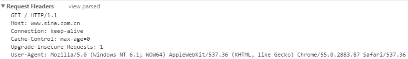
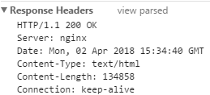
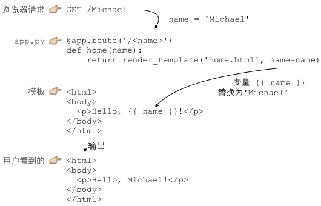

## 目录
[toc]

## 1 HTML与HTTP协议简介
### 1.1 介绍
* HTML：一种用来定义网页的文本。

* CSS：层叠样式表（Cascading Style Sheets），用来控制HTML里的所有元素。

* JavaScript实现HTML交互的脚本语言。与Java没有关系。

* HTTP协议：在网络上传输HTML的协议，用于浏览器和服务器的通信。

### 1.2 网页分析

使用浏览器的开发者工具，通过network记录浏览器与服务器之间的通信，查看通信源码。



* `GET`表示读取请求，将从服务器获得网页数据；`/`表示URL路径（以`/`开头，`/`就表示首页）；`HTTP/1.1`指示采用的HTTP协议版本为1.1。

* `Host: www.sina.com.cn`表示请求的域名是`www.sina.com.cn`

* 接下来的每一行都类似：`Xxx: abcdefg`，表示一些信息头。



* `200`表示一个成功的响应，后面的`OK`是说明。

* `Content-Type`指示响应的内容，`: text/html`表示HTML网页。注意浏览器只依靠该头信息判断响应内容类型。

HTTP响应的Body就是HTML源码，通过查看网页源码功能了解。

### 1.3 总结
**HTTP的步骤：**

步骤1：浏览器首先向服务器发送HTTP请求，包括：

* 方法：GET（仅请求资源）或POST（会附带用户数据）
* 路径：/full/url/path
* 域名：由Host头指定
* 若为POST，还有一个Body，包含用户数据
* 其他相关的header

步骤2：服务器向浏览器返回HTTP响应，包括：

* 响应代码：200表示成功，3xx表示重定向，4xx表示客户端发送的请求有误，5xx表示服务器端处理发生错误
* 响应类型：有Content-Type指定
* 通常响应会携带一个Body，包含HTML源码
* 其他相关的header

步骤3：如果浏览器还需要继续向服务器请求其他资源，就再次发送HTTP请求，重复步骤1、2

**HTTP的格式：**

GET请求格式：

	GET /path HTTP/1.1
	Header1: Value1
	Header2: Value2
	Header3: Value3

POST请求格式：

	POST /path HTTP/1.1
	Header1: Value1
	Header2: Value2
	Header3: Value3
	
	body data goes here...

HTTP响应格式：

	200 OK
	Header1: Value1
	Header2: Value2
	Header3: Value3
	
	body data goes here...

### 1.4 更多参考内容

[w3school](http://www.w3school.com.cn/ "w3school")

[HTTP权威指南](http://t.cn/R7FguRq "HTTP权威指南")

[Library->Web->Web帮助文档->W3School离线手册(2017.03.11版).chm](E:\Library\Web\Web帮助文档\W3School_2018\W3School离线手册(2017.03.11版).chm "W3CSchool")

## 2 WSGI接口
WSGI（Web Server Gateway Interface）是封装了TCP连接、HTTP原始请求和响应格式的接口，使用户专注于生成HTML文档。

**定义处理：**

```python
# 在WSGI处理文件
def application(environ, start_response): # environ：包含所有http请求的dict对象
	start_response('200 OK', [('Content-Type', 'text/html')]) # 发送http响应的函数
	return [b'<h1>Hello, web!</h1>'] # 作为响应的body
```

**运行服务：**

```python
# 在WSGI服务文件
from wsgiref.simple_server import make_server # 导入服务器生成函数
from hello import application # 导入编写的wsgi处理函数

httpd = make_server('', 8000, application) # 创建服务器
print('Serving HTTP on port 8000...')
httpd.serve_forever() # 开始监听http请求
```


## 3 使用Web框架
### 3.1 基本方法演示
Web框架是WSGI上的进一步抽象，让用户专注于用一个函数处理一个URL，框架将URL映射到函数。

以流行的Web框架——Flask框架说明，Flask通过Python装饰器在内部自动地把URL和函数关联起来。

**基本流程：**

* 1 生成web框架对象
* 2 映射URL请求
* 3 启动框架

**Flask框架使用演示：**

```python
from flask import Flask, request # 导入装饰器类和用户请求对象

app = Flask(__name__) # 生成web框架对象（这里是一个装饰器）

@app.route('/', methods=['GET', 'POST']) # 装饰器映射URL请求，处理首页
def home(): # 处理函数
	return '<h1>Home</h1>'

@app.route('/signin', methods=['GET']) # 装饰器映射URL请求，处理登录页
def signin_form(): # 处理函数
	return '''<form action="/signin" method="post">
<p><input name="username"></p>
<p><input name="password" type="password"></p>
<p><button type="submit">Sign In</button></p>
</form>'''

@app.route('/signin', methods=['POST']) # 装饰器映射URL请求，处理登陆表单
def signin(): # 处理函数，需要从request对象读取表单内容
	if request.form['username']=='admin' and request.form['password']=='password':
		return '<h3>Hello, admin!</h3>'
	return '<h3>Bad username or password.</h3>'

if __name__=='__main__':
	app.run() # 启动Web（Flask）框架
```

常见的Python Web框架还有：

* Django：全能型Web框架
* web.py：一个小巧的Web框架
* Bottle：和Flask类似的框架
* Tornado：Facebook的开源异步Web框架

## 4 使用模板
### 4.1 基本方法演示
模板技术，即传说中的MVC：Model-View-Controller，模型-视图-控制器。

即使使用了Web框架，编写HTML页面的工作量仍然巨大，又由于在Python代码里拼字符串不现实，故使用模板技术。

**MVC示意图：**



* C（Controller）：Python中处理URL的函数
* V（View）：包含`{{...}}`的模板
* M（Model）：传输给View的dict

```python
# 一：Web框架
from flask import Flask, request, render_template

app = Flask(__name__) # 生成装饰器对象

@app.route('/', methods=['GET', 'POST'])
def home():
	return render_template('home.html')

@app.route('/signin', methods=['GET'])
def signin_form():
	return render_template('form.html')

@app.route('/signin', methods=['POST'])
def signin():
	username = request.form['username']
	password = request.form['username']
	if username=='admin' and password=='passowrd':
		return render_template('signin-ok.html', username=username)
	return render_template('form.html', message='Bad username or password', username=username)

if __name__=='__main__':
	app.run()
```

```html
<!-- 二：jinja2模板 -->
<!-- home.html -->
<html>
<head>
  <title>Home</title>
</head>
<body>
  <h1 style="font-style:italic">Home</h1>
</body>
</html>

<!-- form.html -->
<html>
<head>
  <title>Please Sign In</title>
</head>
<body>
  
  <p style="color:red">{{ message }}</p>
  
  <form action="/signin" method="post">
	<legend>Please sign in:</legend>
	<p><input name="username" placeholder="Username" value="{{ username }}"></p>
	<p><input name="password" placeholder="Password" type="password"></p>
	<p><button type="submit">Sign In</button></p>
  </form>
</body>
</html>

signin-ok.html
<html>
<head>
  <title>Welcome, {{ username }}</title>
</head>
<body>
  <p>Welcome, {{ username }}!</p>
</body>
</html>
```

最后将html模板放到与web框架文件同级的templates文件夹中。

常见的模板有：

* Jinja2：用`{{ xxx }}`表示变量，``表示指令
* Mako：用`${xxx}`和`<% ... %>`的一个模板
* Django：Django是一站式框架，内置一个用`{{ xxx }}`和``的模板

### 4.2 Jinja2模板
初始化Jinja2需要以下几步：

* (1) 对`Environment`类的`options`参数进行配置
* (2) 使用Jinja2提供的模板加载器加载模板文件，程序中选用`FileSystemLoader`加载器直接从模板文件夹加载模板，将加载器和`options`参数传递给`Environment`类，
* (3) 添加过滤器，完成初始化

## 5 小问题解决方法
### 5.1 端口占用（Windows）
问题：

在启动某程序时，提示：”**通常每个套接字地址（协议/网络地址/端口）只允许使用一次**"

分析：

通信端口被占用了，导致通信无法进行。

解决方法：

1. `netstat -aon|findstr "xxxx"` - 查看端口xxxx的进程，获得一串yyyy（？）
2. `tasklist|findstr "yyyy"` - 查看占用端口xxxx的程序
3. 杀死程序即可