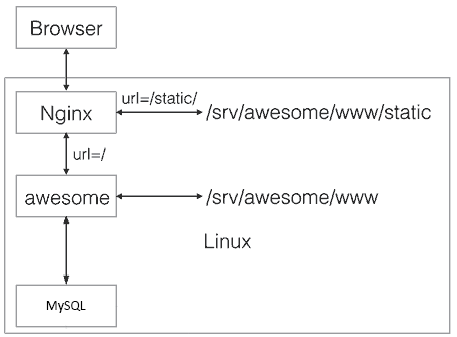

## 目录

[toc]

## 疑问记录
* Day 4 orm.py 172 为什么还要再从属性列表中获取一遍？这两种获取的地方是不同的吗？
* Day 5 coroweb.py 66 为什么request参数的要求这么特殊？
* Day 5 coroweb.py 123 为什么只对“有命名关键字参数且无关键字参数”的情况特殊处理？这里的kw获取时的过滤逻辑是什么？
* Day 5 coroweb.py 151 APIError的具体用法？
* Day 10 app.py 90 这个是管理员后台吗？
* Day 10.4 handlers.py 117 用户登录验证是明文传送密码吗？

## Day 1 - 搭建开发环境
#### 1.1 开发环境
* python3.5及以上
* 异步IO框架：aiohttp
* 前段模板引擎：jinja2
* MySQL异步驱动：aiomysql

#### 1.2 项目结构

		puresakura-python3-webapp/		<-- 根目录
		|
		+- backup/						<-- 备份目录
		|
		+- conf/						<-- 配置文件
		|
		+- dist/						<-- 打包目录
		|
		+- www/							<-- web目录
		| |
		| +- static/					<-- 存放静态文件
		| |
		| +- templates/					<-- 存放缓存文件
		|
		+- ios/							<-- 存放ios App工程
		|
		+- LINCENSE						<-- 代码LINCENSE

建议同时建立git仓库并同步至GitHub，保证代码修改安全。

## Day 2 - 编写Web App骨架
使用`logging`记录日志，使用异步IO（asyncio）+异步框架aiohttp（aiohttp），编写最基本的web app。

**文件：app.py**

```python
import logging # 导入日志模块
logging.basicConfig(level=logging.INFO) # 设置全局日志等级

import asyncio, os, json, time # 导入异步IO相关模块
from datetime import datetime # 导入时间模块

from aiohttp import web # 导入异步的Web框架

def index(request): # 1 定义首页处理函数
	return web.Response(body=b'<h1>Awesome</h1>', headers={'content-type':'text/html'}) # 返回的响应(首页内容）

@asyncio.coroutine
def init(loop): # 2 生成web框架coroutine
    app = web.Application(loop=loop) # 2.1 建立逻辑框架
    app.router.add_route('GET', '/', index) # 2.2 映射首页处理请求
    srv = yield from loop.create_server(app.make_handler(), '127.0.0.1', 9000) # 2.3 建立服务器（协议工厂）
    logging.info('server started at http://127.0.0.1:9000...') # 记录日志
return srv # 2.3 返回服务器对象

loop = asyncio.get_event_loop() # 2 获取事件循环
loop.run_until_complete(init(loop)) # 3 获取协程对象，注册为事件
loop.run_forever() # 4 持续运行
```

参考知识：

* 07 错误、调试和测试
* 19 异步IO

## Day 3 - 编写ORM
使用MySQL数据库，为方便重复利用数据库操作代码，在此封装常用的操作函数。

异步编程有一个原则：一旦决定使用异步，系统每一层都必须使用异步。故使用异步IO的数据库驱动`aiomysql`。

#### 3.1 连接池管理
每个HTTP请求都可以从连接池中直接获取数据库连接，好处是不必频繁地打开和关闭数据库连接，而是尽量重复使用。

利用 `aiomysql.create_pool()` 创建与关闭协程连接池连接数据库。

**文件：orm.py**

```python
import asyncio, logging, aiomysql

# 连接池管理 - 创建连接池
@asyncio.coroutine
def create_pool(loop, **kw):
    logging.info('[ORM] Create database connection pool ...') # 记录日志
    global __pool # 声明线程池变量为全局的
    __pool = yield from aiomysql.create_pool( # 异步IO建立连接池
            host=kw.get('host', 'localhost'),
            port=kw.get('port', 3306),
            user=kw['user'],
            password=kw['password'],
            db=kw['db'],
            charset=kw.get('charset', 'utf8'),
            autocommit=kw.get('autocommit', True),
            maxsize=kw.get('maxsize', 10),
            minisize=kw.get('minsize', 1),
            loop=loop
            )

# 连接池管理 - 关闭连接池
@asyncio.coroutine
def close_pool():
    logging.info('[ORM] Close database connection pool ...') # 记录日志
    global __pool
    __pool.close()
    yield from __pool.wait_closed()
```

#### 3.2 封装数据库操作指令
主要包括select，execute(updata, insert, delete）。除select需要返回查询内容，其他命令只需返回一个影响参数，故可以封装为一个execute方法。

**文件：orm.py**

```python
# 封装数据库操作指令 - SELECT语句封装
@asyncio.coroutine
def select(sql, args, size=None):
    log(sql, args) # 记录日志
    global __pool # 声明连接池全局变量
    with (yield from __pool) as conn: # 异步获取一个连接
        cur = yield from conn.cursor(aiomysql.DictCursor) # 获取数据库指针
        yield from cur.execute(sql.replace('?', '%s'), args or ()) # 执行select语句，用参数替换占位符'?'或'%s'
        if size: # 视情况获取定量数据
            rs = yield from cur.fetchmany(size)
        else:
            rs = yield from cur.fetchall()
        yield from cur.close() # 关闭指针
        logging.info('[ORM]     rows return: %s' % len(rs)) # 记录日志
        return rs # 返回数据
    
# 封装数据库操作指令 - INSERT, UPDATE, DELETE语句封装
@asyncio.coroutine
def execute(sql, args):
    log(sql) # 记录日志
    with (yield from __pool) as conn: # 异步获取一个连接
        try:
            cur = yield from conn.cursor() # 获取指针
            yield from cur.execute(sql.replace('?', '%s'), args) # 执行execute语句，用参数替换占位符
            affected = cur.rowcount # 获取结果数
            yield from cur.close() # 关闭指针
			logging.info('[ORM]     rows affected: %s' % affected) # 记录日志
        except BaseException as e: # 处理异常
			logging.error(str(e))
        return affected # 返回结果数
```

#### 3.3 ORM顶层设计
关于ORM的直观理解：

==示例代码== 以下

```python
class Model(object):
	async def save(self, **kw):
		pass

class User(Model):
	__table__ = 'users' #设定操作数据库表
	name = StringField(...) #设定列属性
	score = FloatField(...) #设定列属性
	pass

u = User(name='Mike', score=98.23)
u.save() # 假设有这个方法
```

类级别上定义的属性用来描述`User`对象和表的映射关系，而实例属性必须通过`__init__()`方法去初始化。

==示例代码== 以上

首先定义一个所有ORM映射的基类，映射基本的数据库操作；当操作某数据库的表时，只需创立一个类，并利用继承的方式，从父类获得属性与方法，以此完成对数据库的操作。

**文件：orm.py**

```python
# orm顶层设计 - 辅助函数
def create_args_string(num): # 创建拥有若干个占位符的字符串
    L = []
    for n in range(num):
        L.append('?')
    return ','.join(L)

# orm顶层设计 - 字段类
class Field(object): # 定义属性类的基类

    def __init__(self, name, column_type, primary_key, default): # 定义构造方法
        self.name = name # 字段名称
        self.column_type = column_type # 字段映射的数据类型
        self.primary_key = primary_key # 字段主键标识
        self.default = default # 字段默认值

    def __str__(self): # 定制print输出功能
        return '<%s, %s:%s>' % (self.__class__.__name__, self.column_type, self.name)
    
class StringField(Field): # 定义字符串-字段类
    
    def __init__(self, name=None, primary_key=False, default='', column_type='varchar(100)'): # 定义构造方法
        super().__init__(name, column_type, primary_key, default) # 使用父类构造方法   

class IntegerField(Field): # 定义整型-字段类
    
    def __init__(self, name=None, primary_key=False, default=0, column_type='integer(20)'): # 定义构造方法
        super().__init__(name, column_type, primary_key, default) # 使用父类构造方法
        
class FloatField(Field): # 定义浮点型-字段类
    
    def __init__(self, name=None, primary_key=False, default=0.0, column_type='double(20,10)'):
        super().__init__(name, column_type, primary_key, default)
        
class BooleanField(Field): # 定义布尔型-字段类
    
    def __init__(self, name=None, default=False):
        super().__init__(name, 'boolean', False, default)
        
class TextField(Field): # 定义文本类型-字段类
    
    def __init__(self, name=None, default=None):
        super().__init__(name, 'text', False, default)

# orm顶层设计 - 模型元类，用于定制表的映射
class ModelMetaclass(type):
    
    def __new__(cls, name, bases, attrs): # 定制类构造方式
        # 排除Model类本身的情况
        if name=='Model': # cls-当前类对象指针；name-类名称；bases-继承集合；attrs-方法属性集合
            return type.__new__(cls, name, bases, attrs) # 构造并返回实例对象
        # 获取table的名称，若无，使用类名
        tableName = attrs.get('__table__', None) or name
        logging.info('[ORM] Found model: %s (table: %s)' % (name, tableName)) # 记录日志
        # 用于获取所用的 field 和主键名(mappings = fields + primaryKey)
        mappings = dict() # 所有的 属性-列 映射
        fields = [] # 非主键的 属性名 集合
        primaryKey = None # 主键标识，记录当前表是否已经设置了主键
        for k, v in attrs.items(): # 遍历attrs，items返回属性名和数值的键值对
            if isinstance(v, Field): # 处理属性（列）内容
                logging.info('[ORM]     found mapping: %s ==> %s' % (k,v)) # 记录日志
                mappings[k] = v # 放入mappings中
                if v.primary_key: # 处理主键情况
                    if primaryKey: # 已有主键
                        raise RuntimeError('Duplicate primary key for field: %s' % k) # 抛出多主键异常
                    primaryKey = k # 没有主键，标记当前主键
                else:
                    fields.append(k) # 不是主键，放入到fileds中
        if not primaryKey: # 处理没有主键的情况
            raise RuntimeError('Primary key not found.') # 抛出无主键异常
        # 建立属性-列映射
        for k in mappings.keys(): # 遍历属性集合
            attrs.pop(k) # 删除attrs中的表格相关属性，因为已经添加到 mappings 里面
        escaped_fields = list(map(lambda f:'`%s`' % f, fields)) # 生成新形式的fields，用于规避sql关键字冲突
        attrs['__mappings__'] = mappings # 保存属性和列的映射关系
        attrs['__table__'] = tableName # 保存表名称
        attrs['__primary_key__'] = primaryKey # 保存主键属性名
        attrs['__fields__'] = fields # 保存非主键属性名
        # 构造默认的SELECT, INSERT, UPDATE, DELETE语句（其中的反引号``是为了避免与sql的关键字冲突）
        attrs['__select__'] = 'SELECT `%s`, %s from `%s`' % (primaryKey, ', '.join(escaped_fields), tableName)
        attrs['__insert__'] = 'INSERT INTO `%s` (%s, `%s`) values (%s)' % (tableName, ', '.join(escaped_fields), primaryKey, create_args_string(len(escaped_fields)+1))
        attrs['__update__'] = 'UPDATE `%s` set %s where `%s`=?' % (tableName, ', '.join(map(lambda f: '`%s`=?' % (mappings.get(f).name or f), fields)), primaryKey)
        attrs['__delete__'] = 'DELETE FROM `%s` where `%s`=?' % (tableName, primaryKey)
        return type.__new__(cls, name, bases, attrs) # 构造并返回实例对象

# orm顶层设计 - 模型基类，表映射的基类
class Model(dict, metaclass=ModelMetaclass):
    
    def __init__(self, **kw):   # 定义初始化方法
        super(Model, self).__init__(**kw) # 使用代理对象将方法调用委托给父类或兄弟类类型
        # 以上代码等价于：super().__init__(**kw)
        
    def __getattr__(self, key): # 定制属性引用默认处理方法
        try:
            return self[key] # 尝试字典方式查找(由于此方法是从dict继承下来的，可以直接以dict的方式应用)
        except KeyError:
            raise AttributeError(r"'Model' object has no attribute '%s'" % key) # 抛出属性调用异常
            
    def __setattr__(self, key, value): # 定制属性赋值默认处理方法
        self[key] = value # 由于此方法是从dict继承下来的，可以直接以dict的方式应用
        
    def getValue(self, key): # 定义带默认值的属性获取方法
        return getattr(self, key, None) # 调用dir辅助函数——getattr()，也会走__getattr__，但指定了默认值，不会抛出错误
    
    def getValueOrDefault(self, key): # 定义可带自定义默认值的属性获取方法
        value = getattr(self, key, None) # 调用dir辅助函数——getattr()
        if value is None: # 处理获取失败的情况
            field = self.__mappings__[key] # 从属性列表中获取该属性的字段类实例
            if field.default is not None:
                value = field.default() if callable(field.default) else field.default # 优先使用调用自定义默认值函数，否则使用自带默认值属性
                logging.debug('using default value for %s: %s' % (key, str(value))) # 记录日志
                setattr(self, key, value) # 添加该属性，使用默认值
        return value # 返回值
    
    @classmethod
    @asyncio.coroutine
    def find(cls, pk): # 定义类方法 - 主键查找
        'find object by primary key.'
        rs = yield from select('%s where `%s`=?' % (cls.__select__, cls.__primary_key__), [pk], 1)
        if len(rs)==0:
            return None
        return cls(**rs[0]) # 建立并返回当前类实例
    
    @classmethod # 类方法装饰器
    @asyncio.coroutine
    def findAll(cls, where=None, args=None, **kw): # 获取表中所有符合的数据
        'find objects by where clause.'
        sql = [cls.__select__] # 获取基本的select语句
        if where: # 处理where条件
            sql.append('WHERE') # 语句
            sql.append(where) # 条件
        if args is None: # 处理空参数的情况
            args=[] # 使用空列表
        orderBy = kw.get('orderBy', None) # 获取排序参数
        if orderBy: # 如果要求排序
            sql.append('ORDER BY') # # 语句
            sql.append(orderBy) # 条件
        limit = kw.get('limit', None) # 获取限制参数
        if limit is not None: # 如果有限制
            sql.append('limit')
            if isinstance(limit, int): # 处理限制参数的整数输入
                sql.append('?') # 语句
                sql.append(limit) # 条件
            elif isinstance(limit, tuple) and len(limit) == 2: # 处理限制参数的二元组输入
                sql.append('?, ?')
                args.extend(limit)
            else:
                raise ValueError('Invaild limit value: %s' % str(limit))
        rs = yield from select(' '.join(sql), args)
        return [cls(**r) for r in rs] # 建立并返回当前类实例
                
    @classmethod
    @asyncio.coroutine
    def findNumber(cls, selectField, where=None, args=None): # 查找指定属性的编号???
        'find number by select and where'
        sql = ['select %s _num_ from `%s`' % (selectField, cls.__table__)]
        if where: # 处理where条件
            sql.append('where') # 语句
            sql.append(where) # 条件
        rs = yield from select(' '.join(sql), args, 1)
        if len(rs)==0:
            return None
        return rs[0]['_num_']
    
    @asyncio.coroutine
    def save(self): # 保存实例到数据库
        args = list(map(self.getValueOrDefault, self.__fields__)) # 获取属性列表的值（非主键）
        args.append(self.getValueOrDefault(self.__primary_key__)) # 添加主键的值
        rows = yield from execute(self.__insert__, args) # 将至更新到数据库中
        if rows != 1: # 处理失败的情况
            logging.warn('[ORM] Failed to insert record: affected rows: %s' % rows)
            
    @asyncio.coroutine
    def update(self): # 更新数据库数据
        args = list(map(self.getValue, self.__fields__)) # 获取属性列表的值
        args.append(self.getValue(self.__primary_key__)) # 添加主键的值
        rows = yield from execute(self.__update__, args) # 将至更新到数据库中
        if rows != 1: # 处理失败的情况
            logging.warn('[ORM] Failed to updata by primary key: affected rows: %s' % rows)
    
    @asyncio.coroutine
    def delete(self): # 删除数据
        args = [self.getValue(self.__primary_key__)]
        rows = yield from execute(self.__delete__, args)
        if rows != 1:
            logging.warn('[ORM] Failed to remove by primary key: affected rows: %s' % rows)
```

测试代码：

```python
# 测试代码            
loop = asyncio.get_event_loop()
loop.run_until_complete(create_pool(host='127.0.0.1', port=3306, user='Infuny', password='asdfgh', datebase='puresakura', loop=loop))
rs = loop.run_until_complete(select('select * from firstSchool', None))
# 获取到了数据库返回的数据
print('heh:%s' % rs)
```

测试结果：

```shell
INFO:root:create database connection pool...
INFO:root:SQL: select * from firstSchool
INFO:root:rows return: 1
heh:[{'grade_1': '77'}]
```

## Day 4 - 编写Model
有了ORM，就可以将Web App需要的3个表用`Model`表示出来。

### 4.1 模型设计
**文件：models.py**

```python
import time, uuid # 导入时间模块和唯一标识模块

from orm import Model, StringField, BooleanField, FloatField, TextField # 导入orm相关类

# 模型设计 - 唯一id函数
def next_id(): # 获取唯一ID
    return '%015d%s000' % (int(time.time() * 1000), uuid.uuid4().hex) # 制作并返回唯一ID

'''
此处缺省值的设置非常巧妙，在编写orm时，
给一个Field增加一个default参数可以让ORM自己填入缺省值，非常方便。
并且，缺省值可以作为函数对象传入，在调用save()时自动计算。
	'''
	
# 模型设计 - 用户模型
class User(Model): # 定义用户模型
    __table__ =  'users'
    
    id = StringField(primary_key=True, default=next_id, ddl='varchar(50)') # 用户id
    email = StringField(ddl='varchar(50)') # 邮箱地址
    passwd = StringField(ddl='varchar(50)') # 密码
    admin = BooleanField() # 管理员标识
    name = StringField(ddl='varchar(50)') # 用户名称
    created_at = FloatField(default=time.time) # 账号注册时间
   
# 模型设计 - 博客模型
class Blog(Model): # 定义博客模型
    __table__ = 'blogs'
    
    id = StringField(primary_key=True, default=next_id, ddl='varchar(50)') # 博客id
    user_id = StringField(ddl='varchar(50)') # 博客所属的用户id
    user_name = StringField(ddl='varchar(50)') # 博客所属的用户名称
    name = StringField(ddl='varchar(50)') # 博客名称
    summary = StringField(ddl='varchar(200)') # 博客摘要
    content = TextField() # 博客正文
    created_at = FloatField(default=time.time) # 博客创建时间
    readers = IntegerField() # 博客阅读量
    sort = IntegerField() # 博客类别
    
# 模型设计 - 评论模型
class Comment(Model): # 评论模型
    __table__ = 'comments'
    
    id = StringField(primary_key=True, default=next_id, ddl='varchar(50)') # 评论id
    blog_id = StringField(ddl='varchar(50)') # 所属博客id
    user_id = StringField(ddl='varchar(50)') # 所属用户id
    user_name = StringField(ddl='varchar(50)') # 所属用户名称
    content = TextField() # 评论正文
    created_at = FloatField(default=time.time) # 评论创建时间

# 模型设计 - 回复模型
class Reply(Model): # 回复模型
    __table__ = 'replies'
    
    id = StringField(primary_key=True, default=next_id, ddl='varchar(50)') # 回复id
    user_id = StringField(ddl='varchar(50)') # 所属用户id
    user_name = StringField(ddl='varchar(50)') # 所属用户名称
    target_cmid = StringField(ddl='varchar(50)') # 目标评论id
    target_name = StringField(ddl='varchar(50)') # 目标用户名称
    content = TextField() # 回复正文
    created_at = FloatField(default=time.time) # 回复创建时间
```

### 4.2 初始化数据库表
如果表的数量很少，可以手动创建表的SQL脚本。

**文件：model.sql**

```mysql
DROP database IF EXISTS puresakura;

CREATE DATABASE puresakura;

USE puresakura;

CREATE TABLE users(
    `id` varchar(50) not null,
    `email` varchar(50) not null,
    `passwd` varchar(50) not null,
    `admin` bool not null,
    `name` varchar(50) not null,
    `created_at` real not null,
	UNIQUE KEY `idx_email` (`email`),
	KEY `idx_created_at` (`created_at`),
	PRIMARY KEY (`id`)
) engine=innodb default charset=utf8;

CREATE TABLE blogs(
	`id` varchar(50) not null,
	`user_id` varchar(50) not null,
	`user_name` varchar(50) not null,
	`name` varchar(50) not null,
	`summary` varchar(200) not null,
	`content` mediumtext not null,
	`created_at` real not null,
	`readers` int not null,
	`sort` int not null,
	KEY `idx_created_at` (`created_at`),
	PRIMARY KEY (`id`)
) engine=innodb default charset=utf8;

CREATE TABLE comments(
	`id` varchar(50) not null,
	`blog_id` varchar(50) not null,
	`user_id` varchar(50) not null,
	`user_name` varchar(50) not null,
	`content` text not null,
	`created_at` real not null,
	KEY `idx_created_at` (`created_at`),
	KEY `idx_blog_id` (`blog_id`),
	PRIMARY KEY (`id`)
) engine=innodb default charset=utf8;

CREATE TABLE replies(
	`id` varchar(50) not null,
	`user_id` varchar(50) not null,
	`user_name` varchar(50) not null,
	`target_cmid` varchar(50) not null,
	`target_name` varchar(50) not null,
	`content` text not null,
	`created_at` real not null,
	KEY `idx_created_at` (`created_at`),
	PRIMARY KEY (`id`)
) engine=innodb default charset=utf8;
```

运行代码：

```shell
$ mysql -u root -p < model.sql
```

### 4.3 操作示例
至此，可以真正开始编写代码操作对象了。

**文件：test.py**

```python
import asyncio, orm # 导入orm模块
from models import User, Blog, Comment # 导入映射模型

async def test(loop): # 1 定义协程类型函数
    # 获取连接
    await orm.create_pool(host='127.0.0.1', port=3306, user='Infuny', password='asdfgh', db='puresakura', loop=loop)
    # 创建用户
    u = User(name='Test', email='test@example.com', passwd='1234567890', image='about:blank')
    # 保存
    await u.save()

    loop = asyncio.get_event_loop() # 2 获取事件循环
    loop.run_until_complete(test(loop)) #3，4获取协程对象，注册为事件
    # loop.close() # 关闭事件循环
```

## Day 5 - 编写Web框架
已有的`aiohttp`编写视图函数（URL处理函数）的方式相对比较底层，需要手动封装一个异步io框架来编写视图函数。

`aiohttp`的视图函数编写方式可参考《19.4 `aiohttp`》。

`inspect`模块的使用可参考《11.9 `urllib`》,《11.13 `inspect`》

`__import__()`函数的使用可参考《5.2 模块的导入方法》

`aysncio`协程模块的使用可参考《19.3 `asyncio`》

`os`模块的路径等使用可参考《8.4 操作文件和目录》

`Jinja2`模块的使用参考《18.4 使用模板》

### 5.1 设计URL装饰器
用aiohttp编写视图函数需要三步（参考自《19.4 `aiohttp`》）：

* 1 定义协程类型的URL处理函数
	* 1.1 协程类型装饰
	* 1.2 获取参数
	* 1.3 构造响应对象

**文件：coroweb.py**

```python
import functools, inspect, logging
logging.basicConfig(logging.INFO) # 设置调试等级

from aiohttp import web
from urllib import parse

# 设计URL处理装饰器
def Handler_decorator(path, *, method): # url装饰器函数
    def decorator(func):
        @functools.wraps(func)
        def wrapper(*args, **kw):
            return func(*args, **kw)
        wrapper.__route__ = path # URL的路径信息
        wrapper.__method__ = method # URL的方法类型
        return wrapper
    return decorator
get = functools.partial(Handler_decorator, method='GET') # 偏函数：GET方法
post = functools.partial(Handler_decorator, method='post') # 偏函数：POST方法
```

### 5.2 视图函数参数解析逻辑
用于解析视图函数所要求的的参数。

**文件：coroweb.py**

```python
def get_required_kw_args(fn): # 获取：位置命名关键字参数
    args = []
    params = inspect.signature(fn).parameters # 检查函数参数，返回关于参数的字典
    for name, param in params.items(): # 遍历参数
        if param.kind == inspect.Parameter.KEYWORD_ONLY and param.default == inspect.Parameter.empty:
            args.append(name)              #为命名关键字参数                          # 默认值为空
    return tuple(args) # 返回为不可修改的tuple

def get_named_kw_args(fn): # 获取：位置命名关键字参数 + 默认命名关键字参数
    args = []
    params = inspect.signature(fn).parameters # 检查函数参数，返回关于参数的字典
    for name, param in params.items(): # 遍历参数
        if param.kind == inspect.Parameter.KEYWORD_ONLY:
            args.append(name)
    return tuple(args)

def has_named_kw_arg(fn): # 判断：位置命名关键字参数/默认命名关键字参数
    params = inspect.signature(fn).parameters # 检查函数参数，返回关于参数的字典
    for name, param in params.items(): # 遍历参数
        if param.kind == inspect.Parameter.KEYWORD_ONLY:
            return True

def has_var_kw_arg(fn): # 判断：关键字参数（**kw）
    params = inspect.signature(fn).parameters # 检查函数参数，返回关于参数的字典
    for name, param in params.items(): # 遍历参数
        if param.kind == inspect.Parameter.VAR_KEYWORD:
            return True

def has_request_arg(fn): # 判断是否有request参数，且是最后一个命名的位置参数/默认参数
    params = inspect.signature(fn).parameters # 检查函数参数，返回关于参数的字典
    found = False # 寻找标识
    for name, param in params.items(): # 遍历参数
        if name == 'request':
            found = True
            continue # 一直找到最后一个参数
        if found and (
                param.kind != inspect.Parameter.VAR_POSITIONAL and # 可变参数（*args）
                param.kind != inspect.Parameter.KEYWORD_ONLY and # 位置命名关键字参数/默认命名关键字参数
                param.kind != inspect.Parameter.VAR_KEYWORD # 关键字参数（**kw）
                ): # 处理位置参数的情况，此时此参数在request之后，故抛出异常
            raise ValueError('request parameter must be the last named parameter in function: %s%s' % (fn.__name__, str(param)))
    return found
```

### 5.3 request对象参数提取逻辑
定义RequestHandler从视图函数中分析其需要接受的参数，从web.Request中获取必要的参数，调用视图函数，然后把结果转换为web.Response对象，符合aiohttp框架要求。

**文件：coroweb.py**

```python
class RequestHandler(object):
    def __init__(self, app, fn):
        logging.debug('[COROWEB] Start initialing RequestHandler ...')
        self._app = app # 
        self._func = fn # 视图函数
        self._required_kw_args = get_required_kw_args(fn) # 获取：命名关键字参数（位置）
        self._named_kw_args = get_named_kw_args(fn) # 获取：命名关键字参数（位置+默认）
        self._has_named_kw_arg = has_named_kw_arg(fn) # 判断：命名关键字参数（位置+默认）
        self._has_var_kw_arg = has_var_kw_arg(fn) # 判断：关键字参数（**kw）
        self._has_request_arg = has_request_arg(fn) # 判断：request参数
        logging.debug('[COROWEB] Finish initialing RequestHandler ...')

    async def __call__(self, request): # 定制函数调用方式
        logging.debug('[COROWEB] Start calling RequestHandler ...')
        kw = None # 用于保存请求中的参数
         # （一）若视图函数有命名关键字参数或关键字参数（表示需要） -> 获取request的请求内容（json/post/query_string）
        if self._has_named_kw_arg or self._has_var_kw_arg:
            # 处理POST方法
            if request.method == 'POST':
                logging.debug('[COROWEB] Request Method is POST.')
                # 根据request参数中的content_type使用不同的解析方法
                if request.content_type == None: # (1) content_type不存在，返回错误400
                    return web.HTTPBadRequest(text='JSON body must be object.')
                ct = request.content_type.lower() # 转换为小写，便于检查
                if ct.startswith('application/json'): # (2) JSON格式数据
                    logging.debug('[COROWEB] Request parameters type is "application/json"')
                    params = await request.json() # 解析：解析body字段的JSON数据。dict-like对象
                    if not isinstance(params, dict): # request.json()返回格式不正确（非字典）
                        return web.HTTPBadRequest(text='JSON body must be object.')
                    kw = params # 保存参数
                    logging.debug("[COROWEB] Requset parameters is" + str(kw))
                elif ct.startswith('application/x-www-form-urlencoded') or ct.startswith('multipart/form-data'): # (3) form表单请求格式
                    logging.debug('[COROWEB] Request parameters type is "application/x-www-form-urlencoded"')
                    params = await request.post() # 解析：解析post内容数据。dict-like对象
                    kw = dict(**params) # 保存参数，组成dict，统一kw格式
                    logging.debug("[COROWEB] Requset parameters is" + str(kw))
                else: # (4) 无匹配类型
                    return web.HTTPBadRequest(text='Unsupported Content-Type: %s' % request.content_type)
            # 处理GET方法
            if request.method == 'GET':
                logging.debug('[COROWEB] Request Method is GET.')
                qs = request.query_string # 返回URL查询语句（?后的键值）。string形式
                if qs: # 有查询语句处理
                    kw = dict() # 键值对参数形式
                    for k, v in parse.parse_qs(qs, True).items(): # 遍历，构造纯键值对映射（可改进，直接用items()）
                        kw[k] = v[0] # 保存参数
                logging.debug("[COROWEB] Requset parameters is" + str(kw))
        # （二）根据是否提取到参数进行处理
        if kw is None:  # 若没有提取到参数
            kw = dict(**request.match_info) # 将match_info的内容映射给kw，那么问题来了，match_info是什么？？？？？？？？？？？？？？？？？？？？
        else: # 若提取到参数
            if self._has_named_kw_arg and (not self._has_var_kw_arg): # 视图需要命名关键字参数，不需要关键字参数
                copy = dict()
                for name in self._named_kw_args: # 只保留视图函数需要的命名关键字参数
                    if name in kw:
                        copy[name] = kw[name]
                kw = copy
            for k, v in request.match_info.items(): # 判断match_info与命名关键字参数的内容是否重复，以match_info的值为准
                if k in kw:
                    logging.warn('[COROWEB] Dulicate arg name in named arg and kw args: %s' % k) # 参数重复
                kw[k] = v
        # （三）添加request参数
        if self._has_request_arg: # 若视图函数对request有参数要求
            kw['request'] = request # 添加
        # （四）检查位置命名关键字参数
        logging.debug('[COROWEB] Checking _required_kw_args')
        if self._required_kw_args: # 检查位置命名关键字参数
            for name in self._required_kw_args:
                if not name in kw: # 处理未添加的情况
                    logging.warn('[COROWEB] Missing argument: %s' % name)
                    return web.HTTPBadRequest('Missing argument: %s' % name) # 抛出异常，此时出现表示未赋值；若有值，则在前面的选择中已囊括
        # 至此，kw为视图函数fn真正可调用的参数
        logging.info('[COROWEB] Analysing complete. Call function with args: %s' % str(kw))
        try:
            r = await self._func(**kw) # 调用视图函数构造响应内容
            return r
        except APIError as e: # APIError的使用，自定义异常
            return dict(error=e.error, data=e.data, message=e.message)
        logging.debug('[COROWEB] Finish calling RequestHandler ...')
```

### 5.4 视图函数与静态文件注册逻辑
现在需要在app中注册视图函数（添加路由）以及添加静态文件。

**文件：coroweb.py**

```python
# 视图函数与静态文件注册逻辑
def add_route(app, fn): # 用于注册一个视图函数（映射一个URL请求）
    method = getattr(fn, '__method__', None) # 获取视图函数的请求类型
    path = getattr(fn, '__route__', None) # 获取视图函数的请求路径
    if method is None or path is None: # 检查是否有method和path参数
        raise ValueError('@get or @post not defined in %s.' % fn.__name__)
    if not asyncio.iscoroutinefunction(fn) and not inspect.isgeneratorfunction(fn): # 检查是否为协程类型和生成器类型
        fn = asyncio.coroutine(fn) # 变为协程
    logging.info('[COROWEB] Add route %s %s => %s(%s)' % (method, path, fn.__name__, ','.join(inspect.signature(fn).parameters.keys())))
    app.router.add_route(method, path, RequestHandler(app, fn)) # 注册函数

def add_routes(app, module_name): # 从模块内批量注册视图函数
    n = module_name.rfind('.') # 从右侧检索，返回索引。若无，返回-1
    if n == -1:
        mod = __import__(module_name, globals(), locals, [], 0) # 导入指定模块
    else:
        name = module_name[(n+1):]
        mod = getattr(__import__(module_name[:n], globals(), locals, [name], 0), name) # 返回模块操作对象
    for attr in dir(mod): # dir()迭代出mod模块中所有的类，实例及函数等对象，str形式
        if attr.startswith('_'): # 忽略“_”开头的对象
            continue
        fn = getattr(mod, attr) # 获取该对象
        if callable(fn): # 确保是函数
            method = getattr(fn, '__method__', None) # 视图函数的请求类型
            path = getattr(fn, '__route__', None) # 视图函数的请求路径
            if method and path: # 当函数具备上述所有信息时注册
                add_route(app, fn) # 注册当前（一个）函数

def add_static(app): # 用于注册静态文件
    path = os.path.join(os.path.dirname(os.path.abspath(__file__)), 'static') # 拼接出static文件目录
    app.router.add_static('/static/', path) # 添加静态文件
    logging.info('[COROWEB] Add static %s => %s' % ('/static/', path)) # 记录日志
```

### 5.5 初始化Web模板
下面可以开始编写Web模板了，我们使用Jinja2作为模板引擎，在新框架中对Jinja2模板进行初始化设置。

**文件：app.py**

```python
# 初始化jinja2模板
def init_jinja2(app, **kw):
    logging.info('init jinja2...') # 记录日志
    # （1）建立Environment类options参数的配置
    options = dict(
            # 自动转译xml/html的特殊字符
            autoescape = kw.get('autoescape', True)
            # 代码块的开始、结束标志
            block_start_string = kw.get('block_start_string', ''),
            # 变量的开始、结束标志
            variable_start_string = kw.get('variable_start_string', '{{'),
            variable_end_string = kw.get('variable_end_string', '}}'),
            # 自动加载修改后的模板文件
            auto_reload(kw.get('auto_reload', True))
            )
    # （2）建立模板加载器加载模板文件的路径
    # 获取模板文件夹路径
    path = kw.get('path', None)
    if not path: # 处理路径为空的情况
        path = os.path.join(os.path.dirname(os.path.abspath(__file__)), 'templates') # 构造路径
    # Environment类是jinja2的核心类，用来保存配置、全局对象以及模板文件的路径
    # FileSystemLoader类加载path路径中的模板文件的路径
    env = Environment(loader=FileSystemLoader(path), **options) # 创建核心引擎，使用指定的模板文件路径
    # （3）添加过滤器，完成初始化
    filters = kw.get('filters', None)
    if filters: # 有过滤器的时候
        for name, f in filters.items():
            env.filters[name] = f # filters是Environment类的属性：过滤器字典（过滤器名:过滤器指针）
    # （）最终给app添加上__templateing__字段，该字段表示模板环境
    app['__templating__'] =  env

# 编写过滤器
def datetime_filter(t):
    delta = int(time.time()-t)
    if delta < 60:
        return u'1分钟前'
    if delta < 3600:
        return u'%s分钟前' % (delta//60)
    if delta < 86400:
        return u'%s小时前' % (delta//3600)
    if delta < 604800:
        return u'%s天前' % (delta//86400)
    dt = datetime.fromtimestamp(t) # 通过timestamp创建datetime对象，默认本地时区
    return u'%s年%s月%s日' % (dt.year, dt.month, dt.day) # 返回年月日
```

### 5.6 编写 middleware
middleware是符合WSGI定义的中间件。位于服务端和客户端之间对数据进行拦截处理的一个桥梁。服务器的数据，经middleware层层封装，最终传递给客户端。

**文件：app.py**

```python
# 编写用于输出日志的middleware（前件）
async def logger_factory(app, handler): # handler为视图函数
    async def logger(request):
		logging.info('[APP] Request: %s %s' % (request.method, request.path))
        return await handler(request) # 因为是协程，handler处理只有一个，都交回处理
    return logger

# 解析请求的body内容然后用视图函数处理返回（前件）
async def data_factory(app, handler): # handler为视图函数
    async def parse_data(request):
        if request.method == 'POST':
            request.__data__ = await request.json()
        elif request.content_type.startswith('application/x-www-form-urlencode'):
            request.__data__ = await request.post()
    	logging.info('[APP] Request form: %s' % str(request.__data__))
        return (await handler(request))
    return parse_data
```

请求对象request的处理工序：

`logger_factory => response_factory => RequsetHandler().__call__ => handler`

响应对象response的处理工序：

* 由视图函数处理request后返回数据
* `@get`，`@post`装饰器返回对象上附加`'__method__'`和`'__route__'`属性，使其附带URL信息
* `response_factory`对处理后的对象，经过一系列类型判断，构造出真正的`web.Response`对象

就可以了：

```python
# 编写构造Response对象的middleware（后件）
async def response_factory(app, handler):
    async def response(request):
        r = await handler(request) # 视图函数返回处理后的数据
        logging.info('[APP] Start Response handler ...') # 记录日志
        logging.debug('[APP]     Response_factory - result = %s' % str(r)) # 记录日志（视图函数响应内容）
        if isinstance(r, web.StreamResponse): # 若返回response对象，StreamResponse是所有Response对象的父类
            logging.debug('[APP]     Response_factory - None')
            return r # 无需构造，直接返回
        if isinstance(r, bytes): # 若返回bytes串
            logging.debug('[APP]     Response_factory - bytes')
            resp = web.Response(body=r) # 继承自StreamResponse，接收body参数，构造HTTP响应内容
            resp.content_type = 'application/octet-stream' # 设置响应的content-type
            return resp # 返回响应内容
        if isinstance(r, str):
            logging.debug('[APP]     Response_factory - str')
            if r.startswith('redirect'): # 若返回重定向字符串
                return web.HTTPFound(r[9:]) # 重定向至目标URL
            resp = web.Response(body=r.encode('utf-8')) # 用字符串的utf-8编码构造HTTP响应
            resp.content_type = 'text/html;charset=utf-8' # 设置content-type属性：utf-8编码的text格式
            return resp # 返回响应内容
        if isinstance(r, dict): # 如果返回dict对象（可能是json，疯狂暗示使用模板文件( • ̀ω•́ )✧）
            logging.debug('[APP]     Response_factory - dict')
            template = r.get('__template__', None) # 获取__template__信息
            if template is None: # 不带有模板信息，返回json对象的字符串形式
                '''
                ensure_ascii : 默认True，仅能输出ascii格式数据。故设置为False
                default : r对象会先被传入default函数进行处理，然后才被序列化为json对象（对象的序列化需要手动编写）
                __dict__ : 以dict的形式返回对象属性和值的映射
                '''
                resp = web.Response(body=json.dumps(r, ensure_ascii=False, default=lambda obj: obj.__dict__).encode('utf-8')) # 构造序列化json并且使用utf-8编码
                resp.content_type = 'application/json;charset=utf-8' # 设置content-type属性
                return resp
            else: # 表示带有模板信息
                '''
                app['__templating__'] : 获取已初始化的Environment对象，调用get_template()方法返回Template对象
                调用Template对象的render()方法，传入r渲染模板，返回unicode格式字符串，将其用utf-8编码
                '''
                r['__user__'] = request.__user__ # 设置用户名
                resp = web.Response(body=app['__templating__'].get_template(template).render(**r).encode('utf-8'))
                resp.content_type = 'text/html;charset=utf-8'
                return resp
        if isinstance(r, int) and (600>r>100): # 如果返回响应码
            logging.debug('[APP]     Response_factory - int')
            resp = web.Response(status=r) # 构造响应码对象的响应
            return resp
        if isinstance(r, tuple) and len(r) == 2: # 如果返回了一组响应代码和原因，如 (200, 'OK') (404, 'Not Found')
            logging.debug('[APP]     Response_factory - tuple int')
            status_code, message = r
            if isinstance(status_code, int) and (600>status_code>=100):
                resp = web.Response(status=r, text=str(message)) # 根据响应码及原因构造返回对象
        resp = web.Response(body=str(r).encode('utf-8')) # 以上条件均不满足，默认返回操作
        resp.content_type = 'text/plain;charset=utf-8' # utf-8纯文本
        return resp
    return response
```

### 5.7 更新Web App框架
下面是对day2 Web App框架的修改，

注意`handlers`是`.py`文件，专门存放一系列的视图函数，这里随意发挥。

**文件：app.py**

```python
async def init(loop): # 2 生成web框架coroutine
    await orm.create_pool(loop=loop, host='127.0.0.1', port=3306, user='www', password='www', db='awesome') # 获取orm操作线程
    app = web.Application(loop=loop, middlewares=[logger_factory, response_factory]) # 2.1 建立逻辑框架
    init_jinja2(app, filters=dict(datetime=datetime_filter))
    add_routes(app, 'handlers') # 2.2 映射首页处理请求，这里另设handlers文件存放视图函数
    add_static(app)
    srv = await loop.create_server(app.make_handler(), '127.0.0.1', 9000) # 2.3 建立服务器（协议工厂）
	logging.info('[APP] Server started at http://127.0.0.1:9000 ...')
    return srv # 2.3 返回服务器对象

loop = asyncio.get_event_loop() # 2 获取事件循环
loop.run_until_complete(init(loop)) # 3 获取协程对象，注册为事件
loop.run_forever() # 4 持续运行
```

## Day 6 - 编写配置文件
作用：通常一个Web App运行时都要读取配置文件，读取信息包括数据库的用户名、口令等等

特点：在不同的运行环境时，Web App可以通过读取不同的配置文件来获得正确的配置

`zip()`方法的使用参考《1.5.5 序列操作函数》

### 6.1 默认配置文件
先编写默认配置文件：

**文件：config_default.py**

```python
configs = {
        'db' : {
                'host' : '127.0.0.1',
                'port' : 3306,
                'user' : 'admin',
                'password' : 'admin',
                'database' : 'database'
                },
        'session' : {
                'secret' : 'sakura'
                },
        'images' : {
                'base_path' : '/static/images/',
                'blog_path' : '/static/images/blog_images/',
                'user_path' : '/static/images/user_images/',
                'article_path' : '/static/images/article_images/',
                'tool_path' : '/static/images/tool_images/'
                }
        }
```

### 6.2 覆盖配置文件
然后是覆盖配置文件：

**文件：config_override.py**

```python
configs = {
        'db' : {
                'user' : 'Infuny',
                'password' : 'asdfgh',
                'host' : 'localhost',
                'database' : 'puresakura'
                }
        }
```

### 6.3 统一配置文件
最后是统一配置文件：

**文件：config.py**

```python
import config_default

# 重写dict类型，用于支持属性访问模式：x.y
class Dict(dict):
    '''
    Simple dict but support access as x.y sytle.
    '''
    def __init__(self, names=(), values=(), **kw):
        super(Dict, self).__init__(**kw) # 使用父类构造方法构造Dict
        for k, v in zip(names, values):
            self[k] = v # 将name和values内的必要参数放入字典中
    
    def __getattr__(self, key): # 定制属性引用默认处理方法
        try:
            return self[key]
        except KeyError:
            raise AttributeError(r"'Dict' object has no attribute '%s'" % key)
            
    def __setattr__(self, key, value): # 定制属性赋值默认处理方法
        self[key] = value

def merge(defaults, override): # 默认配置与覆盖配置的合并方法
    r = {} # 存放需要覆盖的项
    for k, v in defaults.items(): # 遍历默认配置选项
        if k in override: # 如果覆盖配置中存在相同项
            if isinstance(v, dict): # 并且是dict类型
                r[k] = merge(v, override[k]) # 递归调用处理
            else:
                r[k] = override[k]
        else:
            r[k] = v
    return r

def toDict(d): # 转换为单层dict字典形式：{ key1:value1, key2:value2, ... }
    D = Dict()
    for k, v in d.items():
        D[k] = toDict(v) if isinstance(v, dict) else v
    return D

configs = config_default.configs # 首先读取默认配置

try:
    import config_override
    configs = merge(configs, config_override.configs) # 将config_override中的重复项覆盖到default中去
except ImportError:
    pass

configs = toDict(configs) # 转换为单层dict形式
```

## Day 7 - 编写MVC
通过Web框架的`@get`和ORM框架的Model支持，可以很容易编写一个URL处理函数。

**文件：handlers.py**

```python
from coroweb import get, post
from models import User, Comment, Blog, next_id

@get('/') # 装饰为get
async def index(request):
    users = await User.findAll()
    return {
        '__template__' : 'test.html', # 'template__'参数指定的模板文件是'test.html'，其他参数是传递给模板的数据 
        'users' : users
    }

@get('/hello')  # 装饰为get
async def hello(request):
    return '<h1>hello!</h1>'
```

然后创建需要用到的模板文件：

**文件：/templates/test.html**

```html
<!DOCTYPE html>
<html>
    <head>
        <meta charset="utf-8" />
        <title>Test users - Puresakura Python Webapp</title>
    </head>
    <body>
        <h1>All users</h1>
        
        <p>{{ u.name }} / {{ u.email }} </p>
        
    </body>
</html>
```

## Day 8 - 构建前端
对于复杂的HTML前端页面来说，我们需要一套基础的CSS框架来完成页面布局和基本样式。另外，jQuery作为操作DOM的JavaScript库也必不可少。

这次选择`uikit`这个强大的CSS框架，它具备完善的响应式布局，漂亮的UI，以及丰富的HTML组件，让我们能够轻松设计出美观简介的页面。

### 8.1 文件的归类
从[uikit](http://getuikit.com/)首页下载打包的资源文件，统一放到`www/static`目录下，并按照类别归类：

		static/
		+- css/
		|  +- addons/
		|  |  +- uikit.addons.min.css
		|  |  +- uikit.almost-flat.addons.min.css
		|  |  +- uikit.gradient.addons.min.css
		|  +- awesome.css
		|  +- uikit.almost-flat.addons.min.css
		|  +- uikit.gradient.addons.min.css
		|  +- uikit.min.css
		+- fonts/
		|  +- fontawesome-webfont.eot
		|  +- fontawesome-webfont.ttf
		|  +- fontawesome-webfont.woff
		|  +- FontAwesome.otf
		+- js/
		   +- awesome.js
		   +- html5.js
		   +- jquery.min.js
		   +- uikit.min.js

### 8.2 模板的复用
jinja2的模板有一种“继承”的方式，可以实现模板的复用。

案例演示：

父模板：

```html
<!-- base.html -->
<html>
    <head>
        <title> 这里定义了一个名为title的block </title>
    </head>
    <body>
         这里定义了一个名为content的block 
    </body>
</html>
```

子模板：

```html


 A 


    <h1>Chapter A</h1>
    <p>blablabla..</p>

```

### 8.3 编写父模板
* ` ... ` - 用于子页面定义一些meta，例如rss feed
* ` ... ` - 覆盖页面的标题
* ` ... ` - 在`<head>`标签关闭前插入JavaScript代码
* ` ... ` - 子页面的`content`内容布局

**文件：__base__.html**

```html
<!DOCTYPE html>
<html>
    <head>
        <meta charset="utf-8" />
        <!-- block meta  -->
        <title> ?  - Awesome Python Webapp</title>
        <link rel="stylesheet" href="/static/css/uikit.min.css">
        <link rel="stylesheet" href="/static/css/uikit.gradient.min.css">
        <link rel="stylesheet" href="/static/css/awesome.css" />
        <script src="/static/js/jquery.min.js"></script>
        <script src="/static/js/sha1.min.js"></script>
        <script src="/static/js/uikit.min.js"></script>
        <script src="/static/js/sticky.min.js"></script>
        <script src="/static/js/vue.min.js"></script>
        <script src="/static/js/awesome.js"></script>
        <!-- before head  -->
    </head>
    <body>
        <nav class="uk-navbar uk-navbar-attached uk-margin-bottom">
        <div class="uk-container uk-container-center">
            <a href="/" class="uk-navbar-brand">Awesome</a>
            <ul class="uk-navbar-nav">
                <li data-url="blogs"><a href="/"><i class="uk-icon-home"></i> 日志</a></li>
                <li><a target="_blank" href="http://www.liaoxuefeng.com/wiki/0014316089557264a6b348958f449949df42a6d3a2e542c000"><i class="uk-icon-book"></i> 教程</a></li>
                <li><a target="_blank" href="https://github.com/michaelliao/awesome-python3-webapp"><i class="uk-icon-code"></i> 源码</a></li>
            </ul>
            <div class="uk-navbar-flip">
                <ul class="uk-navbar-nav">
                
                    <li class="uk-parent" data-uk-dropdown>
                        <a href="#0"><i class="uk-icon-user"></i> {{ __user__.name }}</a>
                        <div class="uk-dropdown uk-dropdown-navbar">
                            <ul class="uk-nav uk-nav-navbar">
                            <li><a href="/signout"><i class="uk-icon-sign-out"></i> 登出</a></li>
                            </ul>
                        </div>
                    </li>
                    
                    <li><a href="/signin"><i class="uk-icon-sign-in"></i> 登陆</a></li>
                    <li><a href="/register"><i class="uk-icon-edit"></i> 注册</a></li>
                    
                </ul>
            </div>
        </div>
        </nav>

        <div class="uk-container uk-container-center">
            <div class="uk-grid">
                <!-- content -->
                
                
                <!-- // content -->
            </div>
        </div>

        <div class="uk-margin-large-top" style="background-color:#eee; border-top:1px solid #ccc;">
            <div class="uk-container uk-container-center uk-text-center">
                <div class="uk-panel uk-margin-top uk-margin-bottom">
                <p>
                    <a target="_blank" href="http://weibo.com/liaoxuefeng" class="uk-icon-button uk-icon-weibo"></a>
                    <a target="_blank" href="https://github.com/michaelliao" class="uk-icon-button uk-icon-github"></a>
                    <a target="_blank" href="http://www.linkedin.com/in/liaoxuefeng" class="uk-icon-button uk-icon-linkedin-square"></a>
                    <a target="_blank" href="https://twitter.com/liaoxuefeng" class="uk-icon-button uk-icon-twitter"></a>
                </p>
                <p>Powered by <a href="http://awesome.liaoxuefeng.com">Awesome Python Webapp</a>. Copyright &copy; 2014. [<a href="/manage/" target="_blank">Manage</a>]</p>
                <p><a href="http://www.liaoxuefeng.com/" target="_blank">www.liaoxuefeng.com</a>. All rights reserved.</p>
                <a target="_blank" href="http://www.w3.org/TR/html5/"><i class="uk-icon-html5" style="font-size:64px; color: #444;"></i></a>
                </div>

            </div>
        </div>
    </body>
</html>
```

### 8.4 编写子模板
填写以上的`block title`和`block content`

**文件：blogs.html**

```html


日志



<div class="uk-width-medium-3-4">
    
    <article class="uk-article">
        <h2><a href="/blog/{{ blog.id }}">{{ blog.name }}</a></h2>
        <p class="uk-article-meta">发表于{{ blog.created_at}}</p>
        # 注：此处的`blog.created_at`之后会添加一些东西
        <p>{{ blog.summary }}</p>
        <p><a href="/blog/{{ blog.id }}">继续阅读 <i class="uk-icon-angle-double-right"></i></a></p>
    </article>
    <hr class="uk-article-divider">
    
</div>

<div class="uk-width-medium-1-4">
    <div class="uk-panel uk-panel-header">
        <h3 class="uk-panel-title">友情链接</h3>
        <ul class="uk-list uk-list-line">
            <li><i class="uk-icon-thumbs-o-up"></i> <a target="_blank" href="#">编程</a></li>
            <li><i class="uk-icon-thumbs-o-up"></i> <a target="_blank" href="#">读书</a></li>
            <li><i class="uk-icon-thumbs-o-up"></i> <a target="_blank" href="#">Python教程</a></li>
            <li><i class="uk-icon-thumbs-o-up"></i> <a target="_blank" href="#">Git教程</a></li>
        </ul>
    </div>
</div>


```

更新URL处理函数：

**文件：handlers.py**

```python
@get('/') # 装饰为get
async def index(request):
    summary = 'Lorem ipsum dolor sit amet, consectetur adipisicing elit, sed do eiusmod tempor incididunt ut labore et dolore magna aliqua.'
    blogs = [Blog(id='1', name='Test Blog', summary=summary, created_at=time.time()-120),
             Blog(id='2', name='Something New', summary=summary, created_at=time.time()-3600),
             Blog(id='3', name='Learn Swift', summart=summart, created_at=time.time()-7200)]
    return {
        '__template__' : 'blogs.html', # 'template__'参数指定的模板文件是'test.html'，其他参数是传递给模板的数据 
        'blogs' : blogs
    }
```

### 8.5 解决时间显示问题
Blog的创建日期显示的是一个浮点数。

问题在于这段模板：

```html
<p class="uk-article-meta">发表于{{ blog.created_at }}</p>
```

解决方法：

通过jinja2的filter（过滤器），把一个浮点数转换成日期字符串，在模板编写一个名为`datetime`的filter如下

```html
<p class="uk-article-meta">发表于{{ blog.created_at|datetime }}</p>
```

其中filter需要在初始化jinja2时设置（之前已经设置）：

```python
def datetime_filter(t):
    delta = int(time.time()-t)
    if delta < 60:
        return u'1分钟前'
    if delta < 3600:
        return u'%s分钟前' % (delta//60)
    if delta < 86400:
        return u'%s小时前' % (delta//3600)
    if delta < 604800:
        return u'%s天前' % (delta//86400)
    dt = datetime.fromtimestamp(t) # 通过timestamp创建datetime对象，默认本地时区
    return u'%s年%s月%s日' % (dt.year, dt.month, dt.day) # 返回年月日
```

然后再初始化：

```python
init_jinja2(app, filters=dict(datetime=datetime_filter))
```

## Day 9 - 编写API
Roy Fielding博士在2000年的博士论文中提出[REST](https://zh.wikipedia.org/wiki/REST)（Representation State Transfer）风格的软件架构模式，从此REST逐渐成为Web API标准。

Web API：网络应用程序接口。包含了广泛的功能，网络应用通过API接口，可以实现存储服务、消息服务、计算服务等能力，利用这些能力可以进行开发出强大功能的Web应用。

最常用的数据格式是JSON，一个API也是一个URL的处理函数，使得能够直接通过一个`@api`来把函数变成JSON格式的REST API，最后返回一个`dict`，**后续的`response`这个`middlewares`就可以把结果序列化为JSON并返回**。

### 9.1 编写API（示例）

编写一个获取注册用户信息的函数：

**文件：handlers.py**

```python
@get('/api/users') # api获取注册用户
def api_get_users(*, page='1'):
    users = yield from User.findAll(orderBy='created_at desc')
    for u in users:
        u.passwd = '******'
        return dict(users=users)
```

### 9.2 API错误处理
在使用API时可能会出现一些错误，如用户不存在，定义一个`APIError`对Error处理，其他的Error视为Bug，返回错误代码为`internalerror`

该代码已编写，这里重新分开剖析一下。

**文件：apis.py**

```python
class APIError(Exception): # 继承Exception
    '''
	the base APIError which contains error(required), data(optional) and message(optional).
	'''
    def __init__(self, error, data='', message=''): # 构造方法初始化
        super(APIError, self).__init__(message)
        self.error = error
        self.data = data
        self.message = message
```

**文件：coroweb.py**

```python
try:
    r = await self._func(**kw) # 调用视图函数构造响应内容
    return r
except APIError as e: # APIError的使用，自定义异常
    return dict(error=e.error, data=e.data, message=e.message)
```

## Day 10 - 用户管理
用户管理涉及用户注册和登录。

HTTP是一种无状态协议，服务器要跟踪用户状态，就只能通过cookie实现。

大多数Web框架提供了Session功能来封装保存用户的状态cookie：

* 优点：简单易用，可以直接从Session中取出用户登录信息
* 缺点：服务器需要在内存中维护一个映射表来存储用户登录信息，如果有两台以上的服务器，就需要对Session做集群，Web App难以扩展

我们采用直接读取cookie的方式：

* 优点：服务器处理任意的URL都是无状态的，可以扩展到多台服务器

**流程：**

登录成功后，由服务器生成一个cookie发送给浏览器；浏览器发送cookie到服务器后，服务器可以拿到信息（用户id，过期时间，SHA1值）；在没过期的情况下，计算哈希，将服务器与浏览器的cookie比较，判断用户登录状态。

**核心：**

实现防伪造cookie的单向算法，即：

`cookie = “用户id” + “过期时间” + SHA1(“用户id” + “用户口令” + “过期时间” + “SecretKey”)`

### 10.1 用户注册逻辑
**文件：handlers.py**

```python
_RE_EMAIL = re.compile(r'^[a-z0-9\.\-\_]+\@[a-z0-9\-\_]+(\.[a-z0-9\-\_]+){1,4}$')
_RE_SHA1 = re.compile(r'^[0-9a-f]{40}$')

@get('/register') # 用户注册页面
async def register():
    return {
        '__template__' : 'register.html'
    }

@post('/api/users') # 用户注册api
async def api_register_user(*, email, name, passwd):
    logging.debug('api_register_user starting...')
    if not name or not name.strip(): # 如果没有名字或者去空格后的名字
        raise APIValueError('name') # api值异常
    if not email or not _RE_MAIL.match(email): # 如果与邮箱re正则不匹配
        raise APIValueError('email') # api值异常
    if not passwd or not _RE_SHA1.match(passwd): # 如果与密码re正则不匹配
    	users = await User.findAll('email=?', [email]) # 获取数据库中指定的用户信息
    if len(users) > 0: # 如果用户中已有数据
        raise APIError('register:failed', 'email', 'Email is already in use.') # api逻辑异常
    uid = next_id() # 分配唯一id
    sha1_passwd = '%s:%s' % (uid, passwd) # 制作sha1加密口令
    user = User(id=uid, name=name.strip(), email=email, passwd=hashlib.sha1(sha1_passwd.encode('utf-8')).hexdigest(), image='http://www.gravatar.com/avatar/%s?d=mm&s=120' % hashlib.md5(email.encode('utf-8')).hexdigest())
    await user.save() # 保存信息到数据库
    # 制作会话cookie，用于保存用户状态：
    r = web.Response() # 建立web响应
    r.set_cookie(COOKIE_NAME, user2cookie(user, 86400), max_age=86400, httponly=True) # 设置cookie
    user.passwd = '******' # 及时保密
    r.content_type = 'application/json'
    r.body = json.dumps(user, ensure_ascii=False).encode('utf-8')
    return r
```

注意：用户口令是客户端传递的经过SHA1计算后的40位Hash字符串，所以服务器并不知道用户的原始口令。

创建用户注册页面，让用户填写表单，然后提交到注册用户的API，

### 10.2 用户注册页面
**文件：/templates/register.html**

```html


注册



<script>
    function validateEmail(email) {
        var re = /^[a-z0-9\.\-\_]+\@[a-z0-9\-\_]+(\.[a-z0-9\-\_]+){1,4}$/;
        return re.test(email.toLowerCase());
    }
    $(function () {
        var vm = new Vue({
            el: '#vm',
            data: {
                name: '',
                email: '',
                password1: '',
                password2: ''
            },
            methods: {
                submit: function (event) {
                    event.preventDefault();
                    var $form = $('#vm');
                    if (! this.name.trim()) {
                        return $form.showFormError('请输入名字');
                    }
                    if (! validateEmail(this.email.trim().toLowerCase())) {
                        return $form.showFormError('请输入正确的Email地址');
                    }
                    if (this.password1.length < 6) {
                        return $form.showFormError('口令长度至少为6个字符');
                    }
                    if (this.password1 !== this.password2) {
                        return $form.showFormError('两次输入的口令不一致');
                    }
                    var email = this.email.trim().toLowerCase();
                    $form.postJSON('/api/users', {
                        name: this.name.trim(),
                        email: email,
                        passwd: CryptoJS.SHA1(email + ':' + this.password1).toString()
                    }, function (err, r) {
                        if (err) {
                            return $form.showFormError(err);
                        }
                        return location.assign('/');
                    });
                }
            }
        });
        $('#vm').show();
    });
</script>





<div class="uk-width-2-3">
    <h1>欢迎注册！</h1>
    <form id="vm" v-on="submit: submit" class="uk-form uk-form-stacked">
        <div class="uk-alert uk-alert-danger uk-hidden"></div>
        <div class="uk-form-row">
            <label class="uk-form-label">名字:</label>
            <div class="uk-form-controls">
                <input v-model="name" type="text" maxlength="50" placeholder="名字" class="uk-width-1-1">
            </div>
        </div>
        <div class="uk-form-row">
            <label class="uk-form-label">电子邮件:</label>
            <div class="uk-form-controls">
                <input v-model="email" type="text" maxlength="50" placeholder="your-name@example.com" class="uk-width-1-1">
            </div>
        </div>
        <div class="uk-form-row">
            <label class="uk-form-label">输入口令:</label>
            <div class="uk-form-controls">
                <input v-model="password1" type="password" maxlength="50" placeholder="输入口令" class="uk-width-1-1">
            </div>
        </div>
        <div class="uk-form-row">
            <label class="uk-form-label">重复口令:</label>
            <div class="uk-form-controls">
                <input v-model="password2" type="password" maxlength="50" placeholder="重复口令" class="uk-width-1-1">
            </div>
        </div>
        <div class="uk-form-row">
            <button type="submit" class="uk-button uk-button-primary"><i class="uk-icon-user"></i> 注册</button>
        </div>
    </form>
</div>


```

### 10.3 用户状态逻辑
#### <1> cookie转化
**文件：handlers.py**

```python
COOKIE_NAME = 'sakurasession'
_COOKIE_KEY = configs.session.secret

# 用来生成cookie的值（id-expiers-sha1）
def user2cookie(user, max_age):
    expires = str(int(time.time() + max_age))
    s = '%s-%s-%s-%s' % (user.id, user.passwd, expires, _COOKIE_KEY)
    L = [user.id, expires, hashlib.sha1(s.encode('utf-8')).hexdigest()]
    return '-'.join(L)

# 用来解析cookie的代码
async def cookie2user(cookie_str):
    if not cookie_str: # 如果没有cookie
        return None
    try:
        L = cookie_str.split('-') # 将cookie拆解
        if len(L) != 3: # cookie格式不正确
            return None
        uid, expires, sha1 = L
        if int(expires) < time.time(): # 如果寿命时间小于当前时间
            return None
        user = await User.find(uid) # 获取指定用户
        if user is None:
            return None
        s = '%s-%s-%s-%s' % (uid, user.passwd, expires, _COOKIE_KEY) # 制作cookie值
        if sha1 != hashlib.sha1(s.encode('utf-8')).hexdigest():
            logging.info('invalid sha1')
            return None
        user.passwd = '******' # 及时保密
        return user
    except Exception as e:
        logging.exception(e)
        return None
```

#### <2> cookie解析中间件

**文件：app.py**

```python
# 编写使用cookie解析方法的中间件
async def auth_factory(app, handler):
    async def auth(request):
        logging.info('check user: %s %s' % (request.method, request.path))
        request.__user__ = None # 默认设置用户名为空（默认不通过，需验证cookie后再判断是否通过）
        cookie_str = request.cookies.get(COOKIE_NAME) # 通过cookie名字获取cookie值
        if cookie_str: # 获取到cookie值
            user = await cookie2user(cookie_str) # 解析cookie
        if user: # 如果解析成功
            logging.info('set current user: %s' % user.email) # 记录日志
            request.__user__ = user # 通过
            if request.path.startswith('/manage/') and (request.__user__ is None or not request.__user__.admin):
                return web.HTTPFound('/signin') # 重新登录
            return (await handler(request))
        return auth

        # 修改WebApp框架
        app = web.Application(loop=loop, middlewares=[logger_factory, auth_factory, response_factory])
```

### 10.4 用户登录逻辑
**文件：handlers.py**

```python
@get('/signin') # 用户登录页面
async def sigin():
    return {
        '__template__' : 'signin.html'
    }

@get('/signout') # 用户登出页面
async def signout(request):
    referer = request.headers.get('Referer')
    r = web.HTTPFound(referer or '/')
    r.set_cookie(COOKIE_NAME, '-deleted-', max_age=0, httponly=True) # 设置cookie
    logging.info('user signed out.')
    return r

@post('/api/authenticate') # 用户验证api
async def authenticate(*, email, passwd): # ？？？是明文传送吗？
    if not email: # 如果没有邮箱
        raise APIValueError('email', 'Invalid email.') # api值异常
    if not passwd: # 如果没有密码
        raise APIValueError('passwd', 'Invalid passwd.') # api值异常
    users = await User.findAll('email=?', [email]) # 获取指定用户信息
    if len(users) == 0: # 如果没有该用户
        raise APIValueError('email', 'Email not exist.')
    user = users[0]
    # 检查密码
    sha1 = hashlib.sha1()
    sha1.update(user.id.encode('utf-8')) # 插入用户id
    sha1.update(b':') # 来一个冒号
    sha1.update(passwd.encode('utf-8')) # 插入用户口令
    if user.passwd != sha1.hexdigest(): # 检查密码
        raise APIValueError('passwd', 'Invalid password.') # api值异常
    # 此时密码验证成功，设置cookie
    r = web.Response()
    r.set_cookie(COOKIE_NAME, user2cookie(user, 86400), max_age=86400, httponly=True) # 设置cookie
    user.passwd = '******' # 隐藏口令
    r.content_type = 'application/json'
    r.body = json.dumps(user, ensure_ascii=False).encode('utf-8')
    return r
```

### 10.5 用户登录页面
**文件：/templates/signin.html**

```html
<!DOCTYPE html>
<html class="uk-height-1-1">
    <head>
        <meta charset="utf-8" />
        <title>登录 - Puresakura Python Webapp</title>
        <link rel="stylesheet" href="/static/css/uikit.min.css">
        <link rel="stylesheet" href="/static/css/uikit.gradient.min.css">
        <script src="/static/js/jquery.min.js"></script>
        <script src="/static/js/sha1.min.js"></script>
        <script src="/static/js/uikit.min.js"></script>
        <script src="/static/js/vue.min.js"></script>
        <script src="/static/js/awesome.js"></script>
        <script>
            $(function() {
                var vmAuth = new Vue({
                    el: '#vm',
                    data: {
                        email: '',
                        passwd: ''
                    },
                    methods: {
                        submit: function(event) {
                            event.preventDefault();
                            var
                            $form = $('#vm'),
                                email = this.email.trim().toLowerCase(),
                                data = {
                                    email: email,
                                    passwd: this.passwd==='' ? '' : CryptoJS.SHA1(email + ':' + this.passwd).toString()
                                };
                            $form.postJSON('/api/authenticate', data, function(err, result) {
                                if (! err) {
                                    location.assign('/');
                                }
                            });
                        }
                    }
                });
            });
        </script>
    </head>
    <body class="uk-height-1-1">
        <div class="uk-vertical-align uk-text-center uk-height-1-1">
            <div class="uk-vertical-align-middle" style="width: 320px">
                <p><a href="/" class="uk-icon-button"><i class="uk-icon-html5"></i></a> <a href="/">Awesome Python Webapp</a></p>
                <form id="vm" v-on="submit: submit" class="uk-panel uk-panel-box uk-form">
                    <div class="uk-alert uk-alert-danger uk-hidden"></div>
                    <div class="uk-form-row">
                        <div class="uk-form-icon uk-width-1-1">
                            <i class="uk-icon-envelope-o"></i>
                            <input v-model="email" name="email" type="text" placeholder="电子邮件" maxlength="50" class="uk-width-1-1 uk-form-large">
                        </div>
                    </div>
                    <div class="uk-form-row">
                        <div class="uk-form-icon uk-width-1-1">
                            <i class="uk-icon-lock"></i>
                            <input v-model="passwd" name="passwd" type="password" placeholder="口令" maxlength="50" class="uk-width-1-1 uk-form-large">
                        </div>
                    </div>
                    <div class="uk-form-row">
                        <button type="submit" class="uk-width-1-1 uk-button uk-button-primary uk-button-large"><i class="uk-icon-sign-in"></i> 登录</button>
                    </div>
                </form>
            </div>
        </div>
    </body>
</html>
```

## Day 11 - 编写日志创建页（MVVM）
通过模板，可以由后端代码动态生成前端页面，且便于维护；但是如今前端页面大量使用JavaScript，使得JavaScript代码与后端代码联系紧密，难以维护。

新的模式：MVVM（Model View ViewModel）应运而生。

Model表示数据，用纯JavaScript对象表示，View负责显示，用纯HTML显示，两者做到了最大限度的分离。

ViewModel负责把View的修改同步到Model。先已有许多成熟的MVVM框架，我们选择Vue来创建Blog的页面。

### 11.1 日志创建api
**文件：handlers.py**

```python
# 用来验证管理员身份
def check_admin(request): 
    if request.__user__ is None or not request.__user__.admin:
        raise APIPermissionError()

        @get('/manage/blogs/create') # 博客创建页面
        async def manage_create_blog():
            return {
                '__template__': 'manage_blog_edit.html',
                'id': '',
                'action': '/api/blogs'
            }

    @post('/api/blogs') # 博客创建api
    async def api_create_blog(request, *, name, summary, content):
        check_admin(request) # 判断是否是管理员
        if not name or not name.strip(): # 如果没有名字
            raise APIValueError('name', 'name cannot be empty.')
        if not summary or not summary.strip(): # 如果没有标题
            raise APIValueError('summary', 'summary cannot be empty.')
        if not content or not content.strip(): # 如果没有内容
            raise APIValueError('content', 'content cannot be empty.')
        blog = Blog(user_id=request.__user__.id, user_name=request.__user__.name, user_image=request.__user__.image, name=name.strip(), summary=summary.strip(), content=content.strip())
        await blog.save()
        return blog # ？？？直接返回如何处理该类型的数据？
```

### 11.2 日志创建html
**文件：manage_blog_edit.html**

```html


编辑日志



<script>
    var
    ID = '{{ id }}',
        action = '{{ action }}';
    function initVM(blog) {
        var vm = new Vue({
            el: '#vm',
            data: blog,
            methods: {
                submit: function (event) {
                    event.preventDefault();
                    var $form = $('#vm').find('form');
                    $form.postJSON(action, this.$data, function (err, r) {
                        if (err) {
                            $form.showFormError(err);
                        }
                        else {
                            return location.assign('/api/blogs/' + r.id);
                        }
                    });
                }
            }
        });
        $('#vm').show();
    }
    $(function () {
        if (ID) {
            getJSON('/api/blogs/' + ID, function (err, blog) {
                if (err) {
                    return fatal(err);
                }
                $('#loading').hide();
                initVM(blog);
            });
        }
        else {
            $('#loading').hide();
            initVM({
                name: '',
                summary: '',
                content: ''
            });
        }
    });
</script>





<div class="uk-width-1-1 uk-margin-bottom">
    <div class="uk-panel uk-panel-box">
        <ul class="uk-breadcrumb">
            <li><a href="/manage/comments">评论</a></li>
            <li><a href="/manage/blogs">日志</a></li>
            <li><a href="/manage/users">用户</a></li>
        </ul>
    </div>
</div>

<div id="error" class="uk-width-1-1">
</div>

<div id="loading" class="uk-width-1-1 uk-text-center">
    <span><i class="uk-icon-spinner uk-icon-medium uk-icon-spin"></i> 正在加载...</span>
</div>

<div id="vm" class="uk-width-2-3">
    <form v-on="submit: submit" class="uk-form uk-form-stacked">
        <div class="uk-alert uk-alert-danger uk-hidden"></div>
        <div class="uk-form-row">
            <label class="uk-form-label">标题:</label>
            <div class="uk-form-controls">
                <input v-model="name" name="name" type="text" placeholder="标题" class="uk-width-1-1">
            </div>
        </div>
        <div class="uk-form-row">
            <label class="uk-form-label">摘要:</label>
            <div class="uk-form-controls">
                <textarea v-model="summary" rows="4" name="summary" placeholder="摘要" class="uk-width-1-1" style="resize:none;"></textarea>
            </div>
        </div>
        <div class="uk-form-row">
            <label class="uk-form-label">内容:</label>
            <div class="uk-form-controls">
                <textarea v-model="content" rows="16" name="content" placeholder="内容" class="uk-width-1-1" style="resize:none;"></textarea>
            </div>
        </div>
        <div class="uk-form-row">
            <button type="submit" class="uk-button uk-button-primary"><i class="uk-icon-save"></i> 保存</button>
            <a href="/manage/blogs" class="uk-button"><i class="uk-icon-times"></i> 取消</a>
        </div>
    </form>
</div>


```

### 11.3 解析MVVM
初始化Vue时，指定3个参数：

`el` - 根据css选择器查找绑定的View。这里是`#vm`，即id为`vm`的DOM，对于一个`div`标签。

`data` - JavaScript对象表示的Model。初始化为`{ name: '', summary: '', content: ''}`。

`methods` - View可以触发的JavaScript函数。`submit`是提交表单时触发的函数。

在`<form>`标签中，用几个简单的`v-model`就可以让Vue的Model和View关联起来。

而`<form>`表单通过`<form v-on="summit: summit">`把提交表单的事件关联到`submit`方法。

需要注意的是，在MVVM中，Model和View是双向绑定的。

## Day 12 - 编写日志列表页
MVVM模式不但可以用于Form表单，还可以管理复杂页面。

### 12.1 日志列表api
定义一个page类用于存储分页信息。

**文件：apis.py**

```python
class Page(object):
    '''
	    Page object for display pages. 该类用于存储分页信息。
	    '''
    def __init__(self, item_count, page_index=1, page_size=10):
        ''' # 文档测试
	        Init Pagination by item_count, page_index and page_size.

	        >>> p1 = Page(100, 1)
	        >>> p1.page_count
	        10

	        >>> p1.offset
	        0
	        >>> p1.limit
	        10
	        >>> p2 = Page(90, 9, 10)
	        >>> p2.page_count
	        9
	        >>> p2.offset
	        80
	        >>> p2.limit
	        10
	        >>> p3 = Page(91, 10, 10)
	        >>> p3.page_count
	        10
	        >>> p3.offset
	        90
	        >>> p3.limit
	        10
	        '''
        self.item_count = item_count # 总条目数
        self.page_size = page_size # 一页大小
        self.page_count = item_count // page_size + (1 if item_count % page_size > 0 else 0) # 总页数
        if (item_count == 0) or (page_index > self.page_count): # 处理无条目的情况
            self.offset = 0 # 当前页之前的总大小
            self.limit = 0 # 一页大小限制
            self.page_index = 1 # 当前页码 设置为1
            else:
                self.page_index = page_index # 当前页码
                self.offset = self.page_size *  (self.page_index - 1) # 当前页之前的总大小
                self.limit = self.page_size # 一页大小限制
                self.has_next = self.page_indxe < self.page_count # 是否有下一页
                self.has_previous = self.page_index > 1 # 是否有上一页
	
    def __str__(self):
        return 'item_count: %s, page_count: %s, page_index: %s, page_size %s, offset: %s, limit: %s' % (self.item_count, self.page_count, self.page_index, self.page_index, self.page_size, self.limit)
	
    __repr__ = __str__
```

**文件：handlers.py**

```python
# 用来根据页码字符获得页码数字
def get_page_index(page_str):
    p = 1
    try:
        p = int(page_str)
    except ValueError as e:
        pass
	if p < 1:
        p = 1
    return p

@get('/manage/blogs') # 博客管理页面
async def manage_blogs(*, page='1'):
    return {
        '__template__': manage_blogs.html,
        'page_index': get_page_index(page)
    }

@get('/api/blogs') # 博客列表显示api
async def api_blogs(*, page='1'):
    page_index = get_page_index(page) # 根据页码字符获取对应的页码数字
    num = await Blog.findNumber('count(id)') # 获取博文总数
    p = Page(num, page_index) # 根据Page类制作博客列表分页信息
    if num == 0: # 处理无条目的情况
        return dict(page=p, blogs=())
	blogs = await Blog.findAll(orderBy='created_at desc', limit=(p.offset, p.limit)) # 从数据库中获取所有的博文
    return dict(page=p, blogs=blogs) # 返回数据 # ？？？直接返回如何处理该类型的数据？
```

### 12.2 日志列表html
**文件：manage_blogs.html**

```html


日志



<script>
    function initVM(data) {
        var vm = new Vue({
            el: '#vm',
            data: {
                blogs: data.blogs,
                page: data.page
            },
            methods: {
                edit_blog: function (blog) {
                    location.assign('/manage/blogs/edit?id=' + blog.id);
                },
                delete_blog: function (blog) {
                    if (confirm('确认要删除“' + blog.name + '”？删除后不可恢复！')) {
                        postJSON('/api/blogs/' + blog.id + '/delete', function (err, r) {
                            if (err) {
                                return alert(err.message || err.error || err);
                            }
                            refresh();
                        });
                    }
                }
            }
        });
        $('#vm').show();
    }
    $(function() {
        getJSON('/api/blogs', {
            page: {{ page_index }}
                }, function (err, results) {
            if (err) {
                return fatal(err);
            }
            $('#loading').hide();
            initVM(results);
        });
    });
</script>





<div class="uk-width-1-1 uk-margin-bottom">
    <div class="uk-panel uk-panel-box">
        <ul class="uk-breadcrumb">
            <li><a href="/manage/comments">评论</a></li>
            <li class="uk-active"><span>日志</span></li>
            <li><a href="/manage/users">用户</a></li>
        </ul>
    </div>
</div>

<div id="error" class="uk-width-1-1">
</div>

<div id="loading" class="uk-width-1-1 uk-text-center">
    <span><i class="uk-icon-spinner uk-icon-medium uk-icon-spin"></i> 正在加载...</span>
</div>

<div id="vm" class="uk-width-1-1">
    <a href="/manage/blogs/create" class="uk-button uk-button-primary"><i class="uk-icon-plus"></i> 新日志</a>

    <table class="uk-table uk-table-hover">
        <thead>
            <tr>
                <th class="uk-width-5-10">标题 / 摘要</th>
                <th class="uk-width-2-10">作者</th>
                <th class="uk-width-2-10">创建时间</th>
                <th class="uk-width-1-10">操作</th>
            </tr>
        </thead>
        <tbody>
            <tr v-repeat="blog: blogs" >
                <td>
                    <a target="_blank" v-attr="href: '/blog/'+blog.id" v-text="blog.name"></a>
                </td>
                <td>
                    <a target="_blank" v-attr="href: '/user/'+blog.user_id" v-text="blog.user_name"></a>
                </td>
                <td>
                    <span v-text="blog.created_at.toDateTime()"></span>
                </td>
                <td>
                    <a href="#0" v-on="click: edit_blog(blog)"><i class="uk-icon-edit"></i></a>
                    <a href="#0" v-on="click: delete_blog(blog)"><i class="uk-icon-trash-o"></i></a>
                </td>
            </tr>
        </tbody>
    </table>

    <div v-component="pagination" v-with="page"></div>
</div>


```

### 12.3 解析MVVM
模板页面首先通过API`GET /api/blog?page=?`拿到Model，然后通过Vue初始化MVVM。

Vue的容器是`#vm`，包含一个table，用`v-repeat`可以把Model的数组`blogs`直接变成多行的`<tr>`。

## Day 13 - 提高开发效率
注意到每次修改代码后，都必须重启服务器，改动才生效。

Django的开发环境在Debug模式下就可以做到自动重新加载，但可惜的是这个功能没有独立出来。

Python本身提供了重新载入模块的功能，但不是所有模块都能被载入。

另一种思路是检测`www`目录下的代码改动，有改动时将`wsgiapp.py`进程杀掉，再重启。

按照这个思路，编写一个辅助程序`pymonitor.py`，让它启动`wsgiapp.py`，并时刻监控`www`目录下的改动，有改动时，先把`wsgiapp.py`进程杀掉，再重启。

### 13.1 安装`watchdog`
`watchdog`模块可以利用操作系统API来监控目录文件变化，并发送通知。

安装：

`pip install watchdog`

### 13.2 使用`watchdog`
利用Python自带的`subprocess`实现进程的启动和终止，并把输入输出重定向到当前进程的输入输出中。

**文件：pymonitor.py**

```python
#!/usr/bin/enc python3
# -*- conding: utf-8 -*-

__author__ = 'Infinity'

import os, sys, time, subprocess

from watchdog.observers import Observer
from watchdog.events import FileSystemEventHandler

def log(s): # 日志记录函数
	print('[Mpnitor] %s' %s)
	
class MyFileSystemEventHandler(FileSystemEventHandler): # 继承并自定义 文件系统事件监听器
	def __init__(self, fn): # 构造方法初始化
		super(MyFileSystemEventHandler, self).__init__() # 调用父类方法构造
		self.restart = fn # 重启方法
		
	def on_any_event(self, event): # 事件过滤器
		if event.src_path.endswith('.py'): # 若事件由py文件的改动引起
			log('Python source file changed: %s' % event.src_path) # 记录日志
			self.restart() # 调用重启方法
			
command = ['echo', 'ok'] # 启动进程命令
process = None # 进程指针

def kill_process(): # 结束进程
	global process # 获取全局变量 - 进程
	if process: # 有进程就可以杀死
		log('Kill process [%s]...' % process.pid)
		process.kill()
		process.wait()
		log('Process ended with code %s.' % process.returncode)
		process = None # 清空进程变量
		
def start_process(): # 启动进程
	global process, command # 获取全局变量 - 进程，命令
	log('Start process %s...' % ' ' .join(command))
	process = subprocess.Popen(command, stdin=sys.stdin, stdout=sys.stdout, stderr=sys.stderr) # 重定向输入输出为当前进程的输入输出

def restart_process(): # 重启进程，经上述两个函数整合
	kill_process() # 结束进程
	start_process() # 启动进程

def start_watch(path, callback): # 看门口主调程序
	observer = Observer() # 创建观察者
	observer.schedule(MyFileSystemEventHandler(restart_process), path, recursive=True) # 绑定重启函数、监听路径
	observer.start() # 启动观察者
	log('Watching directory %s...' % path) # 记录日志
	start_process() # 首次启动进程
	try:
		while True: # 循环等待
			time.sleep(0.5) # 推迟执行0.5秒
	except KeyboardInterrupt:
		observer.stop() # 人为停止程序时，此进程也要保证停止
	observer.join() # 加入主线程结束掉
	
if __name__ == '__main__': # 自动调用
	argv = sys.argv[1:]
	if not argv:
		print('Usage: ./pymonitor your-script.py')
		exit(0)
	if argv[0] != 'python3':</a>
		argv.insert(0, 'python3')
	command = argv
	path = os.path.abspath('.')
	start_watch(path, None)
```

然后启动：

`python pymonitor.py app.py`

## Day 14 - 完成Web App
完成后端所有API，前端所有页面：

后端API：

* 获取日志：GET /api/blogs											DONE

* 创建日志：POST /api/blogs											DONE

* 修改日志：POST /api/blogs/:blog_id									DONE

* 删除日志：POST /api/blogs/:blog_id/delete							DONE

* 获取评论：GET /api/comments										DONE

* 创建评论：POST /api/blogs/:blog_id/comments						DONE

* 删除评论：POST /api/comments/:comment_id/delete					DONE

* 创建新用户：POST /api/users											DONE

* 获取用户：GET /api/users											DONE

* 用户验证 : POST /api/authenticate									DONE

验证完之后显示什么？

管理页面：

* 评论列表页：GET /manage/comments									DONE

* 日志列表页：GET /manage/blogs										DONE

* 创建日志页：GET /manage/blogs/create								DONE

* 修改日志页：GET /manage/blogs/edit									DONE

* 用户列表页：GET /manage/users										DONE

用户浏览页面：

* 注册页：GET /register												DONE

* 登录页：GET /signin												DONE

* 注销页：GET /signout												DONE

* 首页：GET /														DONE

* 日志详情页：GET /blog/:blog_id										DONE

代码略，类比思考即可。

## Day 15 - 部署Web App
### 15.1 搭建Linux服务器
我们已经利用Python自带的asyncio编写了一个异步高性能服务器，现在还需要一个高性能的Web服务器

**架构如下：**



**部署目录为：**

	/
	+- srv/
	   +- awesome/       <-- Web App根目录
	      +- www/        <-- 存放Python源码
	      |  +- static/  <-- 存放静态资源文件
	      +- log/        <-- 存放log

**安装所需软件包：**

```shell
$ sudo apt-get install nginx supervisor python3 mysql-server

$ sudo pip3 install jinja2 aiomysql aiohttp

$ pip install fabric3

$ sudo yum install vsftpd // 如果要上传文件，安装
```

其中：

* Nginx : 高性能Web服务器+负责反向代理
* Supervisor : 监控服务进程的工具
* MySQL : 数据库服务
* Fabric : 自动化部署工具

PS1 ： 记得初始化数据库

PS2 ： Fabric安装使用参见 12-6 Fabric

PS3 ： CentOS下Python3的安装

(1) 安装相关包

```shell
$ yum install zlib-devel bzip2-devel openssl-devel ncurses-devel sqlite-devel readline-devel tk-devel gcc make
```

(2) 备份python

```shell
查看python版本
$ python -V

查看python文件位置
$ which python

备份python
$ mv python python.bak
$ mv pip pip.bak
```

(3) 编译安装python3

```shell
去官网下载编译安装包或者直接执行以下命令下载
$ wget https://www.python.org/ftp/python/3.6.2/Python-3.6.2.tar.xz

解压
$ tar -xvJf  Python-3.6.2.tar.xz

切换进入
$ cd Python-3.6.2

编译安装
$ ./configure prefix=/usr/local/python3
$ make && make install
```

(4) 软链接

```shell
$ ln -s /usr/local/python3/bin/python3 /usr/bin/python
$ ln -s /usr/local/python3/bin/pip3 /usr/bin/pip

$ vi /usr/bin/yum
把#! /usr/bin/python修改为#! /usr/bin/python2

$ vi /usr/libexec/urlgrabber-ext-down
把#! /usr/bin/python修改为#! /usr/bin/python2
```

PS4 ： CentOS下mysql的安装

(1) 安装

```shell
$ wget http://dev.mysql.com/get/mysql-community-release-el7-5.noarch.rpm 

$ rpm -ivh mysql-community-release-el7-5.noarch.rpm

两次进行
$ yum -y install mysql mysql-server mysql-devel
```

(2) 开启服务器

```shell
$ service	mysqld start
```

(3) 登录

```shell
$ mysql -u root -p
默认密码为空
```

### 15.2 部署
#### 15.2.1 vsftpd配置

创建用户：

```shell
$ useradd -d /home/test test  //增加用户test，并制定test用户的主目录为/home/test
$ passwd test                 //为test设置密码
```

修改用户：

```shell
$ usermod -s /sbin/nologin test //限定用户test不能telnet，只能ftp 
$ usermod -s /sbin/bash test //用户test恢复正常 
$ usermod -d /test test //更改用户test的主目录为/test
```

删除用户：

```shell
$ userdel -r test
```

修改配置：

```shell
$ vi /etc/vsfptd/vsftpd.conf
改anonymous enable=NO
```

错误处理：

出现以下错误时

```shell
200 Switching to ASCII mode.
227 Entering Passive Mode (0,0,0,0,227,175).
```

在windows下操作：

打开 “网络和共享中心”，找到“Internet选项” -->【高级】这页，

取消掉“使用被动FTP(用于防火墙和DSL调制解调器的兼容)”

出现 “530 Login incorrect” 时，参考：

1）保证你的Linux用户密码正确，可以正常的SSH登陆（例如虚拟用户www-data）

2）文件`/etc/vsftpd.conf`需要去掉`“pam_service_name=vsftpd”`的注释

3）文件`/etc/pam.d/vsftpd`需要为最后一行的`“auth    required        pam_shells.so”`添加注释

4）文件`/etc/vsftpd.conf`不允许空格，必须为大写的`YES/NO`

#### 15.2.2 Fabric配置

文件目录：

	puresakura/
		+- fabfile.py
		+- www/
		+- ...

脚本代码：**文件 - fabfile.py**

```python
#!/usr/bin/env python3
# -*- coding: utf-8 -*-
"""
Created on Wed Jul 18 07:50:30 2018

@author: 'Infinity'
"""
__author__ = 'Infinity'

import os, re

from datetime import datetime
from fabric.api import * # 导入Fabric API

env.user = 'pi' # 服务器登录用户名
env.sudo_user = 'root' # sudo用户名
env.hosts = ['192.168.0.7'] # 服务器部署地址，可以有多个，依次部署

db_user = 'root' # 服务器MySQL用户名
db_password = 'admin' # 服务器MySQL口令

_TAR_FILE = 'dist-puresakura.tar.gz' # 打包的文件名

def build(): # 打包任务
	includes = ['static', 'templates', 'transwarp', 'favicon.ico', '*.py'] # 目录下应包括的内容
	excludes = ['test', '.*', '*.pyc', '*.pyo'] # 目录下不包括的内容
	local('rm -f dist/%s' % _TAR_FILE) # 运行本地命令（删除dist/下同名的文件）
	with lcd(os.path.join(os.path.abspath('.'), 'www')): # 设置本地工作目录
		cmd = ['tar', '--dereference', '-czvf', '../dist/%s' % _TAR_FILE] # 原始打包命令
		cmd.extend(['--exclude=\'%s\'' % ex for ex in excludes]) # 排除不应包括的内容
		cmd.extend(includes) # 加入应该包括的内容
		local(' '.join(cmd)) # 执行本地命令 - 打包
		
_REMOTE_TMP_TAR = '/tmp/%s' % _TAR_FILE # 远程服务器的打包文件
_REMOTE_BASE_DIR = '/srv/puresakura' # 远程服务器的根目录
		
def deploy(): # 部署任务
	newdir = 'www-%s' % datetime.now().strftime('%y-%m-%d_%H.%M.%S')  # 当前版本目录
	run('rm -f %s' % _REMOTE_TMP_TAR) # 删除已有的tar文件
	put('dist/%s/' % _TAR_FILE, _REMOTE_TMP_TAR) # 上传新的tar文件
	with cd(_REMOTE_BASE_DIR): # 切换到远程服务器根目录
		sudo('mkdir %s' % newdir) #　创建新目录
	with cd('%s/%s' % (_REMOTE_BASE_DIR, newdir)): # 切换到远程服务器当前版本目录
		sudo('tar -xzvf %s' % _REMOTE_TMP_TAR) # 解压到新目录
	with cd(_REMOTE_BASE_DIR): # 切换到远程服务器根目录
		sudo('rm -f www') # 删除原来www
		sudo('ln -s %s www' % newdir) # 创建新的www
		sudo('chown www-data:www-data www') # 改变文件所有者和所属群组
		sudo('chown -R www-data:www-data %s' % newdir) # 改变文件所有者和所属群组
	with settings(warn_only=True): # 同时捕获错误
		sudo('supervisorctl stop puresakura') # 关闭Python服务器
		sudo('supervisorctl start puresakura') # 启动Python服务器
		sudo('/etc/init.d/nginx reload') # 重启nginx服务器
```

配置操作：

待下面的东西也完成后，如果在开发环境更新了代码，类似`watchdog`一样，可以自动重新部署：

```shell
$ fab build
$ fab deploy
```

#### 15.2.3 Supervisor配置

文件目录：

```shell
$ /etc/supervisor/conf.d/
```

配置代码：**文件 - puresakura.conf**

```
[program:puresakura]

command = python /srv/puresakura/www/app.py
directory = /srv/puresakura/www
user = Infuny #如果supervisord是root启动，我们在这里设置这个非root用户，可以用来管理该program（
startsecs = 3

redirect_stderr = true
stdout_logfile_maxbytes = 50MB
stdout_logfile_backups = 10 
stdout_logfile = /srv/puresakura/log/app.log
```

**注意：**

	user 为非 root 用户可能造成无权限存储图片数据，注意文件授权！

配置操作：

先生成初始配置文件：

```shell
$ echo_supervisord_conf > /etc/supervisor/supervisord.conf
```

然后在上述文件最后面添加配置文件。

服务端supervisord重新载入配置文件，客户端也重新载入配置文件，然后开启服务，查看服务状态：

（**重新部署**服务器即整个 puresakura 文件时，**app.log 文件**弄好，然后**重新运行下面的 4 个步骤**即可）

```shell
$ supervisorctl stop puresakura
# $ supervisord -c /etc/supervisor/supervisord.conf # 初次使用/启动 supervisor
$ supervisorctl reload
$ supervisorctl start puresakura
$ supervisorctl status
puresakura			RUNNING			pid xxxx, uptime xx:xx:xx
```

**【问题集合】**

> 若出现socket源码的错误（忘了是哪个了，反正是连接上的）

删除`/etc`目录下的`supervisor.conf`文件，其表示占用端口。

> 若提示缺少`supervisor.conf`文件

重新创建该文件，然后重启supervisor。

> 若出现端口占用

查看进程和端口使用情况`netstat -apn`

获取进程信息`ps -aux | grep 程序名/pid`

杀死进程`kill pid`

> ERROR (abnormal termination)

```shell
$ supervisorctl tail programname 查看programname的具体日志信息

// supervisord的日志在 /var/log/supervisord.log
```

> Error: Another program is already listening on a port that one of our HTTP servers is configured to use. Shut this program down first before starting supervisord.

```shell
sudo unlink /tmp/supervisor.sock 
or
sudo unlink /var/run/supervisor.sock
```

> gave up: redis entered FATAL state, too many start retries too quickly

	修改redis.conf的daemonize为no
	
	brew安装的redis，配置文件在 /usr/local/etc/redis.conf

> flower-rice                      FATAL     can't find command 'source'

The source command is only available in bash, and the supervisor command is run by sh. I would recommend using a script to perform your commands：

**`/etc/supervisor/conf.d/my_app.conf`**

```ini
[program:my_app]
command = bash /path/to/app/init.sh
directory = /path/to/app
autostart = true
autorestart = true
```

**`/path/to/app/init.sh`**

```ini
#!/bin/bash
beanstalkd -l 127.0.0.1 -p 11300
source /home/mf/virtualenvs/env/bin/activate
python manage.py command1
python manage.py command2
```

The only problem is that supervisor will only have control of the script, not the command(s). If you have a situation where you want supervisor to manage and keep alive a specific process, I would recommend using `exec` in your bash init file, that way supervisor will have control of your process. E.g.

**`/path/to/app/init.sh`**

```ini
#!/bin/bash
exec beanstalkd -l 127.0.0.1 -p 11300
source /home/mf/virtualenvs/env/bin/activate
exec python manage.py command1
exec python manage.py command2
```

#### 15.2.4 Nginx配置

文件目录：

```shell
$ /etc/nginx/sites-available
```

配置代码：**文件 - puresakura**

```ini
server {
	listen 80; # 监听80端口
	
	root /srv/puresakura/www;
	access_log /srv/puresakura/log/access_log;
	error_log /srv/puresakura/log/error_log;
	
	# server_name puresakura.com; # 配置域名
	
	# 处理静态文件
	location /favicon.ico {
		root /srv/puresakura/www;
	}
	
	# 处理静态资源
	location ~ ^\/static\/.*$ {
		root /srv/puresakura/www;
	}

	# 动态请求转发到9000端口
	location / {
		proxy_pass http://127.0.0.1:9000;
		proxy_set_header X-Real-IP $remote_addr;
		proxy_set_header Host $Host;
		proxy_set_header X-Forwarded-For $proxy_add_x_forwarded_for;
	}
}
```

配置操作：

在`/etc/nginx/sites-enabled`下创建`/etc/nginx/sites-available/puresakura`文件的符号链接，然后**载入配置文件**，并**重启**。

```shell
$ pwd
/etc/nginx/sites-enabled/
$ ln -s /etc/nginx/sites-available/puresakura
$ /usr/sbin/nginx -c /etc/nginx/nginx.conf  # sudo nginx -c /etc/nginx/nginx.conf
$ /etc/init.d/nginx reload  # sudo nginx -s reload
```

#### 15.2.5 日志记录

服务器的日志记录位置：（**注意，supervisor 部署时必须要存在**）

```shell
$ /srv/puresakura/log/app.log
```

supervisor 的日志记录位置：

```shell
$ /var/log/supervisord.log
```

vsftpd 的日志记录获取：

```shell
$ tail -f /var/log/secure
```

**(5) 重新部署**

首先做好备份，mysql 数据库备份：

```shell
$ mysqldump -u Infuny -p puresakura > /srv/puresakura.sql
```

若要配置新的数据库：

```mysql
use 数据库名;
source /srv/puresakura/backup/database_config/model.sql
```

然后先暂停 Nginx：

	万物用 help : nginx -h
	
	快速停止或关闭Nginx：nginx -s stop
	
	正常停止或关闭Nginx：nginx -s quit
	
	配置文件修改重装载命令：nginx -s reload

然后替换 puresakura 文件叫，再把**app.log 文件**弄好，然后**重新运行上面 supervisor 的 4 个步骤**即可。

**注意：**

每次更新完源代码后必须重新配置并重启 supervisor ，就是相当于重新部署了。

#### 15.2.6 其他

查看占用端口

```shell
$ netstat -tunlp
$ netstat -tunlp |grep 端口号
```

查看、搜索进程

```shell
$ ps aux
$ ps -fe | grep 进程名
```

杀死进程

```shell
$ kill pid
```

