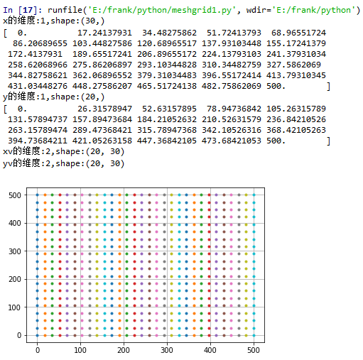
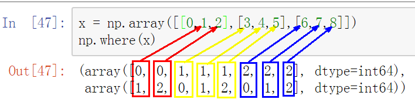
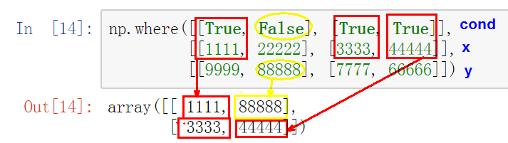

## 目录

[toc]

## 1 `numpy`

`numpy` 是一个强大的矩阵运算工具。

`numpy` 广泛应用于以下任务：

* **机器学习模型**：在编写机器学习算法时，需要对矩阵进行各种数值计算。例如矩阵乘法、换位、加法等。NumPy提供了一个非常好的库，用于简单(在编写代码方面)和快速(在速度方面)计算。NumPy数组用于存储训练数据和机器学习模型的参数。

* **图像处理和计算机图形学**：计算机中的图像表示为多维数字数组。NumPy成为同样情况下最自然的选择。实际上，NumPy提供了一些优秀的库函数来快速处理图像。例如，镜像图像、按特定角度旋转图像等。

* **数学任务**：NumPy对于执行各种数学任务非常有用，如数值积分、微分、内插、外推等。因此，当涉及到数学任务时，它形成了一种基于Python的MATLAB的快速替代。

### 1.1 基本操作

#### 1.1.1 基本概念

##### 1.1.1.1 `ndarray` 数组

NumPy 的主要对象是同类型的多维数组 ndarray。

NumPy 数组的**维度**通过方括号 `[]` 层级区分，称为“轴”，例如 `[1, 2, 1]` 是一维数组，`[[1,0,0],[2,3,4]]` 是二维数组，每进入一层方括号，表示进入到下一个维度。

NmuPy 数组**类**称为 `ndarray`，**别名**为 `array`。这里要注意区分标准 Python 库类 `arrar.array`，后者仅处理一维数组，且功能较少。

`ndarray` 对象具有以下常用属性：

* `ndarray.ndim` - 数组的轴（维度）的个数。在Python世界中，维度的数量被称为rank。
* `ndarray.shape` - 数组的维度。这是一个整数的元组，表示每个维度中数组的大小。
* `ndarray.size` - 数组元素的总数。
* `ndarray.dtype` - 一个描述数组中元素类型的对象。可以指定Python类型或NumPy定义的类型。
* `ndarray.itemsize` - 数组中每个元素的字节大小。
* `ndarray.nbytes` - 数组中全部元素的总字节大小。
* `ndarray.data` - 该缓冲区包含数组的实际元素。一般不用这个，而是用索引。

数据的拷贝是一门学问，有必要理清楚 ndarray 的拷贝方式。

##### 1.1.1.2 `ndarray` 拷贝

**1) 不拷贝**

简单赋值不会创建数组对象或其数据拷贝，函数参数的传递也不会赋值，两者均使用**别名**。


```python
# 例一：简单赋值
a = np.arange(12)
b = a
print('b is a: ',b is a)
```

```
b is a:  True
```

```python
# 例二：可变对象函数传参
def f(x):
    print(id(x))
print(id(a))
f(a)
```

```
93980192
93980192
```

**2) 浅拷贝**

不同的数组对象可以共享数据，实际上就是**引用传递**，称为浅拷贝。

使用 `ndarray.view()` 方法或者切片技术，都可以实现浅拷贝。


```python
c = a.view()
print('c is a:', c is a)
print('c.base is a:', c.base is a)
print('c.flags.owndata:',c.flags.owndata)
print('a = \n',a)
c[4] = 1234
print('c = \n',c)
```

    c is a: False
    c.base is a: True
    c.flags.owndata: False
    a = 
     [ 0  1  2  3  4  5  6  7  8  9 10 11]
    c = 
     [   0    1    2    3 1234    5    6    7    8    9   10   11]

**3) 深拷贝**

要想达到数组数据的完全拷贝，可以使用 `ndarray.copy()` 方法。


```python
d = a.copy()
print('d is a:', d is a)
print('d.base is a:', d.base is a)
print('d.flags.owndata:',d.flags.owndata)
print('a = \n',a)
d[7] = 9999
print('d = \n',d)
```

    d is a: False
    d.base is a: False
    d.flags.owndata: True
    a = 
     [   0    1    2    3 1234    5    6    7    8    9   10   11]
    d = 
     [   0    1    2    3 1234    5    6 9999    8    9   10   11]

#### 1.1.2 数组的创建

##### 1.1.2.1 普通数组 

* `numpy.array()` - 生成指定数据/形状的矩阵

  ```python
  import numpy as np
  
  # 基本语法
  a = np.array([2,3,4])
  b = np.array((1.2, 2.3, 3.8))
  print('a = \n', a)
  print(a.dtype)
  
  a = 
   [2 3 4]
  int32
  
  print()
  print('b = \n', b)
  print(b.dtype)
  
  b = 
   [1.2 2.3 3.8]
  float64
  ```

  ```python
  # 多维 + 指定数据类型
  c = np.array([[1,2,3],[4,5,6]])
  print('c = \n',c)
  print(c.dtype)
  
  c = 
   [[1 2 3]
   [4 5 6]]
  int32
  
  print()
  d = np.array([[1,2,3],[4,5,6]], dtype=complex)
  print('d = \n',d)
  print(d.dtype)
  
  d = 
   [[1.+0.j 2.+0.j 3.+0.j]
   [4.+0.j 5.+0.j 6.+0.j]]
  complex128
  ```

##### 1.1.2.2 序列数组

* `numpy.arange(min, max, interval)` - 生成范围数组（间隔型）

  ```python
  # 生成整数序列
  a = np.arange(10,30,5) # 从 10 开始，到 30 结束，间隔为 5
  print('a = \n',a)
  print(a.dtype)
  
  a = 
   [10 15 20 25]
  int32
  
  # 生成浮点数序列
  b = np.arange(0, 2, 0.3) # 从 0 开始，到 2 结束，间隔为 0.3
  print('b = \n',b)
  print(b.dtype.name)
  
  b = 
   [0.  0.3 0.6 0.9 1.2 1.5 1.8]
  float64
  ```

* `numpy.linspace()` - 生成范围数组（个数型）

  ```python
  # 生成数列，自动类型
  c = np.linspace(0,2,9) # 从 0 开始，到 2 结束，总数为 9
  print('c = \n', c)
  print(c.dtype)
  
  c = 
   [0.   0.25 0.5  0.75 1.   1.25 1.5  1.75 2.  ]
  float64
  ```

##### 1.1.2.3 填充函数

* `np.zeros()` - 全 `0` 矩阵

  ```python
  # numpy.zeros()
  a = np.zeros([3,3])
  print('a = \n',a)
  
  a = 
   [[0. 0. 0.]
   [0. 0. 0.]
   [0. 0. 0.]]
  ```

* `np.ones()` - 全 `1` 矩阵

  ```python
  # numpy.ones()
  b = np.ones((2,3))
  print('b = \n',b)
  
  b = 
   [[1. 1. 1.]
   [1. 1. 1.]]
  ```

* `np.eye()` - 对角矩阵

  ```python
  # numpy.eyes()
  c = np.eye(2)
  print('c = \n',c)
  
  c = 
   [[1. 0.]
   [0. 1.]]
  ```

* `np.empty()` - 值未初始化的数组（速度优势）

  ```python
  # numpy.empty()
  d = np.empty((2,4))
  print('d = \n',d)
  print(d.dtype)
  
  d = 
   [[0.25 0.5  0.75 1.  ]
   [1.25 1.5  1.75 2.  ]]
  float64
  ```

* `np.full()` - 值已初始化的数组

  ```python
  # numpy.full()
  >>> np.full((2, 2), np.inf)
  array([[inf, inf],
         [inf, inf]])
  >>> np.full((2, 2), 10)
  array([[10, 10],
         [10, 10]])
  >>> np.full((2, 2), [1, 2])
  array([[1, 2],
         [1, 2]])
  ```

【注】以上填充函数都有 `like` 版本，能够从已有数组中构造形状相同的新数组，如 `np.ones_like(old_array)`。

##### 1.1.2.4 网格函数

* `np.meshgrid(*xi, copy=True, sparse=False, indexing='xy')` - 根据多个一维向量生成网点矩阵

  * `*xi` - `x1,x2,…,xn: array_like`，代表网格坐标的众多一维向量
  * `indexing` - `{'xy', 'ij'}`，只影响返回的矩阵的表示形式，但并不影响坐标点；`'ij'` 的效果是 `'xy'` 的转置
  * `sparse` - `bool`，为 `True` 时，返回系数网格以节约内存
  * `copy` - `bool`，为 `True` 时，返回原始数据的一个视图以节约内存

  ```python
  # 生成一个20行30列的网格点矩阵
  x = np.linspace(0,500,30)
  print("x的维度:{},shape:{}".format(x.ndim, x.shape))
  print(x)
  y = np.linspace(0,500,20)
  print("y的维度:{},shape:{}".format(y.ndim, y.shape))
  print(y)
  
  xv,yv = np.meshgrid(x, y)
  print("xv的维度:{},shape:{}".format(xv.ndim, xv.shape))
  print("yv的维度:{},shape:{}".format(yv.ndim, yv.shape))
  
  plt.plot(xv, yv, '.')
  plt.grid(True)
  plt.show()
  ```

   

##### 1.2.2.6 坐标点函数

* `np.fromfunction(func,size,dtype)` - 坐标将输入到函数 `func`，取得输出值作为该坐标点元素

  ```python
  # numpy.fromfunction()
  def f(x,y):
      return 10*x+y
  
  b = np.fromfunction(f,(5,4),dtype=int) # 会将坐标输入函数 f，取得输出值作为该坐标点元素
  print('b = \n',b)
  
  b = 
   [[ 0  1  2  3]
   [10 11 12 13]
   [20 21 22 23]
   [30 31 32 33]
   [40 41 42 43]]
  ```

##### 1.1.2.7 随机数函数

`np.random.` 是 NumPy 的随机数模块，有以下随机数组生成函数：

* `rand(d0, d1, ..., dn)` - 生成给定形状 `(d0,d1,...,dn)` 的随机值

  ```python
  >>> np.random.rand(3,2)
  array([[ 0.14022471,  0.96360618],
         [ 0.37601032,  0.25528411],
         [ 0.49313049,  0.94909878]])
  ```

* `randn(d0, d1, ..., dn)` - 生成给定形状 `(d0,d1,...,dn)` 的随机值，具有正态分布

  ```python
  # 标准正态分布
  >>> np.random.randn()
  2.1923875335537315
  
  # 【技巧】均值为 mu，标准差为 sigma 的正态分布：sigma * np.random.randn(...) + mu
  >>> 2.5 * np.random.randn(2, 4) + 3
  array([[-4.49401501,  4.00950034, -1.81814867,  7.29718677],
         [ 0.39924804,  4.68456316,  4.99394529,  4.84057254]])
  ```

* `randint(low[, high, size, dtype])` - 返回随机的整数，位于半开区间 `[low, high)`（只有一个参数时表示 `low=0, high=参数`）

  ```python
  >>> np.random.randint(2, size=10)
  array([1, 0, 0, 0, 1, 1, 0, 0, 1, 0])
  >>> np.random.randint(1, size=10)
  array([0, 0, 0, 0, 0, 0, 0, 0, 0, 0])
  >>> np.random.randint(5, size=(2, 4))
  array([[4, 0, 2, 1],
         [3, 2, 2, 0]])
  ```

* `random_integers(low[, high, size])` - 返回随机的整数，位于闭区间 `[low, high]`（只有一个参数时表示 `low=1, high=参数`）

  ```python
  # 返回 [1,5] 的随机整数
  >>> np.random.random_integers(5)
  4
  >>> type(np.random.random_integers(5))
  <type ‘int‘>
  >>> np.random.random_integers(5, size=(3.,2.))
  array([[5, 4],
         [3, 3],
         [4, 5]])
  # 【技巧】在 [a,b] 之间的 N 个均匀浮点数直接随机：a + (b - a) * (np.random.random_integers(N) - 1) / (N - 1.)
  >>> 2.5 * (np.random.random_integers(5, size=(5,)) - 1) / 4.
  array([ 0.625,  1.25 ,  0.625,  0.625,  2.5  ])
  ```

* `random_sample([size])` - 返回随机的浮点数，在半开区间 `[0.0, 1.0)`

  ```python
  >>> np.random.random_sample()
  0.47108547995356098
  >>> type(np.random.random_sample())
  <type ‘float‘>
  >>> np.random.random_sample((5,))
  array([ 0.30220482,  0.86820401,  0.1654503 ,  0.11659149,  0.54323428])
  
  # 【技巧】返回在指定区间 [a,b) 的浮点数：(b - a) * random_sample() + a
  >>> 5 * np.random.random_sample((3, 2)) - 5
  array([[-3.99149989, -0.52338984],
         [-2.99091858, -0.79479508],
         [-1.23204345, -1.75224494]])
  ```

* `random([size])` - 返回随机的浮点数，在半开区间 `[0.0, 1.0)`，（官网例子与 `random_sample` 完全一样）

* `ranf([size])` - 返回随机的浮点数，在半开区间 `[0.0, 1.0)`，（官网例子与 `random_sample` 完全一样）

* `sample([size])` - 返回随机的浮点数，在半开区间 `[0.0, 1.0)`，（官网例子与 `random_sample` 完全一样）

* `choice(a[, size, replace, p])` - 从给定的一维数组生成随机样本

  * `a` - 一维数组或 `array like`
  * `size` - 样本大小
  * `replace` - 
  * `p` - 数组 `a` 上元素的概率分布

  ```python
  # 从 np.arange(5) 生成 3 个均匀分布的样本，等价于 np.random.randint(0,5,3)
  >>> np.random.choice(5, 3)
  array([0, 3, 4])
  
  # 从 np.arange(5) 生成 3 个非均匀分布的样本
  >>> np.random.choice(5, 3, p=[0.1, 0, 0.3, 0.6, 0])
  array([3, 3, 0])
  
  # 从 np.arange(5) 生成 3 个均匀分布的不重复样本，等价于 np.random.permutation(np.arange(5))[:3]
  >>> np.random.choice(5, 3, replace=False)
  array([3,1,0])
  
  # 从 np.arange(5) 生成 3 个非均匀分布的不重复样本
  >>> np.random.choice(5, 3, replace=False, p=[0.1, 0, 0.3, 0.6, 0])
  array([2, 3, 0])
  
  # 从 array-like 数组生成内容
  >>> aa_milne_arr = [‘pooh‘, ‘rabbit‘, ‘piglet‘, ‘Christopher‘]
  >>> np.random.choice(aa_milne_arr, 5, p=[0.5, 0.1, 0.1, 0.3])
  array([‘pooh‘, ‘pooh‘, ‘pooh‘, ‘Christopher‘, ‘piglet‘],
        dtype=‘|S11‘)
  ```

* `bytes(length)` - 返回随机字节

  ```python
  >>> np.random.bytes(10)
  'eh\x85\x022SZ\xbf\xa4'
  ```

##### 1.2.2.8 排列数函数

`np.random.` 这个 NumPy 的随机数模块，除了有上面的随机数组生成函数外，还有两个随机排列生成函数：

* `shuffle(x)` - 打乱序列 `x` 中的内容

  ```python
  >>> arr = np.arange(10)
  >>> np.random.shuffle(arr)
  >>> arr
  [1 7 5 2 9 4 3 6 0 8]
  
  >>> arr = np.arange(9).reshape((3, 3))
  >>> np.random.shuffle(arr)
  >>> arr
  array([[3, 4, 5],
         [6, 7, 8],
         [0, 1, 2]])
  ```

  【注】对于多维数组，该函数只改变其中的第一个维度，如上所示。

* `permutation(x)` -  返回一个在 `0-x` 的随机排列

  ```python
  >>> np.random.permutation(10)
  array([1, 7, 4, 3, 0, 9, 2, 5, 8, 6])
  
  >>> np.random.permutation([1, 4, 9, 12, 15])
  array([15,  1,  9,  4, 12])
  
  >>> arr = np.arange(9).reshape((3, 3))
  >>> np.random.permutation(arr)
  array([[6, 7, 8],
         [0, 1, 2],
         [3, 4, 5]])
  ```

##### 1.2.2.9 概率分布函数

`np.random.` 这个 NumPy 的随机数模块，除了上面的随机数、排列数函数外，还有大量的概率分布函数，可以详细查阅文档，暂略。

#### 1.1.3 类型的转换

* `type()` - Python 内置函数，获取数据类型

  ```python
  import numpy as np
  a=[1,2,3]
  print(type(a))
  
  list
  ```

* `ndarray.dtype` - NumPy 数组的属性，获取数组元素的数据类型

  ```python
  b = np.array(a)
  print(b)
  print(type(b))
  print(b.dtype)
  
  [1 2 3]
  <class 'numpy.ndarray'>
  int32
  ```

* `np.astype()` - NumPy 数组的方法，修改数组元素的数据类型

  ```python
  c = [0.11,0.22,0.33]
  d = np.array(c)
  e = d.astype(np.int)
  print(d)
  print(e)
  
  [0.11 0.22 0.33]
  [0 0 0]
  ```

#### 1.1.4 运算与函数

==以下留待分割和细化==

##### 1.1.4.1 元素运算

在 NumPy 中 ndarray 的四则运算符，都是针对**元素**运算的。


```python
a = np.array([[1.0,2.0],[3.0,4.0]])
b = np.array([[5.0,6.0],[7.0,8.0]])
print('a = \n', a)
print('b = \n', b)

print('\n四则运算：')
sum = a + b # 元素相加
difference = a - b # 元素相减
product = a * b # 元素相乘
quotient = a / b # 元素相除
print('a + b = \n', sum)
print('a - b = \n', difference)
print('a * b = \n', product)
print('a / b = \n', quotient)

print('\n比较运算：')
print('a < 3 :\n', a<3)
print('a == 3 :\n', a==3)

print('\n双目运算：')
a+=3 # 注意，会改变原数组，遵循自动类型转换规则
print('a += 3：\n', a)
a-=3 # 注意，会改变原数组，遵循自动类型转换规则
print('a -= 3：\n', a)
a*=b # 注意，会改变原数组，遵循自动类型转换规则
print('a *= 3：\n', a)
a/=b # 注意，会改变原数组，遵循自动类型转换规则
print('a /= 3：\n', a)

print('a ** 2：\n', a**2)
```

    a = 
     [[1. 2.]
     [3. 4.]]
    b = 
     [[5. 6.]
     [7. 8.]]
    
    四则运算：
    a + b = 
     [[ 6.  8.]
     [10. 12.]]
    a - b = 
     [[-4. -4.]
     [-4. -4.]]
    a * b = 
     [[ 5. 12.]
     [21. 32.]]
    a / b = 
     [[0.2        0.33333333]
     [0.42857143 0.5       ]]
    
    比较运算：
    a < 3 :
     [[ True  True]
     [False False]]
    a == 3 :
     [[False False]
     [ True False]]
    
    双目运算：
    a += 3：
     [[4. 5.]
     [6. 7.]]
    a -= 3：
     [[1. 2.]
     [3. 4.]]
    a *= 3：
     [[ 5. 12.]
     [21. 32.]]
    a /= 3：
     [[1. 2.]
     [3. 4.]]
    a ** 2：
     [[ 1.  4.]
     [ 9. 16.]]

##### 1.1.4.2 线性代数

在 NumPy 中，对矩阵的操作可以使用相关函数。

更多关于 NumPy 线性代数的知识，可以参与 NumPy 目录中的 `linalg.py`。


```python
# 矩阵乘法
A = np.array([[1,1],[0,1]])
B = np.array([[2,0],[3,4]])
print('A.dot(B)：\n',A.dot(B))
print('np.dot(A,B)：\n',np.dot(A,B))

# 矩阵求迹
print('np.trace(A): \n',np.trace(A))

# 矩阵特征值
print('np.linalg.eig(A)：\n',np.linalg.eig(A))

# 矩阵内元素乘积
m = [1,2,3,4]
M = np.array([[1,2],[3,4]])
print('np.prod([1,2])：\n',np.prod(m))  # 向量，所有元素
print('np.prod(M)：\n',np.prod(M))  # 矩阵，所有元素
print('np.prod(M,axis=0)：\n',np.prod(M,axis=0))  # 矩阵指定维度，axis=0 表示行——最终结果为一行
print('np.prod(M,axis=1)：\n',np.prod(M,axis=1))  # 矩阵指定维度，axis=0 表示列——最终结果为一列
```

    A.dot(B)：
     [[5 4]
     [3 4]]
    np.dot(A,B)：
     [[5 4]
     [3 4]]
    np.trace(A): 
     2
    np.linalg.eig(A)
    (array([1., 1.]), array([[ 1.00000000e+00, -1.00000000e+00],
           [ 0.00000000e+00,  2.22044605e-16]]))
    np.prod([1,2])：
     24
    np.prod(M)：
     24
    np.prod(M,axis=0)：
     [3 8]
    np.prod(M,axis=1)：
     [ 2 12]

##### 1.1.4.3 统计函数


```python
# 求和
a = np.random.random((3,4))
print('a = \n',a)
print('a.sum()：\n',a.sum())
print('a.sum(axis=0)：\n',a.sum(axis=0))
print('a.sum(axis=1)：\n',a.sum(axis=1))

# 最小值
print()
b = np.arange(6,18,1).reshape(3,4)
print('b = \n',b)
print('b.min()：\n',b.min())
print('b.min(axis=0)：\n',b.min(axis=0))
print('b.min(axis=1)：\n',b.min(axis=1))

# 最大值
print()
c = np.linspace(6,17,12).reshape(3,4)
print('c = \n',c)
print('c.max()：\n',c.max())
print('c.max(axis=0)：\n',c.max(axis=0))
print('c.max(axis=1)：\n',c.max(axis=1))

# 累计求和
print()
d = np.arange(12).reshape(3,4)
print('d = \n',d)
print('d.cumsum()：\n',d.cumsum())
print('d.cumsum(axis=0)：\n',d.cumsum(axis=0))
print('d.cumsum(axis=1)：\n',d.cumsum(axis=1))
```

    a = 
     [[0.89172879 0.99782264 0.9983438  0.82075891]
     [0.97674225 0.69865526 0.52299477 0.78551083]
     [0.45975657 0.9641881  0.41116388 0.0395635 ]]
    a.sum()：
     8.567229305878744
    a.sum(axis=0)：
     [2.32822761 2.660666   1.93250245 1.64583325]
    a.sum(axis=1)：
     [3.70865414 2.9839031  1.87467206]
    
    b = 
     [[ 6  7  8  9]
     [10 11 12 13]
     [14 15 16 17]]
    b.min()：
     6
    b.min(axis=0)：
     [6 7 8 9]
    b.min(axis=1)：
     [ 6 10 14]
    
    c = 
     [[ 6.  7.  8.  9.]
     [10. 11. 12. 13.]
     [14. 15. 16. 17.]]
    c.max()：
     17.0
    c.max(axis=0)：
     [14. 15. 16. 17.]
    c.max(axis=1)：
     [ 9. 13. 17.]
    
    d = 
     [[ 0  1  2  3]
     [ 4  5  6  7]
     [ 8  9 10 11]]
    d.cumsum()：
     [ 0  1  3  6 10 15 21 28 36 45 55 66]
    d.cumsum(axis=0)：
     [[ 0  1  2  3]
     [ 4  6  8 10]
     [12 15 18 21]]
    d.cumsum(axis=1)：
     [[ 0  1  3  6]
     [ 4  9 15 22]
     [ 8 17 27 38]]

##### 1.1.4.4 数学函数

NumPy 提供了常见的数学函数。


```python
X = np.arange(3)
print('X = \n',X)
# 指数函数
print('np.exp(X)：\n',np.exp(X))
# 开方函数
print('np.sqrt(X)：\n',np.sqrt(X))
# 退一函数
print('np.floor(np.exp(X))：\n',np.floor(np.exp(X)))
# 进一函数
print('np.ceil(np.sqrt(X))：\n',np.ceil(np.sqrt(X)))
```

    X = 
     [0 1 2]
    np.exp(X)：
     [1.         2.71828183 7.3890561 ]
    np.sqrt(X)：
     [0.         1.         1.41421356]
    np.floor(np.exp(X))：
     [1. 2. 7.]
    np.ceil(np.sqrt(X))：
     [0. 1. 2.]

##### 1.1.4.5 排序、条件筛选函数

* 最值选择

  * `np.maximum()` - 选取两个数组中的最大值
  * `np.minimum()` - 选取两个数组中的最小值

  ```python
  a = np.array(2,1)
  b = np.array(4,1)
  
  >>> np.maximum(a,b)
  array([4,1])
  >>> np.minimum(a,b)
  array([2,1])
  ```

#### 1.1.5 索引、切片和迭代

NumPy 数组的索引、切片和迭代操作类似类似 Python 。

对于高维数组的使用语法也很基于此拓展，容易理解。

**(1) 一维数组**

一维数组的索引和切片操作跟 Python 语法是一样的。


```python
a = np.arange(10)**3
print('a = \n',a)
print('a[2] = \n',a[2])
print('a[2:5] = \n',a[2:5])
a[:6:2] = -1000
print('a[:6:2] = -1000\n',a)
print('a[ : :-1]\n',a[ : :-1])
```

    a = 
     [  0   1   8  27  64 125 216 343 512 729]
    a[2] = 
     8
    a[2:5] = 
     [ 8 27 64]
    a[:6:2] = -1000
     [-1000     1 -1000    27 -1000   125   216   343   512   729]
    a[ : :-1]
     [  729   512   343   216   125 -1000    27 -1000     1 -1000]


**(2) 多维数组**

多维数组的索引和切片非常简单，每个轴有一个索引，以逗号分隔。


```python
def f(x,y):
    return 10*x+y

b = np.fromfunction(f,(6,6),dtype=int)
print('b = \n',b)

print()
print('b[2,3]\n',b[2,3])
print('b[0:5, 1]\n',b[0:5, 1])
print('b[:, 1]\n',b[:, 1])
print('b[1:6:2, 1:6:2]\n',b[1:6:2, 1:6:2])
```

    b = 
     [[ 0  1  2  3  4  5]
     [10 11 12 13 14 15]
     [20 21 22 23 24 25]
     [30 31 32 33 34 35]
     [40 41 42 43 44 45]
     [50 51 52 53 54 55]]
    
    b[2,3]
     23
    b[0:5, 1]
     [ 1 11 21 31 41]
    b[:, 1]
     [ 1 11 21 31 41 51]
    b[1:6:2, 1:6:2]
     [[11 13 15]
     [31 33 35]
     [51 53 55]]


当提供比轴数更少的索引时，NumPy 提供有两种处理方式：

* 确实部分认为是一个完整切片 `:`，索引当前维度的全部
* 手动添加三个点 `...`，表示产生完整索引所需的冒号，索引任意多的维度的全部

例如：


```python
c = np.array([[[1,2,3],[4,5,6]],[[7,8,9],[10,11,12]]])
print('c = \n',c)
print('c[-1]\n',c[-1])
print('c[...,2]\n',c[...,2])
```

    c = 
     [[[ 1  2  3]
      [ 4  5  6]]
    
     [[ 7  8  9]
      [10 11 12]]]
    c[-1]
     [[ 7  8  9]
     [10 11 12]]
    c[...,2]
     [[ 3  6]
     [ 9 12]]


**(3) 迭代**

NumPy 数组支持 Python 的迭代语法。

对于多维数组，其迭代是相对于第一个轴完成的。如果想要对每个元素执行迭代操作，可以使用 `flat` 属性，该属性是数组中所有元素的迭代器。

举个例子：


```python
def f(x,y):
    return 10*x+y

b = np.fromfunction(f,(5,4),dtype=int)
for row in b:
    print(row)
    
for element in b.flat:
    print(element)
```

    [0 1 2 3]
    [10 11 12 13]
    [20 21 22 23]
    [30 31 32 33]
    [40 41 42 43]
    0
    1
    2
    3
    10
    11
    12
    13
    20
    21
    22
    23
    30
    31
    32
    33
    40
    41
    42
    43

### 1.2 形状操作

#### 1.2.1 更改形状

NumPy 提供了一些改变数组形状（即维度）的方法，下面介绍一些常用的。

* `flatten()` - 返回数组扁平化（一维化），顺序为低维递增进位到高维
* `ravel()` - 返回数组扁平化（一维化）<u>的视图</u>，顺序为低维递增进位到高维
* `reshape()` - 返回指定形状的新数组，如果将某个维度指定为-1，则会自动计算其他维度
* `resize()` - 改变数组为指定形状
* `T` - 返回数组的的转置
* `np.roll(a, shift, axis=None)` - 沿着给定轴滚动数组元素，超出最后位置的元素将会滚动到第一个位置
  * `a : (array_like)` - 输入数组
  * `shift : (int or tuple of ints)` - 滚动的长度。如果是提供元组的话，下面的轴参数的维度也应该跟 `shift` 维度一样
  * `axis : (int or tuple of ints, optional)` - 滚动的维度，0 为垂直滚动，1 为水平滚动（默认情况下，即参数为 `None` 时，数组在移位之前会被变成扁平化，之后会恢复原始形状）
  * 返回值 - 输出数组（维度和 `a` 一样）

**注意：**

* 以上函数除了 `resize()` 和 `flatten()` 外都不会改变原数组


```python
a = np.floor(10*np.random.random((3,4)))
print('a = \n',a)
print('a.ravel()：\n',a.ravel())
print('a.reshape(6,2)：\n',a.reshape(6,2))
print('a.T：\n',a.T)
```

    a = 
     [[3. 1. 6. 7.]
     [7. 3. 2. 6.]
     [4. 3. 8. 8.]]
    a.ravel()：
     [3. 1. 6. 7. 7. 3. 2. 6. 4. 3. 8. 8.]
    a.reshape(6,2)：
     [[3. 1.]
     [6. 7.]
     [7. 3.]
     [2. 6.]
     [4. 3.]
     [8. 8.]]
    a.T：
     [[3. 7. 4.]
     [1. 3. 3.]
     [6. 2. 8.]
     [7. 6. 8.]]
     array([[3., 1., 6., 7.],
           [7., 3., 2., 6.],
           [4., 3., 8., 8.]])

#### 1.2.2 数组堆叠

几个数组可以沿不同的轴堆叠在一起。

* `stack(arrays[, axis])` - 沿新轴加入一系列数组
* `vstack(tup)` - 沿第一轴列向堆叠数组
* `hstack(tup)` - 沿第二轴行向堆叠数组
* `column_stack(tup)` - 将1-D阵列作为列堆叠成2-D阵列
* `row_stack(tup)` - 将1-D阵列作为行堆叠成2-D阵列
* `c_(ndarray)` - column_stack 缩写，但只操作数组对象
* `r_(ndarray)` - row_stack 缩写，但只操作数组对象

注释：`tup` 内可以是列表、元组、数组。

这里需要对各个函数作用进行解释和区分。

**(1) `stack()`**

先看以下例子：


```python
# numpy.stack()

# 例一：三个一维数组
print('例一\n')
a = [[1,2,3,4],[5,6,7,8],[9,10,11,12]] # 普通数组
print('a = \n',a)
b = np.stack(a,axis=0)
print('b = \n',b)
c = np.stack(a,axis=1)
print('c = \n',c)

print('\n注意等价情况：\n')

a1 = [1,2,3,4]
a2 = [5,6,7,8]
a3 = [9,10,11,12]
print('a1 = \n',a1)
print('a2 = \n',a2)
print('a3 = \n',a3)
b = np.stack((a1,a2,a3),axis=0)
print('b = \n',b)
c = np.stack((a1,a2,a3),axis=1)
print('c = \n',c)

# 例二：三个二维数组
print('\n例二：\n')
a=[[1,2,3],[4,5,6]]
b=[[1,2,3],[4,5,6]]
c=[[1,2,3],[4,5,6]]
print('a = ',a)
print('b = ',b)
print('c = ',c)

print("\n增加一维，新维度的下标为0：")
d=np.stack((a,b,c),axis=0)
print(d,'\n')

print("增加一维，新维度的下标为1")
d=np.stack((a,b,c),axis=1)
print(d,'\n')

print("增加一维，新维度的下标为2")
d=np.stack((a,b,c),axis=2)
print(d,'\n')
```

    例一
    
    a = 
     [[1, 2, 3, 4], [5, 6, 7, 8], [9, 10, 11, 12]]
    b = 
     [[ 1  2  3  4]
     [ 5  6  7  8]
     [ 9 10 11 12]]
    c = 
     [[ 1  5  9]
     [ 2  6 10]
     [ 3  7 11]
     [ 4  8 12]]
    
    注意等价情况：
    
    a1 = 
     [1, 2, 3, 4]
    a2 = 
     [5, 6, 7, 8]
    a3 = 
     [9, 10, 11, 12]
    b = 
     [[ 1  2  3  4]
     [ 5  6  7  8]
     [ 9 10 11 12]]
    c = 
     [[ 1  5  9]
     [ 2  6 10]
     [ 3  7 11]
     [ 4  8 12]]
    
    例二：
    
    a =  [[1, 2, 3], [4, 5, 6]]
    b =  [[1, 2, 3], [4, 5, 6]]
    c =  [[1, 2, 3], [4, 5, 6]]
    
    增加一维，新维度的下标为0：
    [[[1 2 3]
      [4 5 6]]
    
     [[1 2 3]
      [4 5 6]]
    
     [[1 2 3]
      [4 5 6]]] 
    
    增加一维，新维度的下标为1
    [[[1 2 3]
      [1 2 3]
      [1 2 3]]
    
     [[4 5 6]
      [4 5 6]
      [4 5 6]]] 
    
    增加一维，新维度的下标为2
    [[[1 1 1]
      [2 2 2]
      [3 3 3]]
    
     [[4 4 4]
      [5 5 5]
      [6 6 6]]] 

在解释函数之前，首先要明确数组的“维度”概念，以方括号为特征，最外层的方括号代表第 0 维，向内一层的方括号代表第 1 维，以此层层深入递增。还有，我之所以弄懂函数的作用，还要感谢 https://blog.csdn.net/csdn15698845876/article/details/73380803 的博客。

函数 `stack()` 增加维度的过程是这样理解的，

首先是“加框”，即对传入的元组（或列表、NumPy数组）的每一个元素（也可能是列表、元组、NumPy数组），转换为 NumPy 数组，然后根据 axis 参数值增加一个维度。这里有一个限制，若元素是一维的，则 `axis` 可取 0,1，若元素是二维的，则 `axis` 可取 0,1,2，以此类推。

这里用例一解释说明，对于 `a` 中的第一个元素 `[1,2,3,4]`，若 `axis=0`（默认情况），则增加一个下标为 0 的维度，即为 `[[1,2,3,4]]`；若 `axis=1`，则增加一个下标为 1 的维度，即为 `[[1],[2],[3],[4]]`。这就是第一步，形象点成为“加框”。

然后是“堆叠”，即根据 axis 参数值，将各个元素的“框”串起来。这里又有一个限制，即各个元素的子元素形状必须是相同的，否则会出错。

这里继续用例一解释说明，若 `axis=0`，则对于 `a` 中已经加框的 3 个元素：`[[1,2,3,4]]`、`[[5,6,7,8]]` 和 `[[9,10,11,12]]`，将它们 `axis=0` 维的“框”，也就是之前增加的那个维度，相互串起来，对，打破相邻的“框”，整合成一个大“框”，这就是结果 b；若 `axis=1`，则对于已经加框的 3 个元素：`[[1],[2],[3],[4]]`、`[[5],[6],[7],[8]]`和`[[9],[10],[11],[12]]`，将它们 `axis=1` 维的“框”，也就是之前增加的那个维度，同样相互串起来，这里要注意不同元素之间的对应，比如各个元素的 `[1]`、`[5]` 和 `[9]`对应，然后打破隔阂，融为一体，成为 `[1,5,9]`，其他元素也同理，得到 `[2,6,10]`、`[3,7,11]`、`[4,8,12]`，然后加上 0 维的框，得到结果 c。

这就是 `stack()` 函数的解释，可以试着解释例二，确实能够应用上去。

**(2) `vstack()` 和 `hstack()`**

还是先看看例子：


```python
# 例一：一维数组
print('例一：\n')
a = np.array([1,2,3])
b = np.array([4,5,6])
print('a = \n',a)
print('b = \n',b)

print('np.vstack((a,b))：\n',np.vstack((a,b)))
print('np.hstack((a,b))：\n',np.hstack((a,b)))

# 例二：二维数组
print('\n例二：\n')
a = np.floor(10*np.random.random((3,3)))
print('a = \n',a)
b = np.floor(10*np.random.random((3,3)))
print('b = \n',b)

print()
print('np.vstack((a,b)：\n',np.vstack((a,b)))
print('np.hstack((a,b)：\n',np.hstack((a,b)))
```

    例一：
    
    a = 
     [1 2 3]
    b = 
     [4 5 6]
    np.vstack((a,b))：
     [[1 2 3]
     [4 5 6]]
    np.hstack((a,b))：
     [1 2 3 4 5 6]
    
    例二：
    
    a = 
     [[7. 8. 3.]
     [8. 9. 5.]
     [8. 1. 6.]]
    b = 
     [[6. 2. 7.]
     [9. 0. 1.]
     [9. 5. 3.]]
    
    np.vstack((a,b)：
     [[7. 8. 3.]
     [8. 9. 5.]
     [8. 1. 6.]
     [6. 2. 7.]
     [9. 0. 1.]
     [9. 5. 3.]]
    np.hstack((a,b)：
     [[7. 8. 3. 6. 2. 7.]
     [8. 9. 5. 9. 0. 1.]
     [8. 1. 6. 9. 5. 3.]]


函数 `vstack()` 和 `hstack()` 的解释可以沿用 `stack()` 的概念，只不过这里不用考虑“加框”即增加维度的事，对于 `vstack()`，只需要认为 0 维（轴）是加上去的“框”（维度），对于 `hstack()`,只需要认为 1 维（轴）是加上去的“框”（维度）。

特别地，对于多个一维数组的堆叠，`vstack()`的情况等价于 `stack()` 一个二维数组，`axis=0`; `hstack()` 的情况是认为 0 维就是新加上去的框。

**(3) `column_stack()` 和 `row_stack()`**

老规矩，先看例子：


```python
# 例一：一维数组
print('例一：\n')
a = np.array([1,2,3])
b = np.array([4,5,6])
print('a = \n',a)
print('b = \n',b)

print('np.column_stack((a,b))：\n',np.column_stack((a,b)))
print('np.row_stack((a,b))：\n',np.row_stack((a,b)))

# 例二：二维数组
print('\n例二：\n')
a = np.arange(1,13,1).reshape(3,4)
b = np.arange(1,13,1).reshape(3,4)
print('a = \n',a)
print('b = \n',b)

print()
print('np.column_stack((a,b))：\n',np.column_stack((a,b)))
print('np.row_stack((a,b))：\n',np.row_stack((a,b)))
```

    例一：
    
    a = 
     [1 2 3]
    b = 
     [4 5 6]
    np.column_stack((a,b))：
     [[1 4]
     [2 5]
     [3 6]]
    np.row_stack((a,b))：
     [[1 2 3]
     [4 5 6]]
    
    例二：
    
    a = 
     [[ 1  2  3  4]
     [ 5  6  7  8]
     [ 9 10 11 12]]
    b = 
     [[ 1  2  3  4]
     [ 5  6  7  8]
     [ 9 10 11 12]]
    
    np.column_stack((a,b))：
     [[ 1  2  3  4  1  2  3  4]
     [ 5  6  7  8  5  6  7  8]
     [ 9 10 11 12  9 10 11 12]]
    np.row_stack((a,b))：
     [[ 1  2  3  4]
     [ 5  6  7  8]
     [ 9 10 11 12]
     [ 1  2  3  4]
     [ 5  6  7  8]
     [ 9 10 11 12]]


函数 `column_stack()` 和 `row_stack()` 的解释同样可以沿用上述理论，不过这里 `column_stack()` 认为 1 维才是新增维度，`row_stack()` 认为 0 维才是新增维度。

特别地，对于多个一维数组的堆叠，`column_stack()`的情况等价于 `stack()` 一个二维数组，`axis=1`; `row_stack` 的情况等价于 `stack()` 一个二维数组，`axis=0`。

而更好更快的解释就是定义，`column_stack()` 将每个元素排成一列组成新数组；`row_stack()` 将每个元素排成一行组成新数组。

#### 1.2.3 数组拆分

可以将数组沿不同的维度进行拆分。

* `split(ary, indices_or_sections[, axis])` - 将数组拆分为多个子数组。
* `vsplit(ary, indices_or_sections)` - 将数组垂直拆分为多个子数组（逐行），是上述 axis=1 的情形。
* `hsplit(ary, indices_or_sections)` - 将数组水平拆分为多个子数组（按列），是上述 axis=0 的情形。
* `dsplit(ary, indices_or_sections)` - 沿第3轴（深度）将数组拆分为多个子数组。

注释：`indices_or_sections` 表示要切分的位置，如果为整数表示按照该数均分；如果为索引（数组、列表、元组），则表示各个切分的位置，以指标左边为界。

拆分函数容易理解，下面为示例。


```python
# 例一：一维数组
a = np.arange(8)
print(a)
print(np.split(a,2))
print(np.split(a,[3,6,9]))

# 例二：二维数组
print()
b = np.arange(12).reshape(4,3)
print(b)
print()
print('np.split(b,2): \n',np.split(b,2))
print()
print('np.split(b,[3,6,9]): \n',np.split(b,[3,6,9]))
print()
print('np.split(b,3,1): \n',np.split(b,3,1))
print()

# 例三：vsplit()
print('np.vsplit(b,3): \n',np.split(b,3,1))
print()
```

    [0 1 2 3 4 5 6 7]
    [array([0, 1, 2, 3]), array([4, 5, 6, 7])]
    [array([0, 1, 2]), array([3, 4, 5]), array([6, 7]), array([], dtype=int32)]
    
    [[ 0  1  2]
     [ 3  4  5]
     [ 6  7  8]
     [ 9 10 11]]
    
    np.split(b,2): 
     [array([[0, 1, 2],
           [3, 4, 5]]), array([[ 6,  7,  8],
           [ 9, 10, 11]])]
    
    np.split(b,[3,6,9]): 
     [array([[0, 1, 2],
           [3, 4, 5],
           [6, 7, 8]]), array([[ 9, 10, 11]]), array([], shape=(0, 3), dtype=int32), array([], shape=(0, 3), dtype=int32)]
    
    np.split(b,3,1): 
     [array([[0],
           [3],
           [6],
           [9]]), array([[ 1],
           [ 4],
           [ 7],
           [10]]), array([[ 2],
           [ 5],
           [ 8],
           [11]])]
    
    np.vsplit(b,3): 
     [array([[0],
           [3],
           [6],
           [9]]), array([[ 1],
           [ 4],
           [ 7],
           [10]]), array([[ 2],
           [ 5],
           [ 8],
           [11]])]

#### 1.2.4 数组扩充

* `np.repeat(a,repeats,axis=None)`

* `ndarray.repeat(repeats,axis=None)`
  * `a`：`ndarray`数组
  * `repeats`：一个数或一个矩阵
  * `axis=None`：时候就会`flatten`当前矩阵，实际上就是变成了一个行向量
    * `axis=0`：沿着y轴复制，实际上增加了行数
    * `axis=1`：沿着x轴复制，实际上增加列数
  
* `np.newaxis` - 表示一个新的维度，用于插入一个度数为 `1` 的维度

  ```python
  a=np.array([1,2,3,4,5])
  print(a.shape)
  >>> (5,)
  
  aa=a[:,np.newaxis]
  print(aa.shape)
  >>> (5,1)
  ```

  ```python
  # 示例1：扩充黑白图像的通道数
  np.repeat(imgs_data[:, :, np.newaxis], 3, axis=2)
  ```

### 1.3 排序与搜索

* `np.where(arr)` - 输出 `arr` 中 ‘真’ 值的**坐标**

  * ‘真’ 也可以理解为非零
  * 返回的维度与 `arr` 相同，如果 `arr.shape=(n,)`，则它返回 `shape=(n,)`，是**二维的**

  

* `np.where(cond,x,y)` - 满足条件 `cond` 输出 `x`，不满足输出 `y`

  

  【注】`x` 或 `y` 为单个值时，会应用到所有元素。

* `np.sort(a, axis=-1, kind=None, order=None)` - 返回数组的排序副本。
  * `a` - `array_like`，要排序的数组
  * `axis` - `int` 或 `None`，要排序的轴。 如果为 `None`，则在排序之前将数组展平。默认值是 `-1`，它沿最后一个轴排序
  * `kind` - `'quicksort'`、`'mergesort'`、`'heapssort'`、`'stable'`，排序算法
    * 默认值为 “快速排序”
    * 注意，`"stable"` 和 `"mergesort"` 都使用 `timsort` 或 `radix sort`，通常实际实现将随数据类型而变化
    * 保留 `"mergesort"` 选项是为了向后兼容
  * `order` - `str or list of str`，
    * 当 `a` 是一个定义了字段的数组时，这个参数指定了首先比较哪个字段、然后比较哪个字段，以此类推
      * 可以将单个字段指定为字符串，且不需要指定所有字段，但仍将使用未指定的字段（按照它们在 `dtype` 中出现的顺序）
  * return - `ndarray`，排序后的数组

### 1.3 拷贝

数据的拷贝是一门学问，有必要理清楚 ndarray 的拷贝方式。

#### 1.3.1 不拷贝

简单赋值不会创建数组对象或其数据拷贝，函数参数的传递也不会赋值，两者均使用**别名**。

例如：


```python
# 例一：简单赋值
a = np.arange(12)
b = a
print('b is a: ',b is a)

# 例二：可变对象函数传参
def f(x):
    print(id(x))
print(id(a))
f(a)
```

    b is a:  True
    93980192
    93980192


#### 1.3.2 浅拷贝

不同的数组对象可以共享数据，实际上就是**引用传递**，称为浅拷贝。

使用 `ndarray.view()` 方法或者切片技术，都可以实现浅拷贝。

例如：


```python
c = a.view()
print('c is a:', c is a)
print('c.base is a:', c.base is a)
print('c.flags.owndata:',c.flags.owndata)
print('a = \n',a)
c[4] = 1234
print('c = \n',c)
```

    c is a: False
    c.base is a: True
    c.flags.owndata: False
    a = 
     [ 0  1  2  3  4  5  6  7  8  9 10 11]
    c = 
     [   0    1    2    3 1234    5    6    7    8    9   10   11]


#### 1.3.3 深拷贝

要想达到数组数据的完全拷贝，可以使用 `ndarray.copy()` 方法。


```python
d = a.copy()
print('d is a:', d is a)
print('d.base is a:', d.base is a)
print('d.flags.owndata:',d.flags.owndata)
print('a = \n',a)
d[7] = 9999
print('d = \n',d)
```

    d is a: False
    d.base is a: False
    d.flags.owndata: True
    a = 
     [   0    1    2    3 1234    5    6    7    8    9   10   11]
    d = 
     [   0    1    2    3 1234    5    6 9999    8    9   10   11]


### 1.4 Less 基础

#### 1.4.1 广播

术语 broadcasting 描述 NumPy 在算术运算期间如何处理具有不同形状的数组。

Broadcasting 提供了一种矢量化数组操作的方法，使得循环发生在C而不是Python。这能够避免不必要的数据拷贝，通常能够实现高效的算法。

然而，有些情况下，Broadcasting 是一个坏主意，因为它导致内存低效并减慢计算。

当对两个数组进行运算操作时，NumPy 在元素级别上比较它们的形状。从最高的维度开始，逐个比较，两个维度是兼容的，当且仅当：

* 它们是相等的，或
* 其中之一值为 1

对于兼容维度，数组表现得好像它们具有沿着该维度具有最大形状的数组的大小，从而参与计算。

如果不满足这些条件，则抛出 `ValueError: frames are not aligned` 异常。

这里有一些例子：

    A      (4d array):  8 x 1 x 6 x 1
    B      (3d array):      7 x 1 x 5
    Result (4d array):  8 x 7 x 6 x 5
    
    A      (2d array):  5 x 4
    B      (1d array):      1
    Result (2d array):  5 x 4
    
    A      (2d array):  5 x 4
    B      (1d array):      4
    Result (2d array):  5 x 4
    
    A      (3d array):  15 x 3 x 5
    B      (3d array):  15 x 1 x 5
    Result (3d array):  15 x 3 x 5
    
    A      (3d array):  15 x 3 x 5
    B      (2d array):       3 x 5
    Result (3d array):  15 x 3 x 5
    
    A      (3d array):  15 x 3 x 5
    B      (2d array):       3 x 1
    Result (3d array):  15 x 3 x 5

一个典型的例子是获取两个数组的外积（或者其他 outer 操作）：


```python
a = np.array([0.0, 10.0, 20.0, 30.0])
b = np.array([1.0, 2.0, 3.0])
a[:, np.newaxis] + b
```


    array([[ 1.,  2.,  3.],
           [11., 12., 13.],
           [21., 22., 23.],
           [31., 32., 33.]])

#### 1.4.2 花式索引

NumPy提供了比常规Python序列更多的索引能力。我们下面将看到。

**(1) 使用整数数组索引**

设被索引的数组 a 是一个多维数组，当使用一个数组时，索引的是 a 的维度 0。

下面看一个调色板的示例：


```python
palette = np.array( [ [0,0,0],                # black
...                   [255,0,0],              # red
...                   [0,255,0],              # green
...                   [0,0,255],              # blue
...                   [255,255,255] ] )       # white

image = np.array( [ [ 0, 1, 2, 0 ],           # each value corresponds to a color in the palette
...                 [ 0, 3, 4, 0 ]  ] )

print(palette[[0,4]])
print()
print()
print(palette[image])
```

    [[  0   0   0]
     [255 255 255]]
    [[[  0   0   0]
      [255   0   0]
      [  0 255   0]
      [  0   0   0]]
    [[  0   0   0]
     [  0   0 255]
     [255 255 255]
     [  0   0   0]]]


当使用多个数组时，或多个数组整合成的列表、元组时，索引的维度以此类推。

**注意：**

* 每个维度的索引必须具有相同的形状，或者只是一个标量数值，以自动拼成坐标点。
* 多数组整合体的类型不能为数组（ndarray），会被解释为单个数组。

例如：


```python
a = np.arange(12).reshape(3,4)
print('a = \n',a)

i = np.array([[0,1],[1,2]])
j = np.array([[2,1],[3,3]])
print('i = \n',i)
print('j = \n',j)

# 两个整数数组进行索引
print()
print('a[i,j]：\n',a[i,j])

# 一个整数数组 + 标量值进行索引
print()
print('a[i,2]：\n',a[i,2])
print('a[:,j]：\n',a[:,j])

# 两整数数组整合索引
print()
l = [i,j] # 可以整合为列表、元组，不能使用数组
print('a[l]：\n',a[l])
```

    a = 
     [[ 0  1  2  3]
     [ 4  5  6  7]
     [ 8  9 10 11]]
    i = 
     [[0 1]
     [1 2]]
    j = 
     [[2 1]
     [3 3]]
    
    a[i,j]：
     [[ 2  5]
     [ 7 11]]
    
    a[i,2]：
     [[ 2  6]
     [ 6 10]]
    a[:,j]：
     [[[ 2  1]
      [ 3  3]]
    
     [[ 6  5]
      [ 7  7]]
    
     [[10  9]
      [11 11]]]
    
    a[l]：
     [[ 2  5]
     [ 7 11]]


一个典型例子是搜索时间相关序列的最大值：


```python
time = np.linspace(20, 145, 5) # time scale
data = np.sin(np.arange(20)).reshape(5,4) # 4 time-depedent series
print('time = \n',time)
print('data = \n',data)
ind = data.argmax(axis=0) # index of the maxima for each series
print('ind = \n',ind)
time_max = time[ind]
print('time_max = \n',time_max)
data_max = data[ind, range(data.shape[1])] # => data[ind[0],0], data[ind[1],1]...
print('data_max = \n',data_max)
```

    time = 
     [ 20.    51.25  82.5  113.75 145.  ]
    data = 
     [[ 0.          0.84147098  0.90929743  0.14112001]
     [-0.7568025  -0.95892427 -0.2794155   0.6569866 ]
     [ 0.98935825  0.41211849 -0.54402111 -0.99999021]
     [-0.53657292  0.42016704  0.99060736  0.65028784]
     [-0.28790332 -0.96139749 -0.75098725  0.14987721]]
    ind = 
     [2 0 3 1]
    time_max = 
     [ 82.5   20.   113.75  51.25]
    data_max = 
     [0.98935825 0.84147098 0.99060736 0.6569866 ]


还要注意使用 Python 的 `+=` 等双目运算符的构造，即

    a[[0,0,2]]+=1

不会造成第 0 个元素的重复增加，最终只会增加一次。同理，使用上述方式进行多次赋值时，也是会留下最后一个值。

**(2) 使用布尔数组索引**

一种方法是最自然的使用方式，用与原始数组具有相同形状的布尔数组：


```python
a = np.arange(12).reshape(3,4)
b = a > 4
print('a = \n',a)
print('b = \n',b)
print('a[b] = \n',a[b])
```

    a = 
     [[ 0  1  2  3]
     [ 4  5  6  7]
     [ 8  9 10 11]]
    b = 
     [[False False False False]
     [False  True  True  True]
     [ True  True  True  True]]
    a[b] = 
     [ 5  6  7  8  9 10 11]


另一种方法是，对于数组的每个维度，给出一个一维布尔数组，选择想要的切片。

这里要注意，`1D` 布尔数组的长度必须与切片维度的长度一致。

下面看一些例子：


```python
a = np.arange(12).reshape(3,4)
b1 = np.array([False,True,True])
b2 = np.array([True,False,True,False])
print('a[b1,:]：\n',a[b1,:])
print('a[b1]：\n',a[b1])
print('a[:,b2]：\n',a[:,b2])
print('a[b1,b2]：\n',a[b1,b2])
```

    a[b1,:]：
     [[ 4  5  6  7]
     [ 8  9 10 11]]
    a[b1]：
     [[ 4  5  6  7]
     [ 8  9 10 11]]
    a[:,b2]：
     [[ 0  2]
     [ 4  6]
     [ 8 10]]
    a[b1,b2]：
     [ 4 10]


**(3) 使用 `ix_()` 函数索引**

官网上，关于 `ix_()` 函数的描述是

`numpy.ix_(*args)`

> Construct an open mesh from multiple sequences.
>
> This function takes N 1-D sequences and returns N outputs with N dimensions each, such that the shape is 1 in all but one dimension and the dimension with the non-unit shape value cycles through all N dimensions.
>
> Using `ix_` one can quickly construct index arrays that will index the cross product. 

下面是该函数的效果，该函数可以用于花式索引。


```python
a = np.arange(10).reshape(2, 5)
print('a =\n',a)
print()
ixgrid = np.ix_([0, 1], [2, 4])
print('ixgrid =\n',ixgrid)
print('a[ixgrid] =\n',a[ixgrid])
print()
ixgrid = np.ix_([True, True], [2, 4])
print('ixgrid =\n',ixgrid)
print('a[ixgrid] =\n',a[ixgrid])
```

    a =
     [[0 1 2 3 4]
     [5 6 7 8 9]]
    
    ixgrid =
     (array([[0],
           [1]]), array([[2, 4]]))
    a[ixgrid] =
     [[2 4]
     [7 9]]
    
    ixgrid =
     (array([[0],
           [1]], dtype=int64), array([[2, 4]]))
    a[ixgrid] =
     [[2 4]
     [7 9]]

**以下未完待续。。。**

### 1.5 NumPy I/O 操作

### 1.6 字节交换

### 1.7 结构化数组

### 1.8 子类化 ndarray