## 目录

[toc]

## 1 `pandas`

`pandas` 是基于 NumPy 的一种工具，纳入了大量库和一些标准的数据模型，提供了高效地操作大型数据集所需的工具。

`pandas` 是使Python成为强大而高效的数据分析环境的重要因素之一。

### 1.1 `pandas` 基础

这是一个关于 Pandas 的简短教程，主要适用于新手。

#### 1.1.1 导包

Pandas 是基于 NumPy 的一种数据处理工具，所以使用前还要导入 NumPy。

也正因如此，Pandas 支持 NumPy 的数据。


```python
import numpy as np
import pandas as pd
```

#### 1.1.2 创建操作

##### 创建一个序列（Series）

通过 `pandas.Series([data, index, dtype, name, copy, …])` 函数来创建一个 Pandas 序列，其中 `data` 可以是 Python 的列表、元组，也可以是 NumPy 的数组。


```python
s1 = pd.Series([1, 3, 5, np.nan, 6, 8])
print(s1)
print()

s2 = pd.Series((2, 4, 6, np.pi, 3.14159, 2.71828))
print(s2)
print()

s3 = pd.Series(np.array((-2, 0, 2, np.nan, np.pi)))
print(s3)
```

    0    1.0
    1    3.0
    2    5.0
    3    NaN
    4    6.0
    5    8.0
    dtype: float64
    
    0    2.000000
    1    4.000000
    2    6.000000
    3    3.141593
    4    3.141590
    5    2.718280
    dtype: float64
    
    0   -2.000000
    1    0.000000
    2    2.000000
    3         NaN
    4    3.141593
    dtype: float64

##### 创建一个数据帧（DataFrame）

通过 `pandas.DataFrame([data, index, columns, dtype, copy])` 来创建一个 Pandas 数据帧，其中 `data` 可以是 Python 的列表、元组或字典，也可以是 NumPy 的数组。

还可以通过 `DataFrame.reindex()` 函数从已有的数据帧中创建新的数据帧，这之中的数据转移方式是深拷贝。

`index` 是索引列属性，默认为自然数，`column` 是标题列属性，**默认为自然数**。

下面是一些关于创建的例子：


```python
# 使用数组创建
df = pd.DataFrame(np.random.randn(6,4))
print(df)
print()

# 使用列表创建
a = [[1,2,3,4],[5,6,7,8],[9,10,11,12],[13,14,15,16],[17,18,19,20],[21,22,23,24]]
df = pd.DataFrame(a)
print(df)
print()

# index、columns 参数的使用
dates = pd.date_range('20190101', periods=6) # 先获取今年的时间数据
print(dates)
df = pd.DataFrame(np.random.randn(6,4), index=dates, columns=list('ABCD'))
print(df)
```

              0         1         2         3
    0  0.675949  0.445757  0.287915 -1.373965
    1  1.851662  1.145405 -0.478097 -0.570022
    2 -0.129140  0.114182 -1.466744 -0.138573
    3 -0.353002  0.128363  0.055248 -1.670705
    4  0.172371  0.744562 -0.251506  1.153098
    5 -0.581027  0.378777 -0.507267 -0.070305
    
        0   1   2   3
    0   1   2   3   4
    1   5   6   7   8
    2   9  10  11  12
    3  13  14  15  16
    4  17  18  19  20
    5  21  22  23  24
    
    DatetimeIndex(['2019-01-01', '2019-01-02', '2019-01-03', '2019-01-04',
                   '2019-01-05', '2019-01-06'],
                  dtype='datetime64[ns]', freq='D')
                       A         B         C         D
    2019-01-01 -1.783591  0.848046 -0.759661 -0.312821
    2019-01-02  0.043549 -1.940105 -0.109868  0.022066
    2019-01-03 -0.113384 -0.864056  0.630229  0.298798
    2019-01-04 -1.730280 -1.146362  0.125142  0.352748
    2019-01-05  0.629325 -1.637231  0.126966  1.059090
    2019-01-06  0.387386 -1.394027 -1.318434 -0.081571

```python
# 使用字典创建
df2 = pd.DataFrame({'A': 1.,
                    'B': pd.Timestamp('20130102'),
                    'C': pd.Series(1, index=list(range(4)), dtype='float32'),
                    'D': np.array([3] * 4, dtype='int32'),
                    'E': pd.Categorical(["test", "train", "test", "train"]),
                    'F': 'foo'})
print(df2)
print()
print(df2.dtypes) # 允许各列使用不同的数据类型
```

         A          B    C  D      E    F
    0  1.0 2013-01-02  1.0  3   test  foo
    1  1.0 2013-01-02  1.0  3  train  foo
    2  1.0 2013-01-02  1.0  3   test  foo
    3  1.0 2013-01-02  1.0  3  train  foo
    
    A           float64
    B    datetime64[ns]
    C           float32
    D             int32
    E          category
    F            object
    dtype: object

```python
# 从已有的 DataFrame 创建
df1 = df.reindex(index=dates[0:4], columns=list(df.columns) + ['E'])
print(df1)
```

                       A         B         C         D   E
    2019-01-01 -1.783591  0.848046 -0.759661 -0.312821 NaN
    2019-01-02  0.043549 -1.940105 -0.109868  0.022066 NaN
    2019-01-03 -0.113384 -0.864056  0.630229  0.298798 NaN
    2019-01-04 -1.730280 -1.146362  0.125142  0.352748 NaN


#### 1.1.3 查询操作

##### 查询首尾信息

使用 `DataFrame.head([n])` 可以查阅开始的某些行，使用 `DataFrame.tail([n])` 可以查阅末尾的某些行。

例如：


```python
print(df.head())
print()
print(df.tail(3))
```

                       A         B         C         D
    2019-01-01 -1.783591  0.848046 -0.759661 -0.312821
    2019-01-02  0.043549 -1.940105 -0.109868  0.022066
    2019-01-03 -0.113384 -0.864056  0.630229  0.298798
    2019-01-04 -1.730280 -1.146362  0.125142  0.352748
    2019-01-05  0.629325 -1.637231  0.126966  1.059090
    
                       A         B         C         D
    2019-01-04 -1.730280 -1.146362  0.125142  0.352748
    2019-01-05  0.629325 -1.637231  0.126966  1.059090
    2019-01-06  0.387386 -1.394027 -1.318434 -0.081571

##### 查询索引、列标签信息

可以通过 `DataFrame.index`、`DataFrame.columns` 等属性查看数据帧的某些信息。

举个例子：


```python
print(df.index)
print()
print(df.columns)
```

    DatetimeIndex(['2019-01-01', '2019-01-02', '2019-01-03', '2019-01-04',
                   '2019-01-05', '2019-01-06'],
                  dtype='datetime64[ns]', freq='D')
    
    Index(['A', 'B', 'C', 'D'], dtype='object')

##### 查询概况

函数 `DataFrame.describe([percentiles, include, …])` 可以显示数据的简要信息。

* `percentiles` : list-like，可以设定数值型特征的统计量
* `include` : 
  * 默认是只计算数值型特征的统计量
  * 当输入`include=['O']`，会计算离散型变量的统计特征
  * 传参数`‘all’`的时候，会把数值型和离散型特征的统计都进行显示
* `exclude` : 功能与`include`相反

比如：


```python
print(df.describe())
```

                  A         B         C         D
    count  6.000000  6.000000  6.000000  6.000000
    mean  -0.427832 -1.022289 -0.217605  0.223052
    std    1.061856  0.989678  0.703176  0.477885
    min   -1.783591 -1.940105 -1.318434 -0.312821
    25%   -1.326056 -1.576430 -0.597213 -0.055662
    50%   -0.034917 -1.270194  0.007637  0.160432
    75%    0.301427 -0.934632  0.126510  0.339261
    max    0.629325  0.848046  0.630229  1.059090

##### 查询转置

属性 `DataFrame.T` 提供数据的转置视图。

如下：


```python
print(df.T)
```

       2019-01-01  2019-01-02  2019-01-03  2019-01-04  2019-01-05  2019-01-06
    A   -1.783591    0.043549   -0.113384   -1.730280    0.629325    0.387386
    B    0.848046   -1.940105   -0.864056   -1.146362   -1.637231   -1.394027
    C   -0.759661   -0.109868    0.630229    0.125142    0.126966   -1.318434
    D   -0.312821    0.022066    0.298798    0.352748    1.059090   -0.081571


#### 1.1.4 选择操作

关于 Pandas 的数据选择操作，可以使用 Python/Numpy 的选择和赋值的表达语法，但是在实际的开发生产中，Pandas 更加推荐使用优化后的数据选择方法：`.at`，`.iat`，`.loc`，`.iloc`。

##### 沿用 Python/NumPy 的选择方式

Pandas 数据帧和序列支持使用**方括号的形式**进行索引和切片。例如：


```python
print(df['A'])  # 选择一列
print()
print(df[0:3])  # 选择一行
```

    2019-01-01   -1.783591
    2019-01-02    0.043549
    2019-01-03   -0.113384
    2019-01-04   -1.730280
    2019-01-05    0.629325
    2019-01-06    0.387386
    Freq: D, Name: A, dtype: float64
    
                       A         B         C         D
    2019-01-01 -1.783591  0.848046 -0.759661 -0.312821
    2019-01-02  0.043549 -1.940105 -0.109868  0.022066
    2019-01-03 -0.113384 -0.864056  0.630229  0.298798

##### 通过标签选择

这里的*标签*指的是 `index` 和 `column`，即**索引名称和列名**。对标签使用函数 **`.loc` 和 `.at`** 来选择行列的某些数据，语法与 Python/NumPy 索引和切片方式一样。

其中，如果只选取一个值，用 `.at` 方法会更加高效。 关于 `.loc` 和 `.at` 的其他详细区别，这里不深入讨论。

例如：


```python
# 选取第 0 维 index 为 '2019-01-01' 的一行数据
print(df.loc['2019-01-01'])
# 选取第 1 维 column 为 'A' 和 'B' 的两列数据
print()
print(df.loc[:,['A','B']])
# 选取行为 '20190102'、'20190104'，列为 'A'，'B' 的数据
print()
print(df.loc['20190102':'20190104', ['A', 'B']])
# 两种函数选取单个值，后者更加高效
print()
print(df.loc[dates[0], 'A'])
print(df.at[dates[0], 'A'])
```

    A   -1.783591
    B    0.848046
    C   -0.759661
    D   -0.312821
    Name: 2019-01-01 00:00:00, dtype: float64
    
                       A         B
    2019-01-01 -1.783591  0.848046
    2019-01-02  0.043549 -1.940105
    2019-01-03 -0.113384 -0.864056
    2019-01-04 -1.730280 -1.146362
    2019-01-05  0.629325 -1.637231
    2019-01-06  0.387386 -1.394027
    
                       A         B
    2019-01-02  0.043549 -1.940105
    2019-01-03 -0.113384 -0.864056
    2019-01-04 -1.730280 -1.146362
    
    -1.78359119282541
    -1.78359119282541

##### 通过坐标选择

无论是之前的标签选择，还是现在的**坐标**选择，其索引和切片使用方式本质上是一样的。这里要提醒一下，Pandas 和 Python 以及 NumPy 一样，坐标，或者说是下标，都是从 0 开始的。

同样的，如果只选取一个值，用 `.iat` 方法会更加高效。 关于 **`.iloc` 和 `.iat`** 的其他详细区别，这里不深入讨论。

下面看看例子就明白了。


```python
# 选取第 0 维坐标为 3 的数据
print(df.iloc[3])
# 选取第 0 维坐标 3 至 坐标 5 ，第 1 维坐标 0 至 坐标 2 的数据
print()
print(df.iloc[3:5, 0:2])
# 坐标支持类似 Python/NumPy 切片的缺省语法
print()
print(df.iloc[1:3, :])
print(df.iloc[:, 1:3])
# 两种函数选取单个值，后者更加高效
print()
print(df.iloc[1,1])
print(df.iat[1,1])
```

    A   -1.730280
    B   -1.146362
    C    0.125142
    D    0.352748
    Name: 2019-01-04 00:00:00, dtype: float64
    
                       A         B
    2019-01-04 -1.730280 -1.146362
    2019-01-05  0.629325 -1.637231
    
                       A         B         C         D
    2019-01-02  0.043549 -1.940105 -0.109868  0.022066
    2019-01-03 -0.113384 -0.864056  0.630229  0.298798
                       B         C
    2019-01-01  0.848046 -0.759661
    2019-01-02 -1.940105 -0.109868
    2019-01-03 -0.864056  0.630229
    2019-01-04 -1.146362  0.125142
    2019-01-05 -1.637231  0.126966
    2019-01-06 -1.394027 -1.318434
    
    -1.9401047379708154
    -1.9401047379708154

【注】常见警告：`A value is trying to be set on a copy of a slice from a DataFrame`

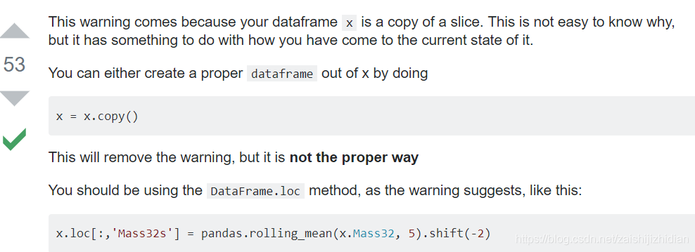

这是由于**在一个 `slice` 结果上进行赋值**引起的，例如：

```python
# 错误：连续两次用选择操作
group['前航延误'][1:] = group['到达延误时间'][0:len(group)-1]
# 正确
group.iloc[1:,group.columns.get_loc('前航延误')] = group['到达延误时间'].iloc[0:len(group)-1]
```

```python
flight_data['前航延误'].iloc[flight_data['飞机编号']==0] = np.NaN  # 连续两次用选择操作
```

##### 通过布尔选择

正如 Python/NumPy 的索引和切片支持使用**布尔**类型的集合一样，Pandas 同样有类似的索引和切片方式。


```python
# 使用单列布尔值选择数据帧
print(df.B > 0)
print(df[df.B > 0])
# 使用整帧布尔值选择数据帧
print('=' * 50)
print(df > 0)
print(df[df > 0])
```

    2019-01-01     True
    2019-01-02    False
    2019-01-03    False
    2019-01-04    False
    2019-01-05    False
    2019-01-06    False
    Freq: D, Name: B, dtype: bool
                       A         B         C         D
    2019-01-01 -1.783591  0.848046 -0.759661 -0.312821
    ==================================================
                    A      B      C      D
    2019-01-01  False   True  False  False
    2019-01-02   True  False  False   True
    2019-01-03  False  False   True   True
    2019-01-04  False  False   True   True
    2019-01-05   True  False   True   True
    2019-01-06   True  False  False  False
                       A         B         C         D
    2019-01-01       NaN  0.848046       NaN       NaN
    2019-01-02  0.043549       NaN       NaN  0.022066
    2019-01-03       NaN       NaN  0.630229  0.298798
    2019-01-04       NaN       NaN  0.125142  0.352748
    2019-01-05  0.629325       NaN  0.126966  1.059090
    2019-01-06  0.387386       NaN       NaN       NaN

【注】布尔选择支持基于位运算符 `&`、`|`、`~` 的逻辑运算。

#### 1.1.5 更新操作

能选择就能更新，即上一小节选择的数据能够直接赋值以更新，但要注意维度的匹配。

赋值的数据来源可以是列表、元组、NumPy 数组和 Pandas 的 `Series` 和 `DataFrame`。

##### 序列更新


```python
# 使用序列更新整列
s1 = pd.Series([1, 2, 3, 4, 5, 6], index=pd.date_range('20190102', periods=6)) # 一个序列
print('s1 = \n', s1)
```

```
s1 = 
2019-01-02    1
2019-01-03    2
2019-01-04    3
2019-01-05    4
2019-01-06    5
2019-01-07    6
Freq: D, dtype: int64
```

```python
df['F'] = s1
print(df)
```

```
                   A         B         C         D    F
2019-01-01 -1.783591  0.848046 -0.759661 -0.312821  NaN
2019-01-02  0.043549 -1.940105 -0.109868  0.022066  1.0
2019-01-03 -0.113384 -0.864056  0.630229  0.298798  2.0
2019-01-04 -1.730280 -1.146362  0.125142  0.352748  3.0
2019-01-05  0.629325 -1.637231  0.126966  1.059090  4.0
2019-01-06  0.387386 -1.394027 -1.318434 -0.081571  5.0
```

##### 数组更新

```python
# 使用 ndarray 更新整列
df.loc[:, 'D'] = np.array([5] * len(df))
print(df)
```

                       A         B         C  D    F
    2019-01-01 -1.783591  0.848046 -0.759661  5  NaN
    2019-01-02  0.043549 -1.940105 -0.109868  5  1.0
    2019-01-03 -0.113384 -0.864056  0.630229  5  2.0
    2019-01-04 -1.730280 -1.146362  0.125142  5  3.0
    2019-01-05  0.629325 -1.637231  0.126966  5  4.0
    2019-01-06  0.387386 -1.394027 -1.318434  5  5.0

##### 选择更新

```python
# 标签选择并更新
df.at[dates[0], 'A'] = 0
print(df)

# 坐标选择并更新
print()
df.iat[0, 1] = 0
print(df)
      
# 布尔选择并更新
print()
df2 = df.copy() # 深拷贝
df2[df2 > 0] = -df2
print(df2)
```

                       A         B         C  D    F
    2019-01-01  0.000000  0.848046 -0.759661  5  NaN
    2019-01-02  0.043549 -1.940105 -0.109868  5  1.0
    2019-01-03 -0.113384 -0.864056  0.630229  5  2.0
    2019-01-04 -1.730280 -1.146362  0.125142  5  3.0
    2019-01-05  0.629325 -1.637231  0.126966  5  4.0
    2019-01-06  0.387386 -1.394027 -1.318434  5  5.0
    
                       A         B         C  D    F
    2019-01-01  0.000000  0.000000 -0.759661  5  NaN
    2019-01-02  0.043549 -1.940105 -0.109868  5  1.0
    2019-01-03 -0.113384 -0.864056  0.630229  5  2.0
    2019-01-04 -1.730280 -1.146362  0.125142  5  3.0
    2019-01-05  0.629325 -1.637231  0.126966  5  4.0
    2019-01-06  0.387386 -1.394027 -1.318434  5  5.0
    
                       A         B         C  D    F
    2019-01-01  0.000000  0.000000 -0.759661 -5  NaN
    2019-01-02 -0.043549 -1.940105 -0.109868 -5 -1.0
    2019-01-03 -0.113384 -0.864056 -0.630229 -5 -2.0
    2019-01-04 -1.730280 -1.146362 -0.125142 -5 -3.0
    2019-01-05 -0.629325 -1.637231 -0.126966 -5 -4.0
    2019-01-06 -0.387386 -1.394027 -1.318434 -5 -5.0

### 1.2 Pandas 数据处理

#### 1.2.1 元素处理

##### 函数作用三板斧

* `Series.map(arg, na_action=None)` - 把对应 `Series` 的数据逐个当作<u>参数</u>传入到字典或函数中，得到映射后的值。

  * `arg` - 函数或字典，其中要求函数只能传入一个参数
  * `na_action` - `None`或`'ignore'`，默认的`None`遇到`NaN`值也会传入处理，`ignore`则会忽略不传入

  ```python
  >>> s.map({'cat': 'kitten', 'dog': 'puppy'})
  0   kitten
  1    puppy
  2      NaN
  3      NaN
  dtype: object
  >>> s.map('I am a {}'.format)
  0       I am a cat
  1       I am a dog
  2       I am a nan
  3    I am a rabbit
  dtype: object
  ```

* `Series.apply(func, convert_dtype=True, args=(), **kwds)` - 和 map 函数原理相同，但允许更复杂的函数。

  * `func` - 函数，且允许接收额外参数，这些额外参数以元组形式传入参数`args`中
  * `convert_dtype` - 是否尝试为函数结果寻找最适合的类型，默认为是，否则元素全为`object`

  ```python
  >>> def subtract_custom_value(x, custom_value):
  ...     return x - custom_value
  >>> s.apply(subtract_custom_value, args=(5,))
  London      15
  New York    16
  Helsinki     7
  dtype: int64
  ```

* `DataFrame.apply(func, axis=0, raw=False, result_type=None, args=(), **kwds)` - 沿着数据帧中的某一个维度作为 Series，应用 func 参数所指的函数，然后整合结果返回。

  * `func` - 函数，用于作用数据中的<u>一行或一列</u>，同样允许接受额外参数
  * `axis` - 默认为 0（或`'index'`），表示各列以 Series 形式作为参数，“一列一列来“；1 或（`'column'`）则将各行作为函数参数，”一行一行来“
  * `raw` - 决定是否将行/列作为一个 Series 对象或 ndarray 对象传入
  * `result_type` - 暂略

  ```python
  >> df = pd.DataFrame([[4, 9]] * 3, columns=['A', 'B'])
  >> df
     A  B
  0  4  9
  1  4  9
  2  4  9
  >> df.apply(lambda x: pd.Series([1, 2], index=['foo', 'bar']), axis=1)
     foo  bar
  0    1    2
  1    1    2
  2    1    2
  ```

* `DataFrame.applymap(func)` - 对每一个元素应用 `func` 参数所指的函数

  ```python
  >> df = pd.DataFrame([[1, 2.12], [3.356, 4.567]])
  >> df
         0      1
  0  1.000  2.120
  1  3.356  4.567
  >> df.applymap(lambda x: len(str(x)))
     0  1
  0  3  4
  1  5  5
  ```

##### 缺失值处理

缺失数据处理是数据处理中一个常见的问题。Pandas 默认使用 NumPy 的 `np.nan` 值作为缺失数据，且<u>默认情况下不参与到 Pandas 的各种运算中</u>。

Pandas 中判断 `np.nan` 的方法：

* `pd.isna(df) / sedf.isna()` - 判断无效值 `np.nan`，返回布尔类型的数据帧
* `pd.notna(df) / sedf.notna()` - 判断有效值，返回布尔类型的数据帧
* `pd.notnull(df) / sedf.notnull()` - `notna()` 函数的别名

Pandas 中操作 `np.nan` 的方法：

* `DataFrame.dropna(...)` - 移除缺失值
  * `axis` - `{0 or ‘index’, 1 or ‘columns’}, default 0`，处理的维度
  * `how` - `{‘any’, ‘all’}, default ‘any’`，默认有空值就处理，`all` 表示全为空值才处理
  * `thresh` - `int, optional`，要求非空值数量多于该阈值，否则处理空值
  * `subset` - `column label or sequence of labels, optional`，用列名列表指出移除空值的子区域
  * `inplace` - `bool, default False`，为 `True` 时直接在原对象上操作，返回变为 `None`
* `DataFrame.fillna(...)` - 填充缺失值
  * `values` - `scalar, dict, Series, or DataFrame`，用于填充的值，`Series` 能定制 `index`，`DataFrame` 能定制 `column`
  * `method` - `{‘backfill’, ‘bfill’, ‘pad’, ‘ffill’, None}, default None`，控制自动填充，是向上填充还是向下填充
    * `'pad' / 'ffill'` - 自下自动填充
    * `'backfill' / 'bfill'` - 自上自动填充

  * `axis` - `{0 or ‘index’, 1 or ‘columns’}, default 0`，处理的维度
  * `inplace` - `bool, default False`，为 `True` 时直接在原对象上操作，返回变为 `None`
  * `limit` - `int, default None`，向上或者向下填充时控制多填充多少个含空值行 / 列 / axis
  * `downcast` - `dict, default is None`，一个 `item: dtype str or 'infer'` 字典，会据此尝试进行类型转换


稍微看看例子：


```python
# 准备一下例子
df1.loc[dates[0]:dates[1], 'E'] = 1
print(df1)
# 移除缺失值
print()
print(df1.dropna(how='any'))
# 填充缺失值
print()
print(df1.fillna(value=5))
# 替换缺失值
print()
print(df1.replace(np.nan, 999))
# 判断缺失值
print()
print(pd.isna(df1))
```

                       A         B         C         D    E
    2019-01-01 -1.783591  0.848046 -0.759661 -0.312821  1.0
    2019-01-02  0.043549 -1.940105 -0.109868  0.022066  1.0
    2019-01-03 -0.113384 -0.864056  0.630229  0.298798  NaN
    2019-01-04 -1.730280 -1.146362  0.125142  0.352748  NaN
    
                       A         B         C         D    E
    2019-01-01 -1.783591  0.848046 -0.759661 -0.312821  1.0
    2019-01-02  0.043549 -1.940105 -0.109868  0.022066  1.0
    
                       A         B         C         D    E
    2019-01-01 -1.783591  0.848046 -0.759661 -0.312821  1.0
    2019-01-02  0.043549 -1.940105 -0.109868  0.022066  1.0
    2019-01-03 -0.113384 -0.864056  0.630229  0.298798  5.0
    2019-01-04 -1.730280 -1.146362  0.125142  0.352748  5.0
    
                       A         B         C         D      E
    2019-01-01 -1.783591  0.848046 -0.759661 -0.312821    1.0
    2019-01-02  0.043549 -1.940105 -0.109868  0.022066    1.0
    2019-01-03 -0.113384 -0.864056  0.630229  0.298798  999.0
    2019-01-04 -1.730280 -1.146362  0.125142  0.352748  999.0
    
                    A      B      C      D      E
    2019-01-01  False  False  False  False  False
    2019-01-02  False  False  False  False  False
    2019-01-03  False  False  False  False   True
    2019-01-04  False  False  False  False   True

##### 字符值编码

在使用字符型数据时，常常需要将有限字符空间映射到相应的有限整数空间。

首先，制作“码表”，

```python
state_dict = {v:k for k,v in enumerate(set(dataset['state']))}
```

然后，使用 `pd.map()` 函数进行映射替换，

```python
dataset['state'] = dataset['state'].map(state_dict).astype(int)
```

需要限定整数的话，可以用 `df.astype(int)` 这个函数。

##### 删除含有某个特殊值的行

思路：通过选择 `8.1.4 选择数据 布尔选择` 来筛除含有该数据的行（这时因为该行其他列还有数据，因此特殊值变为`NAN`），然后再用`8.1.6 处理数据 dropna()`处理缺失数据，直接剔除整行。

例子：

```python
z = pd.DataFrame(np.array([months, y0]).T, columns=['x', 'y'])
z = z[z!=''].dropna()

'''
处理前：
	x			  y
0	20-04	28177.8
1	20-03	26449.9
2	20-02
3	20-01
4	19-12	38776.7	

z[z!='']后：
	x			  y
0	20-04	28177.8
1	20-03	26449.9
2	20-02	NaN
3	20-01	NaN
4	19-12	38776.7	

最后z[z!=''].dropna()：
	x			  y
0	20-04	28177.8
1	20-03	26449.9
2	19-12	38776.7
'''
```

##### 数据的分组与聚合

* `DataFrame.groupby(by=None, axis=0, level=None, as_index=True, sort=True, group_keys=True, squeeze=<object object>, observed=False, dropna=True)`
  * `by` : `mapping, function, label, or list of labels`，该参数用于决定分组的标准
    * 如果是 `function`，则会分别作用于 index 的每个值
    * 如果是 `dict` 或 `series`，则 VALUES 值会用于决定分组
    * 如果是 `ndarray`，则其值决定分组
    * 如果是 `label` 或 `list of labels`，则 label 当做一个键，决定分组（？）
  * `axis` : `{0 or ‘index’, 1 or ‘columns’}`，按行（`0`）或列（`1`）划分组
  * `level` : `int, level name, or sequence of such, default None`，如果维度 axis 是复合索引，则会按照特点的 level(s) 进行判定
  * `as_index` : `bool, default True`
    * `true` : 用于聚集性输出，返回对象中会使用改组的组标签作为索引，只用于 DataFrame 输出
    * `false` : 高效的“SQL-style"分组输出，相当于加了 `reset_index`
  
  * `sort` : `bool, default True`，排序每组的键值，会增加开销
  * `group_keys` : `bool, default True`
  * `observed` : `bool, default False`
  * `dropna` : `bool, default True`

**0）示例数据**

```python
company=["A","B","C"]
data=pd.DataFrame({
    "company":[company[x] for x in np.random.randint(0,len(company),10)],
    "salary":np.random.randint(5,50,10),
    "age":np.random.randint(15,50,10)
}
)
```

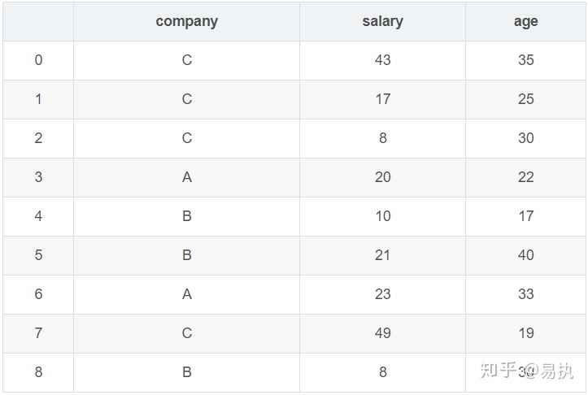

**1）`groupby` 操作**

下面解析 `groupby`函数的原理。

```python
In [5]: group = data.groupby("company")
In [6]: group
Out[6]: <pandas.core.groupby.generic.DataFrameGroupBy object at 0x000002B7E2650240>

# 为了看看 group 内部究竟是什么，这里把 group 转换成 list 的形式来看一看
In [8]: list(group)
Out[8]:
[('A',   company  salary  age
  3       A      20   22
  6       A      23   33), 
 ('B',   company  salary  age
  4       B      10   17
  5       B      21   40
  8       B       8   30), 
 ('C',   company  salary  age
  0       C      43   35
  1       C      17   25
  2       C       8   30
  7       C      49   19)]
```

转换成列表的形式后，可以看到，列表由三个元组组成，每个元组中，**第一个元素是组别**（这里是按照`company`进行分组，所以最后分为了`A`,`B`,`C`），**第二个元素的是对应组别下的`DataFrame`**，整个过程可以图解如下：

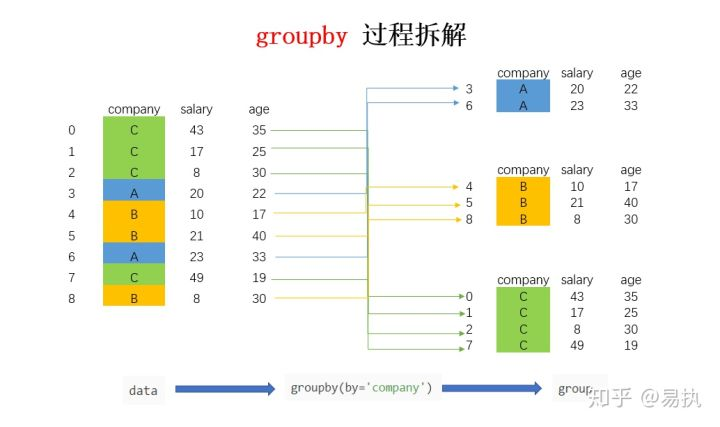

总结来说，`groupby` 的过程就是将原有的 `DataFrame` 按照 `groupby` 的字段（这里是 `company`），划分为若干个分组 `DataFrame`，被分为多少个组就有多少个分组 `DataFrame`。所以说，在 `groupby` 之后的一系列操作（如 `agg`、`apply` 等），均是基于子 `DataFrame`的操作。

因此，可以产生如下操作：

```python
for name,group in data.groupby("company"):
    print("name:", name)
    print("company:", group['company'])
    print("salary:", group['salary'])
    
name: A
company: 2    A
Name: company, dtype: object
salary: 2    10
Name: salary, dtype: int32
        
name: B
company: 0    B
1    B
3    B
4    B
5    B
7    B
9    B
Name: company, dtype: object
salary: 0    11
1    18
3    25
4    25
5    42
7    20
9    35
Name: salary, dtype: int32
        
name: C
company: 6    C
8    C
Name: company, dtype: object
salary: 6    31
8    37
Name: salary, dtype: int32
```

**2）`agg` 操作**

Pandas 中常用的聚合操作如下：

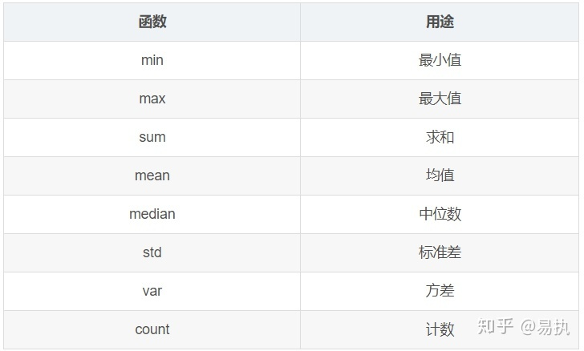

```python
# 单参数
In [12]: data.groupby("company").agg('mean')
Out[12]:
         salary    age
company
A         21.50  27.50
B         13.00  29.00
C         29.25  27.25
# 多参数
In [17]: data.groupby('company').agg({'salary':'median','age':'mean'})
Out[17]:
         salary    age
company
A          21.5  27.50
B          10.0  29.00
C          30.0  27.25
```

`agg` 聚合过程可以图解如下（第二个例子为例）：

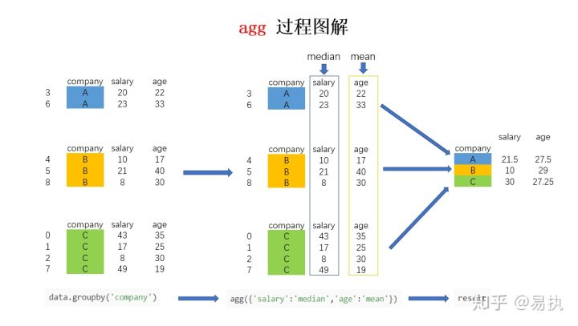

**3）`transform` 操作**

现在需要在原数据集中新增一列 `avg_salary`，代表**员工所在的公司的平均薪水（相同公司的员工具有一样的平均薪水）**。使用 `transform` 函数只需要一行：

```python
In [24]: data['avg_salary'] = data.groupby('company')['salary'].transform('mean')

In [25]: data
Out[25]:
  company  salary  age  avg_salary
0       C      43   35       29.25
1       C      17   25       29.25
2       C       8   30       29.25
3       A      20   22       21.50
4       B      10   17       13.00
5       B      21   40       13.00
6       A      23   33       21.50
7       C      49   19       29.25
8       B       8   30       13.00
```

其执行过程如下图：

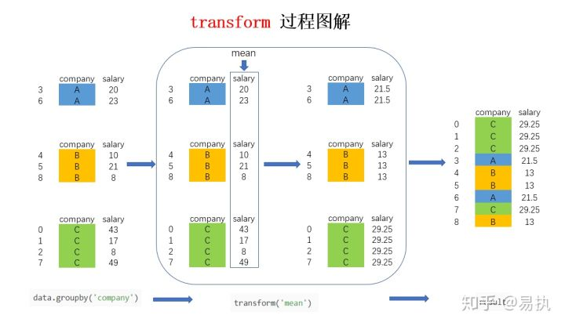

图中的大方框是 `transform` 和 `agg` 所不一样的地方，对 `agg` 而言，会计算得到 `A`，`B`，`C` 公司对应的均值并直接返回，但对 `transform` 而言，则会**对每一条数据求得相应的结果，同一组内的样本会有相同的值**，组内求完均值后会**按照原索引的顺序**返回结果。

**4）`apply` 操作**

`apply` 操作在前面的**函数作用三板斧**中已经纤细介绍了，对于 `groupby` 产生的数据，这里的 `apply` 还是有区别的，但原理基本一致。

**两者的区别**在于，对于 `groupby` 后的 `apply`，以分组后的**子 `DataFrame`** 作为参数传入指定函数的，基本操作单位是 `DataFrame`，而之前介绍的 `apply` 的基本操作单位是 **`Series`**。

下面是一个示例和图解：

```python
In [38]: def get_oldest_staff(x):
    ...:     df = x.sort_values(by = 'age',ascending=True)
    ...:     return df.iloc[-1,:]
    ...:

In [39]: oldest_staff = data.groupby('company',as_index=False).apply(get_oldest_staff)

In [40]: oldest_staff
Out[40]:
  company  salary  age  
0       A      23   33       
1       B      21   40       
2       C      43   35      
```

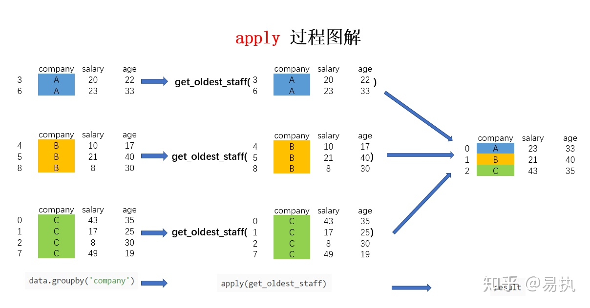

最后，考虑到效率问题，多用 `agg` 和 `transform`，少用 `apply`。

##### 数据的合并与拼接

Pandas 包的 `merge`、`join`、`concat` 方法可以完成数据的合并和拼接，`merge` 方法主要基于两个 `dataframe` 的共同列进行合并，`join` 方法主要基于两个`dataframe` 的索引进行合并，`concat` 方法是对 `series` 或 `dataframe` 进行行拼接或列拼接。

**1）Merge 方法**

Pandas 的 `merge` 方法是基于共同列，将两个 `dataframe` 连接起来。`merge` 方法的主要参数：

* `left/right`：左/右位置的 `dataframe`
* `how`：数据合并的方式
  * `left`：基于左 `dataframe` 列的数据合并
  * `right`：基于右 `dataframe` 列的数据合并
  * `outer`：基于列的数据外合并（取并集）
  * `inner`：基于列的数据内合并（取交集）；默认为`'inner'`
* `on`：用来合并的列名，这个参数需要保证两个 `dataframe` 有相同的列名
* `left_on/right_on`：左/右 `dataframe` 合并的列名，也可为索引，数组和列表
* `left_index/right_index`：是否以 `index` 作为数据合并的列名，`True` 表示是
* `sort`：根据 `dataframe` 合并的keys排序，默认是
* `suffixes`：若有相同列且该列没有作为合并的列，可通过 `suffixes` 设置该列的后缀名，一般为元组和列表类型

`merges` 通过设置 `how` 参数选择两个 `dataframe` 的连接方式，有<u>内连接，外连接，左连接，右连接</u>，下面通过例子介绍连接的含义。

**1.1）内连接**

* `how='inner'`，`dataframe` 的连接方式为内连接，我们可以理解**基于共同列的交集进行连接**，参数 `on` 设置连接的共有列名。

```python
# 单列的内连接
# 定义df1
import pandas as pd
import numpy as np

df1 = pd.DataFrame({'alpha':['A','B','B','C','D','E'],'feature1':[1,1,2,3,3,1],
            'feature2':['low','medium','medium','high','low','high']})
# 定义df2
df2 = pd.DataFrame({'alpha':['A','A','B','F'],'pazham':['apple','orange','pine','pear'],
            'kilo':['high','low','high','medium'],'price':np.array([5,6,5,7])})
# print(df1)
# print(df2)
# 基于共同列alpha的内连接
df3 = pd.merge(df1,df2,how='inner',on='alpha')
df3
```


取共同列alpha值的交集进行连接。

**1.2）外连接**

* `how='outer'`，`dataframe` 的连接方式为外连接，我们可以理解**基于共同列的并集进行连接**，参数 `on` 设置连接的共有列名。 

```python
# 单列的外连接
# 定义df1
df1 = pd.DataFrame({'alpha':['A','B','B','C','D','E'],'feature1':[1,1,2,3,3,1],
                'feature2':['low','medium','medium','high','low','high']})
# 定义df2
df2 = pd.DataFrame({'alpha':['A','A','B','F'],'pazham':['apple','orange','pine','pear'],
                        'kilo':['high','low','high','medium'],'price':np.array([5,6,5,7])})
# 基于共同列alpha的内连接
df4 = pd.merge(df1,df2,how='outer',on='alpha')
df4
```


若两个 `dataframe` 间除了 `on` 设置的连接列外并无相同列，则该列的值置为 `NaN`。

**1.3 左连接**

* `how='left'`，`dataframe` 的连接方式为左连接，我们可以理解**基于左边位置 `dataframe` 的列进行连接**，参数 `on` 设置连接的共有列名。　　 

```python
# 单列的左连接
# 定义df1
df1 = pd.DataFrame({'alpha':['A','B','B','C','D','E'],'feature1':[1,1,2,3,3,1],
    'feature2':['low','medium','medium','high','low','high']})
# 定义df2
df2 = pd.DataFrame({'alpha':['A','A','B','F'],'pazham':['apple','orange','pine','pear'],
                        'kilo':['high','low','high','medium'],'price':np.array([5,6,5,7])})
# 基于共同列alpha的左连接
df5 = pd.merge(df1,df2,how='left',on='alpha')
df5
```


因为 `df2` 的连接列 `alpha` 有两个 `'A'` 值，所以左连接的 `df5` 有两个 `'A'` 值，若两个 `dataframe` 间除了 `on` 设置的连接列外并无相同列，则该列的值置为 `NaN`。

**1.4 右连接**

* `how='right'`，`dataframe` 的链接方式为左连接，我们可以理解**基于右边位置 `dataframe` 的列进行连接**，参数 `on` 设置连接的共有列名。 

```python
# 单列的右连接
# 定义df1
df1 = pd.DataFrame({'alpha':['A','B','B','C','D','E'],'feature1':[1,1,2,3,3,1],
'feature2':['low','medium','medium','high','low','high']})
# 定义df2
df2 = pd.DataFrame({'alpha':['A','A','B','F'],'pazham':['apple','orange','pine','pear'],
                        'kilo':['high','low','high','medium'],'price':np.array([5,6,5,7])})
# 基于共同列alpha的右连接
df6 = pd.merge(df1,df2,how='right',on='alpha')
df6
```


因为 `df1` 的连接列 `alpha` 有两个 `'B'` 值，所以右连接的 `df6` 有两个 `'B'` 值。若两个 `dataframe` 间除了 `on` 设置的连接列外并无相同列，则该列的值置为 `NaN`。

**1.5 基于多列的连接算法** 

多列连接的算法与单列连接一致，本节只介绍基于多列的内连接和右连接，读者可自己编码并按照本文给出的图解方式去理解外连接和左连接。 

多列的内连接：

```python
# 多列的内连接
# 定义df1
df1 = pd.DataFrame({'alpha':['A','B','B','C','D','E'],'beta':['a','a','b','c','c','e'],
                    'feature1':[1,1,2,3,3,1],'feature2':['low','medium','medium','high','low','high']})
# 定义df2
df2 = pd.DataFrame({'alpha':['A','A','B','F'],'beta':['d','d','b','f'],'pazham':['apple','orange','pine','pear'],
                        'kilo':['high','low','high','medium'],'price':np.array([5,6,5,7])})
# 基于共同列alpha和beta的内连接
df7 = pd.merge(df1,df2,on=['alpha','beta'],how='inner')
df7
```


多列的右连接：

```python
# 多列的右连接
# 定义df1
df1 = pd.DataFrame({'alpha':['A','B','B','C','D','E'],'beta':['a','a','b','c','c','e'],
                    'feature1':[1,1,2,3,3,1],'feature2':['low','medium','medium','high','low','high']})
# 定义df2
df2 = pd.DataFrame({'alpha':['A','A','B','F'],'beta':['d','d','b','f'],'pazham':['apple','orange','pine','pear'],
                        'kilo':['high','low','high','medium'],'price':np.array([5,6,5,7])})
print(df1)
print(df2)

# 基于共同列alpha和beta的右连接
df8 = pd.merge(df1,df2,on=['alpha','beta'],how='right')
df8
```


**1.6 基于 index 的连接方法**

前面介绍了基于 `column` 的连接方法，`merge` 方法亦可基于 `index` 连接 `dataframe`。 

其中使用到了 `left_on/right_on` 和 `left_inded/right_index` 参数。

```python
# 基于column和index的右连接
# 定义df1
df1 = pd.DataFrame({'alpha':['A','B','B','C','D','E'],'beta':['a','a','b','c','c','e'],
                    'feature1':[1,1,2,3,3,1],'feature2':['low','medium','medium','high','low','high']})
# 定义df2
df2 = pd.DataFrame({'alpha':['A','A','B','F'],'pazham':['apple','orange','pine','pear'],
                        'kilo':['high','low','high','medium'],'price':np.array([5,6,5,7])},index=['d','d','b','f'])
print(df1)
print(df2)

# 基于df1的beta列和df2的index连接
df9 = pd.merge(df1,df2,how='inner',left_on='beta',right_index=True)
df9
```

图解 `index` 和 `column` 的内连接方法：


设置参数 `suffixes` 以修改除连接列外相同列的**后缀名**。

```python
# 基于df1的alpha列和df2的index内连接
df9 = pd.merge(df1,df2,how='inner',left_on='beta',right_index=True,suffixes=('_df1','_df2'))
df9
```


**2. join 方法**

`join` 方法是基于 `index` 连接 `dataframe`，`merge` 方法是基于 `column` 连接，连接方法有内连接，外连接，左连接和右连接，**与 `merge` 一致**。 

`index` 与 `index` 的连接：

```python
caller = pd.DataFrame({'key': ['K0', 'K1', 'K2', 'K3', 'K4', 'K5'], 'A': ['A0', 'A1', 'A2', 'A3', 'A4', 'A5']})
other = pd.DataFrame({'key': ['K0', 'K1', 'K2'],'B': ['B0', 'B1', 'B2']})
print(caller)print(other)# lsuffix和rsuffix设置连接的后缀名
caller.join(other,lsuffix='_caller', rsuffix='_other',how='inner')
```

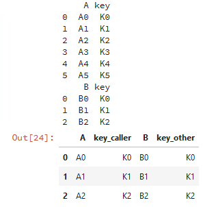

`join` 也可以基于列进行连接：

```
caller = pd.DataFrame({'key': ['K0', 'K1', 'K2', 'K3', 'K4', 'K5'], 'A': ['A0', 'A1', 'A2', 'A3', 'A4', 'A5']})
other = pd.DataFrame({'key': ['K0', 'K1', 'K2'],'B': ['B0', 'B1', 'B2']})
print(caller)
print(other)

# 基于key列进行连接
caller.set_index('key').join(other.set_index('key'),how='inner')
```


因此，`join` 和 `merge` 的连接方法类似，这里就不展开 `join` 方法了，**建议用merge方法。**

**3. concat 方法**

`concat` 方法是拼接函数，有行拼接和列拼接，默认是行拼接，拼接方法默认是外拼接（并集），拼接的对象是 pandas 的两种数据类型。 

**3.1 series类型的拼接方法**

**3.1.1 行拼接**

```python
df1 = pd.Series([1.1,2.2,3.3],index=['i1','i2','i3'])
df2 = pd.Series([4.4,5.5,6.6],index=['i2','i3','i4'])
print(df1)
print(df2)

# 行拼接
pd.concat([df1,df2])
```


行拼接若有相同的索引，为了区分索引，我们在最外层定义了索引的分组情况。

```python
# 对行拼接分组
pd.concat([df1,df2],keys=['fea1','fea2'])
```


**3.1.2 列拼接**

默认以**并集**的方式拼接：

```python
# 列拼接,默认是并集
pd.concat([df1,df2],axis=1)
```


以交集的方式拼接：

```python
# 列拼接的内连接（交）
pd.concat([df1,df2],axis=1,join='inner')
```


设置列拼接的列名：

```python
# 列拼接的内连接（交）
pd.concat([df1,df2],axis=1,join='inner',keys=['fea1','fea2'])
```


对指定的索引拼接：

```python
# 指定索引[i1,i2,i3]的列拼接
pd.concat([df1,df2],axis=1,join_axes=[['i1','i2','i3']])
```


**3.2 dataframe 类型的拼接方法**

**3.2.1 行拼接**

```python
df1 = pd.DataFrame({'key': ['K0', 'K1', 'K2', 'K3', 'K4', 'K5'], 'A': ['A0', 'A1', 'A2', 'A3', 'A4', 'A5']})
df2 = pd.DataFrame({'key': ['K0', 'K1', 'K2'],'B': ['B0', 'B1', 'B2']})
print(df1)
print(df2)

# 行拼接
pd.concat([df1,df2])
```


**3.2.2 列拼接**

```python
# 列拼接
pd.concat([df1,df2],axis=1)
```


若列拼接或行拼接有重复的列名和行名，则报错：

```python
# 判断是否有重复的列名，若有则报错
pd.concat([df1,df2],axis=1,verify_integrity = True)
```

> ValueError: Indexes have overlapping values: ['key']

##### 数据分段分组

* `pandas.cut(x, bins, right=True, labels=None, retbins=False, precision=3, include_lowest=False, duplicates='raise', ordered=True)`
  * `x` : `array-like`，将要分组的数据，必须是一维的
  * ``

##### 数据平移

* `shift()`

#### 1.2.2 次序处理

##### 排序

* `DataFrame.sort_index(axis=0, level=None, ascending=True, inplace=False, kind='quicksort', na_position='last', sort_remaining=True, ignore_index=False, key=None)` - 根据行/列标签对行/列排序

  * `axis` - 0（或`index`）表示对行标签排序，1（或`columns`）对列标签排序
  * `level` - 按照指定标签等级的进行排序
  * `ascending` - `True`为升序排列，`False`为降序排列
  * `inplace` - 为`True`时用排序后的数据替换原来的数据
  * `kind` - 排序方法，包括`‘quicksort’`，`‘mergesort’`，`‘heapsort’`
  * `na_position` - `'last'`将缺失值放在最后，`'first'`将放在最前
  * `sort_remaining` - 排列复合标签时使用，`True`时排列下一标签基于上一标签的排序结果
  * `ignore_index` - `True`时会将目标标签当做数字 `0, 1, ..., n-1`
  * `key` - `callable`对象，指定后会在排序前先对标签进行函数作用

  ```python
  >>> df = pd.DataFrame([1, 2, 3, 4, 5], index=[100, 29, 234, 1, 150],
  ...                   columns=['A'])
  >>> df.sort_index()
       A
  1    4
  29   2
  100  1
  150  5
  234  3
  >>> df.sort_index(ascending=False)
       A
  234  3
  150  5
  100  1
  29   2
  1    4
  ```

* `DataFrame.sort_values(by, axis=0, ascending=True, inplace=False, kind='quicksort', na_position='last', ignore_index=False, key=None)` - 根据指定的行/列进行排序

  * `by` - 行名列表/列名列表，看`axis`指定的是哪个
  * `axis` - 0（或`index`）表示当成一列、行向排序，1（或`columns`）当成一行、列向排序
  * `ascending` - `True`为升序排列，`False`为降序排列
  * `inplace` - 为`True`时用排序后的数据替换原来的数据
  * `kind` - 排序方法，包括`‘quicksort’`，`‘mergesort’`，`‘heapsort’`
  * `na_position` - `'last'`将缺失值放在最后，`'first'`将放在最前
  * `ignore_index` - `True`时会将目标标签当做数字 `0, 1, ..., n-1`
  * `key` - `callable`对象，指定后会在排序前先对标签进行函数作用

  ```python
  >>> df = pd.DataFrame({
  ...     'col1': ['A', 'A', 'B', np.nan, 'D', 'C'],
  ...     'col2': [2, 1, 9, 8, 7, 4],
  ...     'col3': [0, 1, 9, 4, 2, 3],
  ...     'col4': ['a', 'B', 'c', 'D', 'e', 'F']
  ... })
  >>> df
    col1  col2  col3 col4
  0    A     2     0    a
  1    A     1     1    B
  2    B     9     9    c
  3  NaN     8     4    D
  4    D     7     2    e
  5    C     4     3    F
  >>> df.sort_values(by=['col1', 'col2'])
    col1  col2  col3 col4
  1    A     1     1    B
  0    A     2     0    a
  2    B     9     9    c
  5    C     4     3    F
  4    D     7     2    e
  3  NaN     8     4    D
  ```

##### 打乱

方法一：Pandas 中自带的采样方法

* `Series/DataFrame.sample(n, frac, replace, weights, random_state, axis)` - 采样序列/数据帧

  * `n`：`int, optional`，在 `axis` 上抽样的 `items` 个数，不能与 `frac` 一起使用，`frac = None` 时默认 `n = 1`
  * `frac`：`float, optional`，在 `axis` 上抽样的 `items` 比例，不能与 `n` 一起使用
  * `replace`：`bool, default False`，是否是有放回取样
  * `weights`：`str or ndarray-like, optional`，各样本采样的权重，默认为 `None` 表示等概率采样
    * 如果传递一个序列 `Series`，将与目标对象上的索引对齐。序列过长的部分会忽略，序列过短的部分将补充 `0`
    * 如果在数据帧 `DataFrame` 上调用该函数，`axis=0` 时将默认采样列名的那一行
    * 除了序列 `Series` 外，权重必须与被采样的轴 `axis` 长度相同
    * 如果权重的和不是 1，它们将被规范化为和为 1
    * `weights` 中缺少的值将被视为零，且不允许无限值
  * `random_state`：`int or numpy.random.RandomState, optional`，随机数种子
  * `axis`：`{0 or ‘index’, 1 or ‘columns’, None}`，默认 `None`，表示采样的轴，可以是 `axis` 的编号或名称
  * Returns：`Series or DataFrame`，即与调用数据相同类型的新对象，包含从调用数据对象中随机取样的 `items`

  ```python
  # 定义一组数据
  import pandas as pd
  df = pd.DataFrame({'num_legs': [2, 4, 8, 0],
                     'num_wings': [2, 0, 0, 0],
                     'num_specimen_seen': [10, 2, 1, 8]},
                    index=['falcon', 'dog', 'spider', 'fish'])
  >>> df
          num_legs  num_wings  num_specimen_seen
  falcon         2          2                 10
  dog            4          0                  2
  spider         8          0                  1
  fish           0          0                  8``
  ```

  ```python
  # 从 Series df['num_legs'] 中随机提取 3 个元素
  extract = df['num_legs'].sample(n=3, random_state=1)
  >>> extract
  fish      0
  spider    8
  falcon    2
  Name: num_legs, dtype: int64
  ```

  ```python
  # 设置 frac=2, replace=True
  # 【注】当 frac>1 时必须设置 replace=True，默认对行数据进行操作
  extract = df.sample(frac=2, replace=True, random_state=1)
  >>> extract
          num_legs  num_wings  num_specimen_seen
  dog            4          0                  2
  fish           0          0                  8
  falcon         2          2                 10
  falcon         2          2                 10
  fish           0          0                  8
  dog            4          0                  2
  fish           0          0                  8
  dog            4          0                  2
  ```

  ```python
  # 使用数据中的某列的数据值作为权重
  # 	对 num_availen_seen 列数据进行操作，该列数据中值较大的行更容易被采样
  # 	可以看到，num_availen_seen 列中的数据为 [10, 2, 1, 8]，则 [10, 8] 两列更易被抽到
  extract = df.sample(n=2, weights='num_specimen_seen', random_state=1)
  >>> extract 
          num_legs  num_wings  num_specimen_seen
  falcon         2          2                 10
  fish           0          0                  8
  ```

方法二：`sklearn` 中的 `shuffle` 方法

```python
from sklearn.utils import shuffle
df = shuffle(df)
```

方法三：`numpy` 中的 `shuffle` 方法

```python
df.iloc[np.random.permutation(len(df))]
```

##### 调整列顺序

将一个表中各列调整为自己想要的顺序。

方法一：

```python
order = ['date', 'time', 'open', 'high', 'low', 'close', 'volumefrom', 'volumeto']
df = df[order]
```

方法二：

```python
data.insert(0, '性别', data.pop('gender')) #pop返回删除的列，插入到第0列，并取新名为'性别'
```

##### 提取字符

* `Series.str.extract(pat, flags=0, expand=None)` : 可用正则从字符数据中抽取匹配的数据，只返回第一个匹配的数据
  * `pat` : 字符串或正则表达式
  * `flags` : int, 接受来自 re 模块的参数，如 `re.IGNORECASE`
  * `expand` : bool, 是否返回 `DataFrame`
  * `Returns` : 数据框 `dataframe` / 索引 `index`
* `Series.str.extractall(pat, flags=0)` : 返回所有匹配的字符
  * `pat` : 字符串或正则表达式
  * `flags` : int, 接受来自 re 模块的参数，如 `re.IGNORECASE`
  * `Returns` : 数据框 `dataframe`

#### 1.2.3 行列处理

##### 插入一行

* `DataFrame.append(other: DataFrame | Series | Dict | Sequence[Scalar] | Sequence[_ListLike], ignore_index: _bool = ..., verify_integrity: _bool = ..., sort: _bool = ...) -> DataFrame` - 在数据帧末尾增加一行

  【注】该方法将被废弃，建议使用 `concat` 方法，通过数据拼接的方式插入行，列也可以参考此法。

```python
# 源数据
df = pd.DataFrame([
    ['Snow','M',22],['Tyrion','M',32],['Sansa','F',18],['Arya','F',14]], 
    columns=['name','gender','age'])
>>> df
	name	gender	age
0	Snow	M	22
1	Tyrion	M	32
2	Sansa	F	18
3	Arya	F	14
# 先创建一个 DataFrame，用来插入数据框的最后一行【重要！！】
new = pd.DataFrame({'name':'lisa',
                  'gender':'F',
                  'city':'北京',
                  'age':19,
                  'score':100},
                 index=[1])	# 自定义索引为：1 ，这里也可以不设置 index
>>> new
	name	gender	city	age	score
1	lisa	F	北京	19	100
```

```python
# 在原数据框 df1 最后一行新增一行
df = df.append(new,ignore_index=True)   # ignore_index=True,表示不按原来的索引，从 0 开始自动递增
>>> df
	name	gender	age	city	score
0	Snow	M	22	NaN	NaN
1	Tyrion	M	32	NaN	NaN
2	Sansa	F	18	NaN	NaN
3	Arya	F	14	NaN	NaN
4	lisa	F	19	北京	100.0
```

##### 插入一列

* `df['列名'] = [Series|list]` - 在最后增加一列

  ```python
  df = pd.DataFrame([
      ['Snow',  'M',22],
      ['Tyrion','M',32],
      ['Sansa', 'F',18],
      ['Arya',  'F',14]],
      columns=['name','gender','age'])
  # 在数据框最后加上 score 一列，元素值分别为：80，98，67，90
  df['score'] = [80, 98, 67, 90]   # 增加列的元素个数要跟原数据列的个数一样
  >>> df
  	name	gender	age	score
  0	Snow	M	22	80
  1	Tyrion	M	32	98
  2	Sansa	F	18	67
  3	Arya	F	14	90
  ```

* `DataFrame.insert(loc, name, value, allow_duplicates=False)`：在指定位置插入一列
  
  * `loc`：插入的位置索引，取值范围`0 <= loc <= len(columns)`
  * `name`：给插入数据 `value` 取列名，可为数字，字符串等
  * `value`：可以是整数，`Series` 或者数组等，如果不赋值整列都是 `NaN`
  * `allow_duplicates`：是否允许重复值，默认 `False`
  
  ```python
  data = {
      'school' : ['北京大学', '清华大学', '山西大学', '山西大学', '武汉大学'],
      'name' : ['江路离', '沈希梦', '来使鹭', '陈曦冉', '姜浩然'],
      'No.' : [20001943, 300044451, 20190006, 20191234, 1242522]
  }
  frame = pd.DataFrame(data)
  frame.insert(1, 'num', np.ones(5)) # 在列索引为 1 的位置插入一列，列名为 num
  >>> frame
  	school	num	name	No.
  0	北京大学	1.0	江路离	20001943
  1	清华大学	1.0	沈希梦	300044451
  2	山西大学	1.0	来使鹭	20190006
  3	山西大学	1.0	陈曦冉	20191234
  4	武汉大学	1.0	姜浩然	1242522
  ```

##### 删除一列

* `del df['列名']` - 直接删除一列，改变原始数据

  ```python
  data = {
      'school' : ['北京大学', '清华大学', '山西大学', '山西大学', '武汉大学'],
      'name' : ['江路离', '沈希梦', '来使鹭', '陈曦冉', '姜浩然'],
      'No.' : [20001943, 300044451, 20190006, 20191234, 1242522]
  }
  data_df = pd.DataFrame(data)
  del data_df['No.']
  
  >> data_df
  	school	   name
  0	北京大学	江路离
  1	清华大学	沈希梦
  2	山西大学	来使鹭
  3	山西大学	陈曦冉
  4	武汉大学	姜浩然
  ```

* `DataFrame.drop(labels=None, axis=0, index=None, columns=None, level=None, inplace=False, errors='raise')` - 删除列

  * `labels` - `single label or list-like`，要删除的 Index 或 column 标签
  * `axis` - `{0 or ‘index’, 1 or ‘columns’}, default 0`，表示删除 index 或删除 column
  * `index` - `single label or list-like`，取得特定的维度，有 `labels, axis=0` 等价于 `index=labels`
  * `columns` - `single label or list-like`，取得特定的维度，有 `labels, axis=1` 等价于 `columns=labels`
  * `level` - `int or level name, optional`，对于复合 index，指定它们的优先级
  * `inplace` - `bool, default False`，如果为 `False` 返回拷贝，否则原地修改返回 `None`
  * `errors` - `{‘ignore’, ‘raise’}, default ‘raise’`，使用 `ignore` 时会忽略错误，删除可以删除的

  ```python
  data = {
      'school' : ['北京大学', '清华大学', '山西大学', '山西大学', '武汉大学'],
      'name' : ['江路离', '沈希梦', '来使鹭', '陈曦冉', '姜浩然'],
      'No.' : [20001943, 300044451, 20190006, 20191234, 1242522]
  }
  data_df = pd.DataFrame(data)
  data_df.drop('No.', 1)  # 不改变内存，输出 data_df 还是显示原数据
  data_df.drop('No.', axix=1，inplace=True)  # 改变内存，输出 data_df 还是显示修改后的数据
  
  >> data_df
  	school	   name
  0	北京大学	江路离
  1	清华大学	沈希梦
  2	山西大学	来使鹭
  3	山西大学	陈曦冉
  4	武汉大学	姜浩然
  ```

【注】凡是会对原数组作出修改并返回一个新数组的，往往都有一个 `inplace` 可选参数。

##### 重建，设置、重设索引

* `Seires|DataFrame.reindex(labels=None, index=None, columns=None, axis=None, method=None, copy=True, level=None, fill_value=nan, limit=None, tolerance=None)` - 创建一个适应新索引的对象

  * `labels`：新标签/索引使 `axis`  指定的轴与之一致

  * `index`, `columns`：要重建的新标签/索引对象，最好是一个 `Index` 对象，以避免重复数据

  * `axis`：目标轴，可以是轴名称 `(“索引”“列”)` 或数字 `(0, 1)`

  * `method`：可选 `{None，"backfill" / "bfill", "pad" / "ffill", "nearest"}`

  * `copy`：即使传递的索引相同，也返回一个新对象

  * `level`：在一个级别上广播，在传递的 `MultiIndex` 级别上匹配索引值

  * `fill_value`：在计算之前，请使用此值填充现有的缺失 (`NaN`) 值以及为成功完成 `DataFrame` 对齐所需的任何新元素

    【注】如果两个对应的 `DataFrame` 位置中的数据均丢失，则结果将丢失。

  * `limit`：向前或向后填充的最大连续元素数

  * `tolerance`：不完全匹配的原始标签和新标签之间的最大距离

    【注】匹配位置处的索引值最满足方程 `abs(index [indexer]-target)`。

  【注1】除非新索引等于当前索引并且 `copy = False`，否则将生成一个新对象

  【注2】默认情况下，新索引中在 `Series` 或 `DataFrame` 中没有对应记录的值被分配为 `NaN`，可通过 `fill_value` 参数自定义。

  ```python
  import pandas as pd
  # 创建 DataFrame 对象  
  df = pd.DataFrame({"A":[1, 5, 3, 4, 2], 
                     "B":[3, 2, 4, 3, 4], 
                     "C":[2, 2, 7, 3, 4], 
                     "D":[4, 3, 6, 12, 7]}, 
                     index =["first", "second", "third", "fourth", "fifth"]) 
  >>> df
  		A	B	C	D
  first	1	3	2	4
  second	5	2	2	3
  third	3	4	7	6
  fourth	4	3	3	12
  fifth	2	4	4	7
  ```

  ```python
  # 重新建立新的 index 索引
  df = df.reindex(["first", "dues", "trois", "fourth", "fifth"]
  >>> df
  		A	B	C	D
  first	1.0	3.0	2.0	4.0
  dues	NaN	NaN	NaN	NaN
  trois	NaN	NaN	NaN	NaN
  fourth	4.0	3.0	3.0	12.0
  fifth	2.0	4.0	4.0	7.0
  ```

  ```python
  # 重新建立新的 column 索引
  df = df.reindex(columns =["A", "B", "D", "E"])
  >>> df
  		A	B	D	E
  first	1	3	4	NaN
  second	5	2	3	NaN
  third	3	4	6	NaN
  fourth	4	3	12	NaN
  fifth	2	4	7	NaN
  ```

* `DataFrame.set_index(keys, drop=True, append=False, inplace=False, verify_integrity=False)` - 指定某一列为索引

  * `keys`：列标签或列标签/数组列表，需要设置为索引的列
  * `drop`：默认为 `True`，删除用作新索引的列
  * `append`：是否将列附加到现有索引，默认为 `False`
  * `inplace`：输入布尔值，表示当前操作是否对原数据生效，默认为 `False`
  * `verify_integrity`：检查新索引的副本。否则，请将检查推迟到必要时进行。将其设置为 `False` 将提高该方法的性能，默认为 `False`

  ```python
  import numpy as np
  import pandas as pd
  df = pd.DataFrame({'Country':['China','China', 'India', 'India', 'America', 'Japan', 'China', 'India'], 
                     'Income':[10000, 10000, 5000, 5002, 40000, 50000, 8000, 5000],
                      'Age':[50, 43, 34, 40, 25, 25, 45, 32]})
  >>> df  # 原始数据
     Country  Income  Age
  0    China   10000   50
  1    China   10000   43
  2    India    5000   34
  3    India    5002   40
  4  America   40000   25
  5    Japan   50000   25
  6    China    8000   45
  7    India    5000   32
  ```
  
  ```python
  df_new = df.set_index('Country',drop=True, append=False, inplace=False, verify_integrity=False)
  >>> df_new  # 设置 Country 列为新的 index，默认参数情况
           Income  Age
  Country
  China     10000   50
  China     10000   43
  India      5000   34
  India      5002   40
  America   40000   25
  Japan     50000   25
  China      8000   45
  India      5000   32
  
  df_new1 = df.set_index('Country',drop=False, append=False, inplace=False, verify_integrity=False)
  >>> df_new1  # drop = False 时，被作为索引的那一列数据仍然被保留下来
           Country  Income  Age
  Country
  China      China   10000   50
  China      China   10000   43
  India      India    5000   34
  India      India    5002   40
  America  America   40000   25
  Japan      Japan   50000   25
  China      China    8000   45
  India      India    5000   32
  
  df_new2 = df.set_index('Country',drop=True, append=True, inplace=False, verify_integrity=False)
  >>> df_new2  # append = True 时，原来的索引和新索引一起被保留下来
             Income  Age
    Country
  0 China     10000   50
  1 China     10000   43
  2 India      5000   34
  3 India      5002   40
  4 America   40000   25
  5 Japan     50000   25
  6 China      8000   45
  7 India      5000   32
  ```
  
* `DataFrame.reset_index(level=None, drop=False, inplace=False, col_level=0, col_fill='')` - 重设索引值

  * `level`：数值类型可以为：`int`、`str`、`tuple` 或 `list`，默认 `None`，仅从索引中删除给定级别。默认情况下移除所有级别。控制了具体要还原的那个等级的索引
  * `drop`：当指定 `drop=False` 时，则索引列会被还原为普通列；否则，经设置后的新索引值被会丢弃。默认为 `False`
  * `inplace`：输入布尔值，表示当前操作是否对原数据生效，默认为 `False`
  * `col_level`：数值类型 为 `int` 或 `str`，默认值为 `0`，如果列有多个级别，则确定将标签插入到哪个级别。默认情况下，它将插入到第一级
  * `col_fill`：对象，默认 `''`，如果列有多个级别，则确定其他级别的命名方式。如果没有，则重复索引名

  ```python
  import numpy as np
  import pandas as pd
  df = pd.DataFrame({'Country':['China','China', 'India', 'India', 'America', 'Japan', 'China', 'India'], 
   
                     'Income':[10000, 10000, 5000, 5002, 40000, 50000, 8000, 5000],
   
                      'Age':[50, 43, 34, 40, 25, 25, 45, 32]})
  >>> df  # 原始数据
     Country  Income  Age
  0    China   10000   50
  1    China   10000   43
  2    India    5000   34
  3    India    5002   40
  4  America   40000   25
  5    Japan   50000   25
  6    China    8000   45
  7    India    5000   32
  ```

  ```python
  df_new = df.reset_index()
  >>> df_new
     index  Country  Income  Age
  0      0    China   10000   50
  1      1    China   10000   43
  2      2    India    5000   34
  3      3    India    5002   40
  4      4  America   40000   25
  5      5    Japan   50000   25
  6      6    China    8000   45
  7      7    India    5000   32
  ```

##### 按行按列遍历

- `iterrows()` - 按行遍历，将 `DataFrame` 的每一行迭代为 `(index, Series)` 对，可以通过 `row[name]` 对元素进行访问

  ```python
  for index, row in df.iterrows():
  	print(index) # 输出每行的索引值
  ```

- `itertuples()` -  按行遍历，将 `DataFrame` 的每一行迭代为 `tuple`，可以通过 `row[name]` 对元素进行访问，比 `iterrows()` 效率高

  ```python
  for row in df.itertuples():
  	print(getattr(row, 'c1'), getattr(row, 'c2')) # 输出每一行
  ```

- `iteritems()` - 按列遍历，将 DataFrame 的每一列迭代为 `(列名, Series)` 对，可以通过 `row[index]` 对元素进行访问

  ```python
  for index, col in df.iteritems():
  	print(index) # 输出列名
  for col in df.iteritems():
  	print(row[0], row[1], row[2]) # 输出各列（该列有 3 个元素）
  ```

##### 获取列名的序号

```python
df = DataFrame({"pear": [1,2,3], "apple": [2,3,4], "orange": [3,4,5]})
df.columns
>> Index([apple, orange, pear], dtype=object)
df.columns.get_loc("pear")
>> 2
```

##### 重命名列名

方法 1：使用 `DataFrame.rename()` 函数

```python
df.rename(columns={'ID': 'id', 'CODE': 'code'})
```

方法 2：直接改 `DataFrame.columns` 属性

```python
df.columns = ['id', 'code']
```

方法 3：生成/读取表格时，指定 `columns` 参数

```python
df = pd.DataFrame(data, columns=['id', 'code'])
```

#### 1.2.4 类型转换

##### 元素数据类型转换

* `DataFrame.astype(dtype, copy=True, errors='raise')` - 将一个 pandas 对象转换为指定的 `dtype`

  * `dtype` - `data type` 字符串 或 `column name -> data type` 字典，其中 `data type` 使用 `numpy.dtype` 或 Python `type`

     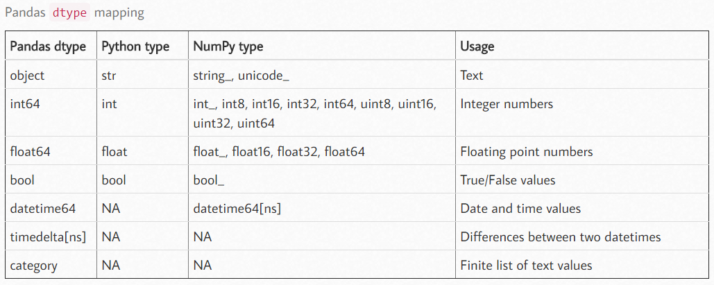

  * `copy, bool` - 默认 `True`，返回一个拷贝

  * `errors, {'raise', 'ignore'}` - 默认 `raise`，控制 `data dtype` 对数据无效的情况下的异常行为

    * `'raise'` - 运行引发异常
    * `'ignore'` - 忽略异常

  * 返回值 - 转换类型后的 DataFrame

* `pandas.to_numeric(arg, errors='raise', downcast=None)` - 将参数转换为数字类型

  * `argscalar, list, tuple, 1-d array, or Series` - 要转换的参数

  * `errors, {'ignore', 'raise', 'coerce'}, default 'raise'` - 异常设置

    * `'ignore'` - 无效解析将返回输入
    * `'coerce'` - 无效解析将设置为 `NaN`
    * `'raise'` - 无效解析将引起异常

  * `downcast, {'integer', 'signed,' 'unsigned', 'float'}, default None` - 设置参数的转换模式，会自动选择最小的数值类型

    * `'integer'` 或 `signed` - 最小的有符号整数类型（最小：`np.int8`）
    * `'unsigned'` - 最小的无符号整数类型（最小：`np.uint8`）
    * `'float'` - 最小的浮点数类型（最小：`np.float32`）
    * 返回值 - 转换后的 `arg`

    【注】如果没有合适的转换方式，会返回原数据

##### 时间转换

* `pandas.to_datetime(arg, errors='raise', dayfirst=False, yearfirst=False, utc=None, format=None, exact=True, unit=None, infer_datetime_format=False, origin='unix', cache=True)` - 将参数转换为日期类型 `datetime`
  * `arg, int, float, str, datetime, list, tuple, 1-d array, Series, DataFrame/dict-like` - 要转换的对象
  * `errors, {'ignore', 'raise', 'coerce'}, default 'raise'` - 默认 `raise`，控制 `data dtype` 对数据无效的情况下的异常行为
    * `'ignore'` - 无效解析将返回输入
    * `'coerce'` - 无效解析将设置为 `NaT`
    * `'raise'` - 无效解析将引起异常
  * `dayfirst, bool, default False` - 当 `arg` 为 `str` 或 `str list likes` 时指定 date 的解析顺序
    * `True` - 日作为第一解析对象，例如 `10/11/12` 解析为 `2012-11-10`
  * `yearfirst, bool, default False` - 当 `arg` 为 `str` 或 `str list likes` 时指定 date 的解析顺序
    * `True` - 日作为第一解析对象，例如 `10/11/12` 解析为 `2010-11-12`
  * `utc, bool, default None` - `True` 时返回 `UTC DatetimeIndex`
  * `format, str, default None` - 用于解析时间的字符串模板，如 `“%d/%m/%Y”`
    * 参考：https://docs.python.org/3/library/datetime.html#strftime-and-strptime-behavior
  * `exact, bool, True by default` - `True` 时，需要精确的匹配格式；`False` 时，允许模板匹配目标串中的任意位置
  * `unit, str, default 'ns'` - 表示时间精度，可选 `D，s，ms，us，ns`，显示效果为整数或浮点数
    * 该具体精度值基于 `origin` 计算，例如，使用 `unit='ms'` 和 `origin='unix'`（默认值），这将计算 `unix` 起点开始的毫秒数
  * `infer_datetime_format, bool, default False` - 如果 `True` 且没有给出 `format`，将基于首个非空元素推断格式，并用更快的速度解析
  * `origin, scalar, default 'unix'` - 定义参考日期
    * 如果是标量，数值将会解析为距参考日期的 `units` 数（单位由参数 `unit` 定义）
    * `'unix'` - 参考日期为 `1970-01-01`
    * `'julian'` - 此时必须 `unit='D'`，参考日期为 `noon on January 1, 4713 BC`
  * `cache, bool, default True` - `True` 时使用唯一的已转换日期缓存来应用日期时间转换，在重复解析日期字符串时能提速
  * 返回值 - `datetime`，如果解析成功，基于输入进行返回
    * `list-like` - `DatetimeIndex`
    * `Series` - `Series of datetime64 dtype`
    * `scalar` - `Timestamp`
* `pandas.to_timedelta(arg, unit=None, errors='raise')` - 将参数转换为 `timedelta`

##### 转换为 `ndarray`

* 原始的方法： `DataFrame.to_numpy()`。
* 新方法：`DataFrame.values`

注意：

* 对于包含多种数据类型的数据帧：
  * 会先寻找一个适合所有列的数据类型，直到 `object` 类型
  * 这个过程可能会造成很大的资源开销
* 对于全部数据类型为 `float` 的数据帧，其转换时非常快的，并且不需要复制数据

##### 转换为 `str`

Pandas 为 `Series` 提供了 `str` 属性，通过它可以方便的对每个元素进行操作。

* `Series.str` : 获得 `Series` 的元素形式

  * 【注】`Series` 也可以通过获取 `DataFrame` 的一行或一列获得

* `Series.to_string(...)` - 写一个格式化的字符串

  * 暂略

* `DataFrame.to_string(...)` - 写一个格式化的字符串

  * `buf`：类似 `StringIO` 要写入的缓冲区

  * `columns`：序列要写的列的子集; 默认 `None` 写入所有列

  * `col_space`：`int`,每列的最小宽度

  * `header`：`bool`,写出列名。如果给出了字符串列表，则假定它是列名的别名

  * `index`：`bool`，是否打印索引（行）标签，默认为 `True`

  * `na_rep`：`string`，要使用的 NAN 字符串表示，默认为 `'NaN'`

  * `formatters`：单参数函数的列表或字典
    
    * `formatter` 函数按位置或名称应用于列的元素，每个函数的结果必须是一个 Unicode 字符串
    * 列表的长度必须等于列数
    
    ```python
    # norm_df 表格，列为 ['norm', 'shape', 'size']
    norms_df.to_string(formatters={'norm': '{:.2f}'.format})
    ```
    
  * `float_format`：单参数函数，格式化程序函数，如果它们是浮点数，则应用于列的元素
    
    * 此函数的结果必须是 Unicode 字符串
    
  * `sparsify`：`bool`
    
       * 对于具有分层索引的 `DataFrame`，设置为 `False` 以打印每个每行都有多索引键，默认为 `True`
       
  * `index_names`：`bool`，打印索引的名称，默认为 `True`

  * `line_width`：`int`，用字符包裹一行的宽度，默认不包装

  * `table_id`：`str`，由 `to_html` 创建的 `<table>` 元素的 `id`

  * `justify`：`str`，对齐方式默认情况下 `'left'`，将打印列标题左对齐或右对齐

    * `None`：使用选项打印配置（由` set_option` 控制）
    * 有效值：`left, right, center, justify, justify-all, start, end, inherit, match-parent, initial, unset`

  * 返回：格式化字符串（Unicode）

##### 转换为字典

官方文档给出了下面这个函数，函数中只需要填写一个参数：**orient** 即可 ，但对于写入 orient 的不同，字典的构造方式也不同。

* `DataFrame.to_dict(self, orient='dict', into=)`

  * `orient ='dict'` : 是函数默认的，转化后的字典形式：`{column(列名) : {index(行名) : value(值) )}}`
  * `orient ='list'`  : 转化后的字典形式：`{column(列名) :{[ values ](值)}}`
  * `orient ='series'`  : 转化后的字典形式：`{column(列名) : Series (values) (值)}`
  * `orient ='split'`  : 转化后的字典形式：`{'index' : [index]，‘columns' :[columns]，’data‘ : [values]}`
  * `orient ='records'`  : 转化后是 `list` 形式：`[{column(列名) : value(值)}......{column:value}]`
  * `orient ='index'`  : 转化后的字典形式：`{index(值) : {column(列名) : value(值)}}`

#### 1.2.5 统计操作

##### 直方图化

直方图化是对数据帧或序列中的数据进行统计归类，使其能够直接用于相关的直方图显示。


```python
s = pd.Series(np.random.randint(0, 7, size=10))
print(s)
print(s.value_counts())
```

    0    1
    1    0
    2    6
    3    6
    4    2
    5    5
    6    0
    7    2
    8    0
    9    2
    dtype: int32
    2    3
    0    3
    6    2
    5    1
    1    1
    dtype: int64

##### 相关系数

* `DataFrame.corr(method='pearson', min_periods=1)`
  * `method` - 设定相关系数的计算方法
    * `pearson` - 标准相关系数
    * `kendall` - Kendall Tau 相关系数
    * `spearman` - Spearman 相关系数
    * 其他 callable 的对象，输入为一维 ndarrays
  * `min_period` - 最小观测数设定，用于后两个相关系数

【注】可以进一步用模块 seaborn 中的 `sns.heatmap()` 函数来绘制相关系数矩阵的热力图。

##### 交叉表

* `pandas.crosstab(index, columns, values=None, rownames=None, colnames=None, aggfunc=None, margins=False, margins_name='All', dropna=True, normalize=False)` : 建立交叉表（类似计数列联表）
  * `index` : array-like, Series, or list of arrays/Series，交叉表中的行组（可复合）
  * `columns` : array-like, Series, or list of arrays/Series，交叉表中的列组（可复合）
  * `values` : array-like, optional，如果有分组时指定的目标，因此需要 `aggfunc` 参数非空
  * `rownames` : sequence, default None，重命名行
  * `colnames` : sequence, default None，重命名列
  * `aggfunc` : function, optional，聚集函数
  * `margins` : bool, default False，
  * `margins_name` : str, default ‘All’，
  * `dropna` : bool, default True，不包含 NaN 值
  * `normalize` : bool, {‘all’, ‘index’, ‘columns’}, or {0,1}, default False，正则化，原理为元素除以元素和
    * `all` : 所有元素进行正则化
    * `index` : 每行进行正则化
    * `columns` : 每列进行正则化

##### 透视表

##### 计数

* `S/D/GroupBy.nunique(axis=0, dropna=True)` - 计算某个维度中唯一值的个数
  * `axis` - `{0 or ‘index’, 1 or ‘columns’}, default 0`，统计所使用的维度
  * `dropna` - `bool, default True`，不统计 `NaN` 值
* `pd.unique(values)` - 返回序列中的唯一值
  * `values` - 一维序列
  * 返回：
    * Index : when the input is an Index
    * Categorical : when the input is a Categorical dtype
    * ndarray : when the input is a Series/ndarray
* `S/D.notna()` - 检测非空值
  * 返回：返回同样维度的、填满布尔值的对象

##### 百分比变化

* `DataFrame.pct_change(periods=1, fill_method=’pad’, limit=None, freq=None, **kwargs)` - 计算当前元素与先前元素之间的百分比变化

  此功能在时间序列数据中最有用。默认情况下，此函数计算前一行的百分比变化。

  * `periods` - 形成百分比变化所需的时间
  * `fill_method` - 在计算百分比变化之前如何处理资产净值
  * `limit` - 停止前要填充的连续 `NA` 数
  * `freq` - 时间序列 API 中使用的增量（例如 `'M'` 或 `BDay()`）
  * `kwargs` - 其他关键字参数将传递到 `DataFrame.shift` 或 `Series.shift` 中
  * 返回值 - 与调用对象的类型相同

  ```python
  import pandas as pd 
  # Creating the time-series index 
  ind = pd.date_range('01/01/2000', periods = 6, freq ='W') 
  # Creating the dataframe  
  df = pd.DataFrame({"A":[14, 4, 5, 4, 1, 55], 
                     "B":[5, 2, 54, 3, 2, 32],  
                     "C":[20, 20, 7, 21, 8, 5], 
                     "D":[14, 3, 6, 2, 6, 4]}, index = ind) 
  # Print the dataframe 
  df
  # find the percentage change with the previous row 
  df.pct_change()
  ```

### 1.3 Pandas 文件处理

#### 1.3.1 文件 IO

##### 1.3.1.0 概览

| 函数             | 说明                                         |
| ---------------- | -------------------------------------------- |
| `d_csv`          | 读取默认以逗号作为分隔符的文件               |
| `read_table`     | 读取默认以制表符分隔的文件                   |
| `read_fwf`       | 从特定宽度格式的文件中读取数据（无分隔符）   |
| `read_clipboard` | `read_table` 的剪贴板版本                    |
| `read_excel`     | 从 EXCEL 的 `XLS` 或者 `XLSX` 文件中读取数据 |
| `read_hdf`       | 读取用 pandas 存储的 `HDF5` 文件             |
| `read_html`      | 从 HTML 文件中读取所有表格数据               |
| `read_json`      | 从 JSON 字符串中读取数据                     |
| `read_msgpack`   | 读取 MessagePack 格式存储的任意对象          |
| `read_pickle`    | 读取以 Python Pickle 格式存储的对象          |
| `read_sas`       | 读取 SAS 系统中定制存储格式的数据集          |
| `read_sql`       | 将 SQL 查询的结果读取出来                    |
| `read_stata`     | 读取 stata 格式的数据集                      |
| `read_feather`   | 读取 Feather 二进制格式                      |

##### 1.3.1.1 `txt` 文件

* `pd.read_table()` - 读取 `txt` 后返回 `DataFraem`
  * `filepath_or_buffer` - 文件路径，或像文件的对象
  * `seq` - 分隔符，默认为 `"\t"`
  * `delimiter` - 备选分隔符，当 `seq` 无效时使用
  * `header` - 用哪一行作列名，赋 `None` 表示无列名
  * `names` - 自定义最终的列名
  * `index_col` -  用作索引的列
    `usecols` - 需要读取哪些列
  * `squeeze` - 当数据仅包含一列
  * `converters`  - 强制规定列数据类型
  * `skiprows` - 跳过特定行
  * `nrows` - 需要读取的行数
  * `skipfooter` - 跳过末尾n行

##### 1.3.1.2 `csv` 文件

* `pd.read_csv()` - 读取 `csv` 后返回 `DataFrame`
  * `filepath_or_buffer` - 文件路径，或像文件的对象
  * `seq` - 分隔符，默认为 `","`
  * `delimiter` - 备选分隔符，当`seq`无效时使用，默认为 `None`
  * `header` - 用哪一行作列名，赋 `None` 表示无列名
  * `names` - 自定义最终的列名
  * `index_col` -  用作索引的列
    `usecols` - 需要读取哪些列
  * `squeeze` - 当数据仅包含一列
  * `converters`  - 强制规定列数据类型
  * `skiprows` - 跳过特定行
  * `nrows` - 需要读取的行数
  * `skipfooter` - 跳过末尾 n 行
* `df.to_csv()` - 存储 `csv` 文件

##### 1.3.1.3 `xls` 文件

* `pd.read_excel()` - 读取 Excel 后返回`DataFrame`
  * `io` - Excel 的存储路径
  * `seq` - 分隔符，默认为 `"\t"`
  * `delimiter` - 备选分隔符，当 `seq` 无效时使用
  * `sheet_name` - 要读取的工作表名称
  * `header` - 用哪一行作列名，赋 `None` 表示无列名
  * `names` - 自定义最终的列名
  * `index_col` -  用作索引的列
    `usecols` - 需要读取哪些列
  * `squeeze` - 当数据仅包含一列
  * `converters`  - 强制规定列数据类型
  * `skiprows` - 跳过特定行
  * `nrows` - 需要读取的行数
  * `skipfooter` - 跳过末尾n行
  
  【注】读取 excel 文件需要安装依赖：
  
  ```shell
  conda install xlrd
  conda install openpyxl
  ```
  

#### 1.3.2 大文件读取

##### 1.3.2.1 分块读取

Pandas 的 `read_table` 和 `read_csv` 函数提供 `chunksize` 和 `iterator` 参数，可实现按行多次读取文件，避免内存不足情况。

* `chunksize` - `int, default None`，指定一个分块的大小（每次读取多少行），返回一个 `TextFileReader` 对象

  ```python
  import pandas as pd
  reader = pd.read_csv('data.csv', sep=',', chunksize=10)
  # <pandas.io.parsers.TextFileReader at 0x1fc81f905e0>
  
  for chunk in reader:
      # df = chunk，可对 chunk 进行数据处理
      print(type(chunk), chunk.shape)
  '''
  <class 'pandas.core.frame.DataFrame'> (10, 6)
  <class 'pandas.core.frame.DataFrame'> (10, 6)
  <class 'pandas.core.frame.DataFrame'> (10, 6)
  <class 'pandas.core.frame.DataFrame'> (10, 6)
  <class 'pandas.core.frame.DataFrame'> (10, 6)
  '''
  ```

* `iterator` - `boolean, default False`，返回一个 `TextFileReader` 对象，以便逐块处理文件

  ```python
  reader = pd.read_csv('data.csv', sep=',', iterator=True)
  data = reader.get_chunk(5) # 返回 N 行数据块
  data
  '''
     Unnamed: 0         a         b         c         d         e
  0           0  0.289972  0.717806  0.886283  0.522148  0.976798
  1           1  0.254952  0.048073  0.464765  0.138978  0.983041
  2           2  0.634708  0.533182  0.855981  0.456156  0.620018
  3           3  0.812648  0.024870  0.536520  0.894937  0.102704
  4           4  0.699629  0.038305  0.379534  0.876242  0.906875
  '''
  ```

【注1】`chunksize` 和 `iterator` 参数可以同时使用。

【注2】`TextFileReader` 对象的处理方式有：**迭代为 `DataFrame` 对象**、**用 `get_chunk` 获取给定行**，用法如上面的示例。

【注3】还可以**用 `pd.concat` 合并**  `TextFileReader` 对象得到的 `DataFrame`，用法如下所示。

```python
import feather
import pandas as pd

filePath = r'data_csv.csv'

def read_csv_feature(filePath):
    # 读取文件
    f = open(filePath, encoding='utf-8')
    reader = pd.read_csv(f, sep=',', iterator=True)
    loop = True
    chunkSize = 1000000
    chunks = []
    while loop:
        try:
            chunk = reader.get_chunk(chunkSize)
            chunks.append(chunk)
        except StopIteration:
            loop = False
            print('Iteration is END!!!')
    df = pd.concat(chunks, axis=0, ignore_index=True)
    f.close()
    return df 

data = read_csv_feature(filePath)
```

##### 1.3.2.2 随机采样

对于数据量比较大的文件，可以在分块读取的基础上，采样随机抽样的方式，大致了解数据的统计特性。

```python
# 如果考虑数据量过大，只抽取部分的数据来进行分析，采取不放回抽样的方式
pd.concat(chunks, ignore_index=True).sample(frac=0.05, replace=False) # 不放回抽样、记录不重复
```

##### 1.3.2.3 相关应用

**分块拆分文件**

分块读取文件的一个用途是拆分文件，示例如下。

```python
import pandas as pd
reader = pd.read_csv('data_csv.csv', sep=',', chunksize=2000000)
for i, chunk in enumerate(reader):
    print(i, '  ', len(chunk))
    chunk.to_csv('./data/data_' + str(i) + '.csv', index=False)
```

**获取文件行数**

分块读取的思想可以用于快速统计文件的行数，示例如下。

```python
count = 0
file = open('data_csv.csv', 'r', encoding='utf-8')
while 1:
    buffer = file.read(8*1024*1024) # 可大概设置
    if not buffer:
        break
    count += buffer.count('\n')
print(count)
file.close()
```

【注】更高级和高效的用法可参考 [03 可视化模块 - 3.4 文件读取封装](03 可视化模块.md#3-4 文件读取封装)。

#### 1.3.3 空值与多类型


### 1.4 Pandas 数据可视化

#### 1.4.1 显示设置

* `pandas.set_option(pat, value) ` - pandas 全局参数设置
  * `compute.[use_bottleneck, use_numba, use_numexpr]`
  * `display.[chop_threshold, colheader_justify, column_space, date_dayfirst, date_yearfirst, encoding, expand_frame_repr, float_format]`
  * `display.html.[border, table_schema, use_mathjax]`
  * `display.[large_repr]`
  * `display.latex.[escape, longtable, multicolumn, multicolumn_format, multirow, repr]`
  * `display.[max_categories, max_columns, max_colwidth, max_info_columns, max_info_rows, max_rows, max_seq_items, memory_usage, min_rows, multi_sparse, notebook_repr_html, pprint_nest_depth, precision, show_dimensions]`
  * `display.unicode.[ambiguous_as_wide, east_asian_width]`
  * `display.[width]`
  * `io.excel.ods.[reader, writer]`
  * `io.excel.xls.[reader, writer]`
  * `io.excel.xlsb.[reader]`
  * `io.excel.xlsm.[reader, writer]`
  * `io.excel.xlsx.[reader, writer]`
  * `io.hdf.[default_format, dropna_table]`
  * `io.parquet.[engine]`
  * `mode.[chained_assignment, sim_interactive, use_inf_as_na, use_inf_as_null]`
  * `plotting.[backend]`
  * `plotting.matplotlib.[register_converters]`

#### 1.4.2 绘图函数

* `DataFrame.hist()` - 根据表格绘制直方图

  * `column` - `str` 或 `sequence`，指定要绘制的列名，默认 `None` 表示所有列
  * `by` - 指定为分组绘图
  * `grid` - `bool`，表示是否显示网格
  * `figsize` - `tuple`，图像大小
  * `layout` - `tuple(rows, columns)`，直方图布局？
  * `bins` - `int` 或 `sequence`，使用的直方数量，会决定横轴显示范围
  * `legend` - `bool`，是否显示图例

  ```python
  >>> df = pd.DataFrame({
  ... 'length': [1.5, 0.5, 1.2, 0.9, 3],
  ... 'width': [0.7, 0.2, 0.15, 0.2, 1.1]
  ... }, index=['pig', 'rabbit', 'duck', 'chicken', 'horse'])
  >>> hist = df.hist(bins=3)
  ```

* `DataFrame.plot.kde(bw_method=None, ind=None)` - 根据表格绘制密度图

  * `bw_method` - `str`、`scalar`或`callable`，使用指定的方法来计算（`str`可选`'scott'`（默认）和`'silverman'`）
  * `ind` - 定值点数量（默认1000），`NumPy array`数据表示给定的点，`int`数据表示自定数量

### 1.5 内存控制

Pandas 常处理中小规模的数据，大数据处理更常用 Spark 这类工具。但有时为了高质量清洗、探索和分析，更希望使用用 Pandas。大数据在单机的 Pandas 数据处理中，最大的困难莫过于内存有限，必须时刻注意节约内存。

#### 1.5.1 内存存储机制

##### 获取内存信息

通过 `DataFrame.info()` 可以获取 Pandas 数据帧的内存使用信息。

* `sedf.info(...)` - 打印数据序列 / 帧的简要总览

  * `verbose` - `bool, optional`，是否打印详细的总览，默认受 `pandas.options.display.max_info_columns` 约束
  * `buf` - `writable buffer, defaults to sys.stdout`，输出的位置，同 `pandas.options.display.max_info_columns` 设置
  * `memory_usage` - `bool, str, optional`，显示精确的内存使用量，随 `pandas.options.display.memory_usage` 设置
    * `True` - 总是显示内存使用量
    * `False` - 从不显示内存使用量
    * `'deep'` - 相当于 “True with deep introspection”，深入统计所有可读二进制单元（非 deep 方式基于列类型和行数计算得到，其假设所有值占用相同，deep 方式真实地计算底层消耗的计算资源）
  * `show_counts` - `bool, optional`，是否列出非空值的总数，默认情况下只在数据帧小于 `pandas.options.display.max_info_rows` 和 `andas.options.display.max_info_columns` 时显示
  * `null_counts` - `bool, optional`，是否列出空值的总数


<u>例 1.5-1：总的内存统计</u>

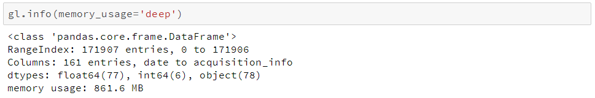

##### 数据内部表示

在底层，Pandas 会**按照数据类型将列分组形成数据块**（blocks），下图示例为 120 年棒球比赛数据的存储结构。

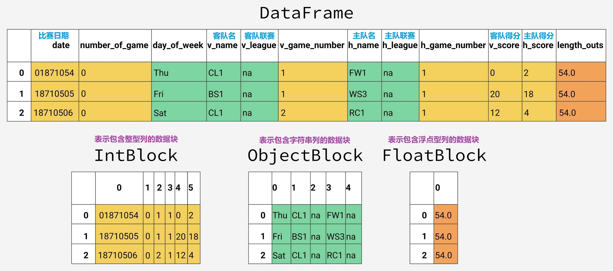

可以注意到，下面的数据块都经过了优化，**没有保持对列名的引用**。内部的 **BlockManager 类**记录了行列索引与真实数据块的映射关系，对外提供对底层数据的访问。

对于包含数值型数据（比如整型和浮点型）的数据块，Pandas 会**合并这些列，并把它们存储为一个 NumPy 数组**（`ndarray`）。NumPy 数组在 C 数组的基础上构建，其值在内存中是连续存储的，因此支持高速的切片访问。

<u>例 1.5-2：平均内存统计</u>

由于不同类型的数据是分开存放的，我们将检查不同数据类型的内存使用情况，先看看各数据类型的平均内存使用量。

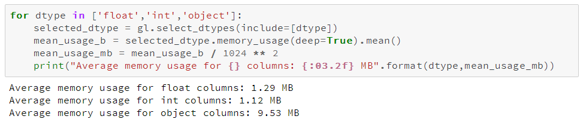

可以看到 Object 类型占用内存较多，这也是 Pandas 内存优化的重点方向。