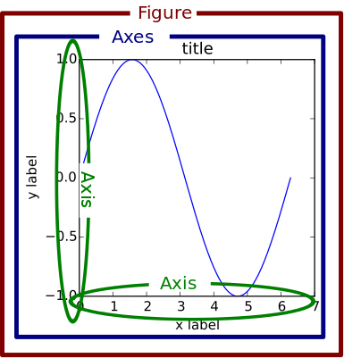

##  	目录

[toc]

## 1 `matplotlib`

### 1.1 导包与设置

#### 1.1.1 全局设置

正常导包即可，比较特殊的是要设置中文参数。

```python
import matplotlib.pyplot as plt
plt.rcParams['font.sans-serif'] = ['FangSong']  # 设置中文字体
plt.rcParams['axes.unicode_minus'] = False      # 设置负号显示
plt.rcParams['font.size'] = 14                  # 字体大小
figsize = np.array([9,5])                       # 图像大小
```

注：字体文件夹可以通过 `print(matplotlib.matplotlib_fname())` 得到，然后找到 `fonts/ttf` 文件夹，将相应的字体放到其中；最后修改 `matplotlibrc` 文件，改动 `font.sans-serif` 属性。

#### 1.1.2 不显示绘图

```python
import matplotlib
matplotlib.use('agg')
import matplotlib.pyplot as plt  # matplotlib.use('agg') 必须在本句执行前运行	
```

#### 1.1.3 绘图风格

```python
import matplotlib as mpl
mpl.style.use('ggplot')
```

#### 1.1.4 全局设置详解

在 matplotlib 中有很多全局的参数都是可以通过 `rcParams` 参数进行配置的，该文件具体内容在 `在C:\Python37\Lib\site-packages\matplotlib\mpl-data路径下`，可查阅后再使用全面的方法进行键值对设置。

### 1.2 绘图语法

`matplotlib.pyplot`的绘图语法和 `MATLAB` 的几乎一样，因此可以参考 `MATLAB` 的绘图笔记，这里很多不做赘述。

#### 1.2.0 概念梳理

> **Canvas, Figure, Axes, Axis 三者的关系**



* Canvas：最外层，代表一个绘画对象的最底层（承担渲染等工作），可以理解为<u>一个画架</u>

* Figure：红色框，代表一个可绘制对象，可以理解为<u>一块画板</u>

* Axes：蓝色框，代表 Figure 当中的**一套**坐标轴（是 Axis 的复数形式），可以理解为<u>一张画布</u>

  * 例如，画三维的图，Axes 就代表 3 根坐标轴，画二维的图，Axes 就代表 2 根坐标轴

  * 下图在 Figure 中定义了 4 个 subplot，因此有 4 个 Axes

     

* Axis：绿色轴，代表坐标轴、

> **`plt` 的 matlab 支持原理**

首先要知道两个获取当前 figure / axes 的函数：

* `plt.gcf()` - 获取当前 figure，即 get current figure
* `plt.gca()` - 获取当前 axes，即 get current axes

然后，`plt.plot()`、`plt.scatter()`、`plt.bar()`，其实本质上还是在 axes 上画图，可以将他们理解为：

* 先在 figure（画板）上获取一个当前要操作的 axes（画布）
* 如果没有 axes 就自动创建一个并将其设为当前的 axes
* 然后在当前这个 axes 上执行各种绘图功能

因而，`plt.<xxx>` 就相当于 `plt.gca().<xxx>`。

> **matplotlib 中的画布元素**

如下图所示。


#### 1.2.1 画板函数

* `plt.figure()` - 建立画板，可以设置画布大小

  * `num=None` - 当给它一个数字时，就作为画板的编号，相当于 ID 号；当给它一个字符串时，就作为画板的名称
  * `figsize=None` - 画板的宽、高，单位为英寸
  * `dpi=None` - 指定在该画板上绘制的图像的分辨率，即每英寸多少个像素
  * `facecolor=None` - 画板的背景颜色
  * `edgecolor=None` - 画板的边框颜色
  * `frameon=True` - 是否显示边框
  * 返回值 - `matplotlib.figure.Figure` 对象，即一块 figure 画板对象

  ```python
  import matplotlib.pyplot as plt
  fig = plt.figure(num='panel', figsize=(3,2),facecolor='gray')  # 建立画板
  plt.show()
  ```

   

* `Figure.add_subplot(nrows=None, ncols=None, index=None)` - 向画板中添加画布

  * `nrows` - 画布行数
  * `ncols` - 画布列数
  * `index` - 指示当前绘制在第几个区域，区域编号的顺序从上至下，从左至右
  * 【注】`nrows`, `ncols`, `index` 三者可以合并写成一个`nrows|ncols|index` 三位数字
  * 返回值 - `matplotlib.axes._subplots.AxesSubplot` 对象，即一张 axes 画布对象

  ```python
  ax = fig.add_subplot()  # 添加画布
  ```

  对于每添加一次 subplot ，其实就是添加了一套坐标轴，也就是添加了一个 axes

* `plt.subplot(nrows, ncols, index)` - 新建画布（网版），无返回值

  * `nrows` - 画布行数
  * `ncols` - 画布列数
  * `index` - 指示当前绘制在第几个区域，区域编号的顺序从上至下，从左至右
  * 【注】`nrows`, `ncols`, `index` 三者可以合并写成一个`nrows|ncols|index` 三位数字

  ```python
  import matplotlib.pyplot as plt
  fig = plt.figure(num='panel', figsize=(8,4),facecolor='gray')
  # 绘制两个不同大小的画布
  plt.subplot(1,3,1) # 划分 1 行 3 列，第 1 个子区域
  plt.subplot(1,2,2) # 划分 1 行 2 列，第 2 个子区域
  plt.show()
  ```

   

  每一次 `subplot` 动作是独立的，第一次将整个画板划分为 1 行 3 列不影响第二次划分为 1 行 2 列，这些数字**仅影响当前划分后子图的大小**，也就是说划分不好可能会导致画布重叠。

* `plt.subplots(nrows, ncols)` - 新建画布（轴版），返回画布，便于绘图时精调细节信息

  * `nrows` - 画布行数
  * `ncols` - 画布列数
  * `figsize` - 画板大小
  * 返回值 - `[fig, axes]`，如果创建多个画布，则 `axes` 为一个 `list`

  ```python
  import matplotlib.pyplot as plt
  import numpy as np
  # create data
  A = np.arange(1,5)
  B = A**2
  C = A**3
  # create figure and axes
  fig, axes = plt.subplots(1, 2, figsize=(6,3))
  # plot data
  axes[0].plot(A,B)
  axes[1].scatter(A,C)
  ```

   

* `plt.tight_layout()` - 自动调整子图参数，使之填充整个图像区域

#### 1.2.2 画布函数

##### Adding artists

* `Axes.add_patch(self, p)` - 增加 Patch 到 axes 的 patches 当中

  * `p` - 要增加的那个 patch
  * 返回值 - 增加的那个 patch

  > 形状（pathes）：`matplotlib.patches` 包里面的对象，比如我们常见的箭头，正方形，椭圆等等，也称之为“块”
  >
  > 路径（path）：一系列可能断开的、可能已关闭的线和曲线段

#### 1.2.3 绘图函数

* `plot(x, y, color, marker, linestyle)` - 绘制折线图

  * `x，y` - 输入数据

  * `color`,  `marker`,  `linestyle` - 线条参数（字符串类型），其中首尾两个可以简写为`c`, `ls`

    <table style="text-align:center">    
        <tr>
            <th>线型 linestyle</th><th>说明</th><th>标记符 marker</th><th>说明</th><th>颜色 color</th><th>说明</th>
        </tr>    
        <tr>
            <td>-</td><td>实线(默认)</td><td>+</td><td>加号符</td><td>r</td><td>红色</td>
        </tr>    
        <tr>
            <td>--</td><td>双划线</td><td>o</td><td>空心圆</td><td>g</td><td>绿色</td>   
        </tr>    
        <tr>
            <td>:</td><td>虚线</td><td>*</td><td>星号</td><td>b</td><td>蓝色</td>  
        </tr>    
        <tr> 
            <td>-.</td><td>点划线</td><td>.</td><td>实心圆</td><td>c</td><td>青绿色</td>  
        </tr>    
        <tr>  
            <td></td><td></td><td>x</td><td>叉号符</td><td>m</td><td>洋红色</td>  
        </tr>    
        <tr>
            <td></td><td></td><td>s</td><td>正方形</td><td>y</td><td>黄色</td>    
        </tr>    
        <tr> 
            <td></td><td></td><td>d</td><td>菱形</td><td>k</td><td>黑色</td>  
        </tr>    
        <tr> 
            <td></td><td></td><td>^</td><td>上三角形</td><td>w</td><td>白色</td>  
        </tr>    
        <tr> 
            <td></td><td></td><td>v</td><td>下三角形</td><td>[0,0,0,0]</td><td>RGBA色</td>   
        </tr>    
        <tr> 
            <td></td><td></td><td>></td><td>右三角形</td><td></td><td></td> 
        </tr>    
        <tr> 
            <td></td><td></td><td><</td><td>左三角形</td><td></td><td></td>  
        </tr>    
        <tr> 
            <td></td><td></td><td>p</td><td>五角星</td><td></td><td></td> 
        </tr>    
        <tr> 
            <td></td><td></td><td>h</td><td>六边形</td><td></td><td></td>    
        </tr>
    </table>

    【注】上表可用于众多的绘图函数。

* `plt.axhline(y,ls, c)` - 添加水平直线

* `plt.axvline(x,ls, c)` - 添加垂直直线

* `plt.colorbar()` - 绘制颜色对照条

* `plt.scatter(x, y, s, c, marker, alpha, linewidths, edgecolors)` - 绘制散点图

  * `x，y` - 输入数据
  * `s` - 标记大小，以像素为单位，可为 `list`
  * `c` - 颜色，可为 `list`
  * `marker` - 标记
  * `alpha` - 透明度
  * `linewidths` - 线宽
  * `edgecolors` - 边界颜色

* `plt.barh()` - 绘制柱状图（横向）

* `plt.bar()` - 绘制柱状图（纵向）

  * `x` - 横坐标
  * `height` - 条形高度
  * `width` - 条形宽度，范围在 `0-1`（若显示 n 个柱状图，则width_val的值需小于1/n ，否则柱形图会有重合）
  * `bottom` - `float`或`array-like`， 条形的起始位置
  * `align=center` - `{'center', 'edge'}`，条形的中心位置
  * `color` - `color or list of color`，条形的颜色
  * `edgecolor` -  `color or list of color`，边框的颜色
  * `linewidth` - `float`或`array-like`，边框宽度
  * `label=None` - 解释每个图像代表的含义
  * `tick_label=None` - `str or list of str`，下标的标签
  * `log=False` - y 轴使用对数刻度表示
  * `orientation='vertical'` - 是竖直条还是水平条，竖直：`"vertical"`，水平条：`"horizontal"`（不好用，建议用相似的 `barh` 方法）

  ```python
  """
  	典例：多柱的柱状图
  """
  plt.figure(figsize=(10,5))  # 设置画布的尺寸
  plt.title('Examples of Histogram',fontsize=20)  # 标题，并设定字号大小
  plt.xlabel(u'x-year',fontsize=14)  # 设置x轴，并设定字号大小
  plt.ylabel(u'y-income',fontsize=14)  # 设置y轴，并设定字号大小
   
  width_val = 0.4  # 若显示 n 个柱状图，则width_val的值需小于1/n ，否则柱形图会有重合
  # 多图显示，alpha：透明度；width：柱子的宽度；facecolor：柱子填充色；edgecolor：柱子轮廓色；lw：柱子轮廓的宽度；label：图例；
  plt.bar(data['时间'],data['收入_Jay'], alpha=0.6,width = width_val,  facecolor = 'deeppink', edgecolor = 'deeppink', lw=1, label='Jay income')
  plt.bar(data['时间']+width_val,data['收入_JJ'], alpha=0.6,width = width_val,  facecolor = 'darkblue', edgecolor = 'darkblue', lw=1, label='JJ income')
  
  # 添加数据标签 就是矩形上面的数值(网版)
  def auto_labels(rects):
      for rect in rects:
          height = rect.get_height()
          plt.text(rect.get_x() + rect.get_width()/2, height, height, ha='center', va='bottom', fontsize=16)
          rect.set_edgecolor('white')
  # 添加数据标签 就是矩形上面的数值(轴版，可该为plt用于网版)
  def auto_labels(rects):
      for rect in rects:
          height = rect.get_height()
          ax.annotate('{}'.format(height),
                      xy=(rect.get_x() + rect.get_width() / 2, height),
                      xytext=(0, 3),  # 3 points vertical offset
                      textcoords="offset points",
                      ha='center', va='bottom', fontsize=16)
  auto_labels(rects_Jay)
  auto_labels(rects_JJ)
  plt.legend(loc=2)  # 图例展示位置，数字代表第几象限
  plt.show()
  ```

* `plt.hist()` - 绘制频数分布直方图

  * `x` - 数据集
  * `bins=None` - `int`或`sequence`，使用的条形数量，会决定横轴显示范围
  * `range` - `tuple`, 显示的区间，`range`在没有给出`bins`时生效
  * `density=None` - `bool`，默认为`False`，显示的是频数统计结果。为`True`则显示频率统计结果，这里需要注意，频率统计结果=区间数目/(总数*区间宽度)，和 normed 效果一致，官方推荐使用`density`
  * `histtype` - 可选`{'bar', 'barstacked', 'step', 'stepfilled'}`之一，默认为`bar`，推荐使用默认配置，`step`使用的是梯状，`stepfilled`则会对梯状内部进行填充，效果与`bar`类似
  * `align` - 可选`{'left', 'mid', 'right'}`之一，默认为`'mid'`，控制柱状图的水平分布，`left`或者`right`，会有部分空白区域，推荐使用默认
  * `log` - `bool`，默认`False`，即y坐标轴是否选择指数刻度
  * `stacked` - `bool`，默认为`False`，是否为堆积状图

* `plt.boxplot()` - 绘制箱线图

  * `x`：指定要绘制箱线图的数据；
  * `notch`：是否是凹口的形式展现箱线图，默认非凹口；
  * `sym`：指定异常点的形状，默认为+号显示；
  * `vert`：是否需要将箱线图垂直摆放，默认垂直摆放；
  * `whis`：指定上下须与上下四分位的距离，默认为1.5倍的四分位差；
  * `positions`：指定箱线图的位置，默认为[0,1,2…]；
  * `widths`：指定箱线图的宽度，默认为0.5；
  * `patch_artist`：是否填充箱体的颜色；
  * `meanline`：是否用线的形式表示均值，默认用点来表示；
  * `showmeans`：是否显示均值，默认不显示；
  * `showcaps`：是否显示箱线图顶端和末端的两条线，默认显示；
  * `showbox`：是否显示箱线图的箱体，默认显示；
  * `showfliers`：是否显示异常值，默认显示；
  * `boxprops`：设置箱体的属性，如边框色，填充色等；
  * `labels`：为箱线图添加标签，类似于图例的作用；
  * `filerprops`：设置异常值的属性，如异常点的形状、大小、填充色等；
  * `medianprops`：设置中位数的属性，如线的类型、粗细等；
  * `meanprops`：设置均值的属性，如点的大小、颜色等；
  * `capprops`：设置箱线图顶端和末端线条的属性，如颜色、粗细等；
  * `whiskerprops`：设置须的属性，如颜色、粗细、线的类型等；

  ```python
  import matplotlib.pyplot as plt
  import numpy as np
  all_data=[np.random.normal(0,std,100) for std in range(1,4)]
  
  figure,axes=plt.subplots()  # 得到画板、轴，一个子图的集合
  axes.boxplot(all_data,patch_artist=True)  # 描点上色
  plt.show()  # 展示
  ```

#### 1.2.4 标注函数

**图像命名**

* `plt.title('名字', fontsize)` - 给图像添加名字

**轴线命名**

* `plt.xlabel('x轴名', fontsize)` - 给x轴添加名字
* `plt.ylabel('x轴名', fontsize)` - 给y轴添加名字
* `plt.zlabel('x轴名', fontsize)` - 给z轴添加名字

**坐标轴**

* `plt.axis()` - 坐标轴全局属性设置，网版
* `ax.set(xlim=(xmin, xmax), ylim=(ymin, ymax))` - 坐标轴全局属性设置，轴版
  * `()` - 返回坐标轴范围，格式如下
  * `([xmin, xmax, ymin, ymax])` - 范围设置
  * `(option)` - `'on'`开启，`off`关闭
* `plt.xticks(ticks, [labels], rotation=0, fontsize=None)` - 坐标轴标签位置和内容的设置
* `plt.yticks(ticks, [labels], rotation=0, fontsize=None)` - 坐标轴标签位置和内容的设置
  * `ticks` - 坐标轴标签的位置，以自然数 `0,1,...` 依次对应第几个标签
  * `labels` - `ticks` 位置上要显示的刻度内容
  * `rotation` - 坐标轴每个标签统一旋转的角度
  * `fontsize` - 字体大小
* `ax.xaxis.set_ticks_position(mode) ` - 画布刻度显示设置
* `ax.yaxis.set_ticks_position(mode)` - 画布刻度显示设置
  * `mode` - 可选 `'none'` 或 `'right'`，表示不显示或靠右显示
* `plt.xscale(value)` - 不均匀刻度
* `plt.yscale(value)` - 不均匀刻度
  * `value` - 可选 `{"linear", "log", "symlog", "logit", ...}`，作用于坐标轴上

**图例**

* `plt.legend(['标注1','标注2',...], fontsize)` - 功能是对当前图形进行图例标注

**文字信息**

* `plt.text(x,y,z'标注名')` - 功能是在点(x,y,z)加上文字信息

**颜色信息**

* `plt.colorbar` - 显示颜色条，给出颜色对应的数值

**网格线**

* `plt.grid(linestyle)` - 添加网格线
  * `linestyle` - 线型，参加`9.2.2`表格
* `plt.tick_params(axis, which, direction)` - 参数刻度线样式设置
  * `axis` - `x`、`y`、`both`，分别代表设置X轴、Y轴以及同时设置，默认值为`both`
  * `which` - `major`、`minor`、`both`，分别代表设置主刻度线、副刻度线以及同时设置，默认值为`major`
  * `direction` - `in`、`out`、`inout`，分别代表刻度线显示在绘图区内侧、外侧以及同时显示
  * `length`和`width` - 分别用于设置刻度线的长度和宽度
  * `pad` - 用于设置刻度线与标签间的距离
  * `color`, `labelcolor`, `colors` - 设置刻度线的颜色、刻度线标签的颜色以及同时设置刻度线及标签颜色
  * `labelsize` - 用于设置刻度线标签的字体大小
  * `bottom`, `top`, `left`, `right` - 分别代表设置绘图区四个边框线上的的刻度线是否显示
  * `labelbottom`, `labeltop`, `labelleft`, `labelright` - 分别代表设置绘图区四个边框线上的刻度线标签是否显示

**特殊点**

* `plt.annotate(text, xy, *args, **kwargs)` - 用文本 `text` 标注点 `xy`

  * `text (str)` - 标注的文本信息
  * `xy (float, float)` - 标注的坐标点位置
  * `xytext (float=x, float=y)` - `text` 文本的放置坐标

  ```python
  # 标注最大值点
  # pandas
  x_max = data['title'].idxmax()
  y_max = data['title'].max()
  # numpy
  x_max = np.argmax(x)
  y_max = np.argmax(y)
  # 标注
  plt.annotate(y[y_max], xy=(x_max,y_max))
  ```

### 1.3 绘图技巧

#### 1.3.1 解决横坐标的字重叠问题

* 方法一：拉长画布

  修改 `plt.figure()` 内的 `figsize` 参数。

* 方法二：调整标签字体大小

  修改 `plt.tick_params()` 内的 `labelsize` 参数。

* 方法三：横纵颠倒

  将纵向柱状图改为横向柱状图。

* 方法四：标签旋转

  修改 `plt.xticks` 的 `rotation=-90` 参数，或者 `ax.set_xticklabels(labels=必须的参数,rotation=-90)`

* 方法五：调整坐标轴密度

  ```python
  import matplotlib.pyplot as plt
  import matplotlib.ticker as ticker
  
  ax = plt.gca()
  ax.xaxis.set_major_locator(ticker.MultipleLocator(2)) # 2 是坐标间隔，按情况修改
  ```

#### 1.3.2 更改字体大小

设置标题字体大小：

```python
plt.title('标题', fontsize=fontsize)
```

设置刻度字体大小：

```python
plt.xticks(fontsize=20)
plt.yticks(fontsize=20)
```

设置坐标标签字体大小：

```python
ax.set_xlabel(..., fontsize=20)
ax.set_ylabel(..., fontsize=20)
```

设置图例字体大小：

```python
ax.legend(['图例1','图例2',...], fontsize=20)
```

#### 1.3.3 双 Y 轴图像

核心是使用镜像函数 `ax2 = ax1.twinx()`

```python
x = np.arange(0,6)
y1= [30481,12583,51,9,2,2]
y2= [0.0065,0.016,0.039,0,0,0]
 
fig,ax1 = plt.subplots()
ax2 = ax1.twinx()           # 做镜像处理，关键语句
ax1.plot(x,y1,'g-')
ax2.plot(x,y2,'b--')
 
ax1.set_xlabel('X data')    # 设置x轴标题
ax1.set_ylabel('total_count',color = 'g')   # 设置Y1轴标题
ax2.set_ylabel('bad_rate',color = 'b')   # 设置Y2轴标题
```


### 1.4 图片文件

#### 1.4.1 读取和显示

`matplotlib.image` 用于处理图片文件。

* `mpimg.imread(filename)` - 读取图片文件，可用`plt.imshow()`绘制图像
  * `filename` - 文件路径

例子：

```python
import matplotlib.pyplot as plt # plt 用于显示图片
import matplotlib.image as mpimg # mpimg 用于读取图片
import numpy as np

img = mpimg.imread('lena.png') # 读取和代码处于同一目录下的 lena.png
# 此时 lena 就已经是一个 np.array 了，可以对它进行任意处理
img.shape # (512, 512, 3)，不用进行下面的调整了
# CHW -> HWC
# img = img.transpose((1, 2, 0))  # 图像维度顺序调整，matplotlib 中的图像维度要求是 (H,W,C)

plt.imshow(img) # 显示图片
plt.axis('off') # 不显示坐标轴
plt.show()
```

【注】图像维度顺序调整，matplotlib 中的图像维度要求是 `(H,W,C)`

#### 1.4.2 图像存储

* `plt.savefig(fname, *, dpi='figure', format=None, metadata=None, bbox_inches=None, pad_inches=0.1, facecolor='auto',  edgecolor='auto', backend=None, **kwargs )`
  * `fname`：`str or path-like or binary file-like`，存储路径
  * `dpi`：`float or 'figure', default: rcParams["savefig.dpi"] (default: 'figure')`，分辨率，默认为 `dpi` 单位
  * `format`：`str`，文件格式，支持 `'png'`，`'pdf'`，`'svg'` 等
  * `metadata`：`dict, optional`，存储图像元信息 (meta data) 的键值对，支持以下格式和渲染后端
    * `'png'` with `Agg` backend: See the parameter `metadata` of [`print_png`](https://matplotlib.org/stable/api/backend_agg_api.html#matplotlib.backends.backend_agg.FigureCanvasAgg.print_png)
    * `'pdf'` with `pdf` backend: See the parameter `metadata` of [`PdfPages`](https://matplotlib.org/stable/api/backend_pdf_api.html#matplotlib.backends.backend_pdf.PdfPages)
    * `'svg'` with `svg` backend: See the parameter `metadata` of [`print_svg`](https://matplotlib.org/stable/api/backend_svg_api.html#matplotlib.backends.backend_svg.FigureCanvasSVG.print_svg)
    * `'eps'` and `'ps'` with `PS` backend: Only 'Creator' is supported

【注】保存结果一片空白的问题，要按照以下顺序保存：

```python
# 方案一：在 plt.show() 之前调用 plt.savefig()
plt.savefig("filename.png")
plt.show()

# 方案二：画图的时候获取当前图像（这一点非常类似于 Matlab 的句柄的概念）
fig = plt.gcf() # gcf: Get Current Figure
plt.show()
fig1.savefig('tessstttyyy.png', dpi=100)
```

#### 1.4.3 图像转矩阵

封装为两个函数，用 `fig4vis` 就好。

```python
def fig2data(fig):
    """
    brief Convert a Matplotlib figure to a 4D numpy array with RGBA 
    channels and return it

    @param fig: a matplotlib figure
    @return a numpy 3D array of RGBA values
    """
    # draw the renderer
    fig.canvas.draw()  # 渲染

    # Get the RGBA buffer from the figure
    w, h = fig.canvas.get_width_height()  # 获取图像宽和高
    buf = np.fromstring(fig.canvas.tostring_argb(), dtype=np.uint8)  # 获取图像内容
    buf.shape = (w, h, 4)  # 设置形状

    # canvas.tostring_argb give pixmap in ARGB mode. Roll the ALPHA channel to have it in RGBA mode
    buf = np.roll(buf, 3, axis=2)  # 滚动一下
    return buf.reshape(h, w, 4)  # 变形返回

def fig4vis(fig):
    """
    convert figure to ndarray
    """
    ax = fig.get_figure()  # 获得画布
    img_data = fig2data(ax).astype(np.int32)  # 转换画布内容为 numpy 矩阵
    plot.close()  # 结束图像
    # HWC -> CHW
    return img_data[:, :, :3].transpose((2, 0, 1)) / 255.
```

## 2 `seaborn`

`Seaborn` 是基于 `matplotlib`的图形可视化 python 包。它提供了一种高度交互式界面，便于用户能够做出各种有吸引力的统计图表。

`Seaborn` 是在 `matplotlib` 的基础上**进行了更高级的 `API` 封装**，从而使得作图更加容易，在大多数情况下使用 `seaborn` 能做出很具有吸引力的图，而使用 `matplotlib` 就能制作具有更多特色的图。

应该把 `Seaborn` 视为 `matplotlib` 的补充，而不是替代物。同时它能高度兼容 numpy 与 pandas 数据结构以及 scipy 与 statsmodels 等统计模式。

安装方法：

```shell
pip install seaborn
>>> python
>>> import seaborn as sns
```

### 2.1 风格函数

* `sns.set_theme(style="whitegrid")` - 设置主题风格
  * `style` - 主题字符串，好看的有
    * `"whitegrid"` - 白底黑框

### 2.2 绘图函数

* `sns.barplot()` : 柱状图（条形图）
  * `x, y, hue=None` : 绘图中所使用的类别/对应数值/分类变量（每条柱子按照指定的类别进行分类成多条柱子的组合）
  * `data=None` : 使用的数据集，当指定时为`DataFrame`时，可以在 `x`，`y`参数处直接使用列名序列
  * `palette=None` : 调色方案
  * `order，hue_order` : `order`控制`bar`绘制的顺序，`hue_order`控制一个`bar`内每个类绘图顺序
  * `orient` : `“v” / "h"`条带绘制方向
  * `saturation = 1` : `float`, 直条颜色的饱和度
  * `dodge=False` : 当使用分类参数`hue`时，可以通过该参数设置是将不同的类分别用一个`bar`表示，还是在一个`bar`上通过不同颜色表示
  * 返回值 : `matplotlib.Axes`对象
* `sns.countplot('Class', data = raw_data)`：计数柱状图（条形图）
* `sns.distplot(x, bins=None, hist=True, kde=True, fit=None, color=None, vertical=False, norm_hist=False, ax=None)`
  * 集合了 `matplotlib` 的 `hist()` 与核函数估计 `kdeplot` 的功能
  * `x` : 变量
  * `bins` : 柱子的数目
  * `hist` : 是否显示柱子
  * `kde` : 是否显示密度函数线条
  * `fit` : 拟合分布
  * `color` : 颜色
  * `vertical` : 是否水平画图
  * `norm_hist` : 频数是否计算成概率
  * `ax` : 轴域
* `sns.pairplot()`：散点图矩阵，**对角线上是各个属性的直方图（分布图）**，而**非对角线上**是**两个不同属性之间的相关图**
  * `df`：pandas 的数据结构 `DataFrame`
  * `hue`：按照某个分类变量（字段）进行分类，不同类别的点会以不同的颜色显现出来
  * `kind`：用于控制非对角线上的图的类型，可选`"scatter"`与`"reg"`
    * 将 `kind` 参数设置为 `"reg"` 会为非对角线上的散点图拟合出一条回归直线
  * `diag_kind`：控制对角线上的图的类型，可选`"hist"`与"`kde"`
  * `palette`：控制色调
  * `markers`：控制散点的样式
  * `size`：控制散点大小
  * `vars`,`x_vars`,`y_vars`：选择数据 `df` 中的特定字段，以`list`形式传入
  * `plot_kws`：用于控制非对角线上的图的样式，例如`dict(s=50,edgecolor="w",color="g",alpha=.5)`
  * `diag_kws`：用于控制对角线上图的样式，例如`dict(shade=True,color="r")) `

### 2.4 典型例子

#### 2.4.1 大小和颜色渐变的散点图


使用的函数为：

* `set_theme()`
* `load_dataset()`
* `cubehelix_palette()`
* `relplot()`

```python
import seaborn as sns
sns.set_theme(style="whitegrid")

# Load the example planets dataset
planets = sns.load_dataset("planets")

cmap = sns.cubehelix_palette(rot=-.2, as_cmap=True)
g = sns.relplot(
    data=planets,
    x="distance", y="orbital_period",
    hue="year", size="mass",
    palette=cmap, sizes=(10, 200),
)
g.set(xscale="log", yscale="log")
g.ax.xaxis.grid(True, "minor", linewidth=.25)
g.ax.yaxis.grid(True, "minor", linewidth=.25)
g.despine(left=True, bottom=True)
```

## 3 `tqdm`

`tqdm` 是一个快速的、可拓展的 Python 进度条，可以在 Python 长循环中添加一个进度提示信息，用户只需封装任意的迭代器 `tqdm(Iterator)`。

`tqdm` 可以实时输出处理进度而且占用的**CPU资源非常少**，支持 Windows, Linux, Mac 等系统，支持**循环处理**、多进程、**递归处理**、还可以结合 Linux 的命令来查看处理情况，等进度展示。

安装方法：

```shell
pip install tqdm
conda install -c conda-forge tqdm
```

### 3.1 基本用法

对于**可迭代的对象**都可以使用下面 `tqdm(Iterator)` 的方式，来实现可视化进度。

```python
from tqdm import tqdm
import time
for i in tqdm(range(100)):  # for i in trange(100): # 等价形式
    time.sleep(0.1)
  	pass
```


另外，在 `tqdm` 对 `Pandas` 有专门的支持。

```python
import pandas as pd
import numpy as np
from tqdm import tqdm
df = pd.DataFrame(np.random.randint(0, 100, (100000, 6)))
tqdm.pandas(desc="my bar!")
df.progress_apply(lambda x: x**2)
```


### 3.2 设置显示格式

**(1) 观察处理的数据**

```python
from tqdm import tqdm
import time
pbar = tqdm(["a","b","c","d"])
for c in pbar:
    time.sleep(1)
    pbar.set_description("Processing %s" % c)
```


**(2) 手动设置处理的进度**

```python
from tqdm import tqdm
import time
# total 参数设置进度条的总长度
with tqdm(total=100) as pbar:
    # with 上下文模式
    for i in range(100):
        time.sleep(0.05)
        #每次更新进度条的长度
        pbar.update(1)
```

```python
from tqdm import tqdm
import time
#total 参数设置进度条的总长度
pbar = tqdm(total=100)
for i in range(100):
    # for 循环模式
    time.sleep(0.05)
    #每次更新进度条的长度
    pbar.update(1)
    #关闭占用的资源
    pbar.close()
```

效果同基本用法的图。

**(3) 自定义进度条显示信息**

通过 `set_description` 和 `set_postfix` 方法设置进度条显示信息。

```python
from tqdm import trange
from random import random,randint
import time
with trange(100) as t:
    for i in t:
        #设置进度条左边显示的信息
        t.set_description("GEN %i" % i)
        #设置进度条右边显示的信息
        t.set_postfix(loss=random(),gen=randint(1,999),str="h",lst=[1,2])
        time.sleep(0.1)
```


还可以通过 `tqdm` 的 `bar_format` 参数来设置进度条格式。

```python
from tqdm import tqdm
import time
with tqdm(total=10,bar_format="{postfix[0]}{postfix[1][value]:>9.3g}",	postfix=["Batch",dict(value=0)]) as t:
    for i in range(10):
        time.sleep(0.05)
        t.postfix[1]["value"] = i / 2
        t.update()
```


### 3.3 设置多进度条

**(1) 多层循环进度条**

```python
from tqdm import tqdm
import time
for i in tqdm(range(20), ascii=True,desc="1st loop"):
    for j in tqdm(range(10), ascii=True,desc="2nd loop"):
        time.sleep(0.01)
```


**(2) 多进程进度条**

```python
from time import sleep
from tqdm import trange, tqdm
from multiprocessing import Pool, freeze_support, RLock
L = list(range(9))
def progresser(n):
    interval = 0.001 / (n + 2)
    total = 5000
    text = "#{}, est. {:<04.2}s".format(n, interval * total)
    for i in trange(total, desc=text, position=n,ascii=True):
        sleep(interval)
if __name__ == '__main__':
    freeze_support() # for Windows support
    p = Pool(len(L), # again, for Windows support
    		 initializer = tqdm.set_lock,
             initargs=(RLock(),))
    		 p.map(progresser, L)
    print("\n" * (len(L) - 2))
```


### 3.4 文件读取封装

在读取文件的时候，显示相关的进度条，适合大文件处理的可视化。

```python
with open(file_path) as file:
    for line in tqdm(file, total=get_num_lines(file_path)):
        # various operations here
```

这其中的关键就是**实现文件行数的获取**操作，有以下两种方法。

方法一：二进制+缓存

```python
import time
def get_line_nums(fir, use_mmap=False):
    """
    获取文本文件的行数。

    Args:
        fir (str): 文件路径

    Return:
        nums (int): 行数
    """
    # start = time.time()
    with open(fir, 'rb') as f:
        count = 0
        last_data = '\n'
        while True:
            data = f.read(0x400000)
            if not data:
                break
            count += data.count(b'\n')
            last_data = data
        if last_data[-1:] != b'\n':
            count += 1  # Remove this if a wc-like count is needed
    # end = time.time()
    # print(count)
    # print((end-start) * 1000)
    return count
```

【注】这里没有处理 universal newline、忽略空行等逻辑，如果需要这些功能，程序会变得复杂一些。

方法二：`mmap` 内存映射

```python
import mmap
def get_line_nums(fir, use_mmap=True):
    """
    获取文本文件的行数。

    Args:
        fir (str): 文件路径

    Return:
        nums (int): 行数
    """
    f = open(fir, "r+")
    buf = mmap.mmap(f.fileno(), 0)
    lines = 0
    while buf.readline():
        lines += 1
    f.close()
    return lines
```

【注】概念和原理详见 `Python3 基础 - 3.3 mmap`.

## 4 `visdom`

`visdom` 是一款交互数据可视化工具，本质上是一个 tornado 服务，通过 web-socket 于前端通信。

安装方法为：

```shell
$ pip install visdom
```

### 4.1 启动服务

默认端口为8097，可以根据需要加上 `-p` 选项修改端口

```shell
$ python -m visdom.server # 或者直接 visdom 命令也可以
```

有以下输出代表启动成功：

```text
Downloading scripts. It might take a while.
It's Alive!
INFO:root:Application Started
You can navigate to http://localhost:8097
```

【注1】卡死问题

```python
# 有的同学可能会遇到卡死的问题，原因是下载一些 js、css 资源文件比较慢或者根本没法访问，解决方案是手动下载即可
# 执行的代码在 "$YOUR_PREFIX/lib/python3.6/site-packages/visdom/server.py"
# 这里需要根据自己的环境修改 $YOUR_PREFIX

# 实际执行的部分：
def download_scripts_and_run():
    download_scripts()
    main()

if __name__ == "__main__":
    download_scripts_and_run()

# 只要观察 download_scripts 函数，手动下载资源文件即可
```

【注2】连接问题

Q：`ERROR:visdom:[WinError 10061] 由于目标计算机积极拒绝，无法连接`

A：没启动在线可视化工具，在当前环境中启动 `python -m visdom.server`

### 4.2 基本用法

“窗口 + 更新” 的绘制模式。

例：图像显示与更新窗口显示

```python
# 单张图像显示与更新 demo
image = viz.image(np.random.rand(3,256,256), opts={'title':'image1','caption':'How random.'})
for i in range(10):
    viz.image(np.random.randn( 3, 256, 256), win = image)
    time.sleep(0.5)
```

```python
# 多图像显示与更新 demo
images = viz.images(
    np.random.randn(20,3,64,64), 
    opts=dict(title='Random images', caption='How random.',nrow=5)
)
for i in range(10):
    viz.images(np.random.randn(20, 3, 64, 64), win = images)
    time.sleep(0.5) 
```


例：显示文本与更新文本

```python
# text 显示与更新显示 demo，将在窗口中连续打印字符
text = viz.text('Hello World !')
strForOut = "This is a string for you to print!"
out = ""
for i in range(len(strForOut)):
    out = out + strForOut[i]
    viz.text(out, win = text)
    time.sleep(0.2)
```


### 4.3 demo

```python
#!/usr/bin/env python3

# Copyright 2017-present, The Visdom Authors
# All rights reserved.
#
# This source code is licensed under the license found in the
# LICENSE file in the root directory of this source tree.

from visdom import Visdom
import argparse
import numpy as np
import math
import os.path
import time
import tempfile
import urllib


def run_demo(viz):
    global input
    assert viz.check_connection(timeout_seconds=3), 'No connection could be formed quickly'

    textwindow = viz.text('Hello World!')

    updatetextwindow = viz.text('Hello World! More text should be here')
    assert updatetextwindow is not None, 'Window was none'
    viz.text('And here it is', win=updatetextwindow, append=True)

    # text window with Callbacks
    txt = 'This is a write demo notepad. Type below. Delete clears text:<br>'
    callback_text_window = viz.text(txt)

    def type_callback(event):
        if event['event_type'] == 'KeyPress':
            curr_txt = event['pane_data']['content']
            if event['key'] == 'Enter':
                curr_txt += '<br>'
            elif event['key'] == 'Backspace':
                curr_txt = curr_txt[:-1]
            elif event['key'] == 'Delete':
                curr_txt = txt
            elif len(event['key']) == 1:
                curr_txt += event['key']
            viz.text(curr_txt, win=callback_text_window)

    viz.register_event_handler(type_callback, callback_text_window)

    # matplotlib demo:
    try:
        import matplotlib.pyplot as plt
        plt.plot([1, 23, 2, 4])
        plt.ylabel('some numbers')
        viz.matplot(plt)
    except BaseException as err:
        print('Skipped matplotlib example')
        print('Error message: ', err)

    # video demo:
    try:
        video = np.empty([256, 250, 250, 3], dtype=np.uint8)
        for n in range(256):
            video[n, :, :, :].fill(n)
        viz.video(tensor=video)
    except BaseException:
        print('Skipped video tensor example')

    try:
        # video demo:
        # download video from http://media.w3.org/2010/05/sintel/trailer.ogv
        video_url = 'http://media.w3.org/2010/05/sintel/trailer.ogv'
        videofile = os.path.join(tempfile.gettempdir(), 'trailer.ogv')
        urllib.request.urlretrieve(video_url, videofile)

        if os.path.isfile(videofile):
            viz.video(videofile=videofile, opts={'width': 864, 'height': 480})
    except BaseException as e:
        print('Skipped video file example', e)

    # image demo
    img_callback_win = viz.image(
        np.random.rand(3, 512, 256),
        opts={'title': 'Random!', 'caption': 'Click me!'},
    )

    img_coord_text = viz.text("Coords: ")

    def img_click_callback(event):
        nonlocal img_coord_text
        if event['event_type'] != 'Click':
            return

        coords = "x: {}, y: {};".format(
            event['image_coord']['x'], event['image_coord']['y']
        )
        img_coord_text = viz.text(coords, win=img_coord_text, append=True)

    viz.register_event_handler(img_click_callback, img_callback_win)

    # image demo save as jpg
    viz.image(
        np.random.rand(3, 512, 256),
        opts=dict(title='Random image as jpg!', caption='How random as jpg.', jpgquality=50),
    )

    # image history demo
    viz.image(
        np.random.rand(3, 512, 256),
        win='image_history',
        opts=dict(caption='First random', store_history=True, title='Pick your random!'),
    )
    viz.image(
        np.random.rand(3, 512, 256),
        win='image_history',
        opts=dict(caption='Second random!', store_history=True),
    )

    # grid of images
    viz.images(
        np.random.randn(20, 3, 64, 64),
        opts=dict(title='Random images', caption='How random.')
    )

    # scatter plots
    Y = np.random.rand(100)
    old_scatter = viz.scatter(
        X=np.random.rand(100, 2),
        Y=(Y[Y > 0] + 1.5).astype(int),
        opts=dict(
            legend=['Didnt', 'Update'],
            xtickmin=-50,
            xtickmax=50,
            xtickstep=0.5,
            ytickmin=-50,
            ytickmax=50,
            ytickstep=0.5,
            markersymbol='cross-thin-open',
        ),
    )

    viz.update_window_opts(
        win=old_scatter,
        opts=dict(
            legend=['Apples', 'Pears'],
            xtickmin=0,
            xtickmax=1,
            xtickstep=0.5,
            ytickmin=0,
            ytickmax=1,
            ytickstep=0.5,
            markersymbol='cross-thin-open',
        ),
    )

    # 3d scatterplot with custom labels and ranges
    viz.scatter(
        X=np.random.rand(100, 3),
        Y=(Y + 1.5).astype(int),
        opts=dict(
            legend=['Men', 'Women'],
            markersize=5,
            xtickmin=0,
            xtickmax=2,
            xlabel='Arbitrary',
            xtickvals=[0, 0.75, 1.6, 2],
            ytickmin=0,
            ytickmax=2,
            ytickstep=0.5,
            ztickmin=0,
            ztickmax=1,
            ztickstep=0.5,
        )
    )

    # 2D scatterplot with custom intensities (red channel)
    viz.scatter(
        X=np.random.rand(255, 2),
        Y=(np.random.rand(255) + 1.5).astype(int),
        opts=dict(
            markersize=10,
            markercolor=np.random.randint(0, 255, (2, 3,)),
        ),
    )

    # 2D scatter plot with custom colors per label:
    viz.scatter(
        X=np.random.rand(255, 2),
        Y=(np.random.randn(255) > 0) + 1,
        opts=dict(
            markersize=10,
            markercolor=np.floor(np.random.random((2, 3)) * 255),
            markerborderwidth=0,
        ),
    )

    win = viz.scatter(
        X=np.random.rand(255, 2),
        opts=dict(
            markersize=10,
            markercolor=np.random.randint(0, 255, (255, 3,)),
        ),
    )

    # assert that the window exists
    assert viz.win_exists(win), 'Created window marked as not existing'

    # add new trace to scatter plot
    viz.scatter(
        X=np.random.rand(255),
        Y=np.random.rand(255),
        win=win,
        name='new_trace',
        update='new'
    )

    # 2D scatter plot with text labels:
    viz.scatter(
        X=np.random.rand(10, 2),
        opts=dict(
            textlabels=['Label %d' % (i + 1) for i in range(10)]
        )
    )
    viz.scatter(
        X=np.random.rand(10, 2),
        Y=[1] * 5 + [2] * 3 + [3] * 2,
        opts=dict(
            legend=['A', 'B', 'C'],
            textlabels=['Label %d' % (i + 1) for i in range(10)]
        )
    )

    # bar plots
    viz.bar(X=np.random.rand(20))
    viz.bar(
        X=np.abs(np.random.rand(5, 3)),
        opts=dict(
            stacked=True,
            legend=['Facebook', 'Google', 'Twitter'],
            rownames=['2012', '2013', '2014', '2015', '2016']
        )
    )
    viz.bar(
        X=np.random.rand(20, 3),
        opts=dict(
            stacked=False,
            legend=['The Netherlands', 'France', 'United States']
        )
    )

    # histogram
    viz.histogram(X=np.random.rand(10000), opts=dict(numbins=20))

    # heatmap
    viz.heatmap(
        X=np.outer(np.arange(1, 6), np.arange(1, 11)),
        opts=dict(
            columnnames=['a', 'b', 'c', 'd', 'e', 'f', 'g', 'h', 'i', 'j'],
            rownames=['y1', 'y2', 'y3', 'y4', 'y5'],
            colormap='Electric',
        )
    )

    # contour
    x = np.tile(np.arange(1, 101), (100, 1))
    y = x.transpose()
    X = np.exp((((x - 50) ** 2) + ((y - 50) ** 2)) / -(20.0 ** 2))
    viz.contour(X=X, opts=dict(colormap='Viridis'))

    # surface
    viz.surf(X=X, opts=dict(colormap='Hot'))

    # line plots
    viz.line(Y=np.random.rand(10), opts=dict(showlegend=True))

    Y = np.linspace(-5, 5, 100)
    viz.line(
        Y=np.column_stack((Y * Y, np.sqrt(Y + 5))),
        X=np.column_stack((Y, Y)),
        opts=dict(markers=False),
    )

    # line using WebGL
    webgl_num_points = 200000
    webgl_x = np.linspace(-1, 0, webgl_num_points)
    webgl_y = webgl_x**3
    viz.line(X=webgl_x, Y=webgl_y,
             opts=dict(title='{} points using WebGL'.format(webgl_num_points), webgl=True),
             win="WebGL demo")


    # line updates
    win = viz.line(
        X=np.column_stack((np.arange(0, 10), np.arange(0, 10))),
        Y=np.column_stack((np.linspace(5, 10, 10),
                           np.linspace(5, 10, 10) + 5)),
    )
    viz.line(
        X=np.column_stack((np.arange(10, 20), np.arange(10, 20))),
        Y=np.column_stack((np.linspace(5, 10, 10),
                           np.linspace(5, 10, 10) + 5)),
        win=win,
        update='append'
    )
    viz.line(
        X=np.arange(21, 30),
        Y=np.arange(1, 10),
        win=win,
        name='2',
        update='append'
    )
    viz.line(
        X=np.arange(1, 10),
        Y=np.arange(11, 20),
        win=win,
        name='delete this',
        update='append'
    )
    viz.line(
        X=np.arange(1, 10),
        Y=np.arange(11, 20),
        win=win,
        name='4',
        update='insert'
    )
    viz.line(X=None, Y=None, win=win, name='delete this', update='remove')

    viz.line(
        X=webgl_x+1.,
        Y=(webgl_x+1.)**3,
        win="WebGL demo",
        update='append',
        opts=dict(title='{} points using WebGL'.format(webgl_num_points*2), webgl=True)
    )

    win = viz.line(
        X=np.column_stack((
            np.arange(0, 10),
            np.arange(0, 10),
            np.arange(0, 10),
        )),
        Y=np.column_stack((
            np.linspace(5, 10, 10),
            np.linspace(5, 10, 10) + 5,
            np.linspace(5, 10, 10) + 10,
        )),
        opts={
            'dash': np.array(['solid', 'dash', 'dashdot']),
            'linecolor': np.array([
                [0, 191, 255],
                [0, 191, 255],
                [255, 0, 0],
            ]),
            'title': 'Different line dash types'
        }
    )

    viz.line(
        X=np.arange(0, 10),
        Y=np.linspace(5, 10, 10) + 15,
        win=win,
        name='4',
        update='insert',
        opts={
            'linecolor': np.array([
                [255, 0, 0],
            ]),
            'dash': np.array(['dot']),
        }
    )

    Y = np.linspace(0, 4, 200)
    win = viz.line(
        Y=np.column_stack((np.sqrt(Y), np.sqrt(Y) + 2)),
        X=np.column_stack((Y, Y)),
        opts=dict(
            fillarea=True,
            showlegend=False,
            width=800,
            height=800,
            xlabel='Time',
            ylabel='Volume',
            ytype='log',
            title='Stacked area plot',
            marginleft=30,
            marginright=30,
            marginbottom=80,
            margintop=30,
        ),
    )

    # Assure that the stacked area plot isn't giant
    viz.update_window_opts(
        win=win,
        opts=dict(
            width=300,
            height=300,
        ),
    )

    # boxplot
    X = np.random.rand(100, 2)
    X[:, 1] += 2
    viz.boxplot(
        X=X,
        opts=dict(legend=['Men', 'Women'])
    )

    # stemplot
    Y = np.linspace(0, 2 * math.pi, 70)
    X = np.column_stack((np.sin(Y), np.cos(Y)))
    viz.stem(
        X=X,
        Y=Y,
        opts=dict(legend=['Sine', 'Cosine'])
    )

    # quiver plot
    X = np.arange(0, 2.1, .2)
    Y = np.arange(0, 2.1, .2)
    X = np.broadcast_to(np.expand_dims(X, axis=1), (len(X), len(X)))
    Y = np.broadcast_to(np.expand_dims(Y, axis=0), (len(Y), len(Y)))
    U = np.multiply(np.cos(X), Y)
    V = np.multiply(np.sin(X), Y)
    viz.quiver(
        X=U,
        Y=V,
        opts=dict(normalize=0.9),
    )

    # pie chart
    X = np.asarray([19, 26, 55])
    viz.pie(
        X=X,
        opts=dict(legend=['Residential', 'Non-Residential', 'Utility'])
    )

    # scatter plot example with various type of updates
    colors = np.random.randint(0, 255, (2, 3,))
    win = viz.scatter(
        X=np.random.rand(255, 2),
        Y=(np.random.rand(255) + 1.5).astype(int),
        opts=dict(
            markersize=10,
            markercolor=colors,
            legend=['1', '2']
        ),
    )

    viz.scatter(
        X=np.random.rand(255),
        Y=np.random.rand(255),
        opts=dict(
            markersize=10,
            markercolor=colors[0].reshape(-1, 3),

        ),
        name='1',
        update='append',
        win=win)

    viz.scatter(
        X=np.random.rand(255, 2),
        Y=(np.random.rand(255) + 1.5).astype(int),
        opts=dict(
            markersize=10,
            markercolor=colors,
        ),
        update='append',
        win=win)

    # mesh plot
    x = [0, 0, 1, 1, 0, 0, 1, 1]
    y = [0, 1, 1, 0, 0, 1, 1, 0]
    z = [0, 0, 0, 0, 1, 1, 1, 1]
    X = np.c_[x, y, z]
    i = [7, 0, 0, 0, 4, 4, 6, 6, 4, 0, 3, 2]
    j = [3, 4, 1, 2, 5, 6, 5, 2, 0, 1, 6, 3]
    k = [0, 7, 2, 3, 6, 7, 1, 1, 5, 5, 7, 6]
    Y = np.c_[i, j, k]
    viz.mesh(X=X, Y=Y, opts=dict(opacity=0.5))

    # double y axis plot
    X = np.arange(20)
    Y1 = np.random.randint(0, 20, 20)
    Y2 = np.random.randint(0, 20, 20)
    viz.dual_axis_lines(X, Y1, Y2)

    # Example for Latex Support
    viz.line(
        X=[1, 2, 3, 4],
        Y=[1, 4, 9, 16],
        win="latex_support",
        name=r'$\alpha_{1c} = 352 \pm 11 \text{ km s}^{-1}$',
        update='append',
        opts={
            'showlegend': True,
            'title': "Demo Latex in Visdom",
            'xlabel': r'$\sqrt{(n_\text{c}(t|{T_\text{early}}))}$',
            'ylabel': r'$d, r \text{ (solar radius)}$',
        },
    )
    viz.line(
        X=[1, 2, 3, 4],
        Y=[0.5, 2, 4.5, 8],
        win="latex_support",
        name=r'$\beta_{1c} = 25 \pm 11 \text{ km s}^{-1}$',
        update='append',
    )

    # SVG plotting
    svgstr = """
    <svg height="300" width="300">
      <ellipse cx="80" cy="80" rx="50" ry="30"
       style="fill:red;stroke:purple;stroke-width:2" />
      Sorry, your browser does not support inline SVG.
    </svg>
    """
    viz.svg(
        svgstr=svgstr,
        opts=dict(title='Example of SVG Rendering')
    )

    # close text window:
    viz.close(win=textwindow)

    # assert that the closed window doesn't exist
    assert not viz.win_exists(textwindow), 'Closed window still exists'

    # Arbitrary visdom content
    trace = dict(x=[1, 2, 3], y=[4, 5, 6], mode="markers+lines", type='custom',
                 marker={'color': 'red', 'symbol': 104, 'size': "10"},
                 text=["one", "two", "three"], name='1st Trace')
    layout = dict(title="First Plot", xaxis={'title': 'x1'},
                  yaxis={'title': 'x2'})

    viz._send({'data': [trace], 'layout': layout, 'win': 'mywin'})

    # PyTorch tensor
    try:
        import torch
        viz.line(Y=torch.Tensor([[0., 0.], [1., 1.]]))
    except ImportError:
        print('Skipped PyTorch example')

    # audio demo:
    tensor = np.random.uniform(-1, 1, 441000)
    viz.audio(tensor=tensor, opts={'sample_frequency': 441000})

    # audio demo:
    # download from http://www.externalharddrive.com/waves/animal/dolphin.wav
    try:
        audio_url = 'http://www.externalharddrive.com/waves/animal/dolphin.wav'
        audiofile = os.path.join(tempfile.gettempdir(), 'dolphin.wav')
        urllib.request.urlretrieve(audio_url, audiofile)

        if os.path.isfile(audiofile):
            viz.audio(audiofile=audiofile)
    except BaseException:
        print('Skipped audio example')

    # get/set state
    import json
    window = viz.text('test one')
    data = json.loads(viz.get_window_data())
    data[window]['content'] = 'test two'
    viz.set_window_data(json.dumps(data))

    try:
        input = raw_input  # for Python 2 compatibility
    except NameError:
        pass
    input('Waiting for callbacks, press enter to quit.')


if __name__ == '__main__':
    DEFAULT_PORT = 8097
    DEFAULT_HOSTNAME = "http://localhost"
    parser = argparse.ArgumentParser(description='Demo arguments')
    parser.add_argument('-port', metavar='port', type=int, default=DEFAULT_PORT,
                        help='port the visdom server is running on.')
    parser.add_argument('-server', metavar='server', type=str,
                        default=DEFAULT_HOSTNAME,
                        help='Server address of the target to run the demo on.')
    parser.add_argument('-base_url', metavar='base_url', type=str,
                    default='/',
                    help='Base Url.')
    parser.add_argument('-username', metavar='username', type=str,
                    default='',
                    help='username.')
    parser.add_argument('-password', metavar='password', type=str,
                    default='',
                    help='password.')
    parser.add_argument('-use_incoming_socket', metavar='use_incoming_socket', type=bool,
                    default=True,
                    help='use_incoming_socket.')
    FLAGS = parser.parse_args()

    try:
        viz = Visdom(port=FLAGS.port, server=FLAGS.server, base_url=FLAGS.base_url, username=FLAGS.username, password=FLAGS.password, use_incoming_socket=FLAGS.use_incoming_socket)
        run_demo(viz)
    except Exception as e:
        print(
            "The visdom experienced an exception while running: {}\n"
            "The demo displays up-to-date functionality with the GitHub "
            "version, which may not yet be pushed to pip. Please upgrade "
            "using `pip install -e .` or `easy_install .`\n"
            "If this does not resolve the problem, please open an issue on "
            "our GitHub.".format(repr(e))
        )
```

## 5 `TensorBoardX`

TensorBoard 是一个可视化工具，它可以用来展示网络图、张量的指标变化、张量的分布情况等，可是对于 PyTorch 等其他神经网络训练框架并没有功能像 TensorBoard 一样全面的类似工具（`tensorboard_logger`，`visdom` 等）。

TensorboardX 这个工具使得其他神经网络框架也可以使用到 TensorBoard 的便捷功能。

安装方法：

```shell
pip install tensorboardX
```

官方文档：https://tensorboardx.readthedocs.io/en/latest/tensorboard.html

### 5.1 起手式

**创建**

`TensorBoardX` 首先要创建一个 `SummaryWriter`，有三种方法：

1. 提供一个路径：将使用该路径来保存日志
2. 无参数：默认将使用 `runs/日期时间` 路径来保存日志
3. 提供一个 comment 参数：将使用 `runs/日期时间-comment` 路径来保存日志

```python
from tensorboardX import SummaryWriter

# Creates writer1 object.
# The log will be saved in 'runs/exp'
writer1 = SummaryWriter('runs/exp')

# Creates writer2 object with auto generated file name
# The log directory will be something like 'runs/Aug20-17-20-33'
writer2 = SummaryWriter()

# Creates writer3 object with auto generated file name, the comment will be appended to the filename.
# The log directory will be something like 'runs/Aug20-17-20-33-resnet'
writer3 = SummaryWriter(comment='resnet')
```

【注】一般来讲，我们对于每次实验新建一个路径不同的 `SummaryWriter`，也叫一个 **run**，如 `runs/exp1`、`runs/exp2`。

**记录**

接下来就可以调用 `SummaryWriter` 实例的各种 `add_something()` 方法向日志中写入不同类型的数据，见 `5.2 数据记录`。

**启动**

至于浏览器可视化，只要在命令行中开启 TensorBoard 即可：

```shell
tensorboard --logdir=<your_log_dir>					# 单个 run 路径，一次实验
tensorboard --logdir=runs/<your_log_dir>			# 多个 run 路径，方便横向比较

tensorboard --logdir=<your_log_dir> --port=6005  	# 指定端口
```

### 5.2 数据记录

下面详细介绍 `SummaryWriter` 实例的各种数据记录方法，并提供相应的示例供参考。

#### 5.2.1 数字 (scalar)

* `writer.add_scalar(tag, scalar_value, global_step=None, walltime=None)` - 记录数字常量，常用于记录 `loss`、`accuracy`、`learning rate` 等数值的变化

  * `tag (string)` - 数据名称，不同名称的数据使用不同曲线展示

  * `scalar_value (float)` - 数字常量值

  * `global_step (int, optional)` - 训练的 step

  * `walltime (float, optional)` - 记录发生的时间，默认为 `time.time()`

    【注】这里的 `scalar_value` 一定是 `float` 类型，如果是 PyTorch scalar tensor，则需要调用 `.item()` 方法获取其数值。

  ```python
  from tensorboardX import SummaryWriter
  
  # 分别写入了二次函数数据 quadratic 和指数函数数据 exponential
  writer = SummaryWriter('runs/scalar_example')
  for i in range(10):
      writer.add_scalar('quadratic', i**2, global_step=i)
      writer.add_scalar('exponential', 2**i, global_step=i)
      
  writer = SummaryWriter('runs/another_scalar_example')
  for i in range(10):
      writer.add_scalar('quadratic', i**3, global_step=i)
      writer.add_scalar('exponential', 3**i, global_step=i)
  ```

  

#### 5.2.2 图片 (image)

* `writer.add_image(tag, img_tensor, global_step=None, walltime=None, dataformats='CHW')` - 记录单个图像数据，常用于实时观察生成式模型的生成效果，或者可视化分割、目标检测的结果，帮助调试模型

  * `tag (string)` - 数据名称
  * `img_tensor (torch.Tensor / numpy.array)` - 图像数据
  * `global_step (int, optional)` - 训练的 step
  * `walltime (float, optional)` - 记录发生的时间，默认为 `time.time()`
  * `dataformats (string, optional)` - 图像数据的格式，默认为 `'CHW'` = `Channel x Height x Width`，还可以是 `'CHW'`、`'HWC'` 或 `'HW'` 等

  ```python
  from tensorboardX import SummaryWriter
  import cv2 as cv
  
  # 使用 opencv 读入几张带有数字的图片，分别使用 add_image 写入记录
  writer = SummaryWriter('runs/image_example')
  for i in range(1, 6):
      writer.add_image('countdown',
                       cv.cvtColor(cv.imread('{}.jpg'.format(i)), cv.COLOR_BGR2RGB),
                       global_step=i,
                       dataformats='HWC')
  ```

  

#### 5.2.3 直方图 (histogram)

* `writer.add_histogram(tag, values, global_step=None, bins='tensorflow', walltime=None, max_bins=None)` - 记录一组数据的直方图，常用于观察数据、训练参数、特征的直方图，了解到它们大致的分布情况，辅助神经网络的训练过程

  * `tag (string)` - 数据名称
  * `values (torch.Tensor, numpy.array, or string/blobname)` - 用来构建直方图的数据
  * `global_step (int, optional)` - 训练的 step
  * `bins (string, optional)` - 取值有 `‘tensorflow’`、`‘auto’`、`‘fd’` 等, 该参数决定了分桶的方式，详见[这里](https://docs.scipy.org/doc/numpy/reference/generated/numpy.histogram.html)
  * `walltime (float, optional)` - 记录发生的时间，默认为 `time.time()`
  * `max_bins (int, optional)` - 最大分桶数

  ```python
  from tensorboardX import SummaryWriter
  import numpy as np
  
  # 使用 numpy 从不同方差的正态分布中进行采样
  writer = SummaryWriter('runs/embedding_example')
  writer.add_histogram('normal_centered', np.random.normal(0, 1, 1000), global_step=1)
  writer.add_histogram('normal_centered', np.random.normal(0, 2, 1000), global_step=50)
  writer.add_histogram('normal_centered', np.random.normal(0, 3, 1000), global_step=100)
  ```

  

  

#### 5.2.4 运行图 (graph)

* `writer.add_graph(model, input_to_model=None, verbose=False, **kwargs)` - 可视化一个神经网络模型

  * `model (torch.nn.Module)` - 待可视化的网络模型
    `input_to_model (torch.Tensor or list of torch.Tensor, optional)` - 待输入神经网络的变量或一组变量

  例子：[官方样例](https://github.com/lanpa/tensorboardX/blob/master/examples/demo_graph.py)

  

#### 5.2.5 嵌入向量 (embedding)

* `writer.add_embedding(mat, metadata=None, label_img=None, global_step=None, tag='default', metadata_header=None)`

  在二维或三维空间可视化 embedding 向量。
  不仅可以将高维特征使用 `PCA`、`t-SNE` 等方法降维至二维平面或三维空间显示，还可观察每一个数据点在降维前的特征空间的 K 近邻情况。

  * `mat (torch.Tensor or numpy.array)` - 一个矩阵，每行代表特征空间的一个数据点
  * `metadata (list or torch.Tensor or numpy.array, optional)` - 一个一维列表，`mat` 中每行数据的 `label`，大小应和 `mat` 行数相同
  * `label_img (torch.Tensor, optional)` - 一个形如 `NxCxHxW` 的张量，对应 `mat` 每一行数据显示出的图像，`N` 应和 `mat` 行数相同
  * `global_step (int, optional)` - 训练的 step
  * `tag (string, optional)` - 数据名称，不同名称的数据将分别展示

  【注1】`mat` 是二维 `MxN`，`metadata` 是一维 `N`，`label_img` 是四维 `NxCxHxW`！
  【注2】`label_img` 记得归一化为 `0-1` 之间的 `float` 值。

  ```python
  from tensorboardX import SummaryWriter
  import torchvision
  
  # 取 MNIST 训练集中的 100 个数据，将图像展成一维向量直接作为 embedding，使用 TensorboardX 可视化出来
  writer = SummaryWriter('runs/embedding_example')
  mnist = torchvision.datasets.MNIST('mnist', download=True)
  writer.add_embedding(
      mnist.train_data.reshape((-1, 28 * 28))[:100,:],
      metadata=mnist.train_labels[:100],
      label_img = mnist.train_data[:100,:,:].reshape((-1, 1, 28, 28)).float() / 255,
      global_step=0
  )
  ```

  

### 5.3 Tips

* 如果在进入 embedding 可视化界面时卡住，请更新 TensorBoard 至最新版本 (>=1.12.0)
* TensorBoard 有缓存，如果进行了一些 run 文件夹的删除操作，最好重启 TensorBoard，以避免无效数据干扰展示效果
* 如果执行 add 操作后没有实时在网页可视化界面看到效果，试试重启 TensorBoard

## 6 `wandb`

`wandb`（Weights & Biases）是一个类似于 `TensorBoard` 的极度丝滑的在线模型训练可视化工具。

`wandb` 有以下子工具：

* `Dashboard`：跟踪实验，可视化结果
* `Reports`：分享，保存结果
* `Sweeps`：超参调优
* `Artifacts`：数据集和模型的版本控制

安装方法：

```shell
pip install wandb
```

### 6.1 起手式

**1 创建账户：**

```shell
# WandB – Login to your wandb account so you can log all your metrics
>> wandb login
```

**2 导包和初始化**

```python
# Inside my model training code
import wandb
wandb.init(project="my-project")
```

**3 声明超参数**

```python
wandb.config.dropout = 0.2
wandb.config.hidden_layer_size = 128
```

**4 记录日志**

```python
def my_train_loop():
    for epoch in range(10):
        loss = 0 # change as appropriate :)
        wandb.log({'epoch': epoch, 'loss': loss})
```

**5 保存文件**

```python
# by default, this will save to a new subfolder for files associated
# with your run, created in wandb.run.dir (which is ./wandb by default)
wandb.save("mymodel.h5")

# you can pass the full path to the Keras model API
model.save(os.path.join(wandb.run.dir, "mymodel.h5"))
```

使用 `wandb` 以后，模型输出，`log` 和要保存的文件将会同步到 <u>cloud</u>。

