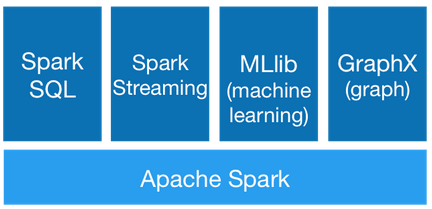
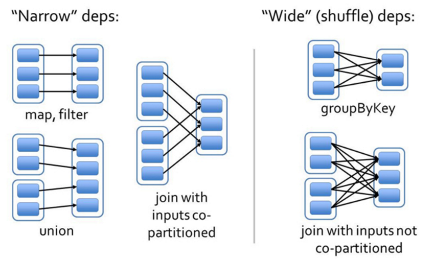
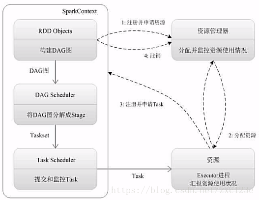

## 目录

[toc]

## 1 概述

Spark 是一种高效且多用途的集群计算平台。换句话说，Spark 是一种开源的，大规模数据处理引擎。它提供了一整套开发 API，包括流计算、机器学习和 SQL，支持批处理和流处理。

### 1.1 Spark 组件



Spark提供了6大组件：

- Spark Core

  Spark Core 是分布式处理大数据集的基础，提供内存计算能力。Spark Core 将分布式数据抽象为弹性分布式数据集（RDD），实现了应用任务调度、RPC、序列化和压缩，并为运行在其上的上层组件提供 API。

- Spark SQL

  Spark SQL 是操作结构化数据的程序包，允许使用 SQL 语句来查询数据。Spark 支持多种数据源，包括 Hive，Parquet 和 JSON。

- Spark Streaming

  Spark Streaming 支持处理动态数据流，还能开发出强大的交互和数据查询程序。

  【注】在处理动态数据流时，流数据会被分割成微小的批处理， 在 Spark Core 上按时间一个一个执行，且速度非常快。

- Spark MLlib

  Spark MLlib 封装了很多高效的机器学习算法，且在内存中处理数据，有效提高了数据迭代算法的性能。

- Spark GraphX

  Spark GraphX 是一个建立在 Spark 之上大规模图数据处理计算引擎。

* PySpark

  PySpark 是 Python 调用 Spark 的接口，允许以调用 Python API 的方式来编写 Spark 程序，支持大部分 Spark 组件和功能。

### 1.2 Spark 架构

#### 1.2.1 基本概念


* Application

  用户编写的 Spark 应用程序，包含了 Driver 程序及在集群上运行的程序代码，在物理机器上涉及 Driver，Master，Worker 三种节点。一个 Application 由一个 Driver 和若干个 Job 构成，一个 Job 由多个 Stage 构成，一个 Stage 由多个没有 Shuffle 关系的 Task 组成，相关概念下面会提到。

* Driver

  该结点运行 Application 的 main 函数并创建 `SparkContext`，准备 Spark 程序的运行环境，并在 Executor 完成时将其关闭。`SparkContext` 负责与 Cluster Manager 通信，进行资源申请、任务分配、监控。

* Worker

  集群中任何一个可以运行 Spark Application 代码的物理节点，可以在上面启动 Executor 进程。

* Executor

  每个 Worker 上会为某应用启动的一个 Executor 进程，它是一组计算资源（CPU 核心、内存）的集合，不同任务之间的 Executor 相互独立，共同分摊 Worker 结点的 CPU 和 memory。作为 Task 执行和监控的容器，它的主要职责是：

  - 初始化 Task 的执行环境 `SparkEnv`，解决应用程序需要的运行时依赖
  - 向 Cluster Manager 汇报当前的任务状态
  - 若 Application 代码里调用 RDD 的缓存函数（如 `cache()` 或 `persist()`），Executor 将会通过 Block Manager 给 Spark RDD 提供缓存机制

* Task

  Executor 上的工作单元，每个 Task 负责计算一个分区的数据。在 Spark 中有两类 Task：

  * `shuffleMapTask`

    输出为 shuffle 所需的数据，stage 的划分也以此为依据。

    例如操作 `rdd.map(x=>(x,1)).reduceByKey(_+_).foreach(println)` 有 reduce 需要 shuffle 过程，因而 `reduceByKey` 前后为不同的 stage。

  * `resultTask`

    输出为计算结果。

    例如操作 `rdd.parallize(1 to 10).foreach(println)` 没有 shuffle 直接输出结果，因而其 Task 为 `resultTask`，stage 也只有一个。

* Cluster Manager

  指在集群上获取资源的外部服务，目前有三种类型：

  * Standalone : Spark 原生的资源管理，由 Master 负责资源的分配

  * Apache Mesos : 与 Hadoop Map-Reduce 良好兼容的资源调度框架

  * Hadoop Yarn : 主要是指 Yarn 中的 Resource Manager

    客户端程序会向 Yarn 申请计算资源（CPU，内存等等），然后 Cluster Manager 通过调度告诉客户端可以使用，客户端就可以把程序送到每个 Worker 上面去执行（其中某个为 Driver）。

    当执行一个 Application 时，Driver 会向 Cluster Manager 申请资源，启动 Executor，并向 Executor 发送应用程序代码和文件，然后在 Executor 上执行 Task，运行结束后，执行结果会返回给 Driver，或者写到 HDFS 或者其它数据库中。

* RDD

  称为弹性分布式数据集（RDD, Resilient Distributed Dataset），是 Spark 中最基本的数据抽象，它代表一个不可变、可分区、里面的元素<u>可并行计算</u>的集合。

  RDD 的特性：

  * 内存计算 - RDD 运算是在内存中进行的，在内存足够的情况下，不会把中间结果存到磁盘，所以计算非常高效

  * 惰性求值 - RDD 转换操作会暂不执行，而只记录转换操作，直到 action 操作需返回数据给 Driver 时才执行
  * 容错性 - 在 RDD 失效或者数据丢失时，可以根据 DAG 从父 RDD 重新把数据集计算出来
  * 不变性 - RDD 是不可修改的，因而是进程安全的，可以随时创建、查询、缓存、共享和备份
  * 分区 - 分区是 RDD 并行计算的基础，每个分区是对数据集的逻辑划分，支持转换操作和创建新分区
  * 粗粒度 - 可通过 `map`、`filter`、`groupby` 等操作对 RDD 集体操作，而不只局限于某些数据集元素
  * 持久化 - RDD 允许用户在执行多个查询时显式地将工作集缓存在内存中，以方便重用、提升速度
  * 本地化 - Spark 会把计算程序调度到尽可能离数据近的地方运行，即 “移动数据不如移动计算”

  RDD 的属性：

  * 一组分区（Partition）

    数据集的基本组成单位，每个分区都会被一个计算任务处理，并决定并行计算的粒度。用户可以在创建 RDD 时指定分区个数，默认为 CPU 核心数目。

  * 一个计算函数（Compute）

    RDD 的计算是以分区为单位的，每个 RDD 都会实现 `compute` 函数以达到这个目的。`compute` 函数会对迭代器进行复合，不需要保存每次计算的结果。

  * 一个分区函数（Partitioner）

    Spark 中实现了两种类型的分片函数，一个是基于哈希的 `HashPartitioner`，另一个是基于范围的 `RangePartitioner`。

    只有 key-value 的 RDD 才会有 Partitioner，非 key-value 的 RDD 的 `Parititioner = None`。Partitioner 函数不但决定了 RDD 本身的分区数量，也决定了 `parentRDDShuffle` 输出时的分片数量。

  * 一个列表（存储每个 Partition 的存取优先位置）

    对于一个 HDFS 文件来说，这个列表保存的就是每个 Partition 所在的块的位置。按照 “移动数据不如移动计算” 的理念，Spark 在进行任务调度的时候，会尽可能地将计算任务分配到其所要处理数据块的存储位置。

  * 依赖关系

    RDD 的每次转换都会生成一个新的 RDD，所以 RDD 之间就会形成类似于流水线一样的前后依赖关系。在部分分区数据丢失时，Spark 可以通过这个依赖关系重新计算丢失的分区数据，无需全部计算。
    
    依赖关系有 “窄” 和 “宽” 之分：<u>窄依赖</u>指父 RDD 的每一个分区最多被一个子 RDD 的分区所用，<u>宽依赖</u>指子 RDD 的分区依赖于父RDD 的所有分区。
    
    

* DAG

  有向无环图，反映 RDD 之间的依赖关系。

* Job

  一个 Job 包含多个 RDD 及作用于相应 RDD 上的各种操作。用户提交的 Job 会提交给 DAG Scheduler，将 Job 分解成 Stage，Stage会细化成 Task（可见 Task 就是在一个分区上的单个数据处理流程）。

  

* Stage

  一个 Job 会分为多组 Task，每组 Task 被称为一个 Stage，是 Job 的基本调度单位。Stage 也被称为 Task Set，代表一组关联但无 Shuffle 依赖关系的 Task 集合。

【注1】Block 与 Partition 的区别

Block 是 HDFS 分布式存储的最小单元，Partition 是 Spark 弹性分布式数据集的最小单元。

Block 位于存储空间、Partition 位于计算空间；Block的大小是固定的、Partition大小是不固定的；Block 是有冗余的、不会轻易丢失，Partition（RDD）没有冗余设计、丢失之后重新计算得到。

【注2】与 Hadoop Map-Reduce 计算框架的比较

* 利用多线程来执行具体的任务减少任务的启动开销
* Executor 中有一个 `BlockManager` 存储模块，会将内存和磁盘共同作为存储设备，有效减少 IO 开销

#### 1.2.2 运行流程



1. 为应用构建起基本的运行环境，即由 Driver 创建一个 `SparkContext` 进行资源的申请、任务的分配和监控
2. 资源管理器为 Executor 分配资源，并启动 Executor 进程
3. `SparkContext` 根据 RDD 的依赖关系构建 DAG 图，DAG 图提交给 `DAGScheduler` 解析成 Stage，然后把一个个 `TaskSet` 提交给底层调度器 `TaskScheduler` 处理
4. Executor 向 `SparkContext` 申请 Task，`TaskScheduler` 将 Task 发放给 Executor 运行并提供应用程序代码
5. Task 在 Executor 上运行把执行结果反馈给 `TaskScheduler`，然后反馈给 `DAGScheduler`，运行完毕后写入数据并释放所有资源

### 1.3 安装与配置

#### 1.3.1 本地模式

以 Spark 2 版本为例：

到[官网](https://www.apache.org/)寻找并下载 Apache Spark tar 文件（没有安装 hadoop 的可以下载带 hadoop 的版本），并解压到指定目录。

```shell
tar -xzvf /home/例如/spark-2.4.1-bin-hadoop2.7.tgz
```

【注】官网的 spark 已经整合了 scalar 接口和 PySpark 接口，同理 `pip/conda` 安装的 PySpark 包也整合了 spark，择一即可。

打开 `~/.bashrc` 文件，按如下配置环境变量。

```shell
# Spark environment variables
export SPARK_HOME=/usr/local/spark2.4.1-bin-hadoop2.7
export PATH=$PATH:$SPARK_HOME/bin
# Spark support for python  # 获取所有 zip 文件路径   # 修改间隔符为: # 输出所有 zip 文件  # 要在最后加否则前面出错
export PYTHONPATH=$(ZIPS=("$SPARK_HOME"/python/lib/*.zip); IFS=:; echo "${ZIPS[*]}"):$PYTHONPATH
export PYSPARK_PYTHON=python3
# Hadoop classpath for "Hadoop free" spark version  # 这里直接执行 hadoop 命令获取 classpath
export SPARK_DIST_CLASSPATH=$(hadoop classpath)
```

修改保存后，更新环境变量，并进行测试。

```shell
$ source ~/.bashrc
$ spark-shell  # 测试 scalar 接口
$ pyspark      # 测试 python 接口
```

## 2 核心编程

### 2.1 运行环境

SparkContext 是 Spark 应用程序执行的入口，任何 Spark 应用程序最重要的一个步骤就是生成 SparkContext 对象。SparkContext 允许 Spark 应用程序通过资源管理器（Resource Manager，如 Spark Standalone，Yarn 或者 Apache Mesos）访问 Spark 集群。

#### 2.1.1 创建环境

先创建配置对象 `SparkConf`，然后在创建环境对象 `SparkContext` 时传入。

例：Scala 中创建环境

```scala
import org.apache.spark.SparkContext
import org.apache.spark.SparkConf

// Create spark conf object
val conf = new SparkConf().setAppName("WordCount").setMaster("local[*]")
// Create spark context object
val sc = new SparkContext(conf)
```

例：Python 中创建环境

```python
from pyspark import SparkConf
from pyspark import SparkContext

# Create spark conf object
conf = SparkConf().setAppName("WordCount").setMaster("local[*]")
# Create spark context object
sc = SparkContext.getOrCreate(conf)
```

【注1】`SparkContext` 是 Spark RDD API 的切入点，对于其他的 API 则需使用不同的 context（例如，Streaming 使用 `StreamingContext`；SQL 使用 `SqlContext`；Hive 使用 `HiveContext`）

【注2】随着 Dataset 和 DataFrame 的 API 渐成主流，Spark 2.0 开始引入了 `SparkSession` 对象，它为用户提供统一 `SqlContext` 和 `HiveContext` 的切入点。

#### 2.1.2 关闭环境

一个 JVM 只能运行一个 SparkContext，新建 SparkContext 前必须把旧的停掉：

```python
# Close spark context, for both scala and python
sc.stop()
```

Spark 成功停止后，会打印出类似的日志：`INFO SparkContext: Successfully stopped SparkContext`。

### 2.2 RDD 操作

#### 2.2.1 创建操作

##### 内存数据

```python
from pyspark import SparkContext
from pyspark import SparkConf

conf = SparkConf().setAppName("miniProject").setMaster("local[*]")
sc = SparkContext.getOrCreate(conf)

# 使用 sc.parallelize 可以把 Python list, NumPy array 或者 Pandas Series, Pandas DataFrame 转成 Spark RDD
rdd = sc.parallelize([1,2,3,4,5])
>>> rdd
Output: ParallelCollectionRDD[0] at parallelize at PythonRDD.scala:480
```

##### 外存数据

* 文本文件

  `textFile(String path)`

  ```python
  import os
  from pyspark import SparkContext
  from pyspark import SparkConf
  
  conf = SparkConf().setAppName("miniProject").setMaster("local[*]")
  sc = SparkContext.getOrCreate(conf)
  
  # 用 textFile 读取全路径指向的外存文件
  rdd = sc.textFile("file:\\\\\\" + os.getcwd() + "\\names\yob1880.txt")
  >>> rdd
  Output:file:\\\C:\Users\Yu\0JulyLearn\5weekhadoopspark\names\yob1880.txt MapPartitionsRDD[3] at textFile at NativeMethodAccessorImpl.java:0
  ```

* CSV 文件

  `csv(String path)`

  ```scala
  import org.apache.spark.sql.SparkSession
  def main(args: Array[String]):Unit = {
      object DataFormat {
          val spark =  SparkSession.builder.appName("AvgAnsTime").master("local").getOrCreate()
          val dataRDD = spark.read.csv("path/of/csv/file").rdd
          // ... ...
  ```

* JSON 文件

  `json(String path)`

其余初始化 RDD 的方法，包括：HDFS 上的文件、Hive 中的数据库与表、Spark SQL 得到的结果，这里暂时不做介绍。

#### 2.2.2 转换操作

Transformation 操作以 RDD 做为输入参数，输出一个或者多个 RDD，不会修改输入 RDD。需要注意，在 Action 操作执行之前， Transformation 都不会真正运行。

##### map 类操作

* `map(func)` - 将函数 `func` 作用于 RDD 的每个元素，其返回结果作为新 RDD 的对应元素，返回新 RDD

  ```python
  >>> nums = sc.parallelize([1,2,3,4])
  >>> new_nums = nums.map(lambda x: x*2)
  >>> for new_num in new_nums.take(4):
  ...     print new_num
  ...
  2
  4
  6
  8
  ```

* `flatMap(func)` - 将函数 `func` 作用于 RDD 的每个元素，其返回结果为迭代器，返回新 RDD

  ```scala
  scala> val string = sc.parallelize(List("i love you"))
  string: org.apache.spark.rdd.RDD[String] = ParallelCollectionRDD[5] at parallelize at <console>:27
  scala> val new_str = string.flatMap(line=>line.split(" "))
  new_str: org.apache.spark.rdd.RDD[String] = MapPartitionsRDD[6] at flatMap at <console>:29
  scala> new_str.take(3).foreach(println)
  i
  love
  you
  ```

  ```python
  >>> string = sc.parallelize(["i love you"])
  >>> new_str = string.flatMap(lambda str:str.split(" "))</span>
  >>> for str in new_str.take(3):
  ...     print str
  ... 
  i
  love
  you
  ```

* `filter(func)` - 将函数 `func` 作用于 RDD 的每个元素，其返回结果为布尔值，将为真的元素放入新 RDD 中，返回新  RDD

  ```scala
  scala> val string = sc.parallelize(List("i love you"))
  string: org.apache.spark.rdd.RDD[String] = ParallelCollectionRDD[7] at parallelize at <console>:27
  scala> string.first()
  res3: String = i love you
  scala> val new_str = string.filter(line =>line.contains("love"))
  new_str: org.apache.spark.rdd.RDD[String] = MapPartitionsRDD[6] at filter at <console>:23
  scala> new_str.foreach(println)
  I love you
  ```

  ```python
  >>> string = sc.parallelize(["i love you"])
  >>> new_str = string.filter(lambda line : "you" in line)
  >>> new_str.first()
  'i love you'
  ```

##### 集合操作

* `distinct()` - 对 RDD 里的元素进行去重，返回新 RDD

  ```scala
  scala> val num1 = sc.parallelize(List(1,2,3,3))
  num1: org.apache.spark.rdd.RDD[Int] = ParallelCollectionRDD[4] at parallelize at <console>:27
  scala> val num2 = num1.distinct()
  num2: org.apache.spark.rdd.RDD[Int] = MapPartitionsRDD[7] at distinct at <console>:29
  scala> num2.foreach(println)
  2
  3
  1
  ```

  ```python
  >>> nums1 = sc.parallelize([1,2,3,3])
  >>> nums1.count()
  4
  >>> nums2=nums1.distinct()
  >>> nums2.count()
  3
  ```

  【注】该操作的开销较大，因为它需要所有数据通过网络进行混洗。

* `rdd1.union(rdd2)` - 返回包含两个 RDD 所有元素的新 RDD

  ```scala
  scala> val num1 = sc.parallelize(List(1,2,3))
  num1: org.apache.spark.rdd.RDD[Int] = ParallelCollectionRDD[0] at parallelize at <console>:27
  scala> val num2 = sc.parallelize(List(4,5,6))
  num2: org.apache.spark.rdd.RDD[Int] = ParallelCollectionRDD[1] at parallelize at <console>:27
  scala> val num3 = num1.union(num2)
  mum3: org.apache.spark.rdd.RDD[Int] = UnionRDD[2] at union at <console>:31
  scala> num3.count()
  res1: Long = 6
  scala> num3.foreach(println)
  3
  1
  2
  4
  5
  6
  ```

  ```python
  >>> num1 = sc.parallelize([1,2,3])
  >>> num2 = sc.parallelize([4,5,6])
  >>> num3 = num1.union(num2)
  >>> for num in num3.take(6):
  ...     print num
  ... 
  1
  2
  3
  4
  5
  6
  ```

* `rdd1.intersection(rdd2)` - 返回包含两个 RDD 共同元素的新 RDD

  ```scala
  scala> val num1 = sc.parallelize(List(1,2,3,4))
  num1: org.apache.spark.rdd.RDD[Int] = ParallelCollectionRDD[9] at parallelize at <console>:27
  scala> val num2 = sc.parallelize(List(3,4,5,6))
  num2: org.apache.spark.rdd.RDD[Int] = ParallelCollectionRDD[10] at parallelize at <console>:27
  scala> val num3 = num1.intersection(num2)
  num3: org.apache.spark.rdd.RDD[Int] = MapPartitionsRDD[16] at intersection at <console>:31
  scala> num3.foreach(println)
  4
  3
  ```

  ```python
  >>> nums_1=sc.parallelize([1,2,3,4,5])
  >>> nums_2=sc.parallelize([3,4,5,6,7])
  >>> nums_3=nums_1.intersection(nums_2)
  >>> nums_3.count()
  >>> for num in nums_3.take(3):
  ...     print num
  ...
  3
  4
  5
  ```

* `rdd1.subtract(rdd2)` - 返回 `rdd1` 减去 `rdd2` 元素后的新 RDD

  ```scala
  scala> val num1 = sc.parallelize(List(1,2,3,4))
  num1: org.apache.spark.rdd.RDD[Int] = ParallelCollectionRDD[17] at parallelize at <console>:27
  scala> val num2 = sc.parallelize(List(3,4,5,6))
  num2: org.apache.spark.rdd.RDD[Int] = ParallelCollectionRDD[18] at parallelize at <console>:27
  scala> val num3 = num1.subtract(num2)
  num3: org.apache.spark.rdd.RDD[Int] = MapPartitionsRDD[22] at subtract at <console>:31
  scala> num3.foreach(println)
  2
  1
  ```

  ```python
  >>> nums_4 = nums_1.subtract(nums_2)
  >>> nums_4.count()
  2
  >>> for num in nums_4.take(2):
  ...     print num
  ...
  1
  2
  ```

* `rdd1.cartesian(rdd2)` - 求两个 RDD 的笛卡尔积，返回所有 `(a, b)` 对作为元素的新 RDD

  ```scala
  scala> val num1 = sc.parallelize(List(1,2,3,4))
  num1: org.apache.spark.rdd.RDD[Int] = ParallelCollectionRDD[23] at parallelize at <console>:27
  scala> val num2 = sc.parallelize(List(3,4,5,6))
  num2: org.apache.spark.rdd.RDD[Int] = ParallelCollectionRDD[24] at parallelize at <console>:27
  scala> val num3 = num1.cartesian(num2)
  num3: org.apache.spark.rdd.RDD[(Int, Int)] = CartesianRDD[25] at cartesian at <console>:31
  scala> num3.foreach(println)
  (1,3)
  (1,5)
  (1,6)
  (1,4)
  (2,3)
  (2,4)
  (3,3)
  (2,5)
  (2,6)
  (3,4)
  (3,6)
  (4,3)
  (3,5)
  (4,5)
  (4,4)
  (4,6)
  ```

  ```python
  >>> nums_5 = nums_1.cartesian(nums_2)
  >>> nums_5
  org.apache.spark.api.java.JavaPairRDD@5617ade8
  >>> nums_5.first()
  (1, 3)
  ```

* `sample(withReplacement,traction,[send])` - 对 RDD 采样以及是否转换

  ```scala
  scala> val num1 = sc.parallelize(List(1,2,3,4))
  num1: org.apache.spark.rdd.RDD[Int] = ParallelCollectionRDD[37] at parallelize at <console>:27
  scala> val num2 = num1.sample(false,0.5)
  num2: org.apache.spark.rdd.RDD[Int] = PartitionwiseSampledRDD[38] at sample at <console>:29
  scala> num2.foreach(println)
  2
  3
  ```

  ```python
  >>> nums = sc.parallelize([1,2,3,4,5,6,7])
  >>> new_nums = nums.sample(False,0.5)
  >>> new_nums
  PythonRDD[106] at RDD at PythonRDD.scala:43
  >>> new_nums.count()
  5
  >>> for n in new_nums.take(5):
  ...     print n
  ...
  1
  3
  5
  6
  7
  ```

#### 2.2.3 行动操作

Action 操作是数据执行部分。

##### reduce 操作

* `reduce(func)` - 将函数作用于 RDD 中的两两元素，返回一个同类型的元素

  ```scala
  scala> val num1 = sc.parallelize(List(1,2,3,4))
  num1: org.apache.spark.rdd.RDD[Int] = ParallelCollectionRDD[27] at parallelize at <console>:27
  scala> val num2 = num1.reduce((x,y)=>x+y)
  num2: Int = 10
  ```

  ```python
  >>> nums=sc.parallelize([1,2,3,4,5,6])
  >>> nums.reduce(lambda x,y:x+y)
  21
  ```

* `fold(init, func)` - 和 `reduce` 功能一样，但有初始值。解析见下面这个函数。

* `aggregate(init, seqOp, combOp)` - 和 `reduce` 功能一样，但有初始值且返回的 RDD 数据类型和原 RDD 不一样

  * `init` - 目标类型（即累加器型）的初始值
  * `seqOp` - 分区内合并值函数，把<u>新的累加器型值</u>与<u>旧的元素类型值</u>合并，返回累加器型值

  * `combOp` - 多分区合并组合器函数，把<u>新的累加器型值</u>与<u>新的累加器型值</u>合并，返回累加器型值

  该函数通过 `init` 设置返回类型的初始值，然后通过 `seqOp` 函数把 RDD 中的元素两两合并放入累加器，考虑到每个节点是在本地累加的，最终还需要通过 `combOp` 函数把累加器两两合并。

  ```scala
  scala> val num1 = sc.parallelize(List(1,2,3,4))
  num1: org.apache.spark.rdd.RDD[Int] = ParallelCollectionRDD[30] at parallelize at <console>:27
  scala> val result = num1.aggregate((0,0))(
       | (acc,value) => (acc._1 + value,acc._2+1),
       | (acc1,acc2) =>(acc1._1+acc2._1,acc1._2+acc2._2)
       | )
  result: (Int, Int) = (10,4)
  scala> val avg = result._1/result._2.toDouble
  avg: Double = 2.5
  ```

  ```python
  >>> nums = sc.parallelize([1,2,3,4])
  >>> sumCount = nums.aggregate( (0,0),
  ... (lambda acc,value:(acc[0]+value,acc[1]+1)),
  ... (lambda acc1,acc2:(acc1[0]+acc2[0],acc1[1]+acc2[1])))
  >>> sumCount[0]/float(sumCount[1])
  2.5
  ```

  【注】函数运作流程可参考 [单 RDD 转化](#单 RDD 转化) 中的 `combineByKey` 函数。

* `foreach(func)` - 对 RDD 每个元素都是使用 `func` 函数

  ```scala
  scala> def add(x:Int)={
       |  println (x+2)
       | }
  add: (x: Int)Unit
  scala> val num1 = sc.parallelize(List(1,2,3,4))
  num1: org.apache.spark.rdd.RDD[Int] = ParallelCollectionRDD[36] at parallelize at <console>:27
  scala> num1.foreach(add)
  6
  5
  3
  4
  ```

  ```python
  >>> nums = sc.parallelize([1,2,3])
  >>> def add(x):
  ...     print "\n","x+2:",x+2
  ... 
  >>> nums.foreach(add)
  x+2: 5
  x+2: 3
  x+2: 4
  ```

##### 统计操作

* `count()` - 统计 RDD 中元素的个数，返回一个整数

  ```scala
  scala> val num1 = sc.parallelize(List(1,2,3))
  num1: org.apache.spark.rdd.RDD[Int] = ParallelCollectionRDD[3] at parallelize at <console>:27
  scala> num1.count()
  res3: Long = 3
  ```

  ```python
  >>> nums = sc.parallelize([1,2,3,4])
  >>> nums.count()
  [Stage 0:>                                                          (0 +[Stage 0:>                                                          (0 +[Stage 0:==============>
   (1 +
   4
  ```

* `countByValue()` - 统计各元素在 RDD 中的出现次数

* `collect()` - 返回 RDD 中的所有元素，保存在一个新的数据结构中，用来持久化

  ```scala
  scala> val num2 = num1.collect()
  num2: Array[Int] = Array(1, 2, 3)
  scala> num2
  res4: Array[Int] = Array(1, 2, 3)
  ```

  ```python
  >>> new_nums = nums.collect()
  >>> new_nums
  [1, 2, 3, 4]
  ```

  【注】`collect` 不能用在大规模数据集上。

* `take(num)` - 用于取回 `num` 个值，可结合 map 使用以方便查看值

  ```scala
  scala> val nums = sc.parallelize(List(1,2,3,4))
  nums: org.apache.spark.rdd.RDD[Int] = ParallelCollectionRDD[4] at parallelize at <console>:27
  scala>nums.take(4).foreach(println)
  1
  2
  3
  4
  ```

  ```python
  >>> nums = sc.parallelize([1,2,3,4])
  >>> for num in nums.take(4):
  ...     print num
  ...
  1
  2
  3
  4
  >>> new_nums = nums.map(lambda x: x*2)
  >>> for new_num in new_nums.take(4):
  ...     print new_num
  ...
  2
  4
  6
  8
  ```

* `top(num)` - 从 RDD 中返回前边 `num` 个元素

  ```scala
  scala> val num1 = sc.parallelize(List(1,2,3,4))
  num1: org.apache.spark.rdd.RDD[Int] = ParallelCollectionRDD[31] at parallelize at <console>:27
  scala> num1.top(2)
  res10: Array[Int] = Array(4, 3)
  ```

  ```python
  >>> nums = sc.parallelize([1,2,3])
  >>> def add(x):
  ...     print "\n","x+2:",x+2
  ... 
  >>> nums.foreach(add)
  x+2: 5
  x+2: 3
  x+2: 4
  ```

* `takeSample(withReplacement, num, [send])` - 从 RDD 中返回任意一些元素

  ```scala
  scala> val num1 = sc.parallelize(List(1,2,3,4))
  num1: org.apache.spark.rdd.RDD[Int] = ParallelCollectionRDD[39] at parallelize at <console>:27
  scala> val num2 = num1.takeSample(false,2)
  num2: Array[Int] = Array(3, 4)
  ```

  ```python
  >>> nums = sc.parallelize([1,2,3,4,5,6,7])
  >>> new_nums= nums.takeSample(False,5)
  >>> new_nums
  [5, 3, 4, 6, 7]
  ```

#### 2.2.4 缓存操作

缓存操作把 RDD 计算的中间结果持久化到内存，以便在需要的时候重复使用，能有效减轻计算压力、提升运算性能。

* `rdd.persist()` - 可设置存储级别（见下），默认 `MEMORY_ONLY`

* `rdd.unpersist()` - 清除缓存

* `rdd.cache()` - 相当于 `persist(MEMORY_ONLY)`

RDD 的存储级别主要有以下几种：

| 级别                    | 使用空间 | CPU 时间 | 是否在内存中 | 是否在磁盘上 | 备注                                                         |
| ----------------------- | -------- | -------- | ------------ | ------------ | ------------------------------------------------------------ |
| `MEMORY_ONLY`           | 高       | 低       | 是           | 否           | 内存                                                         |
| `MEMORY_ONLY_2`         | 高       | 低       | 是           | 否           | 内存，数据存 2 份                                            |
| `MEMORY_ONLY_SER`       | 低       | 高       | 是           | 否           | 内存，数据序列化                                             |
| `MEMORY_ONLY_SER_2`     | 低       | 高       | 是           | 否           | 内存，数据序列化，数据存 2 份                                |
| `MEMORY_AND_DISK`       | 高       | 中等     | 部分         | 部分         | 内存 + 磁盘（内存不足将溢写到磁盘）                          |
| `MEMORY_AND_DISK_2`     | 高       | 中等     | 部分         | 部分         | 内存 + 磁盘，数据存 2 份                                     |
| `MEMORY_AND_DISK_SER`   | 低       | 高       | 部分         | 部分         | 内存 + 磁盘，数据序列化                                      |
| `MEMORY_AND_DISK_SER_2` | 低       | 高       | 部分         | 部分         | 内存 + 磁盘，数据序列化，数据存 2 份                         |
| `DISK_ONLY`             | 低       | 高       | 否           | 是           | 磁盘                                                         |
| `DISK_ONLY_2`           | 低       | 高       | 否           | 是           | 磁盘，数据存 2 份                                            |
| `OFF_HEAP`              |          |          |              |              | 试验型选项，<br/>类似 `MEMORY_ONLY_SER`，<br/>但是数据是存储在堆外内存的。 |

【注1】只能设置一种，不然会抛异常 `Cannot change storage level of an RDD after it was already assigned a level`。

【注2】选择合适的策略。性能最高的是默认的 `MEMORY_ONLY`，但若发生内存溢出，建议用 `MEMORY_ONLY_SER`；如果纯内存的级别都无法使用，建议用 `MEMORY_AND_DISK_SER`，因为数据量肯定大、一步到位序列化。

【注3】通常不建议使用 `DISK_ONLY` 和后缀为 `_2` 的级别。因为完全基于磁盘文件进行数据的读写，会导致性能急剧降低，有时设置不如重新计算一次 RDD；后缀为 `_2` 的级别，必须将所有数据都复制一份副本，并发送到其他节点上，数据复制以及网络传输会导致较大的性能开销，除非是要求作业的高可用性，否则不建议使用。

#### 2.2.5 键值对 RDD

Spark 为包含键值对类型的 RDD 提供了一些专有的操作，这些 RDD 被称为 PairRDD。

##### 创建 PairRDD

Spark 中有许多创建 PairRDD 的方式，很多存储键值对的数据格式会在读取时解析为 PairRDD，这里不做赘述。

此外，当需要把一个普通 RDD 转换为 PairRDD 时，可以调用 `rdd.map()` 函数。

<u>例：`map` 生成 PairRDD 实现 words count</u>

```scala
val lines = sc.textFile("data.txt")
val pairs = lines.map(s => (s, 1))
val counts = pairs.reduceByKey((a, b) => a + b)
```

```python
lines = sc.textFile("data.txt")
pairs = lines.map(lambda s: (s, 1))
counts = pairs.reduceByKey(lambda a, b: a + b)
```

##### 单 RDD 转化

* `reduceByKey(func)` - 合并具有相同 key 的 value

  ```scala
  scala> val pairs = sc.parallelize(List((1,2),(3,4),(3,6)))
  pairs: org.apache.spark.rdd.RDD[(Int, Int)] = ParallelCollectionRDD[7] at parallelize at <console>:29
  scala> val pair = pairs.reduceByKey((x,y)=>x+y)
  pair: org.apache.spark.rdd.RDD[(Int, Int)] = ShuffledRDD[9] at reduceByKey at <console>:30
  scala> println(pair.collect().mkString(","))
  (1,2),(3,10)
  ```

  ```scala
  >>> list = ['Hadoop','Spark','Hive','Hadoop','Kafka','Hive','Hadoop']
  >>> rdd = sc.parallelize(list)
  >>> pairRDD = rdd.map(lambda word:(word, 1))
  >>> pairRDD.reduceByKey(lambda a,b:a+b).foreach(print)
  [Stage 0:>                                                          (0 + 4) / 4]('Kafka', 1)
  ('Spark', 1)
  ('Hadoop', 3)
  ('Hive', 2)
  ```

* `groupByKey()` - 对具有相同 key 的 value 分组

  ```scala
  scala> val pair = pairs.groupByKey()
  pair: org.apache.spark.rdd.RDD[(Int, Iterable[Int])] = ShuffledRDD[10] at groupByKey at <console>:30
  scala> println(pair.collect().mkString(","))
  (1,CompactBuffer(2)),(3,CompactBuffer(4, 6))
  ```

  ```python
  >>> pairRDD.groupByKey()
  PythonRDD[10] at RDD at PythonRDD.scala:48
  >>> pairRDD.groupByKey().foreach(print)
  ('Spark', <pyspark.resultiterable.ResultIterable object at 0x7fcbd6448a58>)
  ('Hive', <pyspark.resultiterable.ResultIterable object at 0x7fcbcb74d9b0>)
  ('Hadoop', <pyspark.resultiterable.ResultIterable object at 0x7fcbcb74d9b0>)
  ('Kafka', <pyspark.resultiterable.ResultIterable object at 0x7fcbcb74dba8>)
  ```

* `mapValues(func)` - 对每个 value 应用一个函数，但不改变 key

  ```scala
  scala> val pair = pairs.mapValues(x =>x+1)
  pair: org.apache.spark.rdd.RDD[(Int, Int)] = MapPartitionsRDD[11] at mapValues at <console>:30
  scala> println(pair.collect().mkString(","))
  (1,3),(3,5),(3,7)
  ```

* `combineByKey(...)` - 使用不同的返回类型合并具有相同 key 的 value，每个参数分别对应聚合操作的各个阶段

  ```
  combineByKey(createCombiner, mergeValue, mergeCombiners, partitioner, mapSideCombine)
  combineByKey(createCombiner, mergeValue, mergeCombiners, partitioner)
  combineByKey(createCombiner, mergeValue, mergeCombiners)
  ```

  * `createCombiner` - 分区内创建组合函数
  * `mergeValue` - 分区内合并值函数
  * `mergeCombiners` - 多分区合并组合器函数
  * `partitioner` - 自定义分区数，默认为 `HashPartitioner`
  * `mapSideCombine` - 是否在 `map` 端进行 `Combine` 操作，默认为 `True`

  <u>工作流程</u>

  1. `combineByKey` 会遍历分区中的所有元素，因此每个元素的 key 要么没遇到过，要么和之前某个元素的 key 相同

  2. 如果这是一个新 key 元素，调用 `createCombiner` 创建该 key 对应的累加器初始值

  3. 如果这是一个旧 key 元素

     * 元素同分区：调用 `mergeValue` 把<u>旧 key 的累加器型 value</u> 与<u>新 key 的原始型 value</u> 合并

     * 元素跨分区：调用 `mergeCombiners` 把<u>旧 key 的累加器型 value</u> 与<u>新 key 的累加器型 value</u> 合并

  <u>例：统计男女个数</u>

  ```scala
  val conf = new SparkConf ().setMaster ("local").setAppName ("app_1")
  val sc = new SparkContext (conf)
  val people = List(("男", "李四"), ("男", "张三"), ("女", "韩梅梅"), ("女", "李思思"), ("男", "马云"))
  val rdd = sc.parallelize(people, 2)
  val result = rdd.combineByKey(
    (x: String) => (List(x), 1),  // createCombiner
    (peo: (List[String], Int), x : String) => (x :: peo._1, peo._2 + 1), // mergeValue
    (sex1: (List[String], Int), sex2: (List[String], Int)) => (sex1._1 ::: sex2._1, sex1._2 + sex2._2)) // mergeCombiners
  result.foreach(println)
  // 代码输出结果
  (男, ( List( 张三,  李四,  马云),3 ) )
  (女, ( List( 李思思,  韩梅梅),2 ) )
  ```

  

* `flatMapValues(func)` - 对每个 value 应用一个返回迭代器的函数 `func`，搭配原键生成多个同键异值对，通常用于符号化

  ```scala
  scala> val pair = pairs.flatMapValues(x =>(x to 5))
  pair: org.apache.spark.rdd.RDD[(Int, Int)] = MapPartitionsRDD[12] at flatMapValues at <console>:30
  scala> println(pair.collect().mkString(","))
  (1,2),(1,3),(1,4),(1,5),(3,4),(3,5)
  ```

* `sortByKey()` - 返回一个根据键排序的 RDD

  ```scala
  scala> val pair = pairs.sortByKey()
  pair: org.apache.spark.rdd.RDD[(Int, Int)] = ShuffledRDD[17] at sortByKey at <console>:30
  scala> println(pair.collect().mkString(","))
  (1,2),(3,4),(3,6)
  ```

* `keys()` - 获取所有 key

* `values()` - 获取所有 value

##### 双 RDD 转化

* `subtractByKey(other)` - 删掉 PairRDD 中键与 `other` 中的键相同的元素

  ```scala
  scala> val pair = pairs.subtractByKey(other)
  pair: org.apache.spark.rdd.RDD[(Int, Int)] = SubtractedRDD[19] at subtractByKey at <console>:32
  scala> println(pair.collect().mkString(","))
  (1,2)
  ```

* `join(other)` - 对两个 RDD 进行内连接

  ```scala
  scala> val pair = pairs.join(other)
  pair: org.apache.spark.rdd.RDD[(Int, (Int, Int))] = MapPartitionsRDD[22] at join at <console>:32
  scala> println(pair.collect().mkString(","))
  (3,(4,9)),(3,(6,9))
  ```

* `rightOuterJoin(other)` - 对两个 RDD 进行连接操作，确保第一个 RDD 的键存在（右外连接）

  ```scala
  scala> val pair = pairs.rightOuterJoin(other)
  pair: org.apache.spark.rdd.RDD[(Int, (Option[Int], Int))] = MapPartitionsRDD[25] at rightOuterJoin at <console>:32
  scala> println(pair.collect().mkString(","))
  (3,(Some(4),9)),(3,(Some(6),9))
  ```

* `leftOuterJoin(other)` - 对两个 RDD 进行连接操作，确保第二个 RDD 的键必须存在（左外连接）

  ```scala
  scala> val pair = pairs.leftOuterJoin(other)
  pair: org.apache.spark.rdd.RDD[(Int, (Int, Option[Int]))] = MapPartitionsRDD[28] at leftOuterJoin at <console>:32
  scala> println(pair.collect().mkString(","))
  (1,(2,None)),(3,(4,Some(9))),(3,(6,Some(9)))
  ```

* `cogroup(other)` - 将两个 RDD 中相同 key 的数据分组到一起

  ```scala
  scala> val pair = pairs.cogroup(other)
  pair: org.apache.spark.rdd.RDD[(Int, (Iterable[Int], Iterable[Int]))] = MapPartitionsRDD[30] at cogroup at <console>:32
  scala> println(pair.collect().mkString(","))
  (1,(CompactBuffer(2),CompactBuffer())),(3,(CompactBuffer(4, 6),CompactBuffer(9)))
  ```

## 3 数据源

### 3.1 PyArrow

### 3.2 Parquet

教程：https://juejin.cn/post/6844903462572916743

读写：https://arrow.apache.org/docs/python/parquet.html#finer-grained-reading-and-writing
