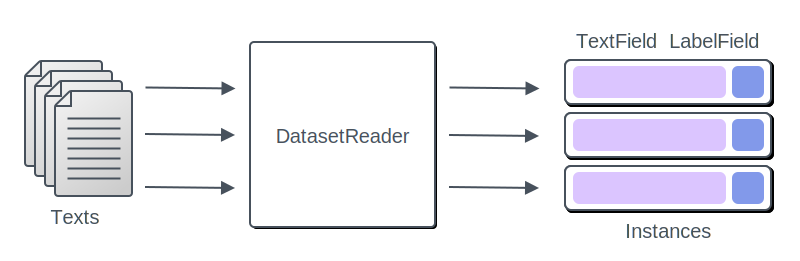
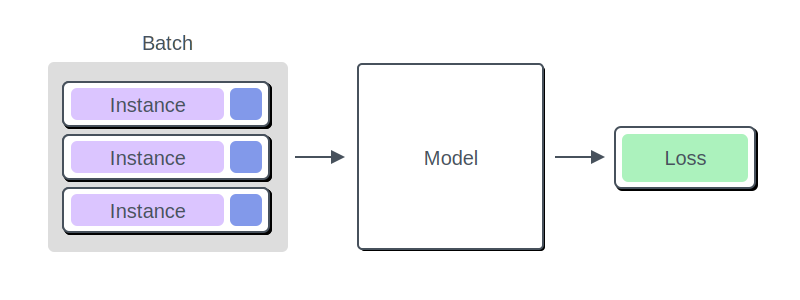
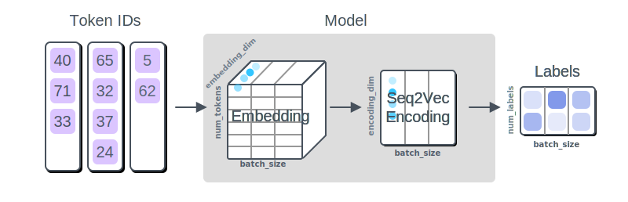

## 目录
[toc]

## 1 AllenNLP
AllenNLP 强大的 NLP 处理工具，它是在 PyTorch 基础上的封装，能够帮助减少 NLP 中很多额外的工作。

### 1.1 模型构建

#### 1.1.1 数据单元

**数据结构**

在 AllenNLP 中，一个样本表示为：

* `Instance` - 样本类，它的实例对象表示样本
  * `Fields` - 样本类对象的子对象，表示数据，将会转换为 Tensor 输入到模型中

一个样本的伪代码示例：

```python
Instance {
    # Input
    text: TextField
    # Output
    label: LabelField
}
```

**`DatasetReader`**

AllenNLP 使用 `DatasetReader` 类处理原始数据文件到 `Instance` 的问题。



```python
@DatasetReader.register('classification-tsv')						# 0 注册（config 方法会用，后面讲）
class ClassificationTsvReader(DatasetReader):  						# 1 继承 DatasetReader 类
    def __init__(self):
        self.tokenizer = SpacyTokenizer()  							# 分词器，对输入按照规则进行分词
        self.token_indexers = {'tokens': SingleIdTokenIndexer()}  	# 编号器，对分出来的词进行编号，文字转为数字

    def _read(self, file_path: str) -> Iterable[Instance]:  		# 2 必须重写 _read 函数（读取文件，生成 Instance）
        with open(file_path, 'r') as lines:  												# 2.1 读取文件
            for line in lines:
                text, label = line.strip().split('\t')  									# 2.2 提取数据
                text_field = TextField(self.tokenizer.tokenize(text), self.token_indexers)  # 2.3 封装成 TextField
                label_field = LabelField(label)  											# 2.3 封装成 LabelField
                fields = {'text': text_field, 'label': label_field}  						# 2.4 制作 dict，用于建立 Instance
                yield Instance(fields)
                
reader = ClassificationTsvReader()
reader.read(file)  													# 3 read() 内部调用 _read() 函数，返回一个 Instance
```

【注1】这里的 Instance 初始化字典中的键名，会用作后面模型获取数据时的参数名。

#### 1.1.2 模型单元

AllenNLP 使用 `Model` 类处理 `Instance` 到 `loss` 的问题。



**模型结构**



* 句子分词和编号
  * 将字符串转换为 token id，这一步在数据单元已经完成

* embedding
  * 将 token id 转换为词向量（词语序列 $\rightarrow$ 词向量序列）

* encoder
  * 对词向量进行压缩，得到句子级特征（词向量序列 $\rightarrow$ 词向量）

* 计算类别分布
  * 模型的训练与预测

**`Model`**

`Model` 的工作与 PyTorch 模块一样，实现 `forward` 方法输出 `output_dict`，然后根据其中的 `loss` 值优化模型。

(1) 模型构造

```python
@Model.register('simple_classifier')  												# 0 注册（config 方法会用，后面讲）
class SimpleClassifier(Model):
    def __init__(self,
                 vocab: Vocabulary,  												# 1 词库，含有 token 到 token id 的映射
                 embedder: TextFieldEmbedder,  										# 2 词嵌入模型，用于 embedding 操作
                 encoder: Seq2VecEncoder):  										# 3 编码模型，用于 encoder 操作
        super().__init__(vocab)
        self.embedder = embedder  														# 2.1 指定词嵌入模型
        self.encoder = encoder  														# 3.1 指定编码模型
        num_labels = vocab.get_vocab_size("labels")  									# 1.1 词库用法，获取 labels 空间大小
        self.classifier = torch.nn.Linear(encoder.get_output_dim(), num_labels)  	# 4 分类器，用于处理得到最终输出
```

【注1】参数的 `type annotations` 用于 config 方法构造模型。

【注2】词库 `Vocalulary` 对象在 `DatasetReader` 读取数据后创建，在 `Model` 创建时传入。

【注3】`classfier` 不使用外部传参，因为模型简单，所涉及的参数能够在模型内得到

(2) 模型传播

```python
class SimpleClassifier(Model):
    def forward(self,  												# 1 Instance 数据传入
                text: TextFieldTensors,  								# 1.1 数据，与 DatasetReader 的键名一致
                label: torch.Tensor) -> Dict[str, torch.Tensor]:  		# 1.2 数据，类型为对应 Field 输出类型
        # Shape: (batch_size, num_tokens, embedding_dim)
        embedded_text = self.embedder(text)  						# 2 词嵌入
        # Shape: (batch_size, num_tokens)  							# 3 编码
        mask = util.get_text_field_mask(text)  							# 3.1 从 TextField 中获取 padding mask
        # Shape: (batch_size, encoding_dim)
        encoded_text = self.encoder(embedded_text, mask)  				# 3.2 带 mask 编码
        # Shape: (batch_size, num_labels)  							# 4 分类输出
        logits = self.classifier(encoded_text)  						# 4.1 分类，获得 logits
        # Shape: (batch_size, num_labels)
        probs = torch.nn.functional.softmax(logits)  					# 4.2 softmax，获得概率分布
        # Shape: (1,) (loss 的)
        output = {
            "probs": probs,
            "loss": torch.nn.functional.cross_entropy(logits, label)  	# 4.3 计算损失
        }
        return output													# 4.4 返回 output_dict，可添加自定义内容
```

### 1.2 模型训练

首先，再写一遍 `DatesetReader` 和 `Model` 的构建方式，这次是基于一个案例。

```python
from typing import Dict, Iterable, List
from allennlp.data import DatasetReader, Instance
from allennlp.data.fields import Field, LabelField, TextField
from allennlp.data.token_indexers import TokenIndexer, SingleIdTokenIndexer
from allennlp.data.tokenizers import Token, Tokenizer, WhitespaceTokenizer

@DatasetReader.register("classification-tsv")  # 此装饰器只在用配置训练的方式时出现
class ClassificationTsvReader(DatasetReader):
    def __init__(
        self,
        tokenizer: Tokenizer = None, token_indexers: Dict[str, TokenIndexer] = None, max_tokens: int = None, **kwargs
    ):
        super().__init__(**kwargs)
        self.tokenizer = tokenizer or WhitespaceTokenizer()  # 增加了自定义，所以构造函数有传参
        self.token_indexers = token_indexers or {"tokens": SingleIdTokenIndexer()}
        self.max_tokens = max_tokens

    def _read(self, file_path: str) -> Iterable[Instance]:
        with open(file_path, "r") as lines:
            for line in lines:
                text, sentiment = line.strip().split("\t")
                tokens = self.tokenizer.tokenize(text)
                if self.max_tokens:
                    tokens = tokens[: self.max_tokens]
                text_field = TextField(tokens, self.token_indexers)
                label_field = LabelField(sentiment)
                fields: Dict[str, Field] = {"text": text_field, "label": label_field}
                yield Instance(fields)

dataset_reader = ClassificationTsvReader(max_tokens=64)
instances = list(dataset_reader.read("quick_start/data/movie_review/train.tsv"))

# 测试代码
for instance in instances[:10]:
    print(instance)
```

```python
from allennlp.models import Model
from allennlp.modules import TextFieldEmbedder, Seq2VecEncoder
from allennlp.modules.text_field_embedders import BasicTextFieldEmbedder
from allennlp.modules.token_embedders import Embedding
from allennlp.modules.seq2vec_encoders import BagOfEmbeddingsEncoder
from allennlp.nn import util

@Model.register("simple_classifier")  # 此装饰器只在用配置训练的方式时出现
class SimpleClassifier(Model):
    def __init__(
        self, vocab: Vocabulary, embedder: TextFieldEmbedder, encoder: Seq2VecEncoder
    ):
        super().__init__(vocab)
        self.embedder = embedder
        self.encoder = encoder
        num_labels = vocab.get_vocab_size("labels")  # 输出维度
        self.classifier = torch.nn.Linear(encoder.get_output_dim(), num_labels)

    def forward(
        self, text: TextFieldTensors, label: torch.Tensor
    ) -> Dict[str, torch.Tensor]:
        # Shape: (batch_size, num_tokens, embedding_dim)
        embedded_text = self.embedder(text)
        # Shape: (batch_size, num_tokens)
        mask = util.get_text_field_mask(text)
        # Shape: (batch_size, encoding_dim)
        encoded_text = self.encoder(embedded_text, mask)
        # Shape: (batch_size, num_labels)
        logits = self.classifier(encoded_text)
        # Shape: (batch_size, num_labels)
        probs = torch.nn.functional.softmax(logits, dim=-1)
        # Shape: (1,) (loss 的)
        output = {
            "probs": probs,
            "loss": torch.nn.functional.cross_entropy(logits, label)
        }
        return output
```

#### 1.2.1 自写训练单元

AllenNLP 使用 `Trainer` 类来对模型进行反向传播和训练，它连接必要的元素，然后执行训练循环。

```python
import tempfile
import torch
import allennlp
from allennlp.data import (
    DataLoader,
    DatasetReader,
    Instance,
    Vocabulary,
    TextFieldTensors,
)
from allennlp.data.data_loaders import SimpleDataLoader
from allennlp.training.trainer import GradientDescentTrainer, Trainer
from allennlp.training.optimizers import AdamOptimizer

def run_training_loop():
    # 1 数据
    dataset_reader = ClassificationTsvReader()  										# 1.1 创建 DatesetReader 对象
    print("Reading data")  																# 1.2 读取数据
	train_data = list(dataset_reader.read("quick_start/data/movie_review/train.tsv"))
    dev_data = list(dataset_reader.read("quick_start/data/movie_review/dev.tsv"))

    # 2 模型
    vocab = Vocabulary.from_instances(train_data + dev_data)  							# 2.1 建立词库
    vocab_size = vocab.get_vocab_size("tokens")  # 输入维度
    embedder = BasicTextFieldEmbedder(
        {"tokens": Embedding(embedding_dim=10, num_embeddings=vocab_size)}  			# 2.2 建立 embedder
    )
    encoder = BagOfEmbeddingsEncoder(embedding_dim=10)  								# 2.3 建立 encoder
    model = SimpleClassifier(vocab, embedder, encoder)  								# 2.4 创建 Model 对象

    # 3 训练
    train_loader = SimpleDataLoader(train_data, 8, shuffle=True).index_with(vocab)  	# 3.1 创建批数据读取器
    dev_loader = SimpleDataLoader(dev_data, 8, shuffle=False).index_with(vocab)
    # You obviously won't want to create a temporary file for your training
    # results, but for execution in binder for this guide, we need to do this.
    with tempfile.TemporaryDirectory() as serialization_dir:
        parameters = [(n, p) for n, p in model.named_parameters() if p.requires_grad]  	# 3.2 获取命名带训练参数
        optimizer = AdamOptimizer(parameters)  											# 3.3 对参数建立优化器
        trainer = GradientDescentTrainer(  												# 3.4 对优化器建立训练器
            model=model,
            serialization_dir=serialization_dir,
            data_loader=train_loader,
            validation_data_loader=dev_loader,
            num_epochs=5,  # 迭代 5 次
            optimizer=optimizer,
        )
        trainer.train()  # 3.5 训练

    return model, dataset_reader

run_training_loop()
```

#### 1.2.2 配置训练单元

在自写训练的方式中，函数 `run_training_loop` 的大部分操作都是机械的，因此 AllenNLP 使用支持内建脚本来完成这些事情，这样唯一需要写的代码就只有  `DatesetReader` 和 `Model`。

**配置**

AllenNLP 通过将 JSON 对象中的键按名称与构造函数参数匹配来读取配置文件，因此这里的**键必须与这些参数完全匹配**，否则会出现 `ConfigurationError`。

```python
config = {  																			# 1 配置文件
    "dataset_reader": {  																	# 1.1 DatasetReader 配置
        "type": "classification-tsv",								# 所属子类
        "token_indexers": {"tokens": {"type": "single_id"}},		# 参数
    },
    "train_data_path": "quick_start/data/movie_review/train.tsv",
    "validation_data_path": "quick_start/data/movie_review/dev.tsv",
    "model": {  																			# 1.2 Model 配置
        "type": "simple_classifier",
        "embedder": {
            "token_embedders": {"tokens": {"type": "embedding", "embedding_dim": 10}}
        },
        "encoder": {"type": "bag_of_embeddings", "embedding_dim": 10},
    },
    "data_loader": {"batch_size": 8, "shuffle": True},  									# 1.3 DataLoader 参数
    "trainer": {"optimizer": "adam", "num_epochs": 5},  									# 1.4 Trainer 参数
}


with tempfile.TemporaryDirectory() as serialization_dir:
    config_filename = serialization_dir + "/training_config.json"
    with open(config_filename, "w") as config_file:
        json.dump(config, config_file)  # 将上面的配置 JSON 序列化为 config_file 文件
        
    from allennlp.commands.train import train_model_from_file
    # Instead of this python code, you would typically just call
    # allennlp train [config_file] -s [serialization_dir]
    # allennlp train my_text_classifier.jsonnet -s model --include-package my_text_classifier
    train_model_from_file(
        config_filename, serialization_dir, file_friendly_logging=True, force=True  	# 2 读取配置，训练模型
    )
```

【注1】AllenNLP 需要 `type` 键来确定所创建的对象：引入 `type` 键，值为 `Model.register` 注册的参数。

【注2】`model` 配置同样也没有指定 `Vocabulary`，因为这是由数据创建然后传入模型的。

**运行**

有了这些配置文件之后，就可以运行以下命令来训练模型。

```shell
allennlp train [config.json] -s [serialization_directory]
```

【注】为了让模型识别出 `Model.register` 装饰的内容，**必须保证该函数运行**。可以在命令添加参数 `--include-package [my_python_module]` 或者使用 AllenNLP 的插件函数（plugin functionality）。

### 1.3 模型评价

AllenNLP 引入抽象类 `Metric` 来为训练过程提供关于计算度量的函数。

```python
from allennlp.models import Model
from allennlp.modules import TextFieldEmbedder, Seq2VecEncoder
from allennlp.modules.text_field_embedders import BasicTextFieldEmbedder
from allennlp.modules.token_embedders import Embedding
from allennlp.modules.seq2vec_encoders import BagOfEmbeddingsEncoder
from allennlp.nn import util
from allennlp.training.metrics import CategoricalAccuracy

@Model.register("simple_classifier")  # 此装饰器只在用配置训练方式时出现
class SimpleClassifier(Model):
    def __init__(
        self, vocab: Vocabulary, embedder: TextFieldEmbedder, encoder: Seq2VecEncoder
    ):
        super().__init__(vocab)
        self.embedder = embedder
        self.encoder = encoder
        num_labels = vocab.get_vocab_size("labels")  # 输出维度
        self.classifier = torch.nn.Linear(encoder.get_output_dim(), num_labels)
        self.accuracy = CategoricalAccuracy()  										# 1 创建 Metric 示例

    def forward(
        self, text: TextFieldTensors, label: torch.Tensor
    ) -> Dict[str, torch.Tensor]:
        # Shape: (batch_size, num_tokens, embedding_dim)
        embedded_text = self.embedder(text)
        # Shape: (batch_size, num_tokens)
        mask = util.get_text_field_mask(text)
        # Shape: (batch_size, encoding_dim)
        encoded_text = self.encoder(embedded_text, mask)
        # Shape: (batch_size, num_labels)
        logits = self.classifier(encoded_text)
        # Shape: (batch_size, num_labels)
        probs = torch.nn.functional.softmax(logits, dim=-1)
        # Shape: (1,)
        output = {"probs": probs}
        output["loss"] = torch.nn.functional.cross_entropy(logits, label)
        self.accuracy(logits, label)  												# 2 每个前馈步骤更新度量
        return output
    
    def get_metrics(self, reset: bool = False) -> Dict[str, float]:  				# 3 实现 get_metrics 方法
        return {"accuracy": self.accuracy.get_metric(reset)}  # reset 参数表示是否重置跟踪内容
```

在运行完训练程序之后，抽取测试数据，使用 `evaluate` 函数允许模型，获得测试集上的度量。

```python
# We've copied the training loop from an earlier example, with updated model code,
# above in the Setup section. We run the training loop to get a trained model.
model, dataset_reader = run_training_loop()

# Now we can evaluate the model on a new dataset.
test_data = list(dataset_reader.read("quick_start/data/movie_review/test.tsv"))
data_loader = SimpleDataLoader(test_data, batch_size=8)
data_loader.index_with(model.vocab)

results = evaluate(model, data_loader)
print(results)
```

如果用命令行运行，可以使用以下命令：

```shell
allennlp evaluate
```

### 1.4 模型预测

#### 1.4.1 数据单元修改

将 `tokens` 和 `label` 到 `Instance` 的步骤抽取为一个 `text_to_instance` 函数，目的是建立两条管线，支持有 `label` 和 无 `label` 的 `Instance` 生成。

```python
@DatasetReader.register('classification-tsv')
class ClassificationTsvReader(DatasetReader):
    def __init__(self,
                 lazy: bool = False,
                 tokenizer: Tokenizer = None,
                 token_indexers: Dict[str, TokenIndexer] = None):
        super().__init__(lazy)
        self.tokenizer = tokenizer or WhitespaceTokenizer()
        self.token_indexers = token_indexers or {'tokens': SingleIdTokenIndexer()}

    def text_to_instance(self, text: str, label: str = None) -> Instance:  				# 1 抽取函数
        text_field = TextField(self.tokenizer.tokenize(text), self.token_indexers)
        fields = {'text': text_field}  														# 1.1 构建 text
        if label:
            fields['label'] = LabelField(label)  											# 1.2 依条件构建 label
        return Instance(fields)

    def _read(self, file_path: str) -> Iterable[Instance]:
        with open(file_path, 'r') as lines:
            for line in lines:
                text, sentiment = line.strip().split('\t')
                yield self.text_to_instance(text, sentiment)  							# 2 函数调用
```

#### 1.4.2 模型单元修改

同样，将 `label` 参数设置为可选的，然后根据其有无来支持度量计算和损失计算。

```python
class SimpleClassifier(Model):
    def forward(self,
                text: Dict[str, torch.Tensor],
                label: torch.Tensor = None) -> Dict[str, torch.Tensor]:  	# 1 将 label 参数设置为可选的
        # Shape: (batch_size, num_tokens, embedding_dim)
        embedded_text = self.embedder(text)
        # Shape: (batch_size, num_tokens)
        mask = util.get_text_field_mask(text)
        # Shape: (batch_size, encoding_dim)
        encoded_text = self.encoder(embedded_text, mask)
        # Shape: (batch_size, num_labels)
        logits = self.classifier(encoded_text)
        # Shape: (batch_size, num_labels)
        probs = torch.nn.functional.softmax(logits)
        output = {'probs': probs}
        if label is not None:  												# 2 依条件计算度量和损失
            self.accuracy(logits, label)
            # Shape: (1,)
            output['loss'] = torch.nn.functional.cross_entropy(logits, label)
        return output
```

#### 1.4.3 预测单元

AllenNLP 提供 `Predictor` 类进行预测，它是已训练模型的一个封装。

```python
@Predictor.register("sentence_classifier")  						# 0 注册（config 方法会用，后面讲）
class SentenceClassifierPredictor(Predictor):  						# 1 继承 Predictor 类
    def predict(self, sentence: str) -> JsonDict:  					# 2 重写 predict 方法
        # This method is implemented in the base class.
        return self.predict_json({"sentence": sentence})  				# 2.1 predict_json 输入为 JsonDict，输出也是 JsonDict

    def _json_to_instance(self, json_dict: JsonDict) -> Instance:  	# 3 重写 _json_to_instance 方法
        sentence = json_dict["sentence"]  								# 3.1 获取一个例子的 json 表示
        return self._dataset_reader.text_to_instance(sentence)  		# 3.2 转换为 Instance 类型
    
# We've copied the training loop from an earlier example, with updated model
# code, above in the Setup section. We run the training loop to get a trained
# model.
model, dataset_reader = run_training_loop()  # 模型训练
vocab = model.vocab  # 抽出词库
predictor = SentenceClassifierPredictor(model, dataset_reader)  # 建立 Predictor

output = predictor.predict("A good movie!")
print(
    [
        (vocab.get_token_from_index(label_id, "labels"), prob)  # 根据 token id 逆映射会 token
        for label_id, prob in enumerate(output["probs"])
    ]
)
output = predictor.predict("This was a monstrous waste of time.")
print(
    [
        (vocab.get_token_from_index(label_id, "labels"), prob)
        for label_id, prob in enumerate(output["probs"])
    ]
)
```
