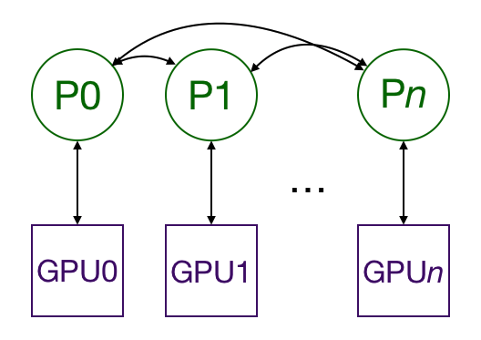
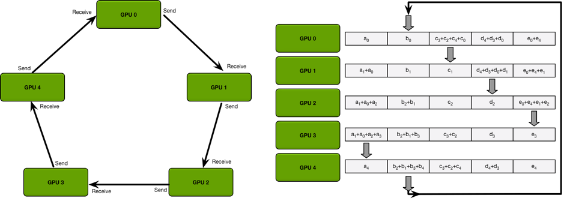

## 1 分布式训练

### 1.1 单机多卡

通过 `torch.nn.DataParallel` 实现单机多卡。

```python
# 1 设置要使用的 GPU
os.environ['CUDA_VISIBLE_DEVICES'] = '0,3'
# 2 模型并行
if torch.cuda.device_count() > 1:
    model = torch.nn.DataParallel(model)
    model = model.cuda()
# 3 数据转移
inputs = inputs.cuda()
labels = labels.cuda()
```

【注1】`torch.nn.DataParallel` 包装后如果想要获得之前 `model` 的函数就得用 `model.module.*`。

【注2】`torch.nn.DataParallel` 需要所有的GPU都在一个节点（一台机器）上，且并**不支持 Apex** 的混合精度训练。

【注3】目前，PyTorch 官方已经准备**逐渐放弃**对 `DataParallel` 的支持。而且受限于 Python 的 GIL，`DataParallel` 采用的多线程模型不能充分发挥多核性能。PyTorch 官方建议大家使用下面的 `DistributedDataParallel`（简称 DDP）。

### 1.2 多机多卡

通过 `torch.nn.DistributedParallel` 实现多机多卡。

#### 1.2.1 基本概念

`nn.DistributedDataParallel` 将 GPU 分成结点，每个结点是一台机器，每个机器有一至多个 GPU，每个 GPU 上建立一个进程，维护一个模型的副本。

训练过程中，每个进程单独加载不同的训练集的子集，进行前向传播并进行反向传播求解梯度。最后，所有进程开始互相通信，交换其他所有进程的梯度（All-Reduce Sum），并求平均。最后，每个进程都使用平均后的梯度更新自己的模型参数。由于每个进程更新的梯度都是一样的，所以在每次梯度更新后所有进程的模型参数都是一样的。



同步梯度的时候不像 DataParallel 那样在一张卡上计算更新梯度之后再将模型参数下发（Parameter Server 模型），这样不仅会造成某张卡负载更高，还有可能会因为传输过多碰到网络瓶颈。所以 DDP 采用了 Ring AllReduce 的方法，每张卡只和自己的邻居交换梯度。



> 比如 1 卡只会接收从 0 卡发来的梯度，只会发送梯度到 2 卡。同时，传输的时候会将数据分块，数据量为 D 的时候，N 个进程在最开始的 N-1 轮传输会发送和接收 D/N 的数据量，然后后面再用 N-1 轮，每个进程将每一块平均好的数据按照环形发送到下一个进程，同样是 D/N 的数据量。这样总共需要传输 2D*(N-1)/N 的数据量。可以看出，数据传输总量基本和 N 无关，所以用 DDP 有良好的扩展性，有钱任性开几百个进程训练数据传输都不会成为瓶颈。

DDP 里会碰到的概念（括号里是后面会用到的环境变量名称）：

- World Size（`WORLD_SIZE`）：总共有多少个进程参与训练，如果你有两台服务器，每台服务器有四张卡，那么 World Size 就是 2 x 4 = 8。
- Rank（`RANK`）：标识一个进程的序号，从 0 开始。按照上面例子的配置，第一台机器上的 0, 1, 2, 3 卡对应的进程序号就是 0, 1, 2, 3，第二台机器上 0, 1, 2, 3 对应的进程序号就是 4, 5, 6, 7。需要确保每个进程的序号没有重复。其中 0 号进程为主进程，负责一些同步操作的通信。
- Master Address（`MASTER_ADDR`）：标识主进程所在的机器 IP 或者主机名，例如 `10.0.0.1` 或者 `gpu-server1`，每一个进程都填一样的就可以了。假如你只有一台服务器的话，填 `127.0.0.1` 或者 `localhost` 也可以。
- Master Port（`MASTER_PORT`）：标识主进程应该监听哪一个端口，随便选择一个没有被占用的端口就好了，比如 23333、10086。一样是每个进程都填一样的就好了。
- Local Rank（`LOCAL_RANK`）：标识一个进程在本机上是第几个进程，不是必须的参数。可以简单理解为这个进程占用的是一台机器上的第几张卡。按照上面例子的配置，第一台机器上的 0, 1, 2, 3 卡对应的 Local Rank 就是 0, 1, 2, 3，第二台机器上 0, 1, 2, 3 对应的 Local Rank 就是 0, 1, 2, 3。可以看出，这个和 Rank 不同，是可以重复的，只用来标识这是一台机器的第几张卡。另外，假如你用了 `CUDA_VISIBLE_DEVICES` 的话，需要注意 Local Rank 就不一定和卡的序号相同了。比如你设定了 `CUDA_VISIBLE_DEVICES=2,3`，你的 Local Rank 分别应该设置成 0, 1。

#### 1.2.2 实现方法

##### 1.2.2.1 初始化进程组

在开始训练前（通常在 `parser.parse_args()` 之后），添加这么一行代码：

```python
torch.distributed.init_process_group(backend="nccl")
local_rank = int(os.getenv("LOCAL_RANK"), -1)
```

默认情况下，PyTorch 会读取上面提到的环境变量，尝试连接到主进程进行通信。一般多 GPU 训练使用 `nccl` 后端即可。

##### 1.2.2.2 设置使用的卡

初始化进程组后，设定本进程使用哪一张卡：

```python
torch.cuda.set_device(local_rank)
device = torch.device("cuda", local_rank)
```

##### 1.2.2.3 加载模型并转移到卡上

```python
model = torch.load("model.bin", map_location="cpu")
model.to(device)
```

这里使用 `map_location="cpu"` 的原因是避免不小心将模型加载到同一张卡上，因为 PyTorch 在保存模型的时候会同时保存这个模型在哪个设备上，一般来说只有主进程会保存，所以如果直接加载的话会将模型复制几遍加载到主进程的卡上，**分分钟爆显存**。

##### 1.2.2.4 使用 DDP 包装模型

直接使用 `DistributedDataParallel` 类包装即可。需要注意的是，如果使用混合精度训练，需要先用 `amp` 包装模型，再使用 DDP 包装模型：

```python
if fp16:
        try:
            from apex.optimizers import FusedAdam
            from apex import amp
        except ImportError:
            raise ImportError("Please install apex from https://www.github.com/nvidia/apex to use distributed and fp16 training.")

        optimizer = FusedSGD(model.parameters(),
                              lr=learning_rate)
        model, optimizer = amp.initialize(
            model,
            optimizers=optimizer,
            opt_level=fp16_opt_level,
            keep_batchnorm_fp32=False,
            loss_scale="dynamic" if loss_scale == 0 else args.loss_scale,
        )
model = DistributedDataParallel(model, device_ids=[local_rank], output_device=local_rank)
```

##### 1.2.2.5 包装数据集采样器

```python
train_dataset = TensorDataset() # 每个进程加载一样的数据集
train_sampler = DistributedSampler(train_dataset)
train_dataloader = DataLoader(train_dataset, sampler=train_sampler, batch_size=batch_size)
```

##### 1.2.2.6 训练

这一部分没有什么特别的，按照通常做法进行前向传播，反向传播，优化器更新参数即可。需要注意的是，为了保证每个进程采样过程随机数种子一样，需要在每个 Epoch 前设置 Sampler 的 Epoch：

```python
for epoch in range(num_train_epochs):
    train_sampler.set_epoch(epoch)
    for x, y in train_dataloader:
        x = x.to(device)
        y = y.to(device)
        outputs = model(x)
        loss = loss_fn(outputs, y)
        loss.backward()
        optimizer.step()
```

这样就完成了多卡训练代码的编写，下面看看怎么启动分布式训练。

##### 1.2.2.7 启动训练

**手动启动**

这里还是假设你有两台服务器，每台四张卡，分别叫 `gpu-server1` 和 `gpu-server2`。

在 `gpu-server1` 上：

```bash
export MASTER_ADDR=gpu-server1
export MASTER_PORT=10086
export WORLD_SIZE=8
RANK=0 LOCAL_RANK=0 python train.py
RANK=1 LOCAL_RANK=1 python train.py
RANK=2 LOCAL_RANK=2 python train.py
RANK=3 LOCAL_RANK=3 python train.py
```

在 `gpu-server2` 上：

```bash
export MASTER_ADDR=gpu-server1
export MASTER_PORT=10086
export WORLD_SIZE=8
RANK=4 LOCAL_RANK=0 python train.py
RANK=5 LOCAL_RANK=1 python train.py
RANK=6 LOCAL_RANK=2 python train.py
RANK=7 LOCAL_RANK=3 python train.py
```

PyTorch 的分布式训练进程会等待所有进程都准备完毕后才会继续往下执行，所以可以手动执行上面的脚本。

**使用 PyTorch 启动工具启动**

PyTorch 提供了一个 `torch.distributed.launch` 帮助我们启动进程。

在 `gpu-server1` 上：

```bash
export MASTER_ADDR=gpu-server1
export MASTER_PORT=10086
python -m torch.distributed.launch --use_env --nproc_per_node=4 --nnodes=2 --node_rank=0 --master_addr=$MASTER_ADDR --master_port=$MASTER_PORT train.py
```

在 `gpu-server2` 上：

```bash
export MASTER_ADDR=gpu-server1
export MASTER_PORT=10086
python -m torch.distributed.launch --use_env --nproc_per_node=4 --nnodes=2 --node_rank=1 --master_addr=$MASTER_ADDR --master_port=$MASTER_PORT train.py
```

其中 `--nproc_per_node` 指的是你每个服务器上想启动多少个进程，一般来说每个服务器有几张 GPU 就填几，`--nnodes` 表示你有几台服务器，`--node_rank` 指的是当前启动的是第几台服务器，从 0 开始。`--use_env` 表示 Local Rank 用 `LOCAL_RANK` 这个环境变量传参，如果不加这个选项，会在你的训练脚本之后额外添加一个 `--local_rank 0` 的命令行参数。最后，`--master_addr` 和 `--master_port` 分别表示分布式启动的地址和端口。

这个工具其实就是帮你计算 `WORLD_SIZE = nproc_per_node * nnodes`，然后执行一个循环，启动本机进程

```bash
for local_rank in range(nproc_per_node)
    RANK = nproc_per_node * node_rank + local_rank
    # 设置环境变量，启动训练进程
    subprocess.call(...)
```

这个脚本适合你的每台服务器上都有一样数量的卡，如果不是的话需要自己手动计算 Rank 和 World Size 按照第一种方法启动。

**通过 Slurm 启动**

如果你的服务器集群用 Slurm 作为作业管理软件，可以参考下面的 SBATCH 脚本来启动 PyTorch DDP 分布式训练：

```bash
#!/bin/bash
#SBATCH -N 2
#SBATCH --ntasks-per-node=1
#SBATCH -p gpu_v100
#SBATCH --output=joblog/R-%x.%j.out
#SBATCH --error=joblog/R-%x.%j.err

# Load anything you want
module load cudnn/7.6.4-CUDA10.1

export MASTER_ADDR=`/bin/hostname -s`
# 自动找一个空闲端口
export MASTER_PORT=`netstat -tan | awk '$1 == "tcp" && $4 ~ /:/ { port=$4; sub(/^[^:]+:/, "", port); used[int(port)] = 1; } END { for (p = 10000; p <= 65535; ++p) if (! (p in used)) { print p; exit(0); }; exit(1); }'`

srun run.slurm.sh
```

其中 `run.slurm.sh` 参考内容如下：

```bash
#!/bin/bash
python -m torch.distributed.launch \
  --nproc_per_node=4 \
  --nnodes=${SLURM_JOB_NUM_NODES} \
  --node_rank=${SLURM_NODEID} \
  --master_addr=${MASTER_ADDR} \
  --master_port=${MASTER_PORT} \
  train.py
```

这个其实就是用 `srun` 在每台服务器上执行启动脚本，脚本里传递 Slurm 的环境变量给启动工具。

[^ 参考]: 完整代码可以到 https://github.com/howardlau1999/pytorch-ddp-template 参考。

#### 1.2.3 案例演示

再处理一下流程：

PyTorch 通过 `torch.distributed.init_process_group()` 函数注册机器，实现不同结点上多个进程之间的同步和通信，它需要找到 `0` 号进程，然后即可找到所有进程。其原因在于，每个进程要求知道总进程数（`word_size`）、在所有进程中的阶序（`rank`）和所使用的 GPU 与数据。

##### 1.2.3.1 参数设置

```python
import os
import argparse

import torch.multiprocessing as mp

if __name__ == '__main__':

    parser = argparse.ArgumentParser()
    parser.add_argument('--nodes', default=1, type=int, help='Number of nodes')
    parser.add_argument('--gpus', default=1, type=int, help='Number of gpus per node')
    parser.add_argument('--node-rank', default=0, type=int, help='Ranking within the nodes')

    args.world_size = args.gpus * args.nodes			# 总进程数 = 总 GPU 数
    os.environ['MASTER_ADDR'] = '10.57.23.164'			# 0 号进程的 IP 地址，Multiprocessing 模块使用
    os.environ['MASTER_PORT'] = '8888'					# 0 号进程的 IP 端口，Multiprocessing 模块使用
    mp.spawn(train, nprocs=args.gpus, args=(args,))		# 每个结点上都执行，生产 args.gpus 个进程，每个进程运行 train(i, args)，
    													# i 从 0 到 args.gpus-1，表示当前结点上的 GPU / 进程序号。

    # ... 其他参数 ...
```

* `nodes` - 使用的结点数
* `gpus` - 当前结点的 GPU 数量
* `node_rank` - 当前结点的阶序 `rank`，这个值的取值范围是 `0` 到 `args.nodes - 1`

##### 1.2.3.2 并行设置

```python
import torch
import torch.nn as nn
import torch.distributed as dist

def train(gpu, args):
    rank = args.node_rank * args.gpus + gpu	# 进程全局阶序，范围从 0 到 args.gpus * args.nodes - 1
    dist.init_process_group(            	# 初始化进程并等待加入其他进程（内含 blocking，只有当所有进程都加入后,单个进程才会运行）
    	backend='nccl',                 	# nccl 后端（跑最快的那种）
   		init_method='env://',           	# 其他参数（IP 和端口等）查找位置 -> 全局变量 os.environ 列表中查找
    	world_size=args.world_size,     	# 总进程数，其实也可以设置为全局变量
    	rank=rank)           				# 进程全局阶序，其实也可以设置为全局变量

    # Model preparing code
    torch.manual_seed(0)
    model = ConvNet()
    torch.cuda.set_device(gpu)
    model.cuda(gpu)
    batch_size = 100
    criterion = nn.CrossEntropyLoss().cuda(gpu)
    optimizer = torch.optim.SGD(model.parameters(), 1e-4)

    model = nn.parallel.DistributedDataParallel(model, device_ids=[gpu])	# 模型并行化封装，这将把模型复制到各个 GPU 中

    # Data loading code
    train_dataset = torchvision.datasets.MNIST(root='./data', train=True, transform=transforms.ToTensor(),download=True)
    
    train_sampler = torch.utils.data.distributed.DistributedSampler(		# 并行化 Sampler，确保每个进程获取不同的数据切片
    	train_dataset,														# DataSet 对象
    	num_replicas=args.world_size,										# 总进程数，表示要分配多少份
    	rank=rank															# 进程全局阶序，表示当前分配的那份
    )

	train_loader = torch.utils.data.DataLoader(	# 当前进程的 DataLoader 对象
		dataset=train_dataset,
		batch_size=batch_size,					# 这里的 batch_size 是每个 GPU 的，总的批大小为 batch_size * world_szie 
		shuffle=False,            				# 分布式不能用正常方法 shuffle
		num_workers=0,							# 数据并行读取线程数
		pin_memory=True,
		sampler=train_sampler)    				# Sampler 对象
```

##### 1.2.3.3 并行启动

假设由 4 台机器，每个机器 8 个 GPU，于是有 4 个结点，每个结点 8 个 GPU。

在结点 0 上，执行

```shell
>> python src/mnist-distributed.py --node 4 --gpus 8 --node-rank 0
```

在其他结点 $i \in 1,2,3$ 上，执行

```shell
>> python src/mnist-distributed.py --node 4 --gpus 8 --node-rank i
```

【注】并行日志：在主函数中判断当前进程的 `rank` 数，并在指定的 `rank` 中写 `log` 之类的数据。

##### 1.2.3.4 其他并行相关

* 学习率：理论上多卡并行时学习率应该相应增加

## 2 混合精度训练

Apex 是一款由 Nvidia 开发的基于 PyTorch 的混合精度训练加速工具，能在不降低模型性能的情况下，将训练速度提升 **2～4 倍**，训练显存减少为原来的一半。

API 文档：https://nvidia.github.io/apex/index.html

### 2.1 安装

```shell
# windows 安装
# 到 https://github.com/NVIDIA/apex 下载 zip 解压
python setup.py install
```

```shell
# linux 安装（能获取最佳性能以及全部的功能体验）
$ git clone https://github.com/NVIDIA/apex
$ cd apex
$ pip install -v --no-cache-dir --global-option="--cpp_ext" --global-option="--cuda_ext" ./
```

可能的问题：`ERROR: compiler_compat/ld: cannot find -lpthread -lc`

解决方法：在 `apex` 文件夹下的 `setup.py` 文件中的 `ext_modules` 中添加

```
extra_link_args=['-L/usr/lib/x86_64-linux-gnu/']
```

### 2.2 简单用法

Apex 中主要有四个功能：

* `amp` - 用于混合精度计算，常用
* `parallel` - 用于分布式计算，其中 `DistributedDataParallel` 是对 PyTorch 官方分布式的包装复现
* `optimizers` - 目前仅提供 Adam 优化器的复现版本
* `normalization` - BatchNormalization 层的复现版本，可能有坑

#### 2.2.1 混合精度计算

##### 2.2.1.1 模板

它的使用方法简单，效果明显：

```python
from apex import amp
from apex.parallel import DistributedDataParallel as DDP

# ===== Your model
# Declare model and optimizer as usual, with default (FP32) precision
model = torch.nn.Linear(D_in, D_out).cuda()
optimizer = torch.optim.SGD(model.parameters(), lr=1e-3)

# ===== Initialization
# Allow Amp to perform casts as required by the opt_level
model, optimizer = amp.initialize(model, optimizer, opt_level="O1") # 这里是“欧一”，不是“零一”
model = DDP(model)  # apex 中的分布式，model = nn.parallel.DistributedDataParallel(model, device_ids=[gpu]) 改动如此

# ===== Train your model
...
# loss.backward() becomes:
with amp.scale_loss(loss, optimizer) as scaled_loss:
    scaled_loss.backward()
...

# ===== Save checkpoint
checkpoint = {
    'model': model.state_dict(),
    'optimizer': optimizer.state_dict(),
    'amp': amp.state_dict()
}
torch.save(checkpoint, 'amp_checkpoint.pt')
...

# ===== Restore
model = ...
optimizer = ...
checkpoint = torch.load('amp_checkpoint.pt')

model, optimizer = amp.initialize(model, optimizer, opt_level=opt_level)
model.load_state_dict(checkpoint['model'])
optimizer.load_state_dict(checkpoint['optimizer'])
amp.load_state_dict(checkpoint['amp'])

# ===== Continue training
...
```

##### 2.2.1.2 API

* `apex.amp.initialize(...)` - 初始化模型、优化器和 torch tensor 与函数空间，根据 `opt_level`

  * `models (torch.nn.Module or list of torch.nn.Modules)` - 修改/转换的模型

  * `optimizers (optional, torch.optim.Optimizer or list of torch.optim.Optimizers) ` - 修改/转换的优化器

  * `enabled (bool, optional, default=True)` - `False` 时渲染所有的 Amp 空操作（no-ops），此时脚本会像 Amp 不存在时一样（不使用混合精度）

  * `num_losses (int, optional, default=1)` - 提前告知 Amp 要使用的损失/反向传播的个数，增加稳定性

  * `opt_level (str)` - `amp.initialize` 中最关键的参数，一共有四种设置方式和效果：

    |         设置          |      O0       |    O1     |      O2       |      O3       |
    | :-------------------: | :-----------: | :-------: | :-----------: | :-----------: |
    |    cast_model_type    | torch.float32 |   None    | torch.float16 | torch.float16 |
    | patch_torch_functions |     False     |   True    |     False     |     False     |
    |  keep_batchnorm_fp32  |     None      |   None    |     True      |     False     |
    |    master_weights     |     False     |   None    |     True      |     False     |
    |      loss_scale       |      1.0      | “dynamic” |   “dynamic”   |      1.0      |

    总体来说，使用了 `O1` 和 `O2` 方式，可以将显存开销真真实实地降低了接近一半，但是速度嘛好像没有变化 ︿(￣︶￣)︿

  【注】使用 `amp.initialize` 前需要将 model 放在 GPU 上，通过 `.cuda()` 或者 `to(device)` 的方式，并且在此之前不能调用任何数据并行函数

* `apex.amp.scale_loss(loss, optimizers, loss_id=0, model=None, delay_unscale=False, delay_overflow_check=False)`

  上下文管理器，计算 `scaled_loss = (loss.float()) * current loss scale` 缩放损失函数以阻止梯度出现下溢，以便用户使用 `scaled_loss.backward()`

  * `loss (Tensor)` - 一般是一个标量 tensor
  * `optimizers` - optimizer 或 list of optimizers，能为反向传播创建梯度的所有优化器
  * `loss_id (int, optional, default=0)` - 取 `0-num_losses`，当与 `amp.initialize` 的 `num_losses` 一起使用时，能在不同的损失上用不同的精度
  * `model (torch.nn.Module, optional, default=None)` - 【暂未使用，保留以支持将来的优化】
  * `delay_unscale (bool, optional, default=False)` - 并不必须使用，强烈建议为 `False`
    * `True` 时 Amp 不会取消梯度缩放、不会在上下文退出时执行 model 到 master 的梯度复制
    * 【注】`delay_unscale=True` 是一个较小的忍者型性能优化，可能会导致奇怪的问题（尤其是多个模型/优化器/损失）

* `apex.amp.master_params(optimizer)` - 生成给定 `optimizaer` 的参数迭代器

  * `optimizer` - `amp.initialize` 返回的优化器

#### 2.2.2 模块结合使用

与 `transformers` 模块结合的示例：

```python
def train(trainset, evalset, model, tokenizer, model_dir, lr, epochs, device):
    optimizer = AdamW(model.parameters(), lr=lr)
    batch_size = 3
    # 每一个epoch中有多少个step可以根据len(DataLoader)计算：total_steps = len(DataLoader) * epoch
    total_steps = (len(trainset)) * epochs 
    scheduler = get_cosine_schedule_with_warmup(
        optimizer, num_warmup_steps=100, num_training_steps=total_steps)
    model, optimizer = amp.initialize(model, optimizer, opt_level="O1")
    lr_record = []
    for epoch in tqdm(range(epochs), desc="epoch"):
        train_loss, steps = 0, 0
        for batch in tqdm(trainset, desc="train"):
            batch = tuple(input_tensor.to(device) for input_tensor in batch if isinstance(input_tensor, torch.Tensor))
            input_ids, label, mc_ids = batch
            steps += 1
            model.train()
            loss, logits = model(input_ids=input_ids, mc_token_ids=mc_ids, labels=label)
            # loss.backward()
            with amp.scale_loss(loss, optimizer) as scaled_loss:
                scaled_loss.backward()
            train_loss += loss.item()
            torch.nn.utils.clip_grad_norm_(amp.master_params(optimizer), 5)
            # torch.nn.utils.clip_grad_norm_(model.parameters(), 5)
            optimizer.step()
            scheduler.step()
            optimizer.zero_grad()
            lr_record.append(scheduler.get_lr()[0])
            if steps % 500 == 0:
                print("step:%d  avg_loss:%.3f"%(steps, train_loss/steps))
        plot(lr_record)
        eval_res = evaluate(evalset, model, device)
        os.makedirs(model_dir, exist_ok=True)
        model_path = os.path.join(model_dir, "gpt2clsnews.model%d.ckpt"%epoch)
        model.save_pretrained(model_path)
        tokenizer.save_pretrained(os.path.join(model_dir,"gpt2clsnews.tokinizer"))
        logging.info("checkpoint saved in %s"%model_dir)
```

```python
# 可能的顺序问题处理
if self.args.fp16:
    try:
        from apex import amp
    except ImportError:
        raise ImportError(
            "Please install apex from https://www.github.com/nvidia/apex to enable fp16 training.")

    bert_model, optimizer = amp.initialize(model, optimizer, opt_level="O1", verbosity=1)
    # init apex amp

# init transformers scheduler
scheduler = get_linear_schedule_with_warmup(
    optimizer,
    num_warmup_steps=num_warmup_steps,
    num_training_steps=total_step,
)
```

### 2.3 动态损失放大策略

[apex 使用教程与梯度爆炸问题](https://blog.csdn.net/zjc910997316/article/details/103559837)

### 2.4 理论详解

[理论部分的详细讲解1](https://blog.csdn.net/gzq0723/article/details/105885088)

[理论部分的详细讲解2](https://blog.csdn.net/mrjkzhangma/article/details/100704397)

## 3 模型存取

### 3.1 模型保存和加载

#### 3.1.1 存储模型参数

这是一种**较为推荐**的保存方法，即**只保存模型的参数**，保存的模型文件会较小，而且比较灵活。但是当加载时，需要先实例化一个模型，然后通过加载将参数赋给这个模型的实例，也就是说加载的时候也需要知道模型的结构。

保存 `state_dict` 常用的格式是 `.pt` 或 `.pth` 的文件,即下面命令的` PATH = "./***.pt"`。

* 保存参数

  ```python
  torch.save(model.state_dict(), PATH)
  ```

* 加载参数

  ```python
  model = TheModelClass(*args, **kwargs)
  model.load_state_dict(torch.load(PATH))  # 不是文件路径，是基于 torch.save() 和 torch.load() 的
  model.eval()
  ```

* 仅加载一层参数

  ```python
  model = TheModelClass(*args, **kwargs)
  model.conv1.weight = torch.load(PATH)['conv1.weight']
  model.eval()
  ```

【注】如果加载出来的模型**用于验证**，不要忘了使用 `model.eval()` 方法，它会丢弃 dropout、normalization 等层，因为这些层不能在inference 的时候使用，否则得到的推断结果不一致。

#### 3.1.2 存储整个模型

这种方式不仅保存、加载模型的数据，也**包括模型的结构**，因此存储的文件会较大。但好处是加载时不需要提前知道模型的结构。

* 保存模型

  ```python
  torch.save(model, PATH)
  ```

* 加载模型

  ```python
  model = torch.load(PATH)
  model.eval()
  ```

【注】同样的，如果加载的模型用于 inference，则需要使用 `model.eval()`。

#### 3.1.3 存储其他信息

有时我们不仅要保存模型，还要**连带保存一些其他的信息**，例如，比如在训练过程中保存一些 checkpoint，需要同时保存 epoch、loss、optimizer 等信息，以便于加载后对这些 checkpoint 继续训练等操作；再比如，有时候需要将多个模型一起打包保存等。

因为 `torch.save` 可以保存 `dict`、`list`、`tuple` 等多种数据结构，所以一个字典可以很完美的解决这个问题。

```python
# saving
torch.save({
            'epoch': epoch,
            'model_state_dict': model.state_dict(),
            'optimizer_state_dict': optimizer.state_dict(),
            'loss': loss,
            ...
            }, PATH)

# loading
model = TheModelClass(*args, **kwargs)
optimizer = TheOptimizerClass(*args, **kwargs)

checkpoint = torch.load(PATH)
model.load_state_dict(checkpoint['model_state_dict'])
optimizer.load_state_dict(checkpoint['optimizer_state_dict'])
epoch = checkpoint['epoch']
loss = checkpoint['loss']

model.eval()
# - or -
model.train()
```

#### 3.1.4 ResNet-50 案例

**torchvision 加载 ResNet 除全连接层的权重**

```python
import torch
import torch.nn as nn
import torchvision

class ResNet(nn.Module):
    def __init__(self):
        super(ResNet, self).__init__()
        # 【这里定义自己的 ResNet 网络】

    # 往ResNet里面添加权重
    def init_weights(self, pretrained = True):
        """
        Args:
            self: 模型本身
            pretrained (bool)
        """
        if pretrained == True:
            # 获取 ResNet34 的预训练权重
            resnet34 = torchvision.models.resnet34(pretrained=True)
            pretrained_dict = resnet34.state_dict()
            """ 加载 torchvision 中的预训练模型和参数后通过state_dict()方法提取参数
               也可以直接从官方model_zoo下载：
               pretrained_dict = model_zoo.load_url(model_urls['resnet152']) """
            # 获取当前模型的参数字典
            model_dict = self.state_dict()
            # 将 pretrained_dict 里不属于 model_dict 的键剔除掉
            pretrained_dict = {k: v for k, v in pretrained_dict.items() if k in model_dict}
            # 更新现有的 model_dict
            model_dict.update(pretrained_dict)
            # 加载我们真正需要的 state_dict
            self.load_state_dict(model_dict)
            print('成功加载预训练权重')
        else:
            pass
    
if __name__ == '__main__':
    resnet = ResNet()
    resnet.init_weights(pretrained=True)
```

其实就是对齐权重字典之间的 key 即可。

**torchvision 中删除并添加 ResNet 的全连接层**

```python
# 导入原始的训练好的 ResNet34
resnet34 = torchvision.models.resnet34(pretrained=True)
# 删除 fc 层
del resnet34.fc
# 换一个新的全连接层
resnet34.add_module('fc',nn.Linear(2048,2))
```

 当然自己定义的 ResNet 类可以随意更改啦。

**冻结 torchvision 中 ResNet 前 `layer2` 的参数**

```python
# 导入原始的训练好的 ResNet34
resnet34 = torchvision.models.resnet34(pretrained=True)
# 若想冻结所有参数
# for params in resnet34.parameters():
#     resnet34.eval() # 由于有 BN 层，eval 使得 BN 使用全局均值和方差
#     params.requires_grad = False
# 冻结包括 layer1 之前的所有模块
for name,module in resnet34.named_children():
    # 若没到 layer2 就一直冻结
    if name != 'layer2' :
        for p in module.parameters():
            p.requires_grad = False
        # 遍历当前 module 下所有子 module，将 BN 进入 eval 状态
        for submodule in module.modules():
            if isinstance(submodule, nn.BatchNorm2d):
                submodule.eval()
    else:
        break
# 可以查看下各个参数梯度是否变成 FALSE 了
for name,params in resnet34.named_parameters():
    print(name,':',params.requires_grad)
```

这里冻结了所有可学习参数，但由于有 BN 层，最好将其设置为 eval 状态，使用训练集的全局均值和方差。当然，若想训练该 resnet34，**需要重写 train 方法[^1]**。

[^1]: 重写 train 参考：[MMdet解读ResNet](https://blog.csdn.net/wulele2/article/details/122703149?spm=1001.2014.3001.5502)

### 3.2 张量的保存和加载

#### 3.2.1 普通 tensor 的保存

PyTorch 中的tensor 可以保存成 `.pt` 或者 `.pth` 格式的文件，使用 `torch.save()` 方法保存张量，使用 `torch.load()` 来读取张量。

```python
x = torch.rand(4,5)
torch.save(x, "./myTensor.pt")

y = torch.load("./myTensor.pt")
print(y)
```

```python
tensor([[0.9363, 0.2292, 0.1612, 0.9558, 0.9414],
        [0.3649, 0.9622, 0.3547, 0.5772, 0.7575],
        [0.7005, 0.8115, 0.6132, 0.6640, 0.1173],
        [0.6999, 0.1023, 0.8544, 0.7708, 0.1254]])
```

#### 3.2.2 复合 tensor 的保存

`torch.save()` 和 `torch.load()` 方法也适用于其他数据类型，比如 `list`、`tuple`、`dict` 等。

```python
a = {'a':torch.rand(2,2), 'b':torch.rand(3,4)}
torch.save(a, "./myDict.pth")

b = torch.load("./myDict.pth")
print(b)
```

```python
{'a': tensor([[0.9356, 0.0240],
        [0.6004, 0.3923]]), 'b': tensor([[0.0222, 0.1799, 0.9172, 0.8159],
        [0.3749, 0.6689, 0.4796, 0.5772],
        [0.5016, 0.5279, 0.5109, 0.0592]])}
```

#### 3.2.3 纯 tensor 的保存

PyTorch 中，使用 `torch.save` 保存的不仅有其中的数据，**还包括一些它的信息**，如与其它数据（可能存在）的关系：

```python
x = torch.arange(20)
y = x[:5]

torch.save([x, y], "./myTensor.pth")
x_, y_ = torch.load("././myTensor.pth")

y_ *= 100

print(x_)
```

```python
tensor([  0, 100, 200, 300, 400,   5,   6,   7,   8,   9,  10,  11,  12,  13, 14,  15,  16,  17,  18,  19])
```

比如在上边的例子中，`y` 是 `x` 的一个前五位的切片。当我们同时保存 `x` 和 `y` 后，它们的**切片关系也将保存**，因此加载的数据**依然保留着切片关系**，导致当 `y_` 乘以 `100` 后，`x_` 也跟着变化。

如果不想保留他们的关系，其实也很简单，在保存 `y` 之前使用 `clone` 方法保存一个只有数据的 “克隆体”：

```python
x = torch.arange(20)
y = x[:5]

torch.save([x, y.clone()], "./myTensor.pth")
x_, y_ = torch.load("././myTensor.pth")

y_ *= 100

print(x_)
```

```python
tensor([ 0,  1,  2,  3,  4,  5,  6,  7,  8,  9, 10, 11, 12, 13, 14, 15, 16, 17, 18, 19])
```

### 3.3 跨设备存储

**从 CPU 保存，加载到 CPU**

实际上，这就是默认的情况，我们上文提到的所有内容都没有关心设备的问题，因此也就适应于这种情况。

**从 CPU 保存，加载到 GPU**

- 保存：依旧使用默认的方法
- 加载：有两种可选的方式
  - 使用 `torch.load()` 函数的 `map_location` 参数指定加载后的数据保存的设备
  - 对于加载后的模型使用 `to()` 函数发送到设备

```python
torch.save(net.state_dict(), PATH)

device = torch.device("cuda")

loaded_net = Net()
loaded_net.load_state_dict(torch.load(PATH, map_location=device))
# or
loaded_net.to(device)
```

**从 GPU 保存，加载到 CPU**

- 保存：依旧使用默认的方法
- 加载：**只能使用** `torch.load()` 函数的 `map_location` 参数指定加载后的数据保存的设备

```python
torch.save(net.state_dict(), PATH)

device = torch.device("cuda")

loaded_net = Net()
loaded_net.load_state_dict(torch.load(PATH, map_location=device))

```

**从 GPU 保存，加载到 GPU**

- 保存：依旧使用默认的方法
- 加载：**只能使用** 对于加载后的模型进行 `to()` 函数发送到设备

```python
torch.save(net.state_dict(), PATH)

device = torch.device("cuda")

loaded_net = Net()
loaded_net.to(device)
```

## 4 度量指标


## 常见总结

### 问题与理解

##### `BatchNorm2d` 参数 `track_running_stats` 的理解

1. `training=True`, `track_running_stats=True` - 这是常用的 training 时期待的行为，running_mean 和 running_var 会跟踪不同 batch 数据的 mean 和 variance，但是仍然是用每个 batch 的 mean 和 variance 做 normalization
2. `training=True`, `track_running_stats=False` - 这时候 running_mean 和 running_var 不跟踪跨 batch 数据的 statistics 了，但仍然用每个 batch 的 mean 和 variance 做 normalization
3. `training=False`, `track_running_stats=True` - 这是我们期待的 test 时候的行为，即使用 training 阶段估计的 running_mean 和 running_var
4. `training=False`, `track_running_stats=False` - 效果同(2)，只不过是位于测试状态，只用测试输入的 batch 的统计特性，容易造成统计特性的偏移，导致糟糕效果

总的来说，

* 训练阶段（`training=True`）, `track_running_stats` 表示要不要跟踪、维护 running_mean 和 running_var
* 测试阶段（`training=False`），`track_running_stats` 表示要不要使用训练阶段的 running_mean 和 running_var

##### `torch.backends.cudnn.benchmark` 作用与解析

作用：让程序在开始时花费一点额外时间，为整个网络的每个卷积层搜索最适合它的卷积实现算法，进而实现网络的加速。

背景：

* `cuDNN`：英伟达专门为深度神经网络所开发出来的 GPU 加速库，针对卷积、池化等等常见操作做了非常多的底层优化

* 卷积操作：卷积神经网络中的最重要、运算量最大的部分，而卷积的实现多种多样，每种都有特有的一些优势

* 影响卷积的因素：

  * 首先，当然是卷积层本身的参数，常见的包括卷积核大小，stride，dilation，padding 等
  * 其次，是输入的相关参数，包括输入的宽和高，输入通道的个数，输出通道的个数等
  * 最后，还有一些其他的因素，比如硬件平台，输入输出精度、布局等等

  给定输入尺寸和卷积层，由于其具体值的大小是不影响卷积的运行时间，只有其尺寸才会影响，因此有预先优化的可能性。

使用：如果网络结构**不是动态变化**的，网络的输入 (`batch size`，图像的大小，输入的通道) 固定就可以使用

```python
# 一般加在开头就好
if args.use_gpu and torch.cuda.is_available():
    device = torch.device('cuda')
    torch.backends.cudnn.benchmark = True
else:
    device = torch.device('cpu')
```

源码：

```c++
// 具体位置的网址：https://github.com/pytorch/pytorch/blob/b5fa9a340a0d174131ad0a452c395860d571b5b0/aten/src/ATen/native/cudnn/Conv.cpp#L701
template <typename perf_t>
void findAlgorithm(const ConvolutionArgs &args, bool benchmark, perf_t *algoPerf)
{
    using search = algorithm_search<perf_t>;
    auto &cache = search::cache();

    // 如果缓存里面已经对该卷积场景优化的结果了，那么就直接返回，不找了
    if (cache.find(args.params, algoPerf))
    {
        return;
    }

    // 如果在 PyTorch 程序中设置了 torch.backends.cudnn.deterministic=True,
    // 并且 cudnn.benchmark == False 的话，那么就选那个默认的卷积算法，返回
    // 【注】torch.backends.cudnn.deterministic = True 让每次返回的卷积算法将是确定的，即默认算法
    if (args.params.deterministic && !benchmark)
    {
        algoPerf->algo = search::DEFAULT_ALGO;
        if (args.params.dataType == CUDNN_DATA_HALF)
        {
            algoPerf->mathType = CUDNN_TENSOR_OP_MATH;
        }
        else
        {
            algoPerf->mathType = CUDNN_DEFAULT_MATH;
        }
        search::getWorkspaceSize(args, algoPerf->algo, &(algoPerf->memory));
        return;
    }

    // 再次检查一下缓存中有没有已经对该卷积场景做过选择，
    // recheck 的原因是可能其他线程可能在此期间优化过了
    if (benchmark)
    {
        if (cache.find(args.params, algoPerf))
        {
            // re-check cache since another thread may have benchmarked the algorithm
            return;
        }
    }

    // 好，如果前边三关都过了的话，确实之前没有对该场景做出过优化，
    // 那就调用 search::findAlgorithm 来做 benchmarking。
    // 至于何为 search::findAlgorithm 函数，等等看下边。
    auto perfResults = search::findAlgorithm(args, benchmark);

    // 如果 findAlgorithm 程序运行成功了，并且程序不要求 determinnistic, 使用 findAlgorithm 的结果
    // 否则的话，要求 deterministic，还是返回默认的卷积算法
    // for deterministic algo, look at all the perf results and return the best deterministic algo
    if (perfResults.status == CUDNN_STATUS_SUCCESS &&
        !(args.params.deterministic && perfResults.determinism != CUDNN_DETERMINISTIC))
    {

        // if benchmarking, map the original params with the found algo+math type for re-use
        if (benchmark)
        {
            // cache 只存需要 benchmark 的结果
            cache.insert(args.params, perfResults);

            // Free the cached blocks in our caching allocator. They are
            // needed here because the above benchmarking uses a huge amount of memory,
            // e.g. a few GBs.
            c10::cuda::CUDACachingAllocator::emptyCache();
        }

        *algoPerf = perfResults;
    }
    else
    {
        algoPerf->algo = search::DEFAULT_ALGO;
        if (args.params.dataType == CUDNN_DATA_HALF)
        {
            algoPerf->mathType = CUDNN_TENSOR_OP_MATH;
        }
        else
        {
            algoPerf->mathType = CUDNN_DEFAULT_MATH;
        }
        search::getWorkspaceSize(args, algoPerf->algo, &(algoPerf->memory));
    }
}
```

```c++
// 选择卷积 forward 算法的函数
// 具体位置的网址: https://github.com/pytorch/pytorch/blob/b5fa9a340a0d174131ad0a452c395860d571b5b0/aten/src/ATen/native/cudnn/Conv.cpp#L504
template <>
struct algorithm_search<cudnnConvolutionFwdAlgoPerf_t>
{
    using perf_t = cudnnConvolutionFwdAlgoPerf_t;
    using algo_t = cudnnConvolutionFwdAlgo_t;

    // 默认算法来了！
    static constexpr auto DEFAULT_ALGO = CUDNN_CONVOLUTION_FWD_ALGO_IMPLICIT_PRECOMP_GEMM;
    static BenchmarkCache<perf_t> &cache() { return fwd_algos; }

    static perf_t findAlgorithm(const ConvolutionArgs &args, bool benchmark)
    {
        // CuDNN 实现的 forward 算法，任君选择：
        static const algo_t algos[] = {
            CUDNN_CONVOLUTION_FWD_ALGO_GEMM,
            CUDNN_CONVOLUTION_FWD_ALGO_FFT,
            CUDNN_CONVOLUTION_FWD_ALGO_FFT_TILING,
            CUDNN_CONVOLUTION_FWD_ALGO_IMPLICIT_GEMM,
            CUDNN_CONVOLUTION_FWD_ALGO_IMPLICIT_PRECOMP_GEMM,
            CUDNN_CONVOLUTION_FWD_ALGO_DIRECT,
            CUDNN_CONVOLUTION_FWD_ALGO_WINOGRAD,
            CUDNN_CONVOLUTION_FWD_ALGO_WINOGRAD_NONFUSED,
        };
        static constexpr int num_algos = CUDNN_CONVOLUTION_FWD_ALGO_COUNT;
        static_assert(sizeof(algos) / sizeof(algos[0]) == num_algos,
                      "Missing cuDNN convolution forward algorithms");
        int perf_count;
        std::unique_ptr<perf_t[]> perf_results(new perf_t[num_algos]);

        // 如果不进行 benchmark 的话，就是我们什么都不设置，PyTorch 默认情况下，
        // 会调用 cudnnGetConvolutionForwardAlgorithm_v7 ！
        if (!benchmark)
        {
            AT_CUDNN_CHECK(cudnnGetConvolutionForwardAlgorithm_v7(
                args.handle,
                args.idesc.desc(),
                args.wdesc.desc(),
                args.cdesc.desc(),
                args.odesc.desc(),
                num_algos,
                &perf_count,
                perf_results.get()));
        }
        else
        { // 如果使用 benchmark，会调用 cudnnFindConvolutionForwardAlgorithmEx！
            size_t max_ws_size = getMaxWorkspaceSize(args, algos, num_algos);
            Workspace ws(max_ws_size);
            AT_CUDNN_CHECK(cudnnFindConvolutionForwardAlgorithmEx(
                args.handle,
                args.idesc.desc(), args.input.data_ptr(),
                args.wdesc.desc(), args.weight.data_ptr(),
                args.cdesc.desc(),
                args.odesc.desc(), args.output.data_ptr(),
                num_algos,
                &perf_count,
                perf_results.get(),
                ws.data,
                ws.size));
        }
        return getBestAlgorithm<perf_t>(perf_results.get(), args, perf_count);
    }
```

##### `torch.distributed.barrier()` 工作原理

`pytorch` 在分布式训练过程中，对于数据的读取是采用主进程预读取并缓存，然后其它进程从缓存中读取，不同进程之间的数据同步具体通过 `torch.distributed.barrier()` 实现。

代码示例：

```python
def create_dataloader():
    # 使用上下文管理器中实现的 barrier 函数确保分布式中的主进程首先处理数据，然后其它进程直接从缓存中读取
    with torch_distributed_zero_first(rank):
        dataset = LoadImagesAndLabels()
 
from contextlib import contextmanager
# 定义的用于同步不同进程对数据读取的上下文管理器
@contextmanager
def torch_distributed_zero_first(local_rank: int):
    """
    Decorator to make all processes in distributed training wait for each local_master to do something.
    """
    if local_rank not in [-1, 0]:
        torch.distributed.barrier()
    yield   # 中断后执行上下文代码，然后返回到此处继续往下执行
    if local_rank == 0:
        torch.distributed.barrier()
```

* 进程号 rank 理解

  在多进程上下文中，我们通常假定 rank 0 是第一个进程或者主进程，其它进程分别具有 0，1，2 不同 rank 号，这样总共具有 4 个进程。

* 单一进程数据处理

  通常有一些操作是没有必要以并行的方式进行处理的，如数据读取与处理操作，只需要一个进程进行处理并缓存，然后与其它进程共享缓存处理数据，但是由于不同进程是同步执行的，单一进程处理数据必然会导致进程之间出现不同步的现象，为此，torch 中采用了 `barrier()` 函数对其它非主进程进行阻塞，来达到同步的目的。

* `barrier()` 具体原理

  在上面的代码示例中，如果执行 `create_dataloader()` 函数的进程不是主进程，即 `rank` 不等于 `0` 或者 `-1`，上下文管理器会执行相应的 `torch.distributed.barrier()`，设置一个阻塞栅栏，让此进程处于等待状态，等待所有进程到达栅栏处（包括主进程数据处理完毕）；如果执行`create_dataloader()` 函数的进程是主进程，其会直接去读取数据并处理，然后其处理结束之后会接着遇到 `torch.distributed.barrier()`，此时，所有进程都到达了当前的栅栏处，这样所有进程就达到了同步，并同时得到释放。

##### PyTorch `tensor` 梯度详解

* `torch.Tensor.requires_grad` 属性的理解

  用于说明当前量是否需要在计算中保留对应的梯度信息。因为根据链式求导法则，只有保留了中间步的梯度信息，才能保证梯度回传训练参数。

  【注】还需要进一步理解 tensor 的概念，再重新学习这篇文章：https://blog.csdn.net/weixin_44696221/article/details/104269981

* `torch.Tensor.detach()` 方法的理解

  返回一个新的 `tensor`，从当前计算图中分离下来。但是仍指向原变量的存放位置，不同之处只是 `requirse_grad` 为 `False`。得到的这个 `tensor` **永远**不需要计算其梯度，不具有 `grad`.

  即使之后重新将它的 `requires_grad` 置为 `true`，它也不会具有梯度 `grad`。这样我们就会继续使用这个新的 `tensor` 进行计算，后面当我们进行反向传播时，到该调用 `detach()` 的 `tensor` 就会停止，不能再继续向前进行传播.

  【注】使用 `detach` 返回的 `tensor` 和原始的 `tensor` 共用一个内存，即一个修改另一个也会跟着改变。

##### PyTorch 数据类关系详解

Loading from a map-style dataset is roughly equivalent with:

```
for index in sampler:
    yield collate_fn(dataset[index])
```

Loading from an iterable-style dataset is roughly equivalent with:

```
for data in iter(dataset):
    yield collate_fn(data)
```

##### GPU 训练的设备匹配问题

* target 标签字典中含有 `list` 等非 tensor 的数据类型

  * 错误提示：`'list' object has no attribute 'cuda'`

  * 解决方法：

    ```python
    # obj 是一个字典，不能直接用 obj.cuda()
    # 可以将每个 value 都变成 cuda() 类型
    obj = {key: obj[key].cuda() for key in obj}
    ```

    ```python
    # 将 list 堆叠成 tensor，使用 torch.stack()
    obj_list = torch.stack(obj_list)
    ```

* 数据加载到 GPU，但是网络权重还在 CPU 中

  * 错误提示：`Tensor for argument #3 'mat2' is on CPU, but expected it to be on GPU (while checking arguments for addmm)`

  * 解决方法：

    将所有网络层定义放入 `def __init__(self, )`，如果在 `forward` 中用 `torch.nn` 直接调用的网络层，那么那个层的权重就只能留在CPU。

    ```python
    class Net(nn.Module):
        def __init__(self):
            super(Net, self).__init__()
            self.conv1 = nn.Conv2d(3, 96, 11, stride=4)
            self.pool1 = nn.MaxPool2d(2, 2)
            self.conv2 = nn.Conv2d(96, 256, 5, stride=2)
            self.pool2 = nn.MaxPool2d(2, 2)
            self.conv3 = nn.Conv2d(256, 384, 3, padding=1)
            self.conv4 = nn.Conv2d(384, 384, 3, padding=1)
            self.conv5 = nn.Conv2d(384, 512, 3, padding=1)
            ...
            ...
     
        def forward(self, x):
            bn = x.shape[0]
            x = self.pool1(F.relu(self.conv1(x)))
            x = nn.BatchNorm2d(96)(x)  				# 此处的 nn.BatchNorm2d 直接调用后会固定在 CPU 中
            x1_1 = F.relu(self.conv_1_1(x))
            ...
            ...
    
    # 改为
    
    class Net(nn.Module):
        def __init__(self):
            super(Net, self).__init__()
            self.conv1 = nn.Conv2d(3, 96, 11, stride=4)
            self.pool1 = nn.MaxPool2d(2, 2)
            self.conv2 = nn.Conv2d(96, 256, 5, stride=2)
            self.pool2 = nn.MaxPool2d(2, 2)
            self.conv3 = nn.Conv2d(256, 384, 3, padding=1)
            self.conv4 = nn.Conv2d(384, 384, 3, padding=1)
            self.conv5 = nn.Conv2d(384, 512, 3, padding=1)
            self.BatchNorm2d = nn.BatchNorm2d(96)  	# 若要使用 GPU，必须在 init 初始化时定义 nn 网络层
            ...
            ...
     
        def forward(self, x):
            bn = x.shape[0]
            x = self.pool1(F.relu(self.conv1(x)))
            x = self.BatchNorm2d(x)  				# 这是改正后的，现在就可以顺利使用 model.to('cuda:0')
            x1_1 = F.relu(self.conv_1_1(x))
            ...
            ...
    ```

##### NumPy 数据与 PyTorch 数据兼容性问题

> Expected object of scalar type Double but got scalar type Float for argument ...

在 NumPy 与 PyTorch 混合使用的过程中，经常会出现上面这种错误。

**错误原因：**输入数据类型为 `double`，而模型数据类型为 `float`，这违反 PyTorch 中对数据统一性的要求。

**错误分析：**

这个问题与 PyTorch 和 NumPy 的<u>默认数据类型</u>有关，

* PyTorch 有成对的数据类型，如
  * `torch.float32(aka torch.float)`
  * `torch.float64(aka torch.double)`

* PyTorch 的默认数据类型为 `torch.float32(aka torch.float)`
  * 这意味着创建一个 Tensor 会得到这种数据类型的数据
  * 同样，模型的各个参数也默认为这种数据类型
* NumPy 的默认数据类型为 `numpy.float64`
  * 这意味着创建一个数组会得到这种数据类型的数据
* NumPy 的 `numpy.float64` 类型会转换为 PyTorch 的 `torch.float64(aka torch.double)`
  * 因此使用 NumPy 转换而来的数据，很可能会引发上述数据类型不匹配问题

**解决方案：**

* 使用 `tensor.float()` 转换数据为 `torch.float32(aka torch.float)`
* 添加参数 `dtype="float32"` 来创建指定数据类型的 NumPy 数据

##### `model.eval()` 和 `with torch.no_grad()` 的区别

这二者的功能是不同的：

- `model.eval()`:  

  告诉网络的所有层，你在 eval 模式，也就是说，像 `batchNorm` 和 dropout t这样的层会工作在 eval 模式而非 training 模式（如 dropout 层在 eval 模式会被关闭)。

-   `with torch.no_grad()`：
    当我们计算梯度时，我们需要缓存 input values，中间 features（可以理解为中间神经元的输出）的值，因为他们可能会在后面计算梯度时需要。 
    
    譬如：`b = w1 * a` 关于变量 `w1` 和 `a` 的梯度分别是 `a` 和 `w1`。因此在前馈的过程中我们应当缓存这些值以在之后的 backward 自动求梯度过程中使用。 
    
    然而，当我们在 inference（或测试)时，我们无需计算梯度，那么前馈的时候我们不必保存这些值。事实上，在 inference 时，我们根本无需构造计算图，否则会导致不必要的存储开销。
    
    Pytorch 提供了一个上下文管理器，也就是 `torch.no_grad` 来满足这种目的，被 `with torch.no_gard()` 管理的环境中进行的计算，不会生成计算图，不会存储为计算梯度而缓存的数值。

**总结：** 如果你的网络中包含 `batchNorm` 或者 dropout 这样在 training, eval 时表现不同的层，应当使用 `model.eval()`。在inference时用 `with torch.no_grad()` 会节省存储空间。

另外需要注意的是，即便不使用 `with torch.no_grad()`，在测试只要你不调用 ` loss.backward()`  就不会计算梯度，`with torch.no_grad()` 的作用只是节省存储空间。

### 常用技巧

##### 指定使用 GPU

```python
import os
os.environ['CUDA_VISIBLE_DEVICES'] = '0,3'  # 指定使用的 GPU
```

【注】此时 `0` 和 `3` 的 GPU 编号为 `0` 和 `1`。

##### `tensor` 形状变换

1. `reshape()`

* 使用形式：

  * `torch.reshape(input, shape) → Tensor` - 类方法

  ```python
  >>> a = torch.arange(4.)
  >>> torch.reshape(a, (2, 2))
  tensor([[ 0.,  1.],
          [ 2.,  3.]])
  >>> b = torch.tensor([[0, 1], [2, 3]])
  >>> torch.reshape(b, (-1,))
  tensor([ 0,  1,  2,  3])
  ```

  * `torch.Tensor.reshape(*shape) → Tensor` - 实例方法
    * `*shape (tuple of python:ints or int...)` – 变换的形状描述

* 拷贝情况：尽可能浅拷贝，否则深拷贝（不要依赖这种自动行为）

2. `view()`

* 使用形式：

  * `torch.Tensor.view(*shape) → Tensor`
    * `*shape (torch.Size or int...)` – 变换的形状描述

  ```python
  >>> x = torch.randn(4, 4)
  >>> x.size()
  torch.Size([4, 4])
  >>> y = x.view(16)
  >>> y.size()
  torch.Size([16])
  >>> z = x.view(-1, 8)  # the size -1 is inferred from other dimensions
  >>> z.size()
  torch.Size([2, 8])
  ```

* 拷贝情况：浅拷贝

* 注：只能用在 contiguous 的 variable

  * view（视图） 只能用在 contiguous（连续的、相邻的）的 variable（可以理解为内存） 上。如果在 view 之前用了 `transpose()`，`permute()` 等，就需要用` contiguous()` 来返回一个 `contiguous copy`。

  ```python
  import torch
  x = torch.ones(10, 10)
  # print() 会调用 view() 视图
  print(x.is_contiguous())
  print(x.transpose(0, 1).is_contiguous())
  print(x.transpose(0, 1).contiguous().is_contiguous())
  # torch.Tensor.contiguous() 的作用是把 tensor 变成在内存中连续分布的形式。
  
  >> True
  >> False
  >> True
  ```

* 联系：`torch.reshape()` 大致相当于 `tensor.contiguous().view()`

3. `transpose()`

* 使用形式：

  * `torch.transpose(input, dim0, dim1) → Tensor`
    * `input (Tensor)` – 输入 tensor
    * `dim0 (int)` – 转置的第一个维度
    * `dim1 (int)` – 转置的第二个维度

  ```python
  >>> x = torch.randn(2, 3)
  >>> x
  tensor([[ 1.0028, -0.9893,  0.5809],
          [-0.1669,  0.7299,  0.4942]])
  >>> torch.transpose(x, 0, 1)
  tensor([[ 1.0028, -0.1669],
          [-0.9893,  0.7299],
          [ 0.5809,  0.4942]])
  ```

  * `torch.Tensor.transpose(dim0, dim1) → Tensor`

4. `permute()`

* 使用形式：

  * `torch.Tensor.permute(*dims) → Tensor`
    * `*dims (int...)` - 想要的维度排序

  ```python
  >>> x = torch.randn(2, 3, 5)
  >>> x.size()
  torch.Size([2, 3, 5])
  >>> x.permute(2, 0, 1).size()
  torch.Size([5, 2, 3])
  ```

* 联系：`permute` 可以通过 `transpose` 的组合形式实现

##### `tensor` 维度增删

* `tensor` 维度中使用 `None`

  `None` 可以在所处维度中增加一维，而不改变数据排列顺序，功能类似于 `torch.unsqueeze()`。

  ```python
  import torch
  tensor = torch.randn(3, 4)
  print('tensor size:', tensor.size())
  tensor_1 = tensor[None]
  print('tensor_1 size:', tensor_1.size())
  tensor_2 = tensor[:, None]
  print('tensor_2 size:', tensor_2.size())
  tensor_3 = tensor[:, :, None]
  print('tensor_3 size', tensor_3.size())
  
  >> tensor size: torch.Size([3, 4])
  >> tensor_1 size: torch.Size([1, 3, 4])
  >> tensor_2 size: torch.Size([3, 1, 4])
  >> tensor_3 size torch.Size([3, 4, 1])
  ```

### 散列
