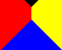
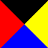

#CSS基础
##目录
* 1 CSS
	* 1.1 选择器（Selector）
	* 1.2 创建（Create）
	* 1.3 背景（Background）
	* 1.4 文本（Text）
	* 1.5 字体（Font）
	* 1.6 列表（List）
	* 1.7 表格（Table）
	* 1.8 盒子模型（Box）
	* 1.9 边框（Border）
	* 1.10 轮廓（Outline）
	* 1.11 外边距（Margin）
	* 1.12 内边距（Padding）
	* 1.13 尺寸（Dimension）
	* 1.14 显示（Display）
	* 1.15 定位（Position）
	* 1.16 浮动（Float）
	* 1.17 对齐（Align）
	* 1.18 伪类（Pseudo-class）
	* 1.19 伪元素（Pseudo-element）
	* 1.20 导航栏（Navigation）
	* 1.21 下拉菜单（Drop List）
	* 1.22 提示工具（Tooltip）
	* 1.23 图片廊（Image Gallery）
	* 1.24 图像透明度（Opacity）
	* 1.25 图像拼合技术（Image Operation）
	* 1.26 媒体类型（Media）
* 2 CSS3
	* 2.1 边框（Border）
	* 2.2 背景（Background）
	* 2.3 渐变（Gradient）
	* 2.4 文本（Text）
	* 2.5 字体（Font）
	* 2.6 2D转换（Transform 2D）
	* 2.7 3D转换（Transform 3d）
	* 2.8 过渡（Transition）
	* 2.9 动画（Animation）
	* 2.10 多列（Columns）
	* 2.11 用户界面（User Frame）
	* 2.12 图片（Image）
	* 2.13 按钮（Button）
	* 2.14 分页（Pages）
	* 2.15 弹性盒子（Flex Box）
	* 2.16 多媒体查询（Media）

##1 CSS基础
什么是 CSS?

* CSS 指层叠样式表 (**C**ascading **S**tyle **S**heets)
* 样式定义**如何显示** HTML 元素
* 样式通常存储在**样式表**中
* 把样式添加到 HTML 4.0 中，是为了**解决内容与表现分离的问题**
* **外部样式表**可以极大提高工作效率
* 外部样式表通常存储在 **CSS 文件**中
* 多个样式定义可**层叠**为一个
* 样式对网页中元素位置的排版进行像素级精确控制

###1.1 选择器（Selector）
**直接选择**

**A id 选择器**

		#身份 {
			样式1: 值1;
			样式2: 值2;
		}

**B class 选择器**

		.类名 {
			样式1: 值1;
			样式2: 值2;
		}

**C 元素选择器**

		元素名 {
			样式1: 值1;
			样式2: 值2;
		}

**D 属性选择**

		[属性名=属性值] {
			样式1: 值1;
			样式2: 值2;
		}

		/* 用于选择使用空格分隔的多值属性 */
		[属性名~=属性值] {
			样式1: 值1;
			样式2: 值2;
		}

		/* 用于选择使用减号分隔的多值属性 */
		[属性名|=属性值] {
			样式1: 值1;
			样式2: 值2;
		}

		/* 前缀查找 */
		[属性名^=属性值]

		/* 后缀查找 */
		[属性名$=属性值]

**关系选择**

**E 后代选择器**

		外选择器 内选择器 {
			样式1: 值1;
			样式2: 值2;
		}

**F 子选择器**

		父选择器>子选择器 {
			样式1: 值1;
			样式2: 值2;
		}

**G 兄弟选择器**

		兄长选择器+相邻兄弟选择器 {
			样式1: 值1;
			样式2: 值2;
		}

		兄长选择器~普通兄弟选择器 {
			样式1: 值1;
			样式2: 值2;
		}

**其他选择**

**H 多项选择**

		选择器1,选择器2 {
			样式1: 值1;
			样式2: 值2;
		}	

**I 过滤器**

位置相关

		/* 表示选择器是其父元素的首位子元素 */
		选择器:first-child

		/* 表示选择器是其父元素的末位子元素 */
		选择器:last-child

		/* 指定位置子元素(从0开始) */
		选择器:nth-child(2)

		/* 偶数位置子元素 */
		选择器:nth-child(even)

		/* 奇数位置子元素 */
		选择器:nth-child(odd)

表单相关

		/* 输入元素：<input> <textarea> <select> <button> */
		选择器:input

		/* 输入元素：<input type="file"> */
		选择器:file

		/* 复选框 */
		选择器:checkbox

		/* 单选框 */
		选择器:radio

		/* 当前焦点元素 */
		选择器:focus

		/* 当前勾选的单选框和复选框 */
		选择器:checked

		/* 可正常输入的元素（没灰掉的） */
		选择器:enabled

		/* 不可输入的元素（灰掉的） */
		选择器:disabled

显示相关

		/* 可见元素 */
		选择器:visible

		/* 不可见元素 */
		选择器:hidden

###1.2 创建（Create）
**A 外部样式表(External style sheet)**

		<link rel="stylesheet" type="text/css" href="文件名" />

**B 内部样式表(Internal style sheet)**

		<style type="text/css">
			选择器 {
				样式1: 值1;
				样式2: 值2;
			}
		</sytle>

**C 内联样式表(Inline Style)**

		<标签名 style="样式1:值1;样式2:值2;"></标签名>

**优先级：**

内联样式 > 内部样式 > 外部样式 > 浏览器默认样式

使用`属性值|important`来设置最高优先级。

###1.3 背景（Background）
* `background-color: CSS颜色` - 定义HTML元素的背景颜色
	* 注释 - CSS颜色参见“【HTML】HTML基础 1.15 颜色”
* `background-image:url('图像地址')` - 定义HTML元素的背景图像
	* 注释 - `-webkit-`为Safari用，`-o-`为Opera用
	* 注释 - 默认平铺重复显示
* `background-repeat` - 定义HTML元素背景图像的平铺方式
	* `repeat-x` - x方向平铺
	* `repeat-y` - y方向平铺
	* `no-repeat` - 不平铺
* `background-attachment` - 规定背景图像固定或跟随页面其余部分
	* `scroll` - 随页面其余部分滚动，默认行为
	* `fixed` - 背景图像固定
	* `inherit` - 继承父元素的设置
* `background-position` - 定义HTML元素背景图像的显示位置
	* `right` - 右，可组合
	* `left` - 左，可组合
	* `top` - 上，可组合
	* `bottom` - 下，可组合
	* `center` - 中，可组合
	* 百分数值（元素中心位置距左上角的偏移）
	* 长度值（长度值解释的是元素内边距区左上角的偏移，偏移点是图像的左上角）

**简写属性**

`background`使用简写属性，属性值的顺序按照以上从上往下的顺序。

###1.4 文本（Text）
* `color: CSS颜色` - 设置HTML元素的文本元素
	* 注释 - CSS颜色参见“【HTML】HTML基础 1.15 颜色”
	* 注意 - 根据W3C标准，定义了文本颜色属性，还必须定义背景颜色属性
* `text-align` - 设置HTML元素文本的对齐方式
	* `left` - 左边排列
	* `right` - 右边排列
	* `center` - 中间排列
	* `justify` - 两端对齐
	* `inherit` - 继承父元素的设置
* `text-decoration` - 设置或删除HTML元素的文本装饰
	* `none` - 无划线
	* `overline` - 上划线
	* `line-through` - 中划线
	* `underline` - 下划线
* `text-transform` - 设置HTML元素的文本大小写属性
	* `uppercase` - 全大写
	* `lowercase` - 全小写
	* `capitalize` - 全首字母大写
* `text-ident:CSS尺寸` - 设置HTML元素的文本首行缩进
	* CSS尺寸 - 像素(px、em)，百分比(%)
* `word-spacing` - 改变字（单词）之间的标准间隔
	* CSS尺寸 - 像素(px、em)，百分比(%)，默认值 0

###1.5 字体（Font）
在CSS中，有两种类型的字体系列名称：

* 通用字体系列 - 拥有相似外观的字体系统组合（如 "Serif" 或 "Monospace"）
* 特定字体系列 - 一个特定的字体系列（如 "Times" 或 "Courier"）

除了各种特定的字体系列外，CSS 定义了 5 种通用字体系列：

* Serif 字体
* Sans-serif 字体
* Monospace 字体
* Cursive 字体
* Fantasy 字体

**语法：**

* `font-family` - 设置文本的字体系列
	* 提示 - 应给设置几种字体作为一种后备机制，详细搜索“CSS Web安全字体组合”
	* 注意 - 如果字体系列名称超过一个字，用双引号
* `font-style` - 设置HTML元素的字体样式
	* `normal` - 正常
	* `italic` - 斜体
	* `oblique` - 倾斜（和斜体非常类似，但不太支持）
* `font-size:CSS尺寸` - 设置HTML元素的字体大小
	* CSS尺寸 - 像素值(px、em)，百分比(%)
	* 注 - 默认16px=1em（假设父元素的 font-size 为 30px，那么公式需改为：pixels/30=em） 
* `font-weight` - 设置HTML元素的字体粗细
	* `normal` - 正常
	* `bold` - 粗体
	* `bolder` - 更粗体
	* `lighter` - 更细体
	* 数值 - 100~800，400=normal，700=bold

**Tips：**

serif 和 sans-serif 字体之间的区别

* 在计算机屏幕上，sans-serif字体被认为是比serif字体容易阅读
* 还可以使用** 在线生成字体CSS样式工具**

###1.6 列表（List）
* `list-sytle-type` - 设置列表项标记类型
	* `none` - 无标记
	* `circle` - 圆形
	* `square` - 正方形
	* `upper-roman` - 大写罗马数字
	* `lower-alpha` - 小写希腊字母
	* 等等，参考列表教程
* `list-style-position` - 设置列表项标记的位置
	* `inside` - 列表项标记放置在文本内，且环绕文本根据标记对齐
	* `outside` - 保持标记位于文本的左侧。列表项标记放置在文本以外，且环绕文本不根据标记对齐。默认。
	* `inherit` - 继承父元素的设置
* `list-style-image: url(图像地址)` - 设置列表项标记为图片

**浏览器兼容性解决方案**

		ul {
			/*无标记*/
			list-style-type: none;
			/*设置填充和边距*/
			padding: 0px;
		}
		ul li {
			/*设置图像URL*/
			background-image: url(图像地址);
			/*设置图像无重复*/
			background-repeat: no-repeat;
			/*设置图像位置*/
			background-position: 0px 5px;
			/*将文本值置于列表中*/
			padding-left: 14px
		}

**简写属性**

`list-style`使用简写属性，属性值的顺序按照以上从上往下的顺序。

###1.7 表格（Table）
* `border:像素 虚实 颜色` - 设置表格的边框
	* 参数含义 - 见下面章节（1.10 边框）
* `border-collapse:collapse` - 折叠边框，将双边框折叠成一个
* `width` - 设置表格宽度
* `height` - 设置表格高度
* `text-align` - 设置水平对齐
	* `right`
	* `left`
	* `center`
* `verticle-align` - 设置垂直对齐
	* `top`
	* `bottom`
	* `middle`
* `background-color` - 设置表格背景颜色
* `color` - 设置表格文字颜色

###1.8 盒子模型（Box）
所有的HTML元素可以看作盒子。

* Margin - 外边距
* Border - 边框
* Padding - 内边距
* Content - 内容

**注释**

当指定一个CSS元素的宽度和高度时，只是设置内容区域的宽度和高度。

###1.9 边框（Border）
* `border-width` - 设置边框宽度
	* `thick` - 厚边框
	* `medium` - 默认边框
	* `thin` - 细边框
	* 数值 - 像素值(px)
* `border-style` - 设置边框样式
	* `none` - 无边框
	* `dotted` - 点线
	* `dashed` - 虚线
	* `solid` - 实线
	* `double` - 双实线，宽度与border-width相同
	* `groove` - 3D沟槽边框，效果取决于边框颜色值
	* `ridge` - 3D脊边框，效果取决于边框颜色值
	* `inset` - 3D嵌入边框，效果取决于边框颜色值
	* `outset` - 3D突出边框，效果取决于边框颜色值
* `border-color: 颜色` - 设置边框颜色
	* `transparent` - 透明
	* 颜色 - CSS颜色
* `border-方位-类型` - 单独设置各边
	* 方位 - top，right，bottom，left
	* 类型 - width，style，color

**简写属性**

`border`和`border-方位`和`border-类型`使用简写属性，属性值的顺序按照以上从上往下的顺序（最后一个不是），方位值按照上面“上右下左”的顺序。

**注意**

单独设置`border-width`不起作用，要先设置`border-style`。

**技巧**

在仅有边框的空元素，其各个方位的占据空间呈现以下形状：

设定`position:absolute`后：

可以由此获得箭头形状，当然也可以绘图了。

###1.10 轮廓（Outline）
轮廓位于边框的外边缘。

* `outline-color: 颜色` - 设置轮廓颜色
* `outline-style` - 设置轮廓样式
* `outline-width` - 设置轮廓宽度

**简写属性**

`outline`使用简写属性，属性值的顺序按照以上从上往下的顺序。

###1.11 外边距（Margin）
* `margin-top` - 设置元素上外边距
* `margin-left` - 设置元素右外边距
* `margin-bottom` - 设置元素下外边距
* `margin-left` - 设置元素左外边距

**简写属性**

`margin`使用简写属性，方位值按照上面“上右下左”的顺序。

###1.12 内边距（Padding）
* `padding-top` - 设置元素上外边距
* `padding-left` - 设置元素右外边距
* `padding-bottom` - 设置元素下外边距
* `padding-left` - 设置元素左外边距

**简写属性**

`padding`使用简写属性，方位值按照上面“上右下左”的顺序。

###1.13 尺寸（Dimension）
* `line-height` - 设置元素行高
* `height` - 设置元素高度
* `width` - 设置元素的宽度
* `max-height` - 设置元素最大高度
* `max-width` - 设置元素的最大宽度
* `min-height` - 设置元素的最小高度
* `min-width` - 设置元素的最小宽度

###1.14 显示（Display）
**块级元素：**

* 块级元素占用全部宽度，在前后都是换行符

* 盒子模型可控制

**内联元素：**

* 内联元素占用必要宽度，不强制换行

* 盒子模型不可控制

**语法：**

* `display` - 控制元素的显示
	* `none` - 隐藏元素，不占用空间
	* `block` - 元素块级显示
	* `inline` - 元素内联显示
	* `inline-block` - 显示为内联块元素（`<ul>`水平显示）
* `visibility` - 控制元素的显示
	* `hidden` - 隐藏元素，占用空间
	* `visibile` - 显示元素
	* `collapse` - 在表格中使用时，删除一行或一列，不影响表格布局。用在其他元素上，会呈现为`hidden`

###1.15 定位（Position）
* `position` - 指定元素的定位类型
	* `static` - 正常定位，不受top bottom left right的影响，默认值
	* `fixed` - 固定定位（相对于浏览器窗口）
	* `relative` - 相对定位（相对于自身正常位置）
	* `absolute` - 绝对定位（相对于最近的已定位父元素，直到`<html>`）
	* `sticky` - 粘性定位（在窗口内时相对定位，超出窗口时绝对定位）
* `top` - 指定元素顶端高度
* `bottom` - 指定元素底端高度
* `left` - 指定元素左端宽度
* `right` - 指定元素右端宽度
* `z-index` - 指定元素重叠顺序，大值在前
* `clip:rect(top,right,bottom,left)` - 裁剪绝对定位元素
* `overflow` - 指定元素内容溢出操作
	* `visible` - 溢出到框外，默认
	* `hidden` - 溢出的部分隐藏
	* `scroll` - 溢出时（无论与否）滚动条显示
	* `auto` - 自动，溢出时才滚动条显示
* `cursor` - 规定了光标放在元素边界范围内时的变化
	* `auto` - 默认。浏览器设置的光标
	* `crosshair` - 光标呈现为十字线
	* `pointer` - 光标呈现为指示链接的指针（一只手）
	* `move` - 此光标指示某对象可被移动
	* `e-resize` - 此光标指示矩形框的边缘可被向右（东）移动
	* `ne-resize` - 此光标指示矩形框的边缘可被向上及向右移动（北/东）
	* `nw-resize` - 此光标指示矩形框的边缘可被向上及向左移动（北/西）
	* `n-resize` - 此光标指示矩形框的边缘可被向上（北）移动
	* `se-resize` - 此光标指示矩形框的边缘可被向下及向右移动（南/东）
	* `sw-resize` - 此光标指示矩形框的边缘可被向下及向左移动（南/西）
	* `s-resize` - 此光标指示矩形框的边缘可被向下移动（北/西）
	* `w-resize` - 此光标指示矩形框的边缘可被向左移动（西）
	* `text` - 此光标指示文本
	* `wait` - 此光标指示程序正忙（通常是一只表或沙漏）
	* `help` - 此光标指示可用的帮助（通常是一个问号或一个气球）

**提示**

相对定位元素通常被用来作为绝对定位元素的容器块。

**注意**

粘性定位需指定top right bottom left之一后才生效，该指定作用于绝对定位状态。

###1.16 浮动（Float）
**规则**

* 元素的水平方向浮动，意味着元素只能左右移动而不能上下移动
* 一个浮动元素会尽量向左或向右移动
* 浮动元素之后的元素将围绕它
* 浮动元素之前的元素将不会受到影响

**语法**

* `float` - 设置元素浮动
	* `left` - 向左浮动
	* `right` - 向右浮动
	* `none` - 不浮动，默认
	* `inherit` - 继承父元素配置
* `clear` - 指定元素周围不能出现浮动元素
	* `left` - 左侧不允许浮动元素
	* `right` - 右侧不允许浮动元素
	* `both` - 左右两侧不允许浮动元素
	* `none` - 允许浮动元素出现在两侧
	* `inherit` - 继承父元素配置

###1.17 对齐（Align）
####水平对齐
**A 元素居中对齐**

		margin: auto;

**B 文本居中对齐**

		text-align: center;

**C 图片居中对齐**

		display: block;
		margin: auto;

**D 左右对齐**

* 绝对定位方式

		position: absolute;
		right/left: **px;

**提示**

当使用position来定位元素时，通常`<body>`元素会设置**margin**和**padding**（哪怕为0），避免不同的浏览器中出现可见的差异。

* float方式

		float: right/left

**注意**

如果子元素的高度大于父元素，且子元素设置浮动，那么子元素将溢出。可使用在父元素使用样式`overflow: auto;`来解决问题。

**E 居中对齐**

* 内边距方式

		padding: 上下间距 左右间距;

* 行高方式

		line-height: 高度;

* 定位+变换

		position: absolute;
		transform: translate(-50%, 50%);

###1.18 伪类（Pseudo-class）
CSS伪类是用来添加一些选择器的特殊效果。

由于状态的变化是非静态的，所以元素达到一个特定状态时，它可能得到一个伪类的样式；当状态改变时，它又会失去这个样式。由此可以看出，它的功能和class有些类似，但它是基于文档之外的抽象，所以叫伪类。 

**语法**

		selector:pseudo-class {property:value;}
		selector.class:pseudo-class {property:value;}

**A `anchor`伪类**

* `a:link` - 未访问链接
* `a:visited` - 已访问链接
* `a:hover` - 鼠标移动到链接上
* `a:actice` - 鼠标点击时

**注意**

按照以上从上到下的顺序设置。

**B `first-child`伪类**

* `选择器:first-child` - 选择父元素的第一个子元素

**C `lang`伪类**

* `自定义元素名:lang(自定义属性值) {样式}` - 自定义元素和属性，使用时用该元素名并指定`lang`属性和值

###1.19 伪元素（Pseudo-element）
CSS伪元素是用来添加一些选择器的特殊效果。

CSS伪元素控制的内容和元素是没有差别的，但是它本身只是基于元素的抽象，并不存在于文档中，所以称为伪元素。

**语法**

		selector:pseudo-element {property:value;}
		selector.class:pseudo-element {property:value;}

**A `first-line`**

* `选择器:first-line` - 向文本的首行设置特殊样式

**注意**

* 只能用于块级元素
* 可以用于以下属性
	* font properties
	* color properties 
	* background properties
	* word-spacing
	* letter-spacing
	* text-decoration
	* vertical-align
	* text-transform
	* line-height
	* clear

**B `first-letter`**

* `选择器:first-letter` - 向文本首字母设置特殊样式

**注意**

* 只能用于块级元素
* 可以用于以下属性
	* font properties
	* color properties 
	* background properties
	* margin properties
	* padding properties
	* border properties
	* text-decoration
	* vertical-align (only if "float" is "none")
	* text-transform
	* line-height
	* float
	* clear

**C `before`**

* `选择器:before {content:内容}` - 在元素的内容前面插入新内容

**D `after`**

* `选择器:after {content:内容}` - 在元素的内容后面插入新内容

###1.20 导航栏（Navigation）
**标准代码**

		<ul>
			<li><a href="" class="active">链接1</a></li>
			<li><a href="">链接1</a></li>
			<li><a href="">链接1</a></li>
			<li><a href="">链接1</a></li>
		</ul>

		ul {
			list-style-type: none;
			margin: 0;
			padding: 0;
		}

**垂直导航栏 - 案例演示**

		/* 基本 */
		ul {
			list-style-type: none;
			margin: 0;
			padding: 0;
			width: 25%;
			background-color: #f1f1f1;
		}

		li a {
			display: block;
			color: #000;
			padding: 8px 16px;
			text-decorarion: none;
		}

		/* 激活 */
		li a.active {
			background-color: #4CAF50;
			color: white;
		}

		li a:hover:not(.active) {
			background-color: #555;
			color: white;
		}

		/* 加框（在以上标签中加入） */
		ul {
			border: 1px solid #555;
		}

		li {
			text-align: center;
			border-bottom: 1px solid #555;
		}

		li:last-child {
			border-bottom: none;
		}

		/* 全屏固定（在以上标签中加入） */
		ul {
			height: 100%;
			position: fixed;
			overflow: auto;
		}

**水平导航栏 - 案例演示**

有两种方法创建横向导航栏。使用内联或浮动的列表项。

这两种方法都很好，但如果你想链接到具有相同的大小，你必须使用浮动的方法。

		/* 基本 */
		ul {
			list-style-type: none;
			margin: 0;
			padding: 0;
			overflow: hidden;
			background-color: #333;
		}

		li {
			float: left;
		}

		li a {
			display: block;
			color: white;
			padding: 14px 16px;
			text-decoration: none;
			text-align: center;
		}

		/* 激活 */
		li a.active {
			background-color: #4CAF50;
			color: white;
		}

		li a:hover:not(.active) {
			background-color: #555;
			color: white;
		}

		/* 对齐分割（在以上标签中加入） */
		<li style="float:right"><a class="active" href="">右对齐项</a></li>
		li {
			border-right: 1px solid #bbb;
		}

		li:last-child {
			border-right: none;
		}

		/* 全屏固定（在以上标签中加入） */
		ul {
			position: fixed;
			top: 0;
			width: 100%;
		}

###1.21 下拉菜单（Drop List）
**HTML部分**

使用任何的HTML元素来打开下拉菜单（如``，`<button>`）。

使用容器元素（如`
`）。

		

			<button class="dropbtn">主菜单名称</button>
			

				<a href="">菜单项1名称</a>
				<a href="">菜单项2名称</a>
				<a href="">菜单项3名称</a>
			

		

**CSS部分**

定位下拉菜单位于右下角（父元素`relative`，子元素`absolute`）。

默认隐藏下拉菜单，鼠标移动时显示。

		/* 基本 */
		.dropdown {
			position: relative;
			display: inline-block;
		}

		.dropdown-content {
			display: none;
			position: absolute;
			background-color: #f9f9f9;
			min-width: 160px;
			box-shadow: 0px 8px 16px 0px rgba(0,0,0,0.2);
			padding: 12px 16px;
			z-index: 1;
		}

		.dropdown:hover .dropdown-content {
			display: block;
		}

		/* 按钮项 */
		.dropbtn {
			background-color: #4CAF50;
			color: white;
			padding: 16px;
			font-size: 16px;
			border: none;
			cursor: pointer;
		}

		.dropdown-content a {
			color: black;
			padding: 12px 16px;
			text-decoration: none;
			display: block;
		}

		.dropdown-content a:hover {
			background-color: #f1f1f1;
		}

		.dropdown:hover .dropbtn {
			background-color: #3e8e41;
		}

###1.22 提示工具（Tooltip）
**HTML部分**

使用任何的HTML元素来打开下拉菜单（如``，`<button>`）。

使用容器元素（如`
`）。

		

			提示文本
		

**CSS部分**

定位下拉菜单位于右下角（父元素`relative`，子元素`absolute`）。

默认隐藏下拉菜单，鼠标移动时显示。

		/* 基础 */
		.tooltip {
			position: relative;
			display: inline-block;
			border-bottom: 1px dotted black;
		}

		.tooltip .tooltiptext {
			visibility: hidden;
			width: 120px;
			background-color: black;
			color: #fff;
			text-align: center;
			padding: 5px 0;
			border-radius: 6px;

			position: absolute;
			zindex: 1;
		}

		.tooltip:hover .tooltiptext {
			visibility: visible;
		}

使用定位（Position）CSS进行定位。

`top:-5px`是因为提示文本的顶部和底部padding是5px。

`margin-left:-60px`使用一半宽度来居中提示工具。

		/* 定位（在以上标签中加入） */
		/*右侧显示*/
		.tooltip .tooltiptext {
			top: -5px;
			left: 105%;
		}
		/*左侧显示*/
		.tooltip .tooltiptext {
			top: -5px;
			right: 105%;
		}
		/*顶部显示*/
		.tooltip .tooltiptext {
			width: 120px;
			bottom: 100%;
			left: 105%;
			margin-left: -60px;
		}
		/*底部显示*/
		.tooltip .tooltiptext {
			width: 120px;
			top: 100%;
			left: 50%;
			margin-left: -60px;
		}

`top:100%`将箭头显示在提示工具的底部。

`left:50%`用于居中对齐箭头。

`border-with`指定了箭头的大小，若修改，同时修改`margin-left`。

`border-color`将内容转换为箭头，其他方向的箭头同理。

		/* 添加箭头 */
		.tooltip .tooltiptext:after {
			content: "";
			position: absolute;
			top: 100%;
			left: 100%;
			margin-left: -5px;
			border-width: 5px;
			border-style: solid;
			border-color: black transparent transparent transparent;
		}

详细原理参考CSS3。

		/* 淡入效果 */
		.tooltip .tooltiptext {
			opacity: 0;
			transition: opacity 1s;
		}

		.tooltip:hover .tooltiptext {
			opacity: 1;
		}

###1.23 图片廊（Image Gallery）
**HTML部分**

		

			

				
				
图片文本描述

			

		

**CSS部分**

		div.img {
			margin: 5px;
			border: 1px solid #ccc;
			float: left;
			width: 180px;
		}

		div.img:hover {
			border:1px solid #777;
		}

		div.img img {
			width: 100%;
			height: auto;
		}

		div.desc {
			padding: 15px;
			text-align: center;
		}

###1.24 图像透明度（Opacity）
* `opacity` - 透明度属性，范围在0~1

###1.25 图像拼合技术（Image Operation）
使用图像拼合技术可以降低服务器的请求数量，并节省带宽。

**语法**

		选择器 {
			width: 宽度;
			height: 高度;
			background: url(图像地址) 左-位置 顶-位置;
		}

###1.26 媒体类型（Media）
**语法**

		@media 媒体类型1,媒体类型2
		{
			CSS样式
		}

媒体类型如下：

* `all` - 用于所有的媒体设备
* `aural` - 用于语音和音频合成器
* `braille`	- 用于盲人用点字法触觉回馈设备
* `embossed` - 用于分页的盲人用点字法打印机
* `handheld`- 用于小的手持的设备
* `print` - 用于打印机
* `projection` - 用于方案展示，比如幻灯片
* `screen` - 用于电脑显示器
* `vtty` - 用于使用固定密度字母栅格的媒体，比如电传打字机和终端
* `tv` - 用于电视机类型的设备
* `(max|min-width: CSS像素数值)` - 自定义媒体类型

可以使用逻辑运算符，例如：

		@media screen and (min-width:900px) // 屏幕宽度大于900px
		
		{
		
		    #header,#footer
		
		    {
		
		        width:800px;
		
		    }
		
		    #main
		
		    {
		
		        width:800px;
		
		        height:400px;
		
		    }
		
		    #main-left
		
		    {
		
		        width:200px;
		
		        height:400px;
		
		        border:solid 1px red;
		
		        float:left;  /*以下均要设置左浮动，保证在同一行*/
		
		    }
		
		    #main-center
		
		    {
		
		        width:394px;
		
		        height:400px;
		
		        border:solid 1px red;
		
		        float:left;
		
		    }
		
		    #main-right
		
		    {
		
		        width:200px;
		
		        height:400px;
		
		        border:solid 1px red;
		
		        float:left;
		
		    }
		
		}

##2 CSS3
###2.1 边框（Border）
* `border-radius` - 创建边框圆角
	* 4个值 - 左上 右上 右下 左下
	* 3个值 - 左上 右上+左下 右下
	* 2个值 - 左上+右下 右上+左下
	* 1个值 - 四角相同
* `box-shadow: h-shadow v-shadow blur spread color inset` - 添加边框阴影
	* `h-shadow` - 水平阴影位置
	* `v-shadow` - 垂直阴影位置
	* `blur` - 模糊距离。可选
	* `spread` - 阴影大小。可选
	* `color` - 阴影颜色。可选
	* `inset` - 盒子内部视角，布尔属性
	* 简写属性 - 按照以上从上往下顺序
* `border-image: source slice width outset repeat|intial|inherit` - 指定图片作为边框
	* `source` - 图片地址
	* `slice` - 图片边界向内偏移
	* `width` - 图片边界宽度
	* `outset` - 指定在边框外部绘制区域的量
	* `repeat` - 设置图像边界是否应重复、拉伸或铺满

###2.2 背景（Background）
* `background-image:url(图像地址)` - 定义HTML元素的背景图像
	* CSS3特性 - 可设定多张图片，每张图片的设定用逗号隔开，显示在最顶端的为第一张
	* 注意 - 有多个背景图而只有一个属性，表明所有图片共用该属性；`background-color`只能设置一个
* `background-size: width height` - 指定背景图片的大小
	* `width` - 宽度，CSS数值
	* `height` - 高度，CSS数值
* `background-origin` - 指定背景图像的位置
	* `padding-box` - 相对于内边距所属框
	* `border-box` - 相对于外边距所属框
	* `content-box` - 相对于内容框
* `background-clip` - 从指定位置开始绘制
	* `padding-box` - 剪成衬距方框
	* `border-box` - 剪成边框方框，默认
	* `content-box` - 剪成内容方框

###2.3 渐变（Gradients）
传统渐变通过图像实现，占用下载事件和带宽。

HTML5可使用Canvas实现渐变。

CSS3

**线性渐变**

		background: -webkit-linear-gradient(direction/angle, color-stop1, color-stop2, ...); /* Safari 5.1 - 6.0 */
		background: -o-linear-gradient(direction/angle, color-stop1, color-stop2, ...); /* Opera 11.1 - 12.0 */
		background: -moz-linear-gradient(direction/angle, color-stop1, color-stop2, ...); /* Firefox 3.6 - 15 */
		background: linear-gradient(direction/angle, color-stop1, color-stop2, ...); /* 标准的语法（必须放在最后） */

* `direction` - 渐变方向（top，bottom，right，left 可组合）
* `angle` - 角度渐变，指水平线和渐变线之间的角度，逆时针方向；渐变方向，顺时针垂直渐变线方向。单位：deg
	* 注意：很多浏览器使用旧标准，渐变方向，沿渐变半径方向
* `color-stop` - CSS颜色，使用`rgba()`创造透明渐变，后面可加百分数，设置颜色占比
* `repeating-linear-gradient()` - 重复的线性渐变

**径向渐变**

		background: -webkit-radial-gradient(center, shape, size, start-color, ..., last-color); /* Safari 5.1 - 6.0 */
		background: -o-radial-gradient(center, shape, size, start-color, ..., last-color); /* Opera 11.6 - 12.0 */
		background: -moz-radial-gradient(center, shape, size, start-color, ..., last-color); /* Firefox 3.6 - 15 */
		background: radial-gradient(center, shape, size, start-color, ..., last-color); /* 标准的语法（必须放在最后） */

* `center` - 中心位置，两个百分数，空格隔开
* `shape` - 设置形状（circle，ellipse(默认)）
* `size` - 设置渐变大小（closest-side，farthest-side，closest-corner，farthest-corner）
* `repeating-radial-gradient()` - 重复的径向渐变

###2.4 文本（Text）
* `text-shadow: h-shadow v-shadow blur color` - 文本阴影
	* `h-shadow` - 水平阴影位置，必需
	* `v-shadow` - 垂直阴影位置，必需
	* `blur` - 模糊距离，可选
	* `color` - 阴影颜色，可选
* `box-shadow: h-shadow v-shadow blur spread color inset` - 盒子阴影
	* `h-shadow` - 水平阴影位置，必需
	* `v-shadow` - 垂直阴影位置，必需
	* `blur` - 模糊距离，可选
	* `spread` - 阴影大小，可选
	* `color` - 阴影颜色，可选
	* `inset` - 盒子内部视角，布尔属性
	* 技巧 - 在`before`和`after`两个伪元素中添加阴影效果，实现非等距阴影
	* 典例1 - 通过盒子模型嵌套，实现卡片效果
* `text-overflow` - 设置文本溢出内容显示方式，代码见下
	* `clip` - 修剪文本
	* `ellipsis` - 显示省略号来代表被修剪的文本
	* `string` - 使用给定的字符串来代表被修剪的文本
	* 典例2 - 鼠标悬停显示整个文本，代码见下
* `word-wrap:break-word` - 允许较长的不可分割的单词进行分割并换行到下一行
* `word-break` - 规定中日韩文本的换行规则
	* `break-all` - 允许在单词内换行
	* `keep-all` - 只能在半角空格或连字符中换行

**典例1 卡片**

		<!-- html -->
		

			

				<h1>卡片主题</h1>
			

			

				
卡片文字

			

		

		/* CSS */
		div.card {
			width: 250px;
			box-shadow: 0 4px 8px 0 rgba(0, 0, 0, 0.2), 0 6px 20px 0 rgba(0, 0, 0, 0.19);
			text-align: center;
		}

		div.header {
			background-color: #4CAF50;
			color: white;
			padding: 10px;
			font-size: 40px;
		}

		div.container {
			padding: 10px;
		}

**典例2 悬停全显**

		<!-- html -->
		
This is some long text that will not fit in the box

		
This is some long text that will not fit in the box

		/* CSS */
		div.test {
			white-space: nowrap;
			width: 12em;
			overflow: hidden;
			border: 1px solid #000000;
		}

		div.test:hover {
			text-overflow: inherit;
			overflow: visible;
		}

###2.5 字体（Font）
**语法**

		@font-face {
			font-family: 字体名称;
			src: url(字体文件路径);
		}

然后在标签内通过`font-family`属性指定即可。

其他可选规则

* `font-stretch` - 定义如何拉伸字体（查阅文档）
* `font-style` - 定义字体的样式
	* `normal` - 正常
	* `italic` - 斜体
	* `oblique` - 倾斜
* `font-weight` - 定义字体粗细
	* `normal` - 正常
	* `bold` - 粗体
	* `bolder` - 更粗体
	* `lighter` - 更细体
	* 数值 - 100~800，400=normal，700=bold

注：使用上述规则需另起 `@font-face`

###2.6 2D转换（Transform 2D）
**语法**

		transform: 转换函数;
		-ms-transform: 转换函数; /* IE 9 */
		-webkit-transform: 转换函数;  /* Safari and Chrome */

转换函数如下：

* `translate(x, y)` - 沿x、y轴移动元素
* `rotate(**deg)` - 沿中心轴旋转元素（正数：顺时针）
* `scale(x_rate, y_rate)` - 沿x、y轴缩放元素（倍数放大）
* `skew(x_angle, y_angle)` - 沿x、y轴倾斜元素（正数：x轴底边向右，y轴右边向下）
* `matrix(n, n, n, n, n, n)` - 元素坐标（二维）的线性变换3x2矩阵

###2.7 3D转换（Transform 3D）
**语法**

		transform: 转换函数;
		-ms-transform: 转换函数; /* IE 9 */
		-webkit-transform: 转换函数;  /* Safari and Chrome */

转换函数如下：

* `translate3d(x, y, z)` - 沿x、y、z轴移动元素
* `rotate3d(x, y, z, **deg)` - 沿x、y、z轴旋转元素
	* `x`,`y`,`z` - 0表示不旋转，非0表示旋转
	* 关于旋转方向 - 正数左手定则
* `scale3d(x, y, z)` - 沿x、y、z轴缩放元素（倍数放大）
* `matrix(16个n)` - 元素坐标（三维）的线性变换4x4矩阵
* 上述各函数`3d` -> `X`或`Y`或`Z` - 该方向上的转换

###2.8 过渡（Transition）
**语法**

		transition: property duration timing-function delay, property2 duration2 ...;
		-webkit-transition: property duration timing-function delay, property2 duration2 ...; /* Safari */

* `property` - 规定应用过渡的CSS属性名称
* `duration` - 过渡效果花费的时间，默认0
* `timing-function` - 过渡效果的时间曲线
	* `linear` - 线性变化
	* `ease` - 缓动（缓入+缓出的轻微版），默认
	* `ease-in` - 缓入
	* `ease-out` - 缓出
	* `ease-in-put` - 缓入+缓出
	* `cubic-bezier(n,n,n,n)` - 自定义
* `delay` - 动画延迟时间，单位为s
* 注释 - `transition`为简写属性，用`-`接属性可具体指定
* 注释 - 至少在`button`元素内，不规定`property`时，过渡会应用于`:hover`的全部属性。

例子：

		.index .blogs {
			positon:relative;
			transition: box-shadow 0.4s ease;
			-webkit-transition: box-shadow 0.4s ease;
		}

###2.9 动画（Animation）
动画是使元素从一种样式逐渐变化为另一种样式的效果。

**语法**

		/* 先建立动画 */
		@keyframes 动画名称 {
			from {CSS样式1}
			to {CSS样式2}
		}

		-webkit-keyframes 选择器 { /* Safari 与 Chrome */
			from {CSS样式1}
			to {CSS样式2}
		}

		@keyframes 动画名称 {
			a% {CSS样式1}
			b% {CSS样式2}
		}

		-webkit-keyframes 选择器 { /* Safari 与 Chrome */
			a% {CSS样式1}
			b% {CSS样式2}
		}

		/* 然后绑定到选择器 */
		选择器 {
			animation: name duration timing-function delay iteration-count direction fill-mode play-state;
			-webkit-animation: name duration timing-function delay iteration-count direction fill-mode play-state; /* Safari 与 Chrome */
		}

* `name` - 动画名称
* `duration` - 过渡效果花费的时间，默认0
* `timing-function` - 过渡效果的时间曲线
	* `linear` - 线性变化
	* `ease` - 缓动（缓入+缓出的轻微版），默认
	* `ease-in` - 缓入
	* `ease-out` - 缓出
	* `ease-in-put` - 缓入+缓出
	* `cubic-bezier(n,n,n,n)` - 自定义
* `delay` - 动画延迟时间
* `iteration-count` - 规定动画播放的次数，默认1
* `direction` - 指定动画是否应该轮流反向播放动画
	* `normal` - 动画正常播放，默认
	* `reverse` - 动画反向播放
	* `alternate` - 动画奇数次正常播放，偶数次反向播放
	* `alternate-reverse` - 动画奇数次反向播放，偶数次正常播放
* `fill-mode` - 规定动画不播放时（延迟开始时或播放结束时）要应用的样式
	* `none` - 无，默认
	* `forwards` - 开头帧
	* `backwards` - 结束帧
	* `both` - 开头和结束两个方向上延伸
* `play-state` - 指定动画是否正在运行或已暂停
	* `paused` - 暂停动画
	* `running` - 运行动画
* 注释 - `animation`为简写属性，用`-`接属性可具体指定

###2.10 多列（Columns）
多列可以将文本设计成像报纸多列布局。

**语法**

* `column-count` - 创建多列，数值
* `column-gap` - 列间间隙，数值
* `column-rule-width` - 列边框厚度，CSS数值
* `column-rule-style` - 列边框样式，CSS边框样式
* `column-rule-color` - 列边框颜色，CSS颜色
* `column-rule` - 以上简写属性，顺序按照以上从上到下顺序
* `column-span` - 元素跨越列数，用于指定多列中要跨列的元素
	* `all` - 跨越所有列
	* `1` - 跨越1列
* `column-width` - 指定列宽度，CSS数值
* 注意 - `-webkit-`于Chrome, Safari, Opera，` -moz-`于Firefox

###2.11 用户界面（User Frame)
* `resize` - 指定一个元素是否应该由用户去调整大小
	* `none` - 用户无法调整元素的尺寸
	* `both` - 用户可调整元素的高度和宽度
	* `horizontal` - 用户可调整元素的宽度
	* `vertical` - 用户可调整元素的高度
* `box-sizing` - 以指定目标去调整方框大小
	* `border-box` - 目标为边框盒子
	* `content-box` - 目标为内容盒子
	* `inherit` - 继承父类属性
* `outline-offset` - 对轮廓进行偏移，并在超出边框边缘的位置绘制轮廓，CSS数值
	* 注释 - 轮廓不占用空间，轮廓可能是非矩形

###2.12 图片（Image）
* `border-radius` - 圆角图片
	* CSS像素数值 - 矩形圆角设置
	* 百分数 - 椭圆形图片长短轴之比

**典例**

**A 缩略图**

		img {
			border: 1px solid #ddd;
			border-radius: 4px;
			padding: 5px;
		}

**B 响应式图片**

		img {
			max-width: 100%;
			height: auto;
		}

提示：Web响应式设计更多内容可以参考【CSS】响应式设计。

**C 图片文本**

HTML部分：

		

			
			
图片文字

		

CSS部分：

		.container {
			position: relative;
		}

		.my_position {
			position: absolute;
			top|bottom: 高度;
			left|right: 宽度;
			font-size: 字体大小;
		}

		/* 指定图片规格，才能准确定位 */
		img {
			width: 100%;
			height: auto;
			opacity: 0.3;
		}

**D 卡片式图片**

相似实例参见 “2.4 文本”。

**E 图片滤镜**

CSS `filter` 属性为元素添加可视效果。

详细内容参考 “CSS 滤镜参考手册”。

**F 响应式图片相册**

HTML部分：

用块级元素将每个相册的图片包裹，添加响应式CSS类，如`responsive`。

CSS部分：

		.responsive {
			padding: 0 6px;
			float: left;
			width: 25%;
		}

		@mdeia only screen and (max-width: 700px) {
			.responsive {
				width: 50%;
				margin: 6px 0;
		}

		@media only screen and (max-width: 500px) {
			.responsive {
				width: 100%
		}

**G Modal 模态**

<h1>学完JavaScript后再回来学。</h1>

###2.13 按钮（Button）
**按钮颜色**

我们可以使用`background-color`属性来设置按钮颜色。

**按钮大小**

我们可以使用`font-size`属性来设置按钮大小。

**圆角按钮**

我们可以使用`border-radius`属性来设置圆角按钮。

**边框颜色**

我们可以使用`border`属性来设置按钮边框颜色。

**悬停效果**

我们可以使用`:hover`选择器来修改数百悬停在按钮上的样式，还可以使用`transition-duration`属性来设置`hover`效果的速度。

**按钮阴影**

我们可以使用`box-shadow`属性来问按钮添加阴影。还可以配合悬停效果。

**禁用按钮**

我们可以使用`opcitity`为按钮添加透明度表现禁用效果，再使用`cursor: not-allowed;`来设置一个禁用图片。

**按钮宽度**

我们可以使用`width`来设置按钮的宽度。

**按钮组**

我们可以使用`float`并移除外边距来设置按钮组。

**按钮动画**

典例1 箭头效果

在button里面用``块包围文字，在后面添加after，内容为箭头，然后组织效果。

		.button {
			按钮本身的效果;
		}

		/* 箭头定位块，并定义光标变化 */
		.button span {
			cursor: pointer;
			display: inline-block;
			position: relative;
			transition: 0.5s;
		}

		/* 将箭头内容补充进去 */
		.button span:after {
			content: '>>'
			position: absolute;
			opacity: 0;
			top: 0;
			right: -20px;
			transition: 0.5s;
		}

		/* 鼠标悬停 箭头定位块动作 */
		.button:hover span {
			padding-right: 25px;
		}

		/* 鼠标悬停 箭头部分动作 */
		.button:hover span:after {
			opacity: 1;
			right: 0;
		}

典例2 波纹效果

在button后面添加after空内容的透明色块，然后移动。

		.button {
			按钮本身的效果;
			position: relative;
		}

		.button:after {
			content: "";
			background: #90EE90;
			display: block;
			position: absolute;
			padding-top: 300%;
			padding-left: 350%;
			margin-left: -20px|important;
			margin-top: -120%;
			opacity: 0;
			transition: all 0.8s;
		}

		.button:active:after {
			padding: 0;
			margin: 0;
			opacity: 1;
			transition: 0s;
		}

典例3 按压效果

为button添加阴影，在活动时添加位置移动效果。

		.button {
			按钮本身的效果;
			box-shadow: 0 9px #999;
		}

		/* 悬停时颜色加深 */
		.button:hover {
			background-color: #3e8e41;
		}

		.button:active {
			background-color: #3e8e41; /*颜色效果加深，一致*/
			box-shadow: 0 5px #666;
			transform: translateY(4px);
		}

###2.14 分页（Pages）
**HTML部分**

		<ul class="pagination">
			<li><a hreg="#">«</a></li>
			<li><a hreg="#">1</a></li>
			<li><a hreg="#">2</a></li>
			<li><a hreg="#">3</a></li>
			<li><a hreg="#">4</a></li>
			<li><a hreg="#">5</a></li>
			<li><a hreg="#">6</a></li>
			<li><a hreg="#">7</a></li>
			<li><a hreg="#">»</a></li>
		</ul>

**CSS部分**

		/* 1 基本 */
		ul.pagination {
			display: inline-block;
			padding: 0;
			margin: 0;
		}
		
		ul.pagination li {
			display: inline; /*使用列表项行显示设置*/
		}

		ul.pagination li a {
			color: black;
			float: left;
			padding: 8px 16px;
			text-decoration: none;
		}

		/* 2 点击及鼠标悬停分页样式 */
		ul.pagination li a:active {
			background-color: #4CAF58;
			color: white;
		}
		ul.pagination li a:hover:not(.active) {
			background-color: #ddd;
		}
		/* 圆角样式 */
		ul.pagination li a {
			border-radius: 5px;
		}
		ul.pagination li a.active {
			border-radius: 5px;
		}
		/* 过渡效果 */
		ul.pagination li a {
			transition: background-color .3s;
		}

		/* 3 边框分页样式 */
		ul.pagination li a {
			border: 1px solid #ddd;
		}
		/* 圆角样式 */
		.pagination li:first-child a {
			border-top-left-radius: 5px;
			border-bottom-left-radius: 5px;
		}
		.pagination li:last-child a {
			border-top-right-radius: 5px;
			border-bottom-right-radius: 5px;
		}
		/* 分页间隔 */
		ul.pagination li a {
			margin: 0 4px;
		}

		/* 4 分页字体大小 */
		ul.pagination li a {
			font-size: 22px;
		}

		/* 5 居中分页 */
		div.center {
			text-align: center;
		}

###2.15 弹性盒子（Flex Box）
弹性盒子是 CSS3 的一种新的布局模式。

CSS3弹性盒是一种当页面需要适应不同的屏幕大小以及设备类型时确保元素又有恰当的行为的布局方式。

引入弹性盒的目的是提供一种更加有效的方式来对一个容器中的子元素进行排列、对齐和分配空白空间。

**A 语法 - 弹性盒子**

* 弹性盒子由弹性容器（Flex container）和弹性子元素（Flex item）组成。

* 弹性容器外及弹性子元素是正常渲染的。弹性盒子只定义了弹性子元素如何在弹性容器内布局。

* 弹性子元素通常在弹性盒子内一行显示。默认情况下每个容器只有一行。

* `display:flex`或`display:inline-flex` - 将其元素定义为弹性容器。
* `flex-direction` - 指定弹性子元素在父容器中的位置
	* `row` - 横向从左到右排列，默认
	* `row-reverse` - 横向从右到左排列
	* `column` - 纵向从上到下排列
	* `column-reverse` - 纵向从下到上排列
* `justify-content` - 内容对齐，把弹性项沿着弹性容器的主轴线（main axis）对齐（**一行子元素的堆叠**）
	* `flex-start` - 弹性项目向行头紧挨着填充，默认
	* `flex-end` - 弹性项目向行尾紧挨着填充
	* `center` - 弹性项目居中紧挨着填充（如果剩余空间为负，则在两个方向上同时溢出）
	* `space-between` - 弹性项目平均分布在该行上。如果剩余空间为负或只有一个弹性项，则该值等同于`flex-start`
	* `space-around` - 弹性项目平均分布在该行上，两边留有一半的间隔空间。如果剩余空间为负或只有一个弹性项，则该值等同于`center`
	* 以上属性值的效果图如下所示

* `align-items` - 设置或检索弹性盒子元素在纵轴方向上的对齐方式（**一行的列堆叠**）
	* `flex-start` - 弹性项的纵轴起始位置的边界紧靠住该行的纵轴起始边界
	* `flex-end` - 弹性项的纵轴起始位置的边界紧靠住该行的纵轴结束边界
	* `center` - 弹性项在该行的纵轴上居中放置（如果剩余空间为负，则会向两个方向溢出）
	* `baseline` - 如果弹性项的行内轴与纵轴为同一条，则该值与`flex-start`等效。其他情况下，该值将参与极限对齐
	* `stretch` - 如果指定纵轴大小的属性值为`auto`，则其值会使项目的边距盒的尺寸尽可能接近所在行的尺寸，但同时会遵照`min/max-width/height`属性的限制，默认
* `flex-wrap` - 用于指定弹性盒子的子元素换行方式
	* `nowrap` - 弹性容器为单行，直到子元素溢出，默认
	* `wrap` - 弹性容器为多行
	* `wrap-reverse` - 反转`wrap`排列
* `align-content` - 用于修改`flex-wrap`属性的行为。类似于`align-items`，但这是各个行的对齐（**各行的列堆叠**）
	* `stretch` - 各行将会伸展以占用剩余的空间
	* `flex-start` - 各行向弹性盒子的起始位置堆叠
	* `flex-end` - 各行向弹性盒子的结束位置堆叠
	* `center` - 各行向弹性盒子的中间位置堆叠
	* `space-between` - 各行在弹性盒子内平均分布
	* `space-around` - 各行在弹性盒子内平均分布，两端保留子元素与子元素之间间距大小的一半

**注意**

* 某些浏览器使用`-webkit`前缀。

**B 语法 - 弹性子元素**

* `order:整数` - 排序，按照整数值的从小到大排列，未定义`order`的子元素默认最后
* `margin:auto` - 在除剩余空间外的所有空间内，两轴向完全居中
	* 剩余空间 - 将其他元素的空间尽可能挤压所形成的其他元素应有的空间，相互挤压五五开
* `margin-方向:auto` - 在指定方向除剩余空间的所有空间内，拥有最大外边距
* `align-self` - 设置弹性子元素自身在行纵轴上的对齐方式
	* `auto` - 计算值为元素的父元素的`align-items`值，如果没有，则为`stretch`值
	* `flex-start` - 弹性子元素纵轴起始位置的边界紧靠住该行的起始边界
	* `flex-end` - 弹性子元素的纵轴起始位置的边界紧靠住该行纵轴的结束边界
	* `center` - 弹性子元素在该行的纵轴上居中放置（该溢出的溢出）
	* `baseline` - 如果弹性子元素的行内轴与纵轴为同一条，则该值与`flex-start`等效。其他情况下，该值将参与极限对齐
	* `stretch` -  如果指定纵轴大小的属性值为`auto`，则其值会使项目的边距盒的尺寸尽可能接近所在行的尺寸，但同时会遵照`min/max-width/height`属性的限制，默认
* `flex: flex-grow flex-shrink flex-basis` - 指定弹性子元素如何分配空间
	* `auto` - 计算值为 1 1 auto（下面中括号三个值）
	* `initial` - 计算值为 0 1 auto
	* `none` - 计算值为 0 0 auto
	* `inherit` - 从父元素继承
	* `[flex-grow]` - 定义弹性元素的扩展比率，比例为`数值/总数`
	* `[flex-shrink]` - 定义弹性盒子元素的收缩比率
	* `[flex-basis]` - 定义弹性盒子的默认基准值

###2.16 多媒体查询（Media）
**语法**

		@media not|only mediatype and (expressions) {
			CSS样式;
		}

* `not` - 用来排除特定的设备（设备见CSS2）
* `only` - 用来指定（设备见CSS2）
* `all` - 所有设备，默认

##辅助工具
**搜索“CSS样式工具”**