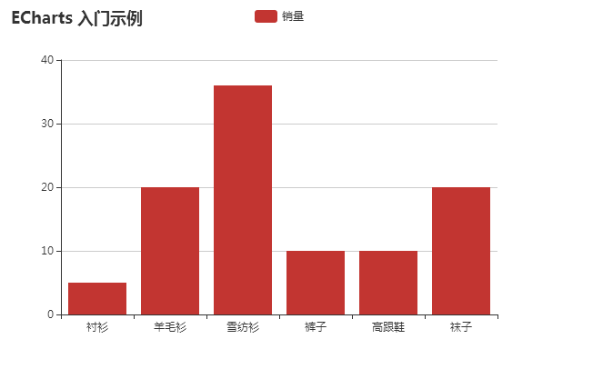
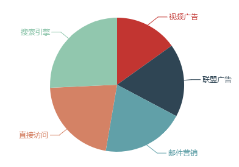
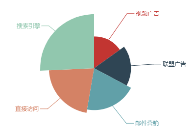
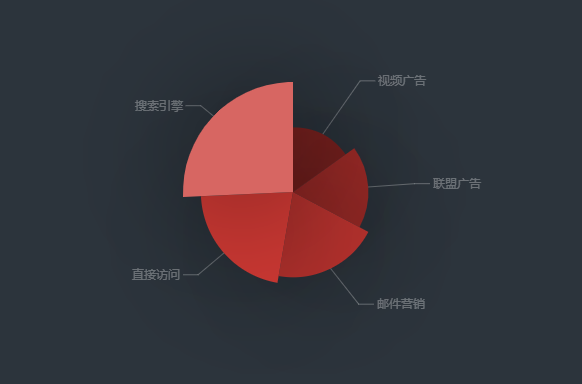
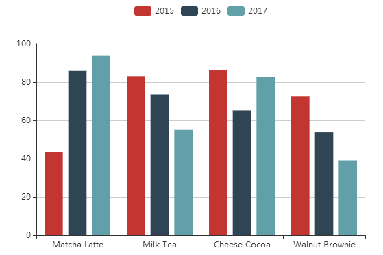
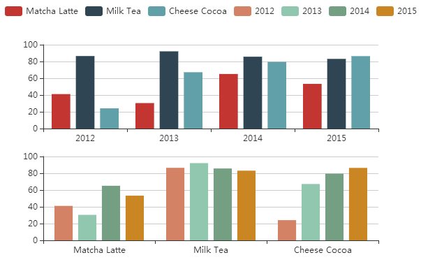
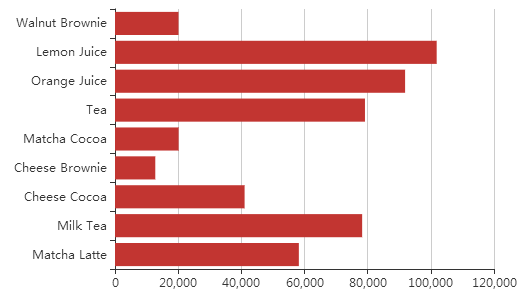

## 目录
* 1 HelloWorld 实例
	* 1.1 代码示例
	* 1.2 效果示例
* 2 个性化图表的样式
	* 2.1 饼图
	* 2.2 南格尔图
	* 2.3 其他效果
* 3 ECharts 样式简介
	* 3.1 颜色主题
	* 3.2 调色盘
	* 3.3 直接样式
	* 3.4 视觉映射
* 4 数据的视觉映射
	* 4.1 数据和维度
	* 4.2 visualMap 组件
* 5 使用 dataset 管理数据
	* 5.1 简单例子
	* 5.2 映射
	* 5.3 方向映射
	* 5.4 维度
	* 5.5 维度映射
	* 5.6 关于数据

## 1 HelloWorld 实例
### 1.1 代码示例
新建一个 `echarts.html` 文件，导入 `echarts.js`。

	<!DOCTYPE html>
	<html>
	<head>
	    <meta charset="utf-8">
	    <!-- 引入 ECharts 文件 -->
	    
	</head>
	</html>

为ECharts准备一个具备大小（宽高）的Dom。

	<body>
	    <!-- 为 ECharts 准备一个具备宽高的 DOM 容器 -->
	    

	</body>

然后就可以通过 echarts.init 方法初始化一个 echarts 实例并通过 setOption 方法生成一个简单的柱状图，下面是完整代码。

	<!DOCTYPE html>
	<html>
	<head>
	    <meta charset="utf-8">
	    <title>ECharts</title>
	    <!-- 引入 ECharts 文件 -->
	    
	</head>
	<body>
	    <!-- 为 ECharts 准备一个具备宽高的 DOM 容器 -->
	    

	    
	</body>
	</html>

### 1.2 效果示例
这样就诞生了第一个图表：

## 2 个性化图表的样式
### 2.1 简单饼图
先画一个简单的**饼图**。

	<!DOCTYPE html>
	<html>
	<head>
	    <meta charset="utf-8" />
	    <title>Nightingale</title>
	    
	</head>
	<body>
	    

	    
	</body>
	</html>

效果如下：

这里 `data` 属性值不像入门教程里那样每一项都是单个数值，而是一个包含 `name` 和 `value` 属性的对象，ECharts 中的数据项都是既可以只设成数值，也可以设成一个包含有名称、该数据图形的样式配置、标签配置的对象，具体见 **data** 文档。

### 2.2 南丁格尔图
通过设置 `roseType` 属性显示成**南丁格尔**图：

	roseType: 'angle'

效果如下：

### 2.3 其他效果
可以通过 `itemStyle` 设置**阴影**：
	
	itemStyle: {
	    // 阴影大小
	    shadowBlur: 200,
	    // 阴影水平方向偏移量
	    shadowOffsetX: 0,
	    // 阴影垂直方向偏移量
	    shadowOffsetY: 0,
	    // 阴影颜色
	    shadowColor: 'rgba(0, 0, 0, 0.5)'
	}

以及鼠标**高亮**：

	itemStyle: {
	    // 鼠标高亮
	    emphasis: {
	        shadowBlur: 200,
	        shadowColor: 'rgba(0,0,0,0.5)'
	    }
	}

更改**背景色**，要注意这里的更改是全局的，故直接在 `option` 下面设置：

	var option = {
		backgroundColor: '#2c343c'
	}

以及**文本样式**：

	// 全局设置
	var option = {
        textStyle: {
            color: 'rgba(255,255,255,0.3)'
        }
	}

	// 分别设置
	label: {
	    textStyle: {
	        color: 'rgba(255, 255, 255, 0.3)'
	    }
	}

对于饼图，还可以设置视觉**引导线**颜色：

    labelLine: {
        lineStyle: {
            color: 'rgba(255,255,255,0.3)'
        }
    }

跟 `itemStyle` 一样，`label` 和 `labelLine` 的样式也有 `emphasis` 状态。'

然后设置**扇形**颜色：

	itemStyle: {
	    // 设置扇形的颜色
	    color: '#c23531',
	    shadowBlur: 200,
	    shadowColor: 'rgba(0, 0, 0, 0.5)'
	}

最后添加光线体现**明暗度**：

    visualMap: {
        // 不显示 visualMap 组件，只用于明暗度的映射
        show: false,
        // 映射的最小值为 80
        min: 80,
        // 映射的最大值为 600
        max: 600,
        inRange: {
            colorLightness: [0, 1]
        }
    }

最后效果如下：

## 3 ECharts 样式简介
本节是对样式承上启下的描述。

前两种样式在本节描述，第三种样式上节已经描述，第四种样式在下节描述。

### 3.1 颜色主题
ECharts4 开始，新内置了两套主题，分别为 `light` 和 `dark`。

使用内置主题：

	var chart = echarts.init(dom, 'light');

	// 或者

	var chart = echarts.init(dom, 'dark');

使用定制主题：

如果主题保存为 JSON 文件，可以自行加载和注册:

	// 假设主题名是 “vintage”
	$.getJSON('xxx/xxx/vintage.json', function(themeJSON) {
		echarts.registerTheme('vintage', JSON.parse(themeJSON));
		var chart = echarts.init(dom, 'vintage');
	});

如果保存为 UMD 格式的 JS 文件，那么支持自注册，直接引入 JS 文件即可：

	// HTML 引入 vintage.js 文件后（假设主题名称是 "vintage"）
	var chart = echarts.init(dom, 'vintage');
	// ...

### 3.2 调色盘
调色盘可以在 `option` 中设置。它给定了一组颜色，图形、系列会自动从其中选择颜色。

有全局设置和局部设置。

	option = {
	    // 全局调色盘。
	    color: ['#c23531','#2f4554', '#61a0a8', '#d48265', '#91c7ae','#749f83',  '#ca8622', '#bda29a','#6e7074', '#546570', '#c4ccd3'],
	
	    series: [{
	        type: 'bar',
	        // 此系列自己的调色盘。
	        color: ['#dd6b66','#759aa0','#e69d87','#8dc1a9','#ea7e53','#eedd78','#73a373','#73b9bc','#7289ab', '#91ca8c','#f49f42'],
	        ...
	    }, {
	        type: 'pie',
	        // 此系列自己的调色盘。
	        color: ['#37A2DA', '#32C5E9', '#67E0E3', '#9FE6B8', '#FFDB5C','#ff9f7f', '#fb7293', '#E062AE', '#E690D1', '#e7bcf3', '#9d96f5', '#8378EA', '#96BFFF'],
	        ...
	    }]
	}

### 3.3 直接样式
直接样式设置是常用的样式设置方式。

如 `itemStyle`、`lineStyle`、`areaStyle`、`label` 等等，可以直接设置图形元素的颜色、线宽、点的大小、标签的文字、标签的样式等等。

直接样式的另一篇介绍参见上节。

### 3.4 视觉映射
visualMap 组件 能指定数据到颜色、图形尺寸的映射规则，详见下节。

## 4 数据的视觉映射
数据可视化：**数据**到**数据元素**的映射过程。这个过程也称为视觉编码，视觉元素也可称为视觉通道。

ECharts 的每种图标内置了这种映射过程。此外 ECharts 还提供了 visualMap 组件来提供通用的视觉映射。

visualMap 组件中可以使用的视觉元素有：

* 图形类别（symbol）
* 图形大小（symbolSize）
* 透明度（opacity）
* 颜色（color）
* 颜色透明度（colorAlpha）
* 颜色明暗度（colorLightness）
* 颜色饱和度（colorSaturation）
* 色调（colorHue）

注：本节关于维度与映射的内容参见下节。

### 4.1 数据和维度
ECharts 中的数据一般存放于 `series.data` 中。

根据图表类型的不同，数据的具体形式也可能有些许差异，如『线性表』，『树』，『图』等，但它们都有个共性：都是『数据项（dataItem）』的集合，每个数据项含有数据值（value）和其他信息（如果需要）。每个数据值，可以是单一的数值（一维）或者一个数组（多维）。

常见的数据形式为 `series.data`，是『线性表』，即一个普通数组：

	series: {
	    data: [
	        {       // 这里每一个项就是数据项（dataItem）
	            value: 2323, // 这是数据项的数据值（value）
	            itemStyle: {...}
	        },
	        1212,   // 也可以直接是 dataItem 的 value，这更常见。
	        2323,   // 每个 value 都是『一维』的。
	        4343,
	        3434
	    ]
	}

	series: {
	    data: [
	        {                        // 这里每一个项就是数据项（dataItem）
	            value: [3434, 129,  '圣马力诺'], // 这是数据项的数据值（value）
	            itemStyle: {...}
	        },
	        [1212, 5454, '梵蒂冈'],   // 也可以直接是 dataItem 的 value，这更常见。
	        [2323, 3223, '瑙鲁'],     // 每个 value 都是『三维』的，每列是一个维度。
	        [4343, 23,   '图瓦卢']    // 假如是『气泡图』，常见第一维度映射到x轴，
	                                 // 第二维度映射到y轴，
	                                 // 第三维度映射到气泡半径（symbolSize）
	    ]
	}

### 4.2 visualMap 组件
visualMap 组件定义了把数据的『维度』映射到『元素』的机制。

ECharts 提供连续型和分段型两种类型的 visualMap 组件，通过 `visualMap.type` 来区分。

其定义结构为：

	option = {
		visualMap:[					// 可以同时定义多个 visualMap 组件
			{						// 第一个 visualMap 组件
				type: 'continus',	// 定义为连续型
				...
			},
			{						// 第二个 visualMap 组件
				type: 'piecewise', 	// 定义为分段型
				...
			}
		],
		...
	}

其中分段型视觉映射组件有三种模式：

* 连续型数据平均分段: 依据 `visualMap-piecewise.splitNumber` 来自动平均分割成若干块。
* 连续型数据自定义分段: 依据 `visualMap-piecewise.pieces` 来定义每块范围。
* 离散数据（类别性数据）: 类别定义在 `visualMap-piecewise.categories` 中。

视觉映射方式的配置如下例：

	option = {
	    visualMap: [
	        {
	            type: 'piecewise'
	            min: 0,
	            max: 5000,
	            dimension: 3,       // series.data 的第四个维度（即 value[3]）被映射
	            seriesIndex: 4,     // 对第四个系列进行映射。
	            inRange: {          // 选中范围中的视觉配置
	                color: ['blue', '#121122', 'red'], // 定义了图形颜色映射的颜色列表，
	                                                    // 数据最小值映射到'blue'上，
	                                                    // 最大值映射到'red'上，
	                                                    // 其余自动线性计算。
	                symbolSize: [30, 100]               // 定义了图形尺寸的映射范围，
	                                                    // 数据最小值映射到30上，
	                                                    // 最大值映射到100上，
	                                                    // 其余自动线性计算。
	            },
	            outOfRange: {       // 选中范围外的视觉配置
	                symbolSize: [30, 100]
	            }
	        },
	        ...
	    ]
	};

更多详情参见地图实例。

## 5 使用 dataset 管理数据
### 5.1 简单例子
一个使用 `dataset` 的简单例子如下：

	<!DOCTYPE html>
	<html>
	<head>
	    <meta charset="utf-8" />
	    <title>Dataset</title>
	    
	</head>
	<body>
	    

	    
	</body>
	</html>

其中 `dateset` 中的数据来源（source）使用**二维数组**表示，也可以使用**对象数组**格式：

	option = {
	    legend: {},
	    tooltip: {},
	    dataset: {
	        // 这里指定了维度名的顺序，从而可以利用默认的维度到坐标轴的映射。
	        // 如果不指定 dimensions，也可以通过指定 series.encode 完成映射，参见后文。
	        dimensions: ['product', '2015', '2016', '2017'],
	        source: [
	            {product: 'Matcha Latte', '2015': 43.3, '2016': 85.8, '2017': 93.7},
	            {product: 'Milk Tea', '2015': 83.1, '2016': 73.4, '2017': 55.1},
	            {product: 'Cheese Cocoa', '2015': 86.4, '2016': 65.2, '2017': 82.5},
	            {product: 'Walnut Brownie', '2015': 72.4, '2016': 53.9, '2017': 39.1}
	        ]
	    },
	    xAxis: {type: 'category'},
	    yAxis: {},
	    series: [
	        {type: 'bar'},
	        {type: 'bar'},
	        {type: 'bar'}
	    ]
	};

效果如下：

### 5.2 映射
制作数据可视化图表的逻辑为：基于数据，在配置项中指定如何映射到图形。

映射到图形的映射规则概括为：

* 指定 `dateset` 的**列（column）/ 行（row）**映射为图形序列（series）。我称之为**“方向映射”**。
	* 可以使用 `series.seriesLayoutBy` 属性配置。
	* 默认为按照列（column）进行映射。
* 指定维度映射规则：如何从 `dateset` 的**维度（dimension）**（指一行/列）映射到坐标轴(axis)、提示框（tooltip）、标签（label）、图形元素大小颜色（visualMap）等。我称之为**“维度映射”**。
	* 可以使用 `series.encode` 属性，以及 `visualMap` 组件（如果有需要映射颜色大小等视觉维度）配置。
	* 默认为 X 轴声明类目轴，自动对应到 `dataset.source` 中的第一列；其余基于剩余列来显示数据。

### 5.3 方向映射
使用 `series.seriesLayoutBy` 属性配置。

关于方向的设置，举个例子：

	<!DOCTYPE html>
	<html>
	<head>
	    <meta charset="utf-8" />
	    <title>Dataset</title>
	    
	</head>
	<body>
	    

	    
	</body>
	</html>

效果如下：

### 5.4 维度
通过设置方向将系列（series）对应到“列”的时候，每一列就称为一个维度，而每一行称为一个数据项（item），反之亦然。

* 维度名可以定义在 dateset 的第一行（列第一列），ECharts 默认会自动探测。
	* 通过设置 `dataset.sourceHeader: true` 显示声明第一行（列）就是维度名（默认）
	* 通过设置 `dataset.sourceHeader: false` 表明第一行（列）就是数据
* 使用单独的 `dataset.dimensions` 或者 `series.dimensions` 定义维度（维度名、维度类型）

		var option1 = {
		    dataset: {
		        dimensions: [
		            {name: 'score'},
		            // 可以简写为 string，表示维度名。
		            'amount',
		            // 可以在 type 中指定维度类型。
		            {name: 'product', type: 'ordinal'}
		        ],
		        source: [...]
		    },
		    ...
		};
	
		var option2 = {
		    dataset: {
		        source: [...]
		    },
		    series: {
		        type: 'line',
		        // 在系列中设置的 dimensions 会更优先采纳。
		        dimensions: [
		            null, // 可以设置为 null 表示不想设置维度名
		            'amount',
		            {name: 'product', type: 'ordinal'}
		        ]
		    },
		    ...
		};
	* 大多数情况下，会自动判断维度类型，除非因为数据为空之类情况造成判断不够准确
	* 维度类型（dimension type）可以取这些值：
		* `number` - 默认，表示普通数据
		* `ordinal` - 对于类目、文本这些 string 类型的数据，如果需要能在数轴上使用，须是 'ordinal' 类型。ECharts 默认会自动判断这个类型。但是自动判断也是不可能很完备的，所以使用者也可以手动强制指定。
		* `time` - 表示时间数据。设置成 'time' 则能支持自动解析数据成时间戳（timestamp），比如该维度的数据是 '2017-05-10'，会自动被解析。如果这个维度被用在时间数轴（axis.type 为 'time'）上，那么会被自动设置为 'time' 类型。时间类型的支持参见 data。
		* `float` - 如果设置成 'float'，在存储时候会使用 TypedArray，对性能优化有好处。
		* `int` - 如果设置成 'int'，在存储时候会使用 TypedArray，对性能优化有好处。

### 5.5 维度映射
“维度映射”即数据到图形的映射。

#### 5.5.1 总体思路
总体思路如下例：

	<!DOCTYPE html>
	<html>
	<head>
	    <meta charset="utf-8" />
	    <title>Dataset</title>
	    
	</head>
	<body>
	    

	    
	</body>
	</html>

效果如下：

#### 5.5.2 关于 encode
关于 `encode` 属性，其支持情况如下：

	// 在任何坐标系和系列中，都支持：
	encode: {
	    // 使用 “名为 product 的维度” 和 “名为 score 的维度” 的值在 tooltip 中显示
	    tooltip: ['product', 'score']
	    // 使用 “维度 1” 和 “维度 3” 的维度名连起来作为系列名。（有时候名字比较长，这可以避免在 series.name 重复输入这些名字）
	    seriesName: [1, 3],
	    // 表示使用 “维度2” 中的值作为 id。这在使用 setOption 动态更新数据时有用处，可以使新老数据用 id 对应起来，从而能够产生合适的数据更新动画。
	    itemId: 2,
	    // 指定数据项的名称使用 “维度3” 在饼图等图表中有用，可以使这个名字显示在图例（legend）中。
	    itemName: 3
	}
	
	// 直角坐标系（grid/cartesian）特有的属性：
	encode: {
	    // 把 “维度1”、“维度5”、“名为 score 的维度” 映射到 X 轴：
	    x: [1, 5, 'score'],
	    // 把“维度0”映射到 Y 轴。
	    y: 0
	}
	
	// 极坐标系（polar）特有的属性：
	encode: {
	    radius: 3,
	    angle: 2
	}
	
	// 地理坐标系（geo）特有的属性：
	encode: {
	    lng: 3,
	    lat: 2
	}
	
	// 对于一些没有坐标系的图表，例如饼图、漏斗图等，可以是：
	encode: {
	    value: 3
	}

#### 5.5.3 关于默认映射
ECharts 针对最常见直角坐标系中的图表（折线图、柱状图、散点图、K线图等）、饼图、漏斗图，给出了简单的默认的映射，从而不需要配置 encode 也可以出现图表（一旦给出了 encode，那么就不会采用默认映射）。

默认的映射规则不易做得复杂，基本规则大体是：

* 在坐标系中（如直角坐标系、极坐标系等）
	* 如果有类目轴（axis.type 为 'category'），则将第一列（行）映射到这个轴上，后续每一列（行）对应一个系列。
	* 如果没有类目轴，假如坐标系有两个轴（例如直角坐标系的 X Y 轴），则每两列对应一个系列，这两列分别映射到这两个轴上。
* 如果没有坐标系（如饼图）
	* 取第一列（行）为名字，第二列（行）为数值（如果只有一列，则取第一列为数值）。

常见的映射方式FAQ：

> 问：如何把第三列设置为 X 轴，第五列设置为 Y 轴？

答：

	series: {
	    // 注意维度序号（dimensionIndex）从 0 开始计数，第三列是 dimensions[2]。
	    encode: {x: 2, y: 4},
	    ...
	}

> 问：如何把第三行设置为 X 轴，第五行设置为 Y 轴？

答：

	series: {
	    encode: {x: 2, y: 4},
	    seriesLayoutBy: 'row',
	    ...
	}

> 问：如何把第二列设置为标签？

答： 关于标签的显示 label.formatter，现在支持引用特定维度的值，例如：

	series: {
	    label: {
	        // `'{@score}'` 表示 “名为 score” 的维度里的值。
	        // `'{@[4]}'` 表示引用序号为 4 的维度里的值。
	        formatter: 'aaa{@product}bbb{@score}ccc{@[4]}ddd'
	    }
	}

> 问：如何让第 2 列和第 3 列显示在提示框（tooltip）中？

答：

	series: {
	    encode: {
	        tooltip: [1, 2]
	        ...
	    },
	    ...
	}

> 问：数据里没有维度名，那么怎么给出维度名？

答：

	dataset: {
	    dimensions: ['score', 'amount'],
	    source: [
	        [89.3, 3371],
	        [92.1, 8123],
	        [94.4, 1954],
	        [85.4, 829]
	    ]
	}

> 问：如何把第四列映射为气泡图的点的大小？

答：

	var option = {
	    dataset: {
	        source: [
	            [12, 323, 11.2],
	            [23, 167, 8.3],
	            [81, 284, 12],
	            [91, 413, 4.1],
	            [13, 287, 13.5]
	        ]
	    },
	    visualMap: {
	        show: false,
	        dimension: 2, // 指向第三列（列序号从 0 开始记，所以设置为 2）。
	        min: 2, // 需要给出数值范围，最小数值。
	        max: 15, // 需要给出数值范围，最大数值。
	        inRange: {
	            // 气泡尺寸：5 像素到 60 像素。
	            symbolSize: [5, 60]
	        }
	    },
	    xAxis: {},
	    yAxis: {},
	    series: {
	        type: 'scatter'
	    }
	};

### 5.6 关于数据
#### 5.6.1 数据格式转换
大多数二维表数据（如 xls，xlsx，Numbers）等，可以将数据导出为 JSON 格式，输入到 `dataset.source` 中。

> **技巧**
> 
> 可以先将各类数据转成 csv 文件，在通过 dsv 或者 PaperParse 将 csv 转成 JSON。

#### 5.6.2 多个数据引用
可以同时定义多个 `dataset`。系列（series）可以通过series.datasetIndex 来指定引用哪个 dataset。例如：

	var option = {
	    dataset: [{
	        // 序号为 0 的 dataset。
	        source: [...],
	    }, {
	        // 序号为 1 的 dataset。
	        source: [...]
	    }, {
	        // 序号为 2 的 dataset。
	        source: [...]
	    }],
	    series: [{
	        // 使用序号为 2 的 dataset。
	        datasetIndex: 2
	    }, {
	        // 使用序号为 1 的 dataset。
	        datasetIndex: 1
	    }]
	}