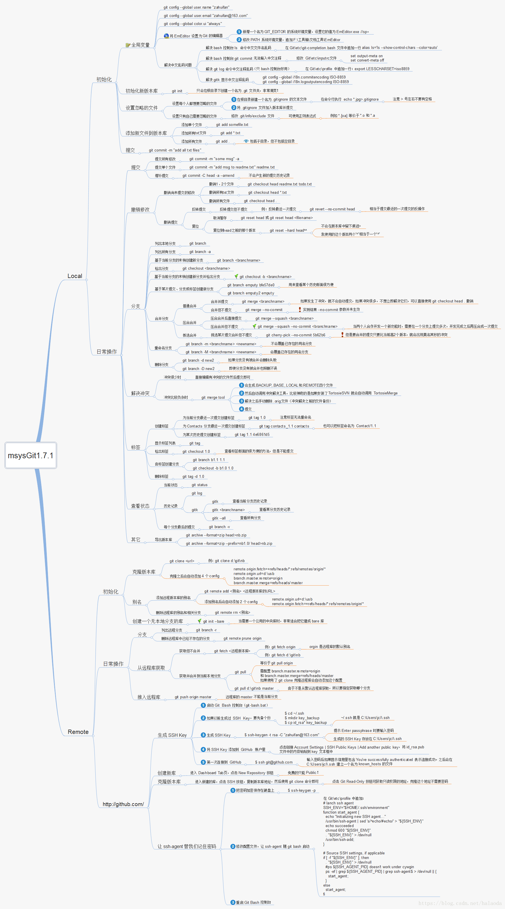

## 目录
[toc]

## 1 Git 简介
### 1.1 Git 的诞生
很多人都知道，Linus 在 1991 年创建了开源的 Linux，从此，Linux 系统不断发展，已经成为最大的服务器系统软件了。

Linus 虽然创建了 Linux，但 Linux 的壮大是靠全世界热心的志愿者参与的，这么多人在世界各地为 Linux 编写代码，那 Linux 的代码是如何管理的呢？

事实是，在2002年以前，世界各地的志愿者把源代码文件通过diff的方式发给 Linus，然后由 Linus 本人通过手工方式合并代码！

你也许会想，为什么 Linus 不把 Linux 代码放到版本控制系统里呢？不是有 CVS、SVN 这些免费的版本控制系统吗？因为Linus坚定地反对CVS 和 SVN，这些集中式的版本控制系统不但速度慢，而且必须联网才能使用。有一些商用的版本控制系统，虽然比CVS、SVN好用，但那是付费的，和Linux的开源精神不符。

不过，到了2002年，Linux系统已经发展了十年了，代码库之大让Linus很难继续通过手工方式管理了，社区的弟兄们也对这种方式表达了强烈不满，于是Linus选择了一个商业的版本控制系统BitKeeper，BitKeeper的东家BitMover公司出于人道主义精神，授权Linux社区免费使用这个版本控制系统。

安定团结的大好局面在2005年就被打破了，原因是Linux社区牛人聚集，不免沾染了一些梁山好汉的江湖习气。开发Samba的Andrew试图破解BitKeeper的协议（这么干的其实也不只他一个），被BitMover公司发现了（监控工作做得不错！），于是BitMover公司怒了，要收回Linux社区的免费使用权。

Linus可以向BitMover公司道个歉，保证以后严格管教弟兄们，嗯，这是不可能的。实际情况是这样的：

Linus花了两周时间自己用C写了一个分布式版本控制系统，这就是Git！一个月之内，Linux系统的源码已经由Git管理了！牛是怎么定义的呢？大家可以体会一下。

Git迅速成为最流行的分布式版本控制系统，尤其是2008年，GitHub网站上线了，它为开源项目免费提供Git存储，无数开源项目开始迁移至GitHub，包括jQuery，PHP，Ruby等等。

历史就是这么偶然，如果不是当年BitMover公司威胁Linux社区，可能现在我们就没有免费而超级好用的Git了。

### 1.2 集中式和分布式
Linus 一直痛恨的 CVS 及 SVN 都是集中式的版本控制系统，而Git是分布式版本控制系统，集中式和分布式版本控制系统有什么区别呢？

**(1) 集中式**

先说集中式版本控制系统，版本库是集中存放在中央服务器的，而干活的时候，用的都是自己的电脑，所以要先从中央服务器取得最新的版本，然后开始干活，干完活了，再把自己的活推送给中央服务器。

中央服务器就好比是一个图书馆，你要改一本书，必须先从图书馆借出来，然后回到家自己改，改完了，再放回图书馆。

集中式版本控制系统最大的毛病就是必须联网才能工作，如果在局域网内还好，带宽够大，速度够快，可如果在互联网上，遇到网速慢的话，可能提交一个10M的文件就需要5分钟，这还不得把人给憋死啊。

**(2) 分布式**

分布式版本控制系统与集中式版本控制系统有何不同呢？

首先，分布式版本控制系统根本没有“中央服务器”，每个人的电脑上都是一个完整的版本库，这样，你工作的时候，就不需要联网了，因为版本库就在你自己的电脑上。

既然每个人电脑上都有一个完整的版本库，那多个人如何协作呢？比方说你在自己电脑上改了文件A，你的同事也在他的电脑上改了文件A，这时，你们俩之间只需把各自的修改推送给对方，就可以互相看到对方的修改了。

和集中式版本控制系统相比，分布式版本控制系统的安全性要高很多，因为每个人电脑里都有完整的版本库，某一个人的电脑坏掉了不要紧，随便从其他人那里复制一个就可以了。而集中式版本控制系统的中央服务器要是出了问题，所有人都没法干活了。

在实际使用分布式版本控制系统的时候，其实很少在两人之间的电脑上推送版本库的修改，因为可能你们俩不在一个局域网内，两台电脑互相访问不了，也可能今天你的同事病了，他的电脑压根没有开机。因此，分布式版本控制系统通常也有一台充当“中央服务器”的电脑，但这个服务器的作用仅仅是用来方便“交换”大家的修改，没有它大家也一样干活，只是交换修改不方便而已。

### 1.3 参考文档

https://git-scm.com/doc

## 2 创建仓库


### 2.1 创建本地仓库

**版本库**

又名<u>仓库</u>，英文名 <u>repositiory</u>，可简单理解为一个目录，其内所有文件可被 Git 管理，能够跟踪每个文件的修改、删除。

所有的版本控制系统只能跟踪<u>文本文件</u>的改动，如 TXT文件、网页、程序代码等，对于图片、视频等<u>二进制文件</u>只能知道每次更改前后的整体文件信息。

**创建本地仓库的步骤**

1. 打开 Git bash 命令行界面，在合适的位置创建空目录
2. 初始化一个 Git 仓库，使用 **`git init`** 命令
3. 添加文件到 Git 仓库
	* 使用命令 **`git add <file>`** 添加文件，可多次使用
	* 使用命令 **`git commit -m <message>`** 提交事务

通过以上的 `git add` 和 `git commit` 命令，就可以实现版本信息的记录。这类似于玩 RPG 游戏，每通过一关就进行存档，以免在冒险中出现意外，可以从最近的地方重新开始。Git 也是一样，每当你觉得文件修改到一定程度时，就可以通过 Git 保存一个快照，称之为 “commit”。

**相关命令**

* `git init` - 在当前目录新建一个 Git 代码库
* `git init [project-name]` - 新建一个目录，将其初始化为Git代码库

* 使用 `cd` 命令切换路径
* 使用 `pwd` 命令查看当前路径
* 使用 `mkdir` 创建文件夹

**注意：**

* Windows 系统务必使用英文路径名以避免各种不必要的麻烦

### 2.2 克隆远程仓库

**远程仓库**

Git 是分布式版本控制系统，同一个 Git 仓库可以分布到不同的机器上。

一般情况下，会有一台计算机充当服务器的角色，其他计算机都从中克隆一份仓库到本地，并且各自把各自的提交推送到服务器仓库内。可以自己搭建一个 Git 服务器，也可以使用 Github 这个网站，顾名思义，这个网站就是提供 Git 仓库托管服务的。

**克隆远程仓库的步骤**

使用 `git clone` 命令，拷贝一个 Git 仓库到本地，让自己能够查看该项目，或者进行修改。

例：拷贝 Github 上的项目

```shell
$ git clone https://github.com/tianqixin/runoob-git-test
Cloning into 'runoob-git-test'...
remote: Enumerating objects: 12, done.
remote: Total 12 (delta 0), reused 0 (delta 0), pack-reused 12
Unpacking objects: 100% (12/12), done.
```

**相关命令**

* `git clone [url]` - 下载一个项目和它的整个代码历史
  * `url` - 要拷贝的项目

### 3.3 本地推送远程

**加密传输设置**

首先注册 Github 账号，获得免费的 Git 远程仓库。

下面进行本地 Git 仓库与 Github 仓库之间的 SSH 加密传输设置：

* 第一步：创建 SSH Key

  首先进入主目录（`cd~`），然后进入 `.ssh` 目录（`cd .ssh`）

  查找是否有 `id_rsa` 和 `id_rsa.pub` 两个文件，没有就通过 shell（Windows 下为 Git Bash）创建：

  ```shell
  $ ssh-keygen -t rsa -C "youremail@example.com"
  ```

  如此能得到 `id_rsa` 和 `id_rsa.pub` 两个文件，这是 SSH Key 的秘钥对，`id_rsa` 是私钥，不能泄露出去，`id_rsa.pub` 是公钥，可以公开。

* 第二步：添加 SSH 公钥

  登录 Github，打开“Account settings”，“SSH and GPG Keys”页面，

  然后点击 “New SSH key”，填上任意 Title，在 Key 文本框粘贴 `id_rsa.pub` 文件的内容。

  Github 允许添加多个 Key，只需把每台电脑的 Key 都添加到 Github 即可。

**将本地仓库推送的远程仓库**

先按照 `2.1 创建本地仓库` 的方法，创建一个本地仓库。

```shell
# Create a new repository on the command line (教程见 `2 创建版本库`)

$ mkdir puresakura
$ cd puresakura/

$ git init						# 在目录中创建新的 Git 仓库
Initialized empty Git repository in /Users/tianqixin/www/puresakura/.git/

$ git add README.md				# 将文件添加到暂存区
$ git commit -m "first commit"	# 将暂存区内容添加到本地仓库中
[master (root-commit) d32cf1f] first commit
 2 files changed, 4 insertions(+)
 create mode 100644 README.md
 create mode 100644 hello.php
```

然后使用 `git remote` 连接，再用 `git push` 推送。

```shell
# Push an existing repository from the command line

$ git remote add origin git@github.com:SingularityP/puresakura.git	# 增加一个新的远程仓库，并命名
$ git push -u origin master											# 然后提交到 Github
```

**相关命令**

* `git remote` - 用于在远程仓库的操作
  * `git remote add [shortname] [url]` - 添加一个新的远程仓库，可以指定一个简短的名字

**问题记录**

根据 github 的提示执行以下操作，出现问题：

```shell
$ git remote add origin https://github.com/waylon-tech/ViT.git
error: remote origin already exists.
$ git branch -M main
$ git push -u origin main
error: src refspec main does not match any
error: failed to push some refs to 'https://github.com/waylon-tech/ViT.git'
```

针对第一个 error，使用 `git remote get-url` 和 `git remote set-url` 查看和调整云端地址为 ssh 的。

针对第二、三个 error，先将本地的项目 commit 一次，再重写执行 `git push -u origin main` 就好了。

## 4 时光机穿梭

### 4.1 获取版本信息
#### `git status`
该命令用于获取仓库当前状态，显示有变更的文件。

```shell
# 显示有变更的文件
$ git status
```

#### `git diff`
该命令用于查看所有文件的修改内容。

```shell
# 显示暂存区和工作区的差异
$ git diff

# 显示暂存区和上一个commit的差异
$ git diff --cached [file]

# 显示工作区与当前分支最新commit之间的差异
$ git diff HEAD

# 显示两次提交之间的差异
$ git diff [first-branch]...[second-branch]

# 显示今天你写了多少行代码
$ git diff --shortstat "@{0 day ago}"
```

【注】`git diff` 格式说明

```shell
$ git diff
diff --git a/readme.txt b/readme.txt
index d8036c1..013b5bc 100644
--- a/readme.txt
+++ b/readme.txt
@@ -1,2 +1,2 @@
-Git is a version control system.
+Git is a distributed version control system.
 Git is free software.
\ No newline at end of file
```

* 第一行 `diff -git a/f1 b/f1`

  表示结果为 git 格式的 diff，进行比较的是 a 版本的 f1（即变动前）和 b 版本的 f1（即变动后）。

* 第二行 `index d8036c1..013b5bc 100644`

  两个版本的 git 哈希值（index 区域的 `d8036c1` 对象与工作目录的 `013b5bc` 对象），最后六位数字式对象模式（普通文件，644权限）。

* 第三、四行 `--- a/readme.txt +++ b/readme.txt`

  表示进行比较的两个文件，"---"表示变动前的版本，"+++"表示变动后的版本。

* 第五行 `@@ -1,2 +1,2 @@`

  描述变动的位置，"-1,2"分成三个部分，减号表示第一个文件（即f1），"1"表示第 1 行，"2"表示连续 2 行，后面同理。

* 剩下部分

  描述变动的具体内容。

#### `git blame`

该命令用于查看指定文件的修改信息。

```shell
# 显示指定文件是什么人在什么时间修改过
$ git blame [file]
```

#### `git log`

该命令显示从最近到最远的提交日志。添加参数 `--pretty=oneline` 以简化信息。

```shell
# 显示当前分支的版本历史
$ git log

# 显示commit历史，以及每次commit发生变更的文件
$ git log --stat

# 搜索提交历史，根据关键词
$ git log -S [keyword]

# 显示某个commit之后的所有变动，每个commit占据一行
$ git log [tag] HEAD --pretty=format:%s

# 显示某个commit之后的所有变动，其"提交说明"必须符合搜索条件
$ git log [tag] HEAD --grep feature

# 显示某个文件的版本历史，包括文件改名
$ git log --follow [file]
$ git whatchanged [file]

# 显示指定文件相关的每一次diff
$ git log -p [file]

# 显示过去5次提交
$ git log -5 --pretty --oneline
```

#### `git shortlog`

该命令对 `git log` 的输出进行汇总，整理成适合于产品发布说明的日志。

```shell
# 显示所有提交过的用户，按提交次数排序
$ git shortlog -sn
```

#### `git reflog`

该命令显示分支的命令操作日志。

```shell
# 显示当前分支的最近几次提交
$ git reflog
```

#### `git show`

```bash
# 显示某次提交的元数据和内容变化
$ git show [commit]

# 显示某次提交发生变化的文件
$ git show --name-only [commit]

# 显示某次提交时，某个文件的内容
$ git show [commit]:[filename]
```

### 4.6 文件增删

#### `git add`

该命令用于将文件添加至暂存区。

```shell
# 添加指定文件到暂存区
$ git add [file1] [file2] ...

# 添加指定目录到暂存区，包括子目录
$ git add [dir]

# 添加当前目录的所有文件到暂存区
$ git add .

# 添加每个变化前，都会要求确认
# 对于同一个文件的多处变化，可以实现分次提交
$ git add -p
```

#### `git rm`

该命令用于删除暂存区的文件。

```shell
# 删除工作区文件，并且将这次删除放入暂存区
$ git rm [file1] [file2] ...

# 停止追踪指定文件，但该文件会保留在工作区
$ git rm --cached [file]
```

#### `git mv`

该命令用于重命名暂存区的文件。

```shell
# 改名文件，并且将这个改名放入暂存区
$ git mv [file-original] [file-renamed]
```

### 4.2 代码提交

#### `git commit`

该命令用于提交暂存区的文件。

```shell
# 提交暂存区到仓库区
$ git commit -m [message]

# 提交暂存区的指定文件到仓库区
$ git commit [file1] [file2] ... -m [message]

# 提交工作区自上次commit之后的变化，直接到仓库区
$ git commit -a

# 提交时显示所有diff信息
$ git commit -v

# 使用一次新的commit，替代上一次提交
# 如果代码没有任何新变化，则用来改写上一次commit的提交信息
$ git commit --amend -m [message]

# 重做上一次commit，并包括指定文件的新变化
$ git commit --amend [file1] [file2] ...
```

【注】提交内容解析

Git 有一个地方比其他版本控制系统优秀，就是 Git 跟踪并管理的<u>是修改，而非文件</u>。

考虑如下操作过程：

	第一次修改 -> git add -> 第二次修改 -> git commit

可以发现第二次修改并不会被提交。此时可以继续 `git add` 再 `git commit`，或者两次修改后 `git add` 和 `git commit`。

### 4.3 分支管理

#### `git branch`

该命令用于管理仓库的各个分支。

```shell
# 列出所有本地分支
$ git branch

# 列出所有远程分支
$ git branch -r

# 列出所有本地分支和远程分支
$ git branch -a

# 新建一个分支，但依然停留在当前分支
$ git branch [branch-name]

# 新建一个分支，并切换到该分支
$ git checkout -b [branch]

# 新建一个分支，指向指定commit
$ git branch [branch] [commit]

# 新建一个分支，与指定的远程分支建立追踪关系
$ git branch --track [branch] [remote-branch]

# 建立追踪关系，在现有分支与指定的远程分支之间
$ git branch --set-upstream [branch] [remote-branch]

# 移动/重命名一个分支，包括 config 和 reflog
# With a -m or -M (Shortcut for --move --force) option, <oldbranch> will be renamed to <newbranch>
$ git branch -M oldbranch newbranch

# 删除分支
$ git branch -d [branch-name]

# 删除远程分支
$ git push origin --delete [branch-name]
$ git branch -dr [remote/branch]
```

#### `git checkout`

该命令用来切换分支、回滚内容。

```shell
# 切换到指定分支，并更新工作区
$ git checkout [branch-name]

# 切换到上一个分支
$ git checkout -
```

#### `git merge`

该命令用于合并分支。

```shell
# 合并指定分支到当前分支
$ git merge [branch]
```

#### `git cherry-pick`

该命令用于指定 `commit` 提及的分支。

```shell
# 选择一个 commit，合并进当前分支
$ git cherry-pick [commit]
```

### 4.4 标签管理

#### `git tag`

该命令用于管理标签。

```shell
# 列出所有tag
$ git tag

# 新建一个tag在当前commit
$ git tag [tag]

# 新建一个tag在指定commit
$ git tag [tag] [commit]

# 删除本地tag
$ git tag -d [tag]
```

```shell
# 删除远程tag
$ git push origin :refs/tags/[tagName]

# 查看tag信息
$ git show [tag]

# 提交指定tag
$ git push [remote] [tag]

# 提交所有tag
$ git push [remote] --tags

# 新建一个分支，指向某个tag
$ git checkout -b [branch] [tag]
```

### 4.5 回滚同步

首先看看 Git 版本的表示，或者称为版本指针（commit point）（自称）。

* `HEAD` - 当前版本
* `HEAD^` - 上个版本
* `HEAD^^` - 上上个版本，下面一次类推
* `HEAD~100` - 上100个版本

#### `git checkout`

该命令用来切换分支、回滚内容。

```shell
# 恢复暂存区的指定文件到工作区
$ git checkout [file]

# 恢复某个 commit 的指定文件到暂存区和工作区
$ git checkout [commit] [file]

# 恢复暂存区的所有文件到工作区
$ git checkout .
```

【注】分支切换可以用于撤销工作区的修改，这里针对以下两种情况：

* 一种是修改后还未添加到暂存区（stage），撤销后回到与版本库/仓库分支一样的状态；
* 一种是修改后已经添加到暂存区（stage），又做了修改，撤销后回到与暂存区一样的状态；

总之，该命令是文件回到最近一次 `git commit` 或 `git add` 时（哪个近回哪个）的状态。

#### `git reset`

该命令用于进行分支重置管理。

```shell
# 重置暂存区的指定文件，与上一次 commit 保持一致，但工作区不变
$ git reset [file]

# 重置暂存区与工作区，与上一次 commit 保持一致
$ git reset --hard

# 重置当前分支的指针为指定 commit，同时重置暂存区，但工作区不变
$ git reset [commit]

# 重置当前分支的 HEAD 为指定 commit，同时重置暂存区和工作区，与指定 commit 一致
$ git reset --hard [commit]

# 重置当前 HEAD 为指定 commit，但保持暂存区和工作区不变
$ git reset --keep [commit]
```

【注】进行版本回退后，无法通过查询到之后的版本信息，也无法找到版本 id。此时可以通过 `git reflog` 命令，查询历史操作。

#### `git revert`

该命令用于反转提交。

```shell
# 新建一个 commit，用来撤销指定 commit
# 后者的所有变化都将被前者抵消，并且应用到当前分支
$ git revert [commit]
```

#### `git stash`

该命令用于保存和恢复进度。

```shell
# 暂时将未提交的变化移除，稍后再移入
$ git stash
$ git stash pop
```

### 4.6 远程同步

#### `git fetch`

该命令用于获取远程版本库的<u>提交</u>。

```shell
# 下载远程仓库的所有变动
$ git fetch [remote]
```

#### `git remote`

该命令用于管理远程仓库。

```shell
# 显示所有远程仓库
$ git remote -v

# 显示某个远程仓库的信息
$ git remote show [remote]

# 增加一个新的远程仓库，并命名
$ git remote add [shortname] [url]
```

#### `git pull`

该命令用于拉回远程仓库的<u>提交</u>。

```shell
# 取回远程仓库的提交，并与本地分支合并
$ git pull [remote] [branch]
```

#### `git push`

该命令用于将<u>分支（包含本地的提交）</u>推送至远程仓库。

```shell
# 将当前分支推送到 remote 主机的对应分支
$ git push [remote]

# 如果当前分支只有一个追踪分支，那么主机名都可以省略
$ git push

# 上传本地指定分支到远程仓库
$ git push [remote] [branch]

# 如果当前分支与多个主机存在追踪关系，那么 -u 选项会指定一个默认主机，后面就可以不加任何参数使用 git push
$ git push -u [remote] [branch]
$ git push -u origin master

# 强行推送当前分支到远程仓库，即使有冲突
$ git push [remote] --force

# 推送所有分支到远程仓库
$ git push [remote] --all
```

【注】`remote` 表示远程仓库名 shortname，如创建时指定的 `origin`

### 4.7 配置文件

Git 的设置文件为 `.gitconfig`，它可以在用户主目录下（全局配置），也可以在项目目录下（项目配置）。

#### `git config`

该命令用于查询和修改配置。

```shell
# 显示当前的 Git 配置
$ git config --list

# 编辑 Git 配置文件
$ git config -e [--global]

# 设置提交代码时的用户信息
$ git config [--global] user.name "[name]"
$ git config [--global] user.email "[email address]"
```

### 4.8 其他

#### `git archive`

该命令用于文件归档打包。

```shell
# 生成一个可供发布的压缩包
$ git archive
```

## 5 概念辨析

### 5.1 工作区和暂存区

**概念解析**

* 工作区 - Working Directory，计算机内能够看到的目录
* 版本库 - Repository，工作区内的隐藏目录 `.git`
* 暂存区 - Stage/Index，版本库里面的一个重要目录
* 分支 - master为第一个分支，有一个 HEAD 指针指向


**工作逻辑**

前面我们将文件添加到 Git 的版本库时，分以下两步执行

* 第一步是用 `git add` 把添加文件，实际上就是把文件修改添加到暂存区（stage）
* 第二步是用 `git commit` 提交更改，实际上就是把暂存区（stage）的所有内容提交的当前分支（master）

**命令辨析**

* `git diff` 比较的是工作区文件与暂存区文件的区别（上次git add 的内容）
* `git diff --cached` 比较的是暂存区文件（上次git add 的内容）与仓库分支文件（上次git commit 后的内容）的区别
* `git diff HEAD` 比较的是工作区文件与仓库分支文件（上次git commit 后的内容）的区别

示意图如下

	-----------------------版本库--------------------------------------------
	                         |                       |
	                 git diff --cached           	 |
	                         |                       |
	-------------暂存区----------------------  git diff HEAD
	               |                                 |
	            git diff                             |
	               |                                 |
	-----工作区--------------------------------------------------------------

### 5.2 思维导图


