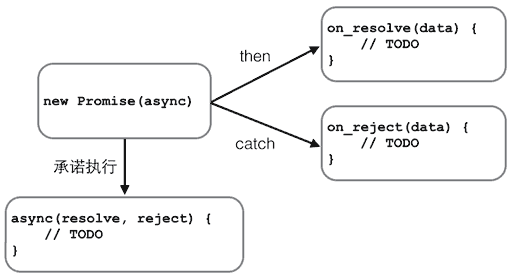

## 目录

[toc]

## 1 基础
JavaScript 是互联网上最流行的脚本语言，这门语言可用于 HTML 和 web，更可广泛用于服务器、PC、笔记本电脑、平板电脑和智能手机等设备。

### 1.1 基本语法
**A 使用方式**

HTML 中的脚本必须位于 `<script>` 与 `</script>` 标签之间。

(1) `<head>` 中的 JavaScript

```html
<!DOCTYPE html>
<html>
    <head>
        <script>
            function myFunction()
            {
                document.getElementById("demo").innerHTML="我的第一个 JavaScript 函数";
            }
        </script>
    </head>

    <body>

        <h1>我的 Web 页面</h1>

        <p id="demo">一个段落</p>

        <button type="button" onclick="myFunction()">尝试一下</button>

    </body>
</html>
```

(2) `<body>` 中的 JavaScript

```html
<!DOCTYPE html>
<html>
    <body>
        <h1>我的 Web 页面</h1>

        <p id="demo">一个段落</p>

        <button type="button" onclick="myFunction()">尝试一下</button>

        <script>
            // Tip: JavaScript 放到了页面代码的底部，这样就可以确保在 <p> 元素创建之后再执行脚本
            function myFunction()
            {
                document.getElementById("demo").innerHTML="我的第一个 JavaScript 函数";
            }
        </script>

    </body>
</html>
```

(3) 外部的 JavaScript

```html
<!DOCTYPE html>
<html>
    <body>
        <script src="myScript.js"></script>
    </body>
</html>
```

**B 注释**

* `//...` - 单行注释
* `/*...*/` - 多行注释

**C 输出**

JavaScript 没有任何打印或者输出的函数。

JavaScript 可以通过不同的方式来输出数据：

1. 使用 **`window.alert()`** 弹出警告框。
* 使用 **`document.write()`** 方法将内容写到 HTML 文档中。
* 使用 **`innerHTML`** 写入到 HTML 元素。
* 使用 **`console.log()`** 写入到浏览器的控制台。

例如：

```html
<script> 
    // 1. 弹窗警告
    window.alert(5 + 6);

    // 2. 写入 HTML 文档
    document.write(Date()); 

    // 3. 写入 HTML 元素
    document.getElementById("demo").innerHTML = "段落已修改。"; 

    // 4. 写到控制台
    console.log("Hello World!"); 
</script> 
```

### 1.2 数据类型及变量
**A 数值类型（number）**

```javascript
123;		// 整数123
0.456;		// 浮点数0.456
-99			// 负数
NaN;		// Not a Number
Infinity;	// 无穷大

1.2345e6	// 科学计数法数字
0xff00;		// 十六进制数
```

* 可以进行四则运算 `+`，`-`，`*`，`/`，以及求余 `%`
* 可以通过 `=`，`+=`，`-=`，`*=`，`/=`，`%=`进行赋值运输
* 可进行自加自减运算 `++`，`--`

**B 字符串类型**

字符串是用单引号 `'` 或双引号 `"` 括起来的文本。

**C 布尔类型**

```javascript
true;	// 真值
false;	// 假值
```

可以进行以下运算：

逻辑运算符：

* `&&` - 与
* `||` - 或
* `!` - 非

比较运算符：

* `>` - 大于
* `>=` - 大于等于
* `<` - 小于
* `<=` - 小于等于
* `==` - 相等，会自动转换数据类型
* `===` - 相等，不会自动转换数据类型，即同时比较数值和类型
	* 例外 - `NaN === NaN` 为 `false`，用 `isNaN()` 来判断
	* 注意 - 整数运算可能产生浮点数，注意浮点数的相等比较
* `!=` - 同理
* `!==` - 同理

条件运算符：

```javascript
variableName = (condition) ? value1 : value2
```

**D 空类型**

* `null` - 空值
	* 注意 - `0`表示数值，`''` 表述长度为 0 的字符串，都与此不同
* `undefined` - 表示值未定义，仅在判断函数参数是否传递的情况下有用

**E 数组类型**

字面表示：

```javascript
[0, 3.14, 'Hello', null, true];
```

函数表示：

```javascript
new Array(1, 2, 3);
```

数组使用带中括号的索引访问，索引下标从零开始。

**F 对象类型**

JavaScript对象是一组由键-值组成的无序集合。

* 键，又称为属性，都是字符串类型。

* 值，通过 `对象变量.属性名` 或者 `对象变量[属性名]` 获取属性值，可以是任意数据类型。

字面表示：

```javascript
{firstName:"John", lastName:"Doe", age:50, eyeColor:"blue"}
```

**G 变量**

初始化：

1. 命名：使用字母、数字、下划线和`$`的组合，且不能以数字开头。
2. 声明：使用语句`var`声明一次：`var 变量名`。(此时变量的值将是 `undefined`)
3. 赋值：同一变量可以反复用不同的数据类型赋值：`变量名 = 变量值`。

提示：

* JavaScript **变量均为对象**。当您声明一个变量时，就创建了一个新的对象。
* 为了规范变量声明（防止不用 `var` 进行声明等），在 JavaScript 代码的第一行添加 `use strict;`，使用 **strict 模式**。
* 一个好的编程习惯是，在代码开始处，**统一**对需要的变量进行声明。

案例演示：

```javascript
// 数值
var x = 7;
// 字符串
var str = '';
// 布尔类型
var judge = true;
// 数组
var arr = [];
var arr = new Array(1, 2, 3);
// 对象
var obj = {
    name: 'Sakura',
    city: 'East Fancy Town'
};
```

**类型操作**

(1) 类型查看

可以使用 `typeof` 操作符来查看 JavaScript 变量的数据类型。

```v
typeof "John"                  // 返回 string 
typeof 3.14                    // 返回 number
typeof NaN                     // 返回 number，注意！
typeof false                   // 返回 boolean
typeof [ 1,2,3,4]              // 返回 object，注意！
typeof {name: 'John', age:34}  // 返回 object
typeof new Date()              // 返回 object，注意！
typeof function () {}          // 返回 function
typeof myCar                   // 返回 undefined (if myCar is not declared) ，注意！
typeof null                    // 返回 object，注意！
```

对于 JavaScript Array 或 JavaScript Date ，就无法通过 `typeof` 来判断他们的类型。

这是可以考虑使用 `constructor` 属性，他返回所有 JavaScript 变量的构造函数。

```javascript
"John".constructor                 // 返回函数 String()  { [native code] }
(3.14).constructor                 // 返回函数 Number()  { [native code] } 
false.constructor                  // 返回函数 Boolean() { [native code] }
[1,2, 3,4].constructor             // 返回函数 Array()   { [native code] }
{name:'John', age:34}.constructor  // 返回函数 Object()  { [native code] }
new Date().constructor             // 返回函数 Date()    { [native code] }
function() {}.constructor          // 返回函数 Function(){ [native code] }
```

从而定制一下判断函数：

```javascript
function isArray(myArray) { 
    return myArray.constructor.toString().indexOf("Array") > -1; 
}

function isDate(myDate) { 
    return myDate.constructor.toString().indexOf("Date") > -1; 
}
```

(2) 类型转换

数字 -> 字符串：

* `String()` - 全局方法
* `toString()` - Number 方法
* `toExponential()` - 把对象的值转换为指数计数法。
* `toFixed()` - 把数字转换为字符串，结果的小数点后有指定位数的数字。
* `toPrecision()` - 把数字格式化为指定的长度。

	```javascript
	String(x)         // 将变量 x 转换为字符串并返回
	String(123)       // 将数字 123 转换为字符串并返回
	String( 100+ 23)  // 将数字表达式转换为字符串并返回
	
	x.toString() 
	(123).toString() 
	(100 + 23).toString()
	```

布尔值 -> 字符串：

* `String()` - 全局方法 
* `toString()` - Boolean 方法

	```javascript
	String(false)        // 返回 "false"
	String(true)         // 返回 "true"
	
	false.toString()     // 返回 "false"
	true.toString()      // 返回 "true"
	```

日期 -> 字符串：

* `String()` - 全局方法 
* `toString()` - Date 方法
* `getDate()` - 从 Date 对象返回一个月中的某一天 (1 ~ 31)。
* `getDay()` - 从 Date 对象返回一周中的某一天 (0 ~ 6)。
* `getFullYear()` - 从 Date 对象以四位数字返回年份。
* `getHours()` - 返回 Date 对象的小时 (0 ~ 23)。
* `getMilliseconds()` - 返回 Date 对象的毫秒(0 ~ 999)。
* `getMinutes()` - 返回 Date 对象的分钟 (0 ~ 59)。
* `getMonth()` - 从 Date 对象返回月份 (0 ~ 11)。
* `getSeconds()` - 返回 Date 对象的秒数 (0 ~ 59)。
* `getTime()` - 返回 1970 年 1 月 1 日至今的毫秒数。

	```javascript
	String(Date())      // 返回 Thu Jul 17 2014 15:38:19 GMT+0200 (W. Europe Daylight Time)
	
	Date().toString()   // 返回 Thu Jul 17 2014 15:38:19 GMT+0200 (W. Europe Daylight Time)
	```

字符串 -> 数字：

* `Number()` - 全局方法
* `parseFloat()` - 	解析一个字符串，并返回一个浮点数。
* `parseInt()` - 解析一个字符串，并返回一个整数。
* `+` - 用于将变量转换为数字，如果变量不能转换，它仍然会是一个数字，但值为 NaN (不是一个数字):

	```javascript
	Number("3.14")    // 返回 3.14
	Number(" ")       // 返回 0 
	Number("")        // 返回 0 
	Number("99 88")   // 返回 NaN
	
	var y = "5";      // y 是一个字符串
	var x = + y;      // x 是一个数字
	var y = "John";   // y 是一个字符串
	var x = + y;      // x 是一个数字 (NaN)
	```

布尔值 -> 数字：

* `Number()` - 全局方法

	```javascript
	Number(false)     // 返回 0
	Number(true)      // 返回 1
	```

日期 -> 数字：

* `Number()` - 全局方法
* `getTime()` - 返回 1970 年 1 月 1 日至今的毫秒数。

	```javascript
	d = new Date(); 
	Number(d)          // 返回 1404568027739
	
	d = new Date(); 
	d.getTime()        // 返回 1404568027739
	```

自动类型转换：

* 当 JavaScript 尝试操作一个 "错误" 的数据类型时，会自动转换为 "正确" 的数据类型。

  ```javascript
  5 + null    // 返回 5         because null is converted to 0
  "5" + null  // 返回"5null"   because null is converted to "null" 
  "5" + 1     // 返回 "51"      because 1 is converted to "1"  
  "5" - 1     // 返回 4         because "5" is converted to 5
  ```

* 当尝试输出一个对象或一个变量时 JavaScript 会自动调用变量的 toString() 方法。

	```javascript
	document.getElementById("demo").innerHTML = myVar; 
	
	// if myVar = {name:"Fjohn"}  // toString 转换为 "[object Object]"
	// if myVar = [1,2,3,4]       // toString 转换为 "1,2,3,4"
	// if myVar = new Date()      // toString 转换为 "Fri Jul 18 2014 09:08:55 GMT+0200"
	// if myVar = 123             // toString 转换为 "123"
	// if myVar = true            // toString 转换为 "true"
	// if myVar = false           // toString 转换为 "false"
	```

### 1.3 深入字符串
**A 转义字符**

* `\'` - 单引号
* `\"` - 双引号
* `\n` - 换行符
* `\t` - 制表符
* `\\` - 反斜杠
* `\x##` - ASCII字符
* `\u####` - Unicode字符

**B 多行字符串**

使用反引号`来表示多行字符串：

```javascript
`这是一个
多行
字符串。`;
```

**C 模板字符串**

可以使用**加号`+`**来连接字符串。

在**模板字符串中**使用`${变量名}`来将引入变量。免去了大量加号的麻烦。

案例演示：

```javascript
var name = 'Sakura';
var message = `Hello, ${name}!`;
```

**D 字符串操作**

* `str.length` - 获取字符串的长度
* `str[index]` - 获取字符串指定位置的字符
	* 注意 - 字符串不可变，进行赋值操作没有任何效果
* `toUpperCase()` - 将一个字符串全部变为大写
* `toLowerCase()` - 将一个字符串全部变为小写
* `trim()` - 移除字符串首尾空白
* `indexOf(str)` - 搜索指定字符串出现的位置
* `substring(start,end)` - 返回指定索引区间的子串
	* 注意 - 子串不包括end
* `split(str)` - 按照指定字符串切割字符串为数组，`str` 可以为 [RegExp](#3.3 RegExp)
* `concat()` - 连接两个或多个字符串，返回连接后的字符串
* `charAt()` - 返回指定索引位置的字符
* `indexOf()` - 返回字符串中检索指定字符第一次出现的位置
* `lastIndexOf()` - 返回字符串中检索指定字符最后一次出现的位置
* `match()` - 	找到一个或多个正则表达式的匹配
* `replace()` - 替换与正则表达式匹配的子串
* `search()` - 检索与正则表达式相匹配的值

### 1.4 深入数组
* `arr.length` - 获取数组长度
	* 注意 - 改变该值会改变数组长度
* `arr[下标]` - 获取并可修改数组指定位置的元素
	* 注意 - 若数组下标越界，会引起数组长度的变化
* `indexOf(元素)` - 搜索指定元素出现的位置
* `slice(start,end)` - 返回指定索引区间的子列
	* 提示 - 参数项为空时会获取字符串本身，可利用此点实现数组复制
	* 注意 - 子列不包括 `end`
* `push(元素1, 元素2, ...)` - 向数组末尾添加若干个元素
* `pop()` - 删除数组末尾的一个元素
	* 注意 - 空数组使用时返回`undefined`
* `unshift(元素1, 元素2, ...)` - 向数组头部添加若干个元素
* `shift()` - 删除数组头部的一个元素
	* 注意 - 空数组使用时返回`undefined`
* `sort()` - 对当前数组进行排序
	* 注释 - 自定义顺序会在后面提到
	* 注意- 会修改当前数组
* `reverse()` - 反转数组
* `splice(start,end,元素1,元素2,...)` - 替换数组中的子列
	* 提示 - 可以只添加：`start`为插入位置，`end` 取 0；可以只删除：各元素项置空
* `concat(arr1/元素1,arr2/元素2,...)` - 连接数组
	* 注意 - 该函数返回一个新数组
* `join(str)` - 将当前数组每个元素用指定字符串连接起来，返回总字符串
	* 注释 - 如果数组的元素不是字符串，会自动转换为字符串再连接

### 1.5 深入对象
* `obj.属性名` - 获取并可添加对象的属性
	* 注意 - 访问不存在的属性返回 `undefined`
* `obj['属性名']` - 获取并可添加对象的属性，访问属性名可以不是有效变量
	* 注意 - 访问不存在的属性返回 `undefined`
* `delete obj.属性名` - 删除指定属性
* `delete obj['属性名']` - 删除指定属性，访问属性名可以不是有效变量
* `属性名 in obj` - 检测对象是否有指定属性
	* 注意 - 继承的属性也会检测到
* `obj.hasOwnProperty('属性名')` - 检测对象自身是否拥有指定属性

### 1.6 函数初步
在JavaScript中，函数即对象，可以随意地被程序操控。

**语法：**

```javascript
// 定义
function functionname(var1,var2)
{
    return 0;
}

// 调用
myFunction(argument1,argument2)
```

**示例：**

```html
<button onclick="myFunction('Harry Potter','Wizard')">Try it</button>

<script>
    function myFunction(name,job)
    {
        alert("Welcome " + name + ", the " + job);
    }
</script>
```

详细内容在后文叙述。

### 1.7 流程语句
#### 1.7.1 条件语句
**语法**

```javascript
variableName=(condition) ? value1 : value2

if (条件1) {
    语句;
} else if (条件2) {
    语句;
} else {
    语句;
}

switch(n)
{
    case 1:
        执行代码块 1
        break;
    case 2:
        执行代码块 2
        break;
    default:
        n 与 case 1 和 case 2 不同时执行的代码
}
```

**注意**

若判断值不是布尔类型，JavaScript会把`null`、`undefined`、`0`、`NaN`和`''`视为`false`，其余为`true`。

#### 1.7.2 循环语句
**语法**

```javascript
for (var k=start; k<=end; k++) {
    语句;
}

for (var item in obj) {
    语句;
}

for (var item of iterable) {
    语句;
}

while (条件) {
    语句;
}

do {
    语句;
} while (条件);
```

**注释**

* 第一种`for ()`循环用于<strong>索引遍历</strong>数组；第二种`for...in`循环用于<strong>属性遍历</strong>对象或数组；第三种`for...of`循环用于<strong>对象遍历</strong>数组，只循环`iterable`类型本身的元素。
* 使用`break`，`continue`来控制循环的进行。

**注意**

* `for...in`循环数组得到是**索引的`String`**，不是`Number`

**技巧**

对于`iterable`类型（`Array`，`Map`，`Set`等），还可以通过内置的`forEach()`方法遍历：

```javascript
iter.forEach(function (element, index, array) {
    // element: 指定当前元素的值
    // index: 指向当前索引
    // array: 指向Array对象本身
    console.log(element + ', index = ' + index);
});
```

### 1.8 Map和Set
为了解决对象类型键只能为字符串的问题，引入了 Map 和 Set。

**(1) Map**

Map 是一组键值对结构，特点是具有极快的查找速度。

**语法**

```javascript
// 创建
var map = new Map([[键1:值1], [键2:值2], ...]);
// 访问
map.get('键');
// 设置
map.set('键');
```

**(2) Set**

Set 是一组键序列，特点是无重复，因为键不能重复。

**语法**

```javascript
// 创建
var set = new Set([键1, 键2, ...]);
// 访问
set;
// 添加
set.add(键);
// 删除
set.delete(键);

// 交并补运算
```

**技巧**

* 使用 Set 快速去重（去除重复元素方法 1）

	```javascript
	var set = new Set(arr);
	```

**注意**

Set没有索引，使用 `forEach()` 方法回调的前两个参数都是元素本身。

### 1.9 事件
事件是可以被 JavaScript 侦测到的行为。也称为 HTML DOM 事件

#### HTML 事件
HTML 事件可以是浏览器行为，也可以是用户行为。

HTML 网页中的每个元素都可以产生某些可以触发 JavaScript 函数的事件。

一下是一些常见的 HTML 事件：

<table class="reference" style="width: 100%">
    <tbody>
        <tr>
            <th>事件</th>
            <th>描述</th>
        </tr>
        <tr>
            <td>onchange</td>
            <td> HTML 元素改变</td>
        </tr>
        <tr>
            <td>onclick</td>
            <td>用户点击 HTML 元素</td>
        </tr>
        <tr>
            <td>onmouseover</td>
            <td>用户在一个 HTML 元素上移动鼠标</td>
        </tr>
        <tr>
            <td>onmouseout</td>
        	<td>用户从一个 HTML 元素上移开鼠标</td>
        </tr>
        <tr>
            <td>onkeydown</td>
            <td>用户按下键盘按键</td>
        </tr>
        <tr>
            <td>onload</td>
            <td>浏览器已完成页面的加载</td>
        </tr>
    </tbody>
</table>

更多 HTML DOM 事件请查阅相关资料。

#### 事件触发 JavaScript
HTML 元素中添加事件属性，使用 JavaScript 代码来添加 HTML 元素。（HTML 事件属性可以直接执行 JavaScript 代码）

单引号形式：

```html
<some-HTML-element some-event='some JavaScript'>
```

双引号形式：

```html
<some-HTML-element some-event="some JavaScript">
```

示例：

```html
<!-- 修改某个 HTML 元素 -->
<button onclick='getElementById("demo").innerHTML=Date()'>The time is?</button>

<!-- 修改自身，注意 this.innerHTML 中 this 的使用 -->
<button onclick="this.innerHTML=Date()">The time is?</button>
```

### 1.10 表单验证
#### 必填（或必选）项目
函数：检查用户是否已填写表单中的必填（或必选）项目。

假如必填或必选项为空，那么警告框会弹出，并且函数的返回值为 `false`；

否则函数的返回值则为 `true`（意味着数据没有问题）；

```javascript
function validateForm()        
{        
    var x=document.forms["myForm"]["fname"].value; // 留意表单内容的提取手法  
    if (x==null || x=="")        
    {        
        alert("First name must be filled out");        
        return false;        
    }        
}
```

以上函数在 form 表单提交时被调用:

```html
<form name="myForm" action="demo_form.asp" onsubmit="return validateForm()" method="post"> 
    First name: <input type="text" name="fname">  <!-- 留意 onsubmit 中的函数调用方式 -->
    <input type="submit" value="Submit"> 
</form>
```

#### E-mail 验证
函数：检查输入的数据是否符合电子邮件地址的基本语法。

输入的数据必须包含 @ 符号和点号(.)；

```javascript
// @ 不可以是邮件地址的首字符，并且 @ 之后需有至少一个点号；

function validateForm()        
{        
    var x=document.forms["myForm"]["email"].value;        
    var atpos=x.indexOf("@");        
    var dotpos=x.lastIndexOf(".");        
    if (atpos<1 || dotpos<atpos+2 || dotpos+2>=x.length)        
    {        
        alert("Not a valid e-mail address");        
        return false;        
    }       
}
```

下面是连同 HTML 表单的完整代码：

```html
<form name="myForm" action="demo_form.asp" onsubmit="return validateForm();" method="post"> 
    Email: <input type="text" name="email"> 
    <input type="submit" value="Submit"> 
</form>
```

### 1.11 `javascript:void(0)` 含义
**含义：**

`javascript:void(0)` 中最关键的是 `void` 关键字， `void` 是 JavaScript 中非常重要的关键字，该操作符指定要计算一个表达式但是不返回值。

示例：

```html
<head> 
    <script type="text/javascript"> 
        <!-- 
        function getValue(){ 
            var a,b,c; 
            a = void ( b = 5, c = 7 ); 
            document.write('a = ' + a + ' b = ' + b +' c = ' + c ); 
        } 
        //--> 
    </script> 
</head>
```

其中，参数 a 将返回 undefined 。

**`href="#"` 与 `href="javascript:void(0)"` 的区别**

* `#` 包含了一个位置信息，默认的锚是 `#top` 也就是网页的上端
* `javascript:void(0)`，仅仅表示一个死链接

示例：

```html
<a href="javascript:void(0);">点我没有反应的!</a> 
<a href="#pos">点我定位到指定位置!</a> 
<br><br><br> <p id="pos">尾部定位点</p>
```

## 2 函数
### 2.1 定义和调用
**(1) 函数定义**

```javascript
function 函数名(参数1, 参数2) {
    语句;
    return 返回值;
}

var 函数变量 = function(参数1, 参数2) {
    语句;
    return 返回值;
};
```

**(2) 函数调用**

JavaScript 函数有 4 种调用方式。每种方式的不同在于 this 的指向，2.3 节会详细讨论。

```javascript
// 作为函数调用
函数变量名(参数1, 参数2);

// 作为方法调用
对象.函数变量名(参数1, 参数2);

// 构造函数调用
new 函数变量名(参数1, 参数2);

// 作为对象调用
函数变量名.call(对象名, 参数1, 参数2);
函数变量名.apply(对象名, [参数1, 参数2]);
```

**(3) 参数**

* 函数参数传递的过程是**值传递**
* 函数参数为对象传递的过程是**址传递**
* JavaScript 允许传入任意个参数。
	* 传入过多参数时，会自动忽略多余的参数。（在 `arguments` 中）
	* 传入过少参数时，会用 `undefined` 替代。
	* 技巧 - 可以通过如 `y = y || 0;` 来为参数指定默认参数
* `arguments` - 函数内使用的关键字变量，指向当前函数的调用者传入的所有参数，可按照 Array 使用
	* 技巧 - 该变量常用于判断插入参数的个数，用 `length` 属性
* `rest` - 用于存储可变参数的数组，在定义函数时添加 `...rest` 到参数列末尾，然后按照 Array 使用
	* 注意 - 若传入过少参数，`rest` 为空

**(4) 函数提升**

提升（Hoisting）是 JavaScript 默认将当前作用域提升到前面去的的行为。

因此，函数可以在声明之前调用：

```javascript
myFunction(5);               
function myFunction(y) {        
    return y * y;        
}
```

注意，使用表达式定义函数时无法提升。

**(5) 自调用函数**

先通过添加括号说明函数体为一个表达式，在后面紧跟`()`，则会自动调用。

示例：

```javascript
(function () { 
    var x = "Hello!!";      // 我将调用自己 
})();
```

**(6) 函数的对象本质**

在 JavaScript 中，函数本质上是一个函数对象。

使用 `typeof` 操作符判断函数类型将返回 "function"。

JavaScript 函数有 **属性** 和 **方法**。

**注释：**

* 函数定义作为对象的属性，称之为对象方法。
* 函数如果用于创建新的对象，称之为对象的构造函数

### 2.2 变量作用域与解构赋值
**(1) 变量机制**

**变量查找**

嵌套函数中，内部函数可以引用外部函数的变量；函数总是从内部向外部查找变量。

**变量提升**

JavaScript 函数定义时会先扫描整个函数体的语句，并把所有变量的声明提升到函数顶部，但不会提升变量的赋值。

因此，在函数内部首先声明所有变量。

**(2) 变量作用域**

**局部作用域**

* 函数内部声明的变量作用域为整个函数体
* `for`循环等**语句块**中无法定义具有局部作用域的变量，若用，使用关键字`let`声明变量：

  ```javascript
  for(let i=0; i<100; i++) {
      语句;
  }
  ```

* 关键字 `const` 用于**声明常量**，其也具有块级作用域

**全局作用域**

* JavaScript 默认有一个全局对象 `window`，全局作用域的变量实际上被绑定为 `window` 的一个属性
* 顶层函数的定义也被视为全局变量，并绑定到 `window` 对象：

	```javascript
	function hello() {
	    alert('hello');
	}
	
	hello();
	window.hello();
	```

**变量生存周期**

JavaScript 变量生命周期在它声明时初始化。

* 局部变量在函数执行完毕后销毁
* 全局变量在页面关闭后销毁

**技巧 - 命名空间**

JavaScript 只有一个全局作用域，不同的 JavaScript 文件如果使用了相同的全局变量，或者定义了相同名字的顶层函数，会造成命名冲突。为此，可以将变量和函数统一到一个全局变量中：

```javascript
var MYAPP = {};

MYAPP.x = 'var1';
MYAPP.f = function() {
    return 'function';
};
```

**(3) 解构赋值**

解构赋值是指同时对一组变量赋值。语法如下：

```javascript
// 数组解构赋值
var [x, y, z] = ['hello', 'JavaScript', 'ES6'];

// 数组嵌套赋值与忽略赋值
var [, [, z]] = ['hello', ['JavaScript', 'ES6']];

// 对象解构赋值
var person {
    name: 'Sakura',
    domain: 'PureSakura',
    age: 7
}
var {name, domain, age} = person;

// 对象嵌套赋值与默认赋值
var person {
    name: 'Sakura',
    age: 7,
    address: {
    	city: 'Guangzhou',
    	street: 'SakuraStreet',
    	zipcode: '777777'
    }
}
var {name, domain='PureSakura', address: {city, street}} = person
```

**注意**

对于已经声明的变量，再用解构赋值会出错，因为解构语句被解析为语句块；此时用**括号**将解构语句包围即可。

**技巧**

* 交换变量

  ```javascript
  var x=1, y=2;
  [x, y] = [y, x];
  ```

* 快速获取域名和路径

  ```javascript
  var {hostname:domain, pathname:path} = location;
  ```

* 快速创建对象（带默认值的函数参数）

	```javascript
	function buildDate([year, month, day, hour=0, minute=0, second=0]) {
	    return new Date(year + '-' + month + '-' + day + '-' + hour + '-' + minute + '-' + second);
	}
	
	buildDate([year: 2017, month:1, day:1]);
	```

### 2.3 方法及 `this` 指向详解
方法是在对象绑定的函数。

```javascript
var obj = {
    x: 'x';
    y: true;
    z: function() {
        语句;
    }
}
```

方法内可以使用 `this` 关键字，指向当前对象。下面详细介绍：

**(1) this关键字详解**

* 基本原则：谁调用指向谁
* 如果作为函数调用，则 `this` 指向全局对象（`window`）
* 如果作为方法调用，则 `this` 指向调用对象
* 如果构造函数调用，则 `this` 指向调用对象？？
* 如果作为对象调用，则 `this` 指向调用对象 (strict 模式) / `window` (非 strict 模式，首参为 `null` 或 `undefined`)

**注意**

* 使用 window 对象作为一个变量容易造成程序崩溃。要保证`this`指向正确对象，必须使用 `对象.方法()` 形式调用方法。

* 在对象方法内嵌套指定了函数再或者拿出对象内的函数（新变量指向），函数内`this`会丢失对象（因为是方法调用了该函数），而指向了 `underfined` (strict 模式) / `window` (非 strict 模式)。对此，有以下解决方案：

	* 中间变量暂存对象引用

	  ```javascript
	  var that = this;
	  ```

	* 使用apply函数

	  ```javascript
	  函数.apply(对象, [参数1, 参数2, ...]);
	  ```
	
	* 使用call函数
	
		```javascript
		函数.call(对象, 参数1, 参数2, ...);
		```

**(2) 装饰器**

使用 `apply` / `call` 函数可以设计装饰器：

```javascript
var old_function = function;
window.function = function() {
    语句;
    return old_function.apply(null, arguments);
}
```

### 2.4 高阶函数
**(1) map/reduce**

map/reduce 的概念同 Python。

在 JavaScript 中，`map()`和`reduce()`函数定义在`Array`中。

语法：

```javascript
arr.map(func);
arr.reduce(func);
```

案例演示：

```javascript
var arr = [1, 2, 3, 4, 5];
var results = arr.map(pow); // [1, 4, 9, 16, 25]
var results = arr.reduce(function (x, y) {  // reduce()必须接收两个参数
    return x+y;
}); // 15
```

**(2) filter**

filter 的概念同 Python。

在JavaScript中，`filter()` 函数定义在 `Array` 中。

语法：

```javascript
arr.filter(function (element, index, self) {});
```

* `element` - 传入的元素
* `index` - 元素下标
* `self` - 数组本身

技巧：去除重复元素方法2

```javascript
var r,
    arr = [ ...(略) ];
r = arr.filter(function (element, index, self) {
    return self.indexOf(element) === index;
}
```

案例演示：

```javascript
var arr = ['A', '', 'B', null, underfined, 'C', '  '];
var r = arr.filter(function(x) {
    // 若s为全空格，返回false，因为trim()后为''，又为了防止''.trim()，先用判断s
    return s && s.trim();
});
```

**(3) sort**

sort 的概念同 Python 的 sorted。

JavaScript 的 `sort()` 函数会传入两个元素 A、B，根据返回值判断两个元素的先后：

* `-1`	  -	`A < B`
* `0`		-	`A = B`
* `1`		-	`A > B`

案例演示：

```javascript
var arr = [1, 2, 3];
arr.sort(function(x, y) {
    if(x < y)
        return -1;
    if(x > y) {
        return 1;
        return 0;
    });
```

**注意**

`arr.sort() `会对当前数组进行修改。

### 2.5 闭包
因为函数也是变量，所以函数可以作为返回值返回。

但是，对于返回函数，如果其引用了外部变量，若该变量后续会发生变化，则最终参与运算的是变化量的最终状态值。

对此，若要使用变化量的中间状态值，就使用**闭包**：再创建一个函数，用**函数参数绑定**变化变量当前的值。

因此，闭包是携带状态的函数，且该状态可以完全对外隐藏起来。

案例演示：

```javascript
function count() {
    var arr=[];
    for(var i=1; i<3; i++) {
        arr.push((function (n) {	// 参数n用于接受传入数据
            return function() {
                return n * n;
            }
        })(i));		// i为传入的参数，这是创建匿名函数并立刻执行的语法（即函数自调用）
        return arr;
    }

var results = count();
var f1 = results[0];
var f2 = results[1];
var f3 = results[2];
```

典例：计数器

```javascript
// 通过函数自调用实现闭包
var add = (function () {
    var counter = 0;
    return function () {return counter += 1;}
})();

add();
add();
add();

// 计数器为 3
```

解析：

> 变量 `add` 指定了函数自我调用的返回字值。
>
> 自我调用函数只执行一次。设置计数器为 `0`。并返回函数表达式。
>
> `add` 变量可以作为一个函数使用。非常棒的部分是它可以访问函数上一层作用域的计数器。
>
> 这个叫作 JavaScript 闭包。它使得函数拥有私有变量变成可能。
>
> 计数器受匿名函数的作用域保护，只能通过 `add` 方法修改。
>
> **闭包是可访问上一层函数作用域里变量的函数，即便上一层函数已经关闭。**

典例：函数运算器

```javascript
'use strict';

// 定义数字0:
var zero = function (f) {
    return function (x) {
        return x;
    }
};

// 定义数字1:
var one = function (f) {
    return function (x) {
        return f(x);
    }
};

// 定义加法:
function add(n, m) {
    return function (f) {
        return function (x) {
            return m(f)(n(f)(x));
        }
    }
}

// 计算数字2 = 1 + 1:
var two = add(one, one);

// 计算数字3 = 1 + 2:
var three = add(one, two);

// 计算数字5 = 2 + 3:
var five = add(two, three);

// 你说它是3就是3，你说它是5就是5，你怎么证明？

// 呵呵，看这里:

// 给3传一个函数,会打印3次:
(three(function () {
    console.log('print 3 times');
}))();

// 给5传一个函数,会打印5次:
(five(function () {
    console.log('print 5 times');
}))();

// 继续接着玩一会...
```

### 2.6 箭头函数
箭头函数相当于匿名函数，类似于Python的`lambda`，并且简化了函数定义。

**语法**

```javascript
// 定义1
x => x * x;

// 定义2
x => {
    if(x>0)
        return x * x;
    else
        return -x * x;
}

// 多参数
(x,y) => x * x + y * y;

// 无参数
() => 3.14;

// 可变参数
(x, y, ...rest) => {
    ...(略)
}

// 返回对象
x => ({key: value});
```

**与JS匿名的区别**

箭头函数完全修复了`this`的指向，`this`总是指向自己的调用者，即使在内部函数。

用`apply()`或者`call()`调用箭头函数时，无法对`this`进行绑定，即传入的第一个参数被忽略。

案例演示：

```javascript
var obj ] {
    birth: 2000,
    getAge: function(year) {
		var b = this.birth;
		var fn = (y) => y - this.birth;
		return fn.call({birth:2000}, year); // 第一个参数将被忽略
	}
}
```

### 2.7 生成器
生成器的概念同 Python 的 generator。

**语法**

```javascript
f = function* 函数名(argument) {
    语句...
    yield 变量; // 返回一次变量值
    语句...
}

// 方法1：调用一次，返回一次，直到完毕
f.next(); // {value: 返回值, done: 是否完成的布尔值}

// 方法2：使用循环for...of
for(let x of f(argument)) {
	语句;
}
```

**注释**

如果 `done` 为 `true`，则 `value` 就是 `return` 的返回值。

**作用**

* 可以记住执行状态，实现需要利用面向对象才能实现的功能，有时**可替代闭包**语法
* 把异步回调代码变成“同步”代码，后面 AJAX 会体会到

## 3 标准对象
### 3.1 基本对象
**(1) 数据对象**

**“1.2 数据类型及变量”**中提到的都是对象：

```javascript
typeof 123; // 'number'
typeof NaN; // 'number'
typeof 'str'; // 'string'
typeof true; // 'boolean'
typeof undefined; // 'undefined'
typeof Math.abs; // 'function'
typeof null; // 'object'
typeof []; // 'object'
typeof {}; // 'object'
```

**(2) 包装对象**

包装对象类似于Java中的`int`和`Integer`，后者包装对象是可操作（创建）的数据类型对象，功能一样，但类型为`Object`。

```javascript
typeof new String('str'); // 'object'
new String('str') === 'str'; // false
```

**注意**

一般不用。

**区别**

带 `new` 关键字使用是表示创建包装对象；

不带 `new` 使用表示强制类型转换。

**(3) 总结规则**

* 不要使用`new Number()`、`new Boolean()`、`new String()`创建包装对象
* 可用 `parseInt()` 或 `parseFloat()` 宽松解析（内容尾部可以不是数字），和 `Number()` 严格解析（内容必须是纯数字）来转换任意类型到 `number`
* `String()` 或 `toString()`（`null` 和 `undefined` 没有此方法）转换任意类型到 `string`
* 通常不必把任意类型转换为 `boolean` 再判断，可直接判断
* `typeof` 操作符可以判断出(1)中所述类型
* 判断 `Array` 使用 `Array.isArray(arr)`
* 判断 `null` 使用 `x === null`
* 判断 `NaN`使用 `isNaN(x)`
* 判断某个全局变量是否存在使用 `typeof window.x === 'undefined'`
* 判断函数内部某个变量是否存在使用 `typeof x === 'undefined'`

**注意**

数字的 `toString()` 方法，JavaScript 会将其第一个 `.` 判断为小数点，故有以下使用方式：

```javascript
20..toString()

20 .toString()

(20).toString()

20["toString"]()
```

### 3.2 Date
在 JavaScript 中，`Date` 对象用来表示日期和时间。

**(1) 基本语法**

```javascript
// 获取当前Date对象
var now = new Date();

// 创建指定Date对象 -- 指定参数
var now = new Date(2018, 0, 15, 19, 15, 30, 777);

// 创建指定Date对象 -- ISO 8611格式字符串
var d = new Date.parse('2018-08-12T21:40:07.777+08:00'); // 其返回一个时间戳
var now = new Date(d);	// 根据时间戳创建Date对象

// 获取本地时间
now;	// Sun Aug 12 2018 21:27:12 GMT+0800 (中国标准时间)
now.toString();	// Sun Aug 12 2018 21:27:12 GMT+0800 (中国标准时间)

// 获取UTC时间
now.toUTCString();	// Sun, 12 Aug 2018 13:27:12 GMT 

// 获取年份
now.getFullYear();	// 2018

// 获取月份
now.getMonth();	// 7，月份范围为0~11，表示一月到十二月

// 获取日期
now.getDate();	// 12

// 获取星期
now.getDay();	// 0，0表示星期日，1表示星期一，以此类推

// 获取小时
now.getHous();	// 21

// 获取分钟
now.getMinutes();	// 31

// 获取秒数
now.getSeconds();	// 12

// 获取毫秒数
now.getMilliSeconds();	// 60

// 获取时间戳
now.getTime();	// 1534080432060
```

**注意**

当前时间是浏览器从本机操作系统中获取的时间，不一定准确，可以更改。

使用 `Date.parse()` 创建的月份使用实际月份 01~12。

Date 对象显示的时间是本地时间，

JS 的时间戳是从格林威治时间 1970 年 01 月 01 日 00 时 00 分 00 秒 (北京时间 1970 年 01 月 01 日 08 时 00 分 00 秒) 起至现在的总**毫秒**数。

### 3.3 RegExp
在 JavaScript 中，用正则表达式匹配字符串。正则表达式的语法同Python。

**(1) 正则表达式的语法**

见 Python 的。

**(2) 正则表达式的使用**

**A：创建**


方法1：

```javascript
var re = /pattern/modifiers;
```

方法2：

```javascript
var re = new RegExp('pattern');
```

两种方法一样。

**B：匹配**

* `re.test('str')` 匹配字符串。返回 `true` 或 `false`
* `str.split(RegStr)` - 切割字符串。返回 `Array`
* `re.exec('str')` - 分组字符串，前提是正则表达式中定义了组。返回 `Array`，其格式为：`[原字符串, 组1, 组2, ...]`，失败时返回 `null`
* `str.search(RegStr)` - 检索字符串。返回子字符串的起始位置。
* `str.replace(RegStr)` - 替换一个匹配的子字符串。返回新字符串。
* `/正则表达式/g` - 全局匹配，通过多次执行 `exec()` 获取所有匹配字符串
	* 注意 - 不能使用 `/^...$/`
* `/正则表达式/i` - 执行对大小写不敏感的匹配
* `/正则表达式/m` - 执行多行匹配

`search()` 方法和 `replace()` 方法是正则表达式通常使用的方法。

示例：

```javascript
var patt = /e/; 
patt.test("The best things in life are free!"); // true

/e/.exec("The best things in life are free!"); // e

var str = "Visit w3cschool"; 
var n = str.search(/w3cschool/i); // 6

var str = "Visit Microsoft!"; 
var res = str.replace(/microsoft/i, "w3cschool"); // Visit w3cschool!
```

### 3.4 JSON
JSON 即 JavaScript Object Notation，它是一种轻量级的数据交换格式，几乎所有语言都能解析 JSON。

JSON 是 JavaScript 基本数据类型的集合，字符集必须是 UTF-8。

JSON 的字符串和 Object 键必须用双引号 `""`。

**(1) JSON语法**

举个例子来说：

```javascript
{"employees":[ 
    {"firstName":"John", "lastName":"Doe"}, 
    {"firstName":"Anna", "lastName":"Smith"}, 
    {"firstName":"Peter", "lastName":"Jones"} 
]}
```

* `{}` - 保存对象
* `键:值,` - 数据项
* `[]` - 保存数组

**(2) 序列化**

```javascript
// 默认序列化
JSON.stringify(对象名, 筛选数组|处理函数, 输出缩进用字符);

// 自定义序列化
var 对象名 {
    ...
    toJSON: function() {
        return {
            键1: 值1;
            ...
        };
    }
};
```

**注释**

处理函数接收 `(key, value)` 两个参数值，返回属性值。


**(3) 反序列化**

```javascript
JSON.parse(json, 处理函数);
```

**注释**

处理函数接收 `(key, value)` 两个参数值，返回属性值。处理函数可以为空，表示不“过滤”。

## 4 面向对象编程
### 4.1 创建对象
**方法一**

```javascript
var arr = [];
// 原型链： arr ----> Array.prototype ----> Object.prototype ----> null

var func = function() {};
// 原型链： func ----> Function.prototype ----> Object.prototype ----> null

var obj = {key: value};
```

**提示**

所有函数都可以使用`apply()`方法。
		
**方法二**

```javascript
function OBJ(proper或者{...}) {
    this.proper = proper;
    this.func = function() {
        语句;
    }
}
var obj = new OBJ('value');
// 原型链： obj ----> OBJ.prototype ----> Object.prototype ----> null
```

**注释**

在无返回（返回 `undefined`）函数使用了 `new` 后，该函数就变成了构造函数，`this` 指向新创建的对象，并默认返回 `this`。

`new function` 创建的对象获得了一个 `constructor` 属性，它指向原始函数本身。

整个原型链和构造函数的关系为：


**注意**

各个对象的属性、**方法**是不共享的。若要实现方法的共享，就要将方法移动到对象的共享原型上：

```javascript
function OBJ(proper) {
    this.proper = proper;
}
OBJ.prototype.func = function() {
    语句;
}
```

**提示**

一个常用的编程模式是在函数内封装所有的`new`操作：

```javascript
...(接上)
function createOBJ(props) {
    return new OBJ(props || {});
}
```

其中的参数是一个 Object，无顺序要求，可以直接接受 JSON 数据。

### 4.2 原型继承
**语法**

```javascript
// PrimaryOBJ构造函数
function PrimaryOBJ(props) {
    Student.call(this, props):
    this.grade = props.grade || 1;
}

// 空函数F
function F() {
}

// 把F的原型指向Student.prototype
F.prototype = Student.prototype;

// 把PrimaryOBJ原型指向一个新的F对象，新F对象正好指向Student.prototype
PrimaryOBJ.prototype = new F();

// 把PrimaryOBJ原型的构造函数修复为PrimaryOBJ
PrimaryOBJ.prototype.constructor = PrimaryOBJ;

// 继续在PrimaryStudent原型（就是new F()对象）上定义方法
PrimaryStudent.prototype.func2 = function() {
    语句;
}
```

将上面的后几步过程封装为一个函数：

```javascript
function inherits(Child, Parent) {
    var F = function() {};
    F.prototype = Parent.prototype;
    Child.prototype = new F();
    Child.prototype.constructor = Child();
```

整个原型链和构造函数的关系为：


**注意**

使用语句

```javascript
PrimaryStudent.prototype = new Student();
```

也可以实现原型继承，但缺点是不仅继承了父原型的方法，还继承了父原型的属性。

### 4.3 class继承
**(1) 创建**

```javascript
class OBJ {
    constructor(prop) {
        this.prop = prop;
    }

    func() {
        语句;
    }
}

var obj = new OBJ();
```

**(2) 继承**

```javascript
class PrimaryOBJ extends OBJ {
    constructor(prop1, prop2) {
        super(prop1);
        this.prop2 = prop2;
    }

    func2() {
        语句;
    }
}
```

## 5 浏览器
### 5.1 浏览器对象与 HTML DOM
#### 5.1.1 浏览器对象
**(1) window**

`window`对象不但充当全局作用域，而且表示浏览器窗口。

`window`有以下常用属性：

* `innerWidth` - 获取浏览器窗口的内部宽度
* `innerHeight` - 获取浏览器窗口的内部高度
* `outerWidth` - 获取浏览器窗口的整个宽度
* `outerHeight` - 获取浏览器窗口的整个高度

**(2) navigator**

`navigator` 对象表示浏览器的信息。

`navigator` 有以下常用属性：

* `appName` - 浏览器名称
* `appVersion` - 浏览器版本
* `language` - 浏览器语言
* `plaform` - 操作系统类型
* `userAgent` - 浏览器设定的 `User-Agent` 字符串

**注意**

`navigator` 的信息很容易被篡改。例如判断浏览器版本，一般不用以上属性，而是充分利用JavaScript对不存在属性返回 `undefined` 的特性，直接用短路运算符计算：

```javascript
var width = window.innerWidth || document.body.clientWidth
```

**(3) screen**

`screen `对象表示屏幕的信息。

`screen` 有以下常用属性：

* `width` - 屏幕宽度，单位：像素
* `height` - 屏幕高度，单位：像素
* `colorDepth` - 颜色位数

**(4) location**

`location` 对象表示当前页面 URL 信息。

`location` 有以下常用属性：

* `href` - URL
* `protocal` - 协议
* `host` - 网址
* `port` - 端口
* `pathname` - 资源路径
* `search` - 请求参数（? 开始的 URL 查询部分）
* `hash` - 哈希值

`location`有以下常用方法：

* `assign()` - 加载新页面
* `reload()` - 重新加载页面

**(5) document**

`document`对象表示当前页面。

`document`有以下常用属性：

* `title` - `<title>` 标签的内容，可修改
* `cookie` - 当前页面的 Cookie

`document` 有以下常用方法：

* `getElementById(元素ID)` - 根据 ID 获取指定 DOM 节点
* `getElementByTagName(元素名)` - 根据获取标签名称获取指定 DOM 节点

**注释**

Cookie 是由服务器发送到 key-value 标识符，例如 `user=ABC123XYZ(加密的字符串)...`。

由于允许在HTML中嵌入  JavaScript 代码，所以为了确保安全，服务器端在设置 Cookie 时，应该始终坚持使用 httpOnly 选项。

**(6) history**

`history` 对象保存了浏览器的历史记录。

`history` 有以下常用方法：

* `back()` - 浏览器后退页面
* `forward()` - 浏览器前进页面

不要用这个对象了。

#### 5.1.2 HTML DOM
当网页被加载时，浏览器会创建页面的文档对象模型（<b>D</b>ocument <b>O</b>bject <b>M</b>odel，简称 DOM）。

HTML DOM 定义了用于 HTML 的一系列标准的对象，以及访问和处理 HTML 文档的标准方法。通过 DOM，你可以访问所有的 HTML 元素，连同它们所包含的文本和属性。

HTML DOM 独立于平台和编程语言。它可被任何编程语言诸如 Java、JavaScript 和 VBScript 使用。

HTML DOM 模型被构造为**对象**的树：


通过可编程的对象模型，JavaScript 获得了足够的能力来创建动态的 HTML，可以进行四类 DOM 操作：

* JavaScript 能够改变页面中的所有 HTML 元素
* JavaScript 能够改变页面中的所有 HTML 属性
* JavaScript 能够改变页面中的所有 CSS 样式
* JavaScript 能够对页面中的所有事件做出反应

### 5.2 DOM操作
####(1) 获取DOM对象

方法：

* `getElementById()` - 通过元素ID获取节点对象
* `getElementsByTagName()` - 通过元素标签名获取**一组**节点对象（类数组，只有下标和 `length` 等属性）
* `getElementsByClassName()` - 通过元素类名获取**一组**节点对象（类数组，只有下标和 `length` 等属性）
* `querySelector(str)` - 通过CSS选择语句获取一个节点对象
* `querySelectorAll(str)` - 通过CSS选择语句获取所有节点对象

用以上方法获取到指定的 DOM 节点对象后，可以继续使用以上方法，也可以使用以下节点对象元素的属性，

属性：

* `children` - 获取元素的直属子节点
* `parentNode` - 获取父节点
* `firstElementChild` - 获取元素的第一个子节点
* `lastElementChild` - 获取元素的最后一个子节点
* `nodeName` - 节点的名称
* `nodeValue` - 节点的值
* `nodeType` - 节点的类型

示例：

	var x=document.getElementById("main");
	var y=x.getElementsByTagName("p");
	var x=document.getElementsByClassName("intro");

####(2) 更新DOM对象

方法：

* `document.write()` - 向 HTML 输出流写内容
* `setAttribute('属性名', '属性值')` - 添加/修改属性

属性：

* `innerHTML` - 节点对象属性，表示内部HTML内容，不会自动对字符串进行HTML编码
	* 注意 - 对字符进行编码来避免XSS攻击
* `innerText` - 节点对象属性，表示内部HTML内容，不返回隐藏元素的文本，自动对字符串进行HTML编码
* `textContent` - 节点对象属性，表示内部HTML内容，返回所有文本，自动对字符串进行HTML编码
* `attribute_name` - 节点对象拥有的 HTML 属性名，能直接使用并赋值
* `style.property_name` - 节点对象属性，后面跟所拥有的CSS属性
	* 注意 - 因为CSS允许`font-size`之类的名称，在JavaScript中要改为驼峰命名`fontSize`

示例：

	<!DOCTYPE html>
	<html>
	<body>
	
	<!-- 改变 HTML 输出流 -->
	<script>
	document.write(Date());
	</script>
	
	<!-- 改变 HTML 内容 -->
	<p id="p1">Hello World!</p>
	<script>
	document.getElementById("p1").innerHTML="New text!";
	</script>
	
	<!-- 改变 HTML 属性 -->
	
	<script>
	document.getElementById("image").src="landscape.jpg";
	</script>
	
	<!-- 改变 HTML 样式 -->
	<p id="p2">Hello World!</p> 
	<script> 
	document.getElementById("p2").style.color="blue"; 
	</script> 
	
	</body>
	</html>

####(3) 插入DOM对象

* `createElement('元素名')` - 创建新节点
* `appendChild(节点变量)` - 添加子节点，由父节点使用该方法
	* 注释 - 如果节点变量是DOM树中的节点，效果相当于移动节点
* `insertBefore(newElement, referenceElement)` - 添加**子**节点到指定**子**节点之前

####(4) 删除DOM对象

* `removeChild(节点变量)` - 删除子节点，由父节点使用该方法
	* 注意 - 删除后的节点不在文档树中，但其实还在内存中
	* 注意 - 删除节点时，节点属性（如children）会实时更新，数组下标与会改变
	* 技巧 - 通过节点对象的 `parentNode` 可以获取一个节点的父节点

####(5) HTML DOM 事件响应

在 1.9 节已经叙述过HTML DOM 事件和如何通过 HTML DOM 事件触发 JavaScript。这里先再回顾一下核心内容：

**方法一：HTML 元素行内添加**

	<some-HTML-element some-event="some JavaScript">

其中 `some-event` 是事件属性，相当于为该 HTML 元素注册事件；`"some JavaScript"` 是 JavaScript 响应。

**方法二：更新 DOM 对象属性**

	<script>
	element.event_name=function_name;
	</script>

使用 JavaScript 来向 HTML 元素注册事件的方式，就是通过上文的“改变 HTML 属性”的方式。

**方法三：`addEventListener() 函数`**

	element.addEventListener(event, function, useCapture); // 为 HTML DOM 对象添加事件句柄
	element.removeEventListener("event", Function); // 移除上述方法添加的事件句柄

* 第一个参数 `event` 是事件的类型 (如 "click" 或 "mousedown").（注意：此处不使用"on"前缀）
* 第二个参数 `function` 是事件触发后调用的函数。
* 第三个参数 `useCapture` 是个布尔值用于描述事件是冒泡还是捕获。该参数是可选的，默认值为 `false`。
	* `false` - 事件冒泡：内部元素的事件会先被触发，然后再触发外部元素
	* `true` - 事件捕获：外部元素的事件会先被触发，然后才会触发内部元素的事件

**Tips：**`addEventListener()` 方法允许向同个元素添加多个事件，且不会覆盖已存在的事件。

**技巧：**向事件函数**传递参数**，使用“匿名函数”调用带参数的函数。

	element.addEventListener("click", function(){ myFunction(p1, p2); });

**一些示例：**

	<!DOCTYPE html> 
	<html> 
	<body>
	
	<!-- 赋值语句 -->
	<h1 onclick="this.innerHTML='Ooops!'">点击文本!</h1> 
	
	<!-- 函数调用 -->
	<script> 
	function changetext(id) 
	{ 
	id.innerHTML="Ooops!"; 
	} 
	</script> 
	<h1 onclick="changetext(this)">Click on this text!</h1>
	
	<!-- JavaScript 注册 HTML DOM 事件 -->
	document.getElementById("myBtn").onclick=function(){displayDate()}; 
	
	</body> 
	</html>

案例：向 Window 对象添加事件句柄

	// 当用户重置窗口大小时添加事件监听：
	window.addEventListener("resize", function(){ 
	    document.getElementById("demo").innerHTML = sometext; 
	});

### 5.3 表单操作
**(1) 获取值**

对于`text`，`password`，`hidden`，`select`类型可以之间通过节点的`value`属性获取输入值：

		// <input type="text" id="email">
	
		var input = document.getElementById('email');
		input.value;

对于`raido`，`checkbox`类型需要获取预设值是否被选上，通过节点内的`checked`判断：

		// <label><input type="radio" name="weekday" id="monday" value="1"> Monday</label>
		// <label><input type="radioa" name="weekday" id="tuesday" value="2"> Tuesday</label>
	
		var mon = document.getElementById('monday');
		var tue = document.getElementById('tuesday');
		mon.checked; // true/false
		tue.checked; // true/false

**(2) 设置值**

使用上述属性赋值即可。

**(3) 提交表单**

除了HTML默认的表单提交方式，JavaScript可以通过两种方式提交表单。

**方式一：介入submit()**

		<form id="test-form">
			<input type="text" name="test>
			<button type="button" onclick="doSubmitForm()">Submit</button>
		</form>
	
		<script>
		function doSubmitForm() {
			var form = document.getElementById('test-form');
			处理语句;
			// 提交form，借用HTML的方式
			form.submit();
		}

**方式二：响应onsubmit()**

		<form id="test-form" onsubmit="return checkForm()">
			<input type="text" name="test">
			<button type="submit">Submit</button>
		</form>
		
		<script>
		fucntion checkForm() {
			var form = document.getElementById('test-form');
			处理语句;
			return true; // 若为false，则不会提交
		}
		</script>

**典例：密文隐藏**

		<form id="login-form" method="post" onsubmit="return checkForm()">
		    <input type="text" id="username" name="username">
		    <input type="password" id="input-password">
		    <input type="hidden" id="md5-password" name="password">
		    <button type="submit">Submit</button>
		</form>
		
		<script>
		function checkForm() {
		    var input_pwd = document.getElementById('input-password');
		    var md5_pwd = document.getElementById('md5-password');
		    // 把用户输入的明文变为MD5:
		    md5_pwd.value = toMD5(input_pwd.value);
		    // 继续下一步:
		    return true;
		}
		</script>

**提示**

没有`name`属性的`<input>`的数据不会被提交。

**(4) 工具方法**

* `decodeURI(str)` - 解码一个编码的URI，返回解码后的字符串
* `decodeURIComponent(str)` - 解码一个编码的URI组件，返回解码后的字符串
* `encodeURI(str)` - 将字符串编码为URI
* `encodeURIComponent(str)` - 将字符串编码为URI组件
	* 区别：URI是完整的URL组成，而URI组件是其中一个，组件编码会对所有非字符进行编码

### 5.4 文件操作
**(1) HTML控件**

在HTML表单中，可以上传文件的唯一控件就是`<input type="file">`。

而且还要注意两点：

* 此时表单的`entype`必须制定为`multipart/form-data`，`method`必须指定为`post`。

* 用JavaScript对控件的`value`赋值没有任何效果，无法获得真实路径，但有真实的文件名，便于检查。

**(2) HTML5控件**

HTML5的File API提供了`File`和`FileReader`两个主要对象，可以获得文件信息并读取文件。

**语法典例**

		// 获取节点
		fileInput = document.getElementById('test-image-file'); // 获取<input type="file">节点
		info = document.getElementById('test-file-info');
		preview = document.getElementById('test-image-preview');
		
		// 监听change事件
		fileInput.addEventListener('change', function() {
			// 参数准备
			preview.style.backgroundImage = ''; // 清除背景图片
			if(! fileInput.value) { // 检查文件是否选择
				info.innerHRML = '没有选择文件';
				retrun;
			}
			var file = fileInput.files[0]; // 获取File引用
		
			// 显示文件信息
			info.innerHTML = '文件：' + file.name + '<br>' +
							'大小：' + file.size + '<br>' +
							'修改：' + file.lastModifiedDate;
		
			// 检查文件类型
			if(file.type != 'image/jpeg' && file.type !== 'image/png' && file.type !== 'image/gif') {
				alter('不是有效的图片文件');
				return;
		
			// 读取文件
			var reader = new FileReader();
			reader.onload = fumction(e) { // 载入文件后的操作，将数据/URL存到data变量
				var data = e.target.result; // 'data:image/jpeg;base64,/9j/4AAQSk...(base64编码)...'
				preview.style.backgroundImage = 'url(' + data + ')'; // 显示图片
			}
			reader.readDataURL(file); // 以DataURL形式读取文件
		});

**注释**

DataURL形式指URL同时还包含了文件数据，文件数据为字符串`base64,`后面的字符。

`reader.onload = function(e) {...}`体现了JavaScript的异步机制，其中函数是异步执行后用于获取响应的回调函数。

### 5.5 AJAX
AJAX指 Asynchronous JavaScript and XML，用JavaScript执行异步网络请求。

**(1) 语法典例**

		'user strict';
	
		// 新建XMLHttpRequest对象（低版本用AcitveXObject对象）
		var request;
		if(window.XMLHttpRequset) {
			request = new XMLHttpRequest();
		} else {
			request = new ActiveXObject('Microsoft.XMLHTTP');
		}
	
		// 请求成功后回调函数
		function success(text) {
			var textarea = document.getElementById('test-response-text');
			textarea.value = text;
		}
	
		// 请求失败的回调函数
		function fail(code) {
			var textarea = document.getElementById('test-response-test');
			textarea.value = 'Error code: ' + code;
	
		// 响应回调函数
		request.onreadystatechange = function() { // 状态发生变化时，函数被回调
			if(request.readyState === 4) { // 响应完成
				// 判断响应结果
				if(request.status === 200) { // 响应成功
					return success(request.responseText); // 获取响应文本
				} else { // 响应失败
					return fail(request.status); // 获取失败代码
				}
			} else { // 响应未完成
				// HTTP请求还在继续
			}
		}
	
		// 发送请求
		request.open('GET', '/api/categories');
		request.send();
	
		alert('请求已发送，请等待响应);

以上代码还可以再改进，见下文**5.6 Promise**

* `open(method, URL, async=true)` - 某某Request对象的请求配置函数
	* `method` - 请求方法GET/POST
	* `URL` - 请求地址
	* `async` - 是否使用异步
* `send(str/FormData)` - 某某Request对象的请求发送函数
	* `str/FormData` - 当方法为POST是启用，用于传送参数

**注意**

上面的URL使用的是相对路径，这是因为浏览器的同源策略导致的：

JavaScript在发送请求时，URL域名必须和当前页面完全一致，即协议(如`http`）、域主机(如`www`)、端口号（如`:8080`）要完全相同。

**(2) 跨域访问**

方法一是通过Flash插件发送HTTP请求。

方法二是通过在同源域名下建立一个代理服务器转发。

方法三是JSONP，但只能用GET请求，并且要求返回JavaScript。

		// 回调函数
		function callFunction(data) {
			var p = document.getElementById('showarea'); // 获取展示数据的节点
			p.innerHTML = ...; // 将处理后的数据传入
		}
		
		// 触发函数
		function getFunction() {
			var js = document.createElement('script'), // 创建脚本节点
			head = document.getElementByTagName('head')[0]; // 获取HTML头
			js.src = "http://web API地址?callback=callFunction"; // 设置脚本节点属性，绑定回调函数
			if(head.lastChild.src===js.src) // 避免script递增
				head.removeChild(head.lastChild);
			head.appendChild(js); // 添加节点
		}
	
		<!-- HTML内容 绑定触发函数 -->
		<p id="showarea">placeholder</p>
		<button type="button" onclick="getFunction()">刷新</button>

方法四是通过HTML5的新跨域策略：CORS（Cross-Origin Resourse Sharing）。

详细内容参考 [https://www.ibm.com/developerworks/cn/xml/wa-ajaxintro2/](https://www.ibm.com/developerworks/cn/xml/wa-ajaxintro2/ "AJAX异步请求")

### 5.6 Promise
Promise对象，一种承诺将来会执行的对象。

**语法**

(1) 串行执行异步任务：

		var p1 = new Promise(function(resolve, reject) {...});
		var p2 = p1.then(function(result) { // 成功时执行
			console.log('成功：' + result); // 执行语句
		}
		var p3 = p2.catch(function(reason) { // 失败时执行
			console.log('失败：' + reason); // 执行语句
		}

上述语法简化为

		new Promise(function(resolve, reject) {...}).then(function(result) {
			console.log('成功：' + result); // 执行语句
		}).catch(function(reason) {
			console.log('失败：' + result); // 执行语句
		});

(2) 串行嵌套执行任务：

		new Promise(function(resolve, reject) {...}).then(function(result) {
			执行语句1;
			return new Promise(function(resolve, reject) {...}); // 要再执行，继续承诺
		}).then(function(result) {
			执行语句2;
			return new Promise(function(resolve, reject) {...}); // 要再执行，继续承诺
		}).then(function (result) {
			执行语句3;	// 不再执行，不再承诺
		});

(3) 并行执行异步任务：

		var p1 = new Promise(function(resolve, reject) {
			执行语句;
		});
		var p2 = new Promise(function(resolve, reject) {
			执行语句;
		});
		// 目标为加速
		Promise.all([p1, p2]).then(function(result) {
			执行语句;
		});
		// 目标为容错
		Promise.race([p1, p2]).then(function(result) {
			执行语句;
		});

**注释**

* 其中`resolve(data)`用于成功时向下级处理函数传递本层结果参数，`reject(data)`用于失败时向下级处理函数传递本层结果参数。

**提示**

* 其最大的好处就是在异步执行的流程中，把执行代码和处理代码清晰地分离了：



### 5.7 Canvas
Canvas是HTML5新增的组件，就像一块幕布，可以用JavaScript在上面绘制各种图标、动画等。

**语法**

		// 定义与获取面板
		<canvas id="test-canvas" width=300" height="200"></canvas>
	
		var canvas = document.getElementById('test-canvas');
		var ctx = canvas.getContext('2d'); // 获取2D面板（CanvasRenderingContext2D对象）
		var gl = canvas.getContext('webgl'); // 获取3D面板

CanvasRenderingContext2D有若干方法来绘制图像，详细参考**“HTML基础 2.1 图形绘制（Canvas)”**。

下面列举补充例子

**绘制复杂路径**

		var path = new Path2D();
		path.arc(75, 75, 50, 0, Math.PI*2, true);
		path.moveTo(110,75);
		path.arc(75, 75, 35, 0, Math.PI, false);
		path.moveTo(65,65);
		path.arc(60, 65, 5, 0, Math.PI*2, true);
		path.moveTo(95, 65);
		path.arc(90, 65, 5, 0, Math.PI*2, true);
		ctx.strokeStyle = '# 0000ff';
		ctx.stroke(path);

此处练习先放下。

## 6 错误处理
### 6.1 捕获与抛出
**捕获语法**

		try {
			可能出错语句;
			throw new Error('手动抛出错误');
		} catch(e) {
			错误处理语句;
		} finally {
			最终执行语句;
		}

**抛出语法**

		throw exception;

**注释**

`catch`，`finally`都是可选语句。

`exception` 可以是一个字符串，其作为参数 `e` 传入 `catch` 中。

JavaScript有一个标准的对象`Error`表示错误，还有派生的`TypeError`，`ReferenceError`等。

若果错误没有被捕获，则错误会被抛到外层调用函数，直到被JavaScript引擎捕获，代码终止运行。

### 6.2 异步错误处理
JavaScript引擎是一个事件驱动的执行引擎，代码总是以单线程执行，而回调函数需要等到下一个满足条件的事件出现后才会被执行。

对于回调函数、事件处理函数等异步代码，无法在调用时捕获，因为捕获当时，回调函数并未执行。只能在函数内捕获。

## 7 jQuery
### 7.1 基本概念
jQuery是一个JavaScript库，封装了DOM操作，统一了不同浏览器之间的差异。

**(1) 使用jQuery**

		<script src="//code.jquery.com/jquery-xxx.min,js"></script>

**(2) `$`符号**

`$`是变量`jQuery`的别名，本质上是一个函数，也就是一个对象。jQuery所有功能全部封装在这个全局变量中。

		window.jQery; // jQuery(selector, context)
		window.$; // jQuery(selector, context)

**(3) 常用属性方法**

* `$.each(obj, function(index/key, element/value){...})` - jQuery的遍历集合对象方法
* `$.param(obj/arr, trad)` - jQuery创建数组或对象的序列化形式（可用于query）

### 7.2 选择器
**(1) 语法**

		var elements = $('CSS选择器');

在jQuery节点对象的选择器方法如下：

* `get(x)` - 获取指定位置x处（从0开始）的DOM对象
* `find('CSS选择器')` - 在jQuery节点对象的子节点中查找
* `parent('CSS选择器')` - 在jQuery节点对象的父节点中查找，若参数为空，默认获得上层节点
* `prev('CSS选择器')` - 获取同层上一个节点，参数表示过滤，若参数为空，默认获得上个节点
* `next('CSS选择器')` - 获取同层下一个节点，参数表示过滤，若参数为空，默认获得下个节点
* `first()` - 获取首位jQuery对象
* `last()` - 获取末位jQuery对象
* `slice(start,end)` - 获取指定区间内的元素组成的jQuery对象，不包括end
* `filter('CSS选择器'/函数)` - 过滤掉参数内要求的节点或按照函数返回值取舍（true-保留，false-过滤）

		var langs = $('ul.lang li');
		var arr = langs.filter(function() {
			return this.innerHTML.indexOf('S') === 0; // 返回S开头的节点
		});

* `map(函数)` - 将jQuery对象内的每个元素作用于函数，获得处理后的结果

		var langs = $('ul.lang li');
		var arr = langs.map(function() {
			return this.innerHTML;
		}).get(); // 方法get()拿到包含string的Array

**(2) 注意**

* 回调函数中`this`绑定为DOM对象

**(3) 注释**

* CSS选择器详见**“【CSS】CSS基础 1.1 选择器（Selector）”**

* `$();`返回jQuery对象，类似于数组(Array，似乎实现了数组相关方法)，获取不到时返回空数组

* jQuery对象的每个元素都是一个应用了DOM节点的对象

**(4) 提示**

* jQuery对象和DOM对象之间可以相互转化：

		var div = $('#abx'); // jQuery对象
		var divDom = div.get(0); // 获取第一个DOM对象
		var another = $('divDom'); // 重新包装成jQuery对象

* 在过滤器中，还有一种属性选择器的过滤方式：`[属性名!=属性值]`

* 回调函数默认传入`(index, element)`

**(5) 典例**

筛选表单

		<form id="test-form" action="# 0" onsubmit="return false;">
		    <p><label>Name: <input name="name"></label></p>
		    <p><label>Email: <input name="email"></label></p>
		    <p><label>Password: <input name="password" type="password"></label></p>
		    <p>Gender: <label><input name="gender" type="radio" value="m" checked> Male</label> <label><input name="gender" type="radio" value="f"> Female</label></p>
		    <p><label>City: <select name="city">
		        <option value="BJ" selected>Beijing</option>
		        <option value="SH">Shanghai</option>
		        <option value="CD">Chengdu</option>
		        <option value="XM">Xiamen</option>
		    </select></label></p>	
		    <p><button type="submit">Submit</button></p>
		</form>
	
		var arr = $('#test-form :input').filter("[type!='submit']").filter((index, element) => {	// 在function中，this绑定DOM；在匿名函数中，this绑定window
		    return element.type !== "radio" || element.checked;
		}).map(function() {
		    return this.name+":"+this.value;
		}).get();
		json=`{${arr.toString()}}`;

我的方法：

		var obj = {};
		$('#test-form :input').filter(function() {
			return (this.type!="submit")&&(this.type!=="radio" || this.checked);
		}).map(function() {
			obj[this.name] = this.value;
			return this;
		});
		json = JSON.stringify(obj);

### 7.3 DOM内容操作
jQuery节点对象有以下DOM操作方法：

**(1) HTML操作**

* `text(str)` - 节点文本操作
	* 参数`str`为空时获取文本
	* 参数`str`不为空时设置文本
* `html(str)` - 节点HTML文本操作
	* 参数`str`为空时获取HTML文本
	* 参数`str`不为空时设置HTML文本

**(2) CSS操作**

* `css('属性名','属性值')` - 节点CSS操作
	* 属性值为空时获取CSS属性
	* 属性值不为空时设置CSS属性
	* 属性值为空字符串时删除CSS属性
* `hasClass('类别名')` - 判断节点是否包含指定类别
* `addClass('类别名')` - 添加给节点指定类别
* `removeClass('类别名')` - 删除节点指定类别
* `show()` - 专门用于修改CSS属性`display`以显示元素
* `hide()` - 专门用于修改CSS属性`display`以隐藏元素

**(3) 节点操作**

* `$('浏览器对象')` - 浏览器对象操作，获取DOM信息
* `attr('属性名', '属性值')` - 节点属性操作
	* 属性值为空时获取属性
	* 属性值不为空时设置属性
* `removeAttr('属性名')` - 删除节点属性
* `prop` - 节点属性操作，与`attr`类似
	* `attr`与`prop`的区别只是对布尔属性的处理不同，前者返回属性值为属性名，后者返回布尔值
* `is(参数)` - 判断节点的内容
	* `:布尔属性名` - 判断布尔属性是否使用
	* `标签名` - 判断节点是否为指定标签
* `each(function(index,element){...})` - 为每个匹配元素规定运行的函数

**(4) 表单操作**

* `val('str')` - 表单节点操作
	* 属性`str`不存在时，获取表单`value`值
	* 属性`str`存在时，设置表单`value`值

**注释**

jQuery对象包含0~n个DOM对象，上述方法是作用于一组DOM节点上，即使无节点也不报错。

jQuery对象的所有方法都返回一个jQuery对象，方便链式调用。

### 7.4 DOM结构操作
**(1) 添加节点**

* `html()` - **详见“6.3 DOM内容操作”**
* `append(str/DOM对象/jQuery对象/函数对象)` - 末尾添加DOM节点
* `str/DOM对象/jQuery对象/函数对象.appendTo(jQuery对象)` - 末尾添加DOM节点，反用
* `prepend(str/DOM对象/jQuery对象/函数对象)` - 开头添加DOM节点
* `after(str/DOM对象/jQuery对象/函数对象)` - 同级节点后添加DOM节点
* `before(str/DOM对象/jQuery对象/函数对象)` - 同级节点前添加DOM节点

案例演示：

		// HTML内容
		<div id="test-div">
		    <ul>
		        <li><span>JavaScript</span></li>
		        <li><span>Python</span></li>
		        <li><span>Swift</span></li>
		    </ul>
		</div>
	
		var ul = $('#test');
	
		// 字符串方式
		ul.append('<li><span>Haskell</span></li>');
	
		// DOM对象方式
		var ps = document.createElement('li');
		ps.innerHTML = '<span>Pascal</span>';
		ul.append(ps);
	
		// jQuery对象方式
		ul.append($('#scheme'));
	
		// 函数对象方式
		ul.append(function(index,html) {
			// 要求返回str/jQuery对象/函数对象
			return '<li><span>Language - ‘ + index + '</span></li>';
		});

**(2) 删除节点**

* `reomve()` - 删除DOM节点

### 7.5 事件
JavaScript在浏览器中以单线程模式运行，页面加载后，一旦页面上所有的代码被执行，就只能依赖触发事件来执行JavaScript代码。

不同的浏览器绑定事件的代码不太一样，使用jQuery可以屏蔽浏览器差异。

**(1) 语法**

* `on('事件名', 函数)` - jQuery节点对象绑定指定事件
	* `'事件名'` - 用于绑定指定事件，一些通用的事件见注释
* `off('事件名', 函数)` - jQuery节点对象取消绑定指定事件
	* `'事件名'` - 用于绑定指定事件，一些通用的事件见注释
	* 注意 - 无法取消绑定以下绑定方法绑定的事件的函数，只能一次性移除（函数项置空）
* `节点对象.事件名(function(event) {...})` - jQuery节点对象绑定指定事件，含有详细事件信息
* `trigger('事件名')` - 代码触发jQuery节点对象的事件
	* 注释 - 简写形式为`节点对象.事件名()`

**(2) 注释**

鼠标事件

* click - 鼠标单击
* dbclick - 鼠标双击
* mouseenter - 鼠标进入DOM
* mouseleave - 鼠标移出DOM
* mousemove - 鼠标DOM内移动
* hover - 鼠标进入和退出时触发两个函数，相当于mouseenter+mouseleave

键盘事件 - 仅作用于当前焦点的DOM上，通常是`<input>`和`<textarea>`

* keydown - 键盘按下
* keyup - 键盘松开
* keykpress - 按键一次

其他事件

* focus - DOM获得焦点
* blur - DOM失去焦点
* change - `<input>`、`<select>`、`<textarea>`内容改变
* submit - `<form>`提交
* ready - 页面加载完成且DOM数完成初始化，仅作用与`document`对象

**(3) 注意**

在`<head>`内的代码先执行，对于需要DOM初始化后执行的JavaScript代码会导致无效：

		<html>
		<head>
			<script>
				$('#testForm).on('submit', function() {	<!-- $('testForm')返回[] -->
					alert('submit!');
				});
			</script>
		</head>
		<body>
			<form id="testForm">
				...
			</form>
		</body>
		</html>

使用上面的`ready`事件可以达到目标：

		<html>
		<head>
			<script>
				$(document).on('ready', function() {
					$(#testForm).on('submit', function() {
						alert('submit!');
					});
				});
			<script>
		</head>
		<body>
			<form id="testForm">
				...
			</form>
		</body>
		</html>

上述`ready`事件处理有简化语法：

		$(function() {
			DOM初始化后执行;
		})

**(4) 典例 - 表单选项**

		switchSelect = (function(x) {
		    return function() {
		        if(x % 2) {
		            selectAllLabel.show();
		            deselectAllLabel.hide();
		        } else {
		            selectAllLabel.hide();
		            deselectAllLabel.show();
		        }
		        x = x + 1;
		        return x % 2;
		    }
		})(0);
		
		selectAll.on('click', function(event) {
		    if (event.currentTarget.checked) {
		        langs.filter((index, element) => {
		            return ! element.checked;
		        }).click();
		        switchSelect();
		    } else {
		        langs.filter(':checked').click();
		        switchSelect();
		    }
		});
		
		invertSelect.on('click', function() {
		    langs.click();
		});
		
		langs.on('click', function() {
		    if (langs.filter(':checked').length === 5 && !selectAll[0].checked) {
		        selectAll.click();
		    } else if (selectAll[0].checked && !this.checked){
		        selectAll[0].checked = false;
		        switchSelect();
		    }
		});

### 7.6 动画
“**6.3 DOM内容操作**”中的`show()`、`hide()`添加时间概念即可生成动画。

**语法**

* `show(str/毫秒数, 回调函数)` - 显示元素
* `hide(str/毫秒数, 回调函数)` - 隐藏元素
* `toggle(str/毫秒数, 回调函数)` - 根据当前元素状态，显示/隐藏元素
* `slideUp(str/毫秒数, 回调函数)` - 向上滑动隐藏
* `slideDown(str/毫秒数, 回调函数)` - 向下滑动显示
* `slideToggle(str/毫秒数, 回调函数)` - 根据当前元素状态，向下显示/向上隐藏元素
* `fadeIn(str/毫秒数, 回调函数)` - 淡入
* `fadeOut(str/毫秒数, 回调函数)` - 淡出
* `fadeToggle(str/毫秒数, 回调函数)` - 根据当前元素状态，淡入/淡出
* `animate({CSS样式}, 毫秒数, 回调函数)` - 在指定时间内将元素过渡到指定CSS样式
* `delay(毫秒数)` - 暂停动画一定时间（链式调用，可实现串行动画）

		div
			.slideDown(2000)
			.delay(1000)
			.animate({...},2000)
			.delay(1000);

**注释**

`str`参数选项如下：

* `'slow'` - 缓慢显示/隐藏
* `'fast'` - 快速显示/隐藏

回调函数是动画结束时调用的函数。

**注意**

动画无效果时，原因是元素不支持某些CSS样式。

### 7.7 AJAX
使用jQuery来处理AJAX不用考虑浏览器问题，也能简化代码。

**语法**

		// 通用方法
		$.ajax({settings对象内容
			}).done(function(data) {
				ajaxLog('成功，收到数据:' + JSON.stringify(data));
			}).fail(function(chr, status) {
				ajaxLog('失败：' + xhr.status + '，原因:' + status);
			}).always(function() {
				ajaxLog('请求完成：无论成功或失败都会调用');
			});
	
		// 快速获取JSON的GET方法
		$.getJSON(url, data).done().fail().always();

`$.ajax()`的`settings`对象的选项如下：

* `url` - 请求地址
* `async` - 是否异步执行AJAX请求，默认`true`
* `type` - 请求方式，默认`GET`，可选`POST`
* `contentType` - POST请求的格式，默认`application/x-www-form-urlencoded; charset=UTF-8`，可选`text/plain`，`application/json`
* `data` - 发送数据，类型为str、Array、object
* `headers` - 自定义的HTTP头，object
* `dataType` - 接收数据格式，默认自动，可选`html`，`xml`，`json`，`text`

`$.ajax()`的回调方法：

* `done(func)` - 成功时执行
* `fail(func)` - 失败时执行
* `always(func)` - 不论成功与否都会执行
* `beforeSend` - 发送请求签调用，传入XMLHttpRequest作为参数
* `error` - 请求出错时调用，传入XMLHttpRequest对象，描述错误类型的字符串以及一个异常对象
* `dataFilter` - 请求成功后调用，传入返回的数据以及`dataType`参数的值。返回新的数据给success回调函数
* `success` - 请求成功后调用，传入返回后的数据和包含成功代码的字符串
* `complete` - 请求完成时调用，无论成功与失败。传入XMLHttpRequest对象，以及状态码

Ajax的其他操作方法：

`$(form).serialize()` - 将表单内容序列化为字符串（query）返回

**注释**

get方法的`settings`将会被解析为query：

		var jqxhr = $.get('/path/to/resource', {
			name: 'Bob Lee',
			check: 1
		});
	
		/path/to/resource?name=Bob%20Lee&check=1

post方法的`setting`将会被序列化为`dataType`指定的格式，作为body被发送。

**注意**

jQuery的AJAX完全封装的是JavaScript的AJAX操作，所以同样受制于同源策略。

### 7.8 扩展
jQuery拓展类似于自定义函数，也称为jQuery插件。

**语法**

		// 设定默认值
		$.fn.myPlugin.defauts = {
			CSS属性名, CSS属性值,
			CSS属性名, CSS属性值
		}
	
		// 定义插件
		$.fn.myPlugin = function(options) {
			var opts = $.extend({}, $.fn.myPlugin.defauts, options); // 合并默认值和用户值
			this.css(CSS属性名, opts.CSS属性值).css(CSS属性名, opts.CSS属性值);
			return this; // 用于支持链式调用
		}
	
		// 定义特定插件
		$.fn.external = function() {
			return this.filter('CSS选择器').each(function() {
				语句;
			});
		}

**注释**

* `$.fn.extend(object)` - 为jQuery扩展一个或多个实例属性和方法（主要）
	* 注释 - jQuery.fn是jQuery的原型对象
* `$.extend(target, obj1, obj2, ...)` - 把多个object对象属性合并到targe对象中，后面的优先级高，详见“**8.4 Object**”
* 插件函数内的`this`在调用时被绑定为jQuery对象，故可调用jQuery对象的方法

## 8 underscore
### 8.1 基本概念
underscore是一个JavaScript库，封装了函数式编程操作，统一了不同浏览器之间的差异。

**(1) 使用underscore**

**(2) `_`符号**

`_`是变量underscore的别名，本质上是一个函数，也就是一个对象。underscore所有功能全部封装在这个全局变量中。

		_.map([1, 2, 3], (x) => x * x); // [1, 4, 9]
		// 还可以作用于对象：
		_.map({a:1, b:2, c:3}, (v, k) => k + '=' + v); // ['a=1', 'b=2', 'c=3']

### 8.2 Collections
underscore为集合类对象（Array，Object，暂不支持Map和Set）提供了一致的接口。

下面是`_.`的集合类方法：

**map / filter**

* `map(集合对象, function)` - 将指定函数作用于每一个元素，返回元素组成的Array
	* Array对象的传入参数 - `(element)`
	* Object对象的传入参数 - `(value, key)`
* `mapObjecr(集合对象, function)` - 将指定函数作用于每一个元素，返回元素组成的Object
	* Array对象的传入参数 - `(element)`
	* Object对象的传入参数 - `(value, key)`，只需返回value，key会对应匹配
* `filter(集合对象, function)` - 将指定函数作用于每一个元素，进行筛选（`true`保留，`false`过滤），返回元素组成的Array
	* Array对象的传入参数 - `(element)`
	* Object对象的传入参数 - `(value, key)`

**every / some**

* `every(集合对象, function)` - 当集合的所有元素都满足指定条件时（回调函数全真），返回`true`
	* Array对象的传入参数 - `(element)`
	* Object对象的传入参数 - `(value, key)`
* `some(集合对象, function)` - 当集合至少一个元素满足指定条件时（回调函数非全假），返回`true`
	* Array对象的传入参数 - `(element)`
	* Object对象的传入参数 - `(value, key)`

**max / min**

* `max(集合对象, function)` - 比较集合中的元素，取比较值最大的元素，默认返回最大数
	* Array对象的传入参数 - `(element1, element2)`
	* Object对象的传入参数 - `(value1, value2)`，即只作用于value
* `min(集合对象, function)` - 比较集合中的元素，取比较值最小的元素，默认返回最小数
	* Array对象的传入参数 - `(element1, element2)`
	* Object对象的传入参数 - `(value1, value2)`，即只作用于value

**groupBy**

* `groupBy()` - 把集合的元素按照key归类，key由回调函数返回，将同类元素组成Array作为value，返回对象
	* Array对象的传入参数 - `(element)`
	* Object对象的传入参数 - `(value, key)`

**shuffle / sample**

* `shuffle(集合对象)` - 用洗牌算法随机打乱一个集合
* `sample(集合对象, 个数)` - 随机选择一个或多个元素

**isEqual**

* `isEqual(集合对象1, 集合对象2)` - 对两个集合对象进行深度比较，内容完全相同时返回`true`

**chain**

* `chain(集合对象)` - 把对象包装成能进行链式调用

		var r = _.chain([1, 4, 9, 16, 25])
				.map(Math.sqrt)
				.filter(x => x % 2 === 1)
				.value(); // 每一步返回的都是包装对象，最后一步需调用value()返回结果

更多内容参考[underscore的文档](https://underscorejs.org/#)。

### 8.3 Array
underscore为Array提供了许多工具类方法。

**first / last**

* `first(arr)` - 取首位元素
* `last(arr)` - 取末尾元素

**flatten**

* `flatten(arr)` - 将任意层嵌套的Array转换为一维

**zip / unzip**

* `zip(arr1, arr2, ...)` - 将多个数组相同下标的元素组合为一个数组元素，返回新数组
* `unzip(arr)` - 将一个嵌套数组子数组内下表相同的元素组合为一个数组元素，返回新数组

**object**

* `object(arr1, arr2)` - 将两个数组相同下标的元素组合为一个键值对，返回新对象

**range**

* `range(start, end, step)` - 快速生成一个序列（不包括end）

更多内容参考[underscore的文档](https://underscorejs.org/#)。

### 8.4 Object
underscore为Object提供了许多工具类方法。

**keys / allKeys**

* `keys(obj)` - 返回一个object自身的所有key，不包括继承的。返回Array。
* `allKeys(obj)` - 返回一个object自身的所有key，包括继承的。返回Array。

**values**

* `values(obj)` - 返回一个object自身的所有value，不包括继承的。返回Array。

**mapObject**

* `mapObject(obj)` - 针对object的map版本，见“**8.2 Collections**”

**invert** 

* `invert(obj)`- 将键值对`(key, value)`交换身份，去重？？

**extend / extendOwn**

* `extend(obj1, obj2, obj3, ...)` - 把多个object的key-value合并到首位object并返回，包括继承的
	* 注释 - 若有重复key，后面value的覆盖前面的value
* `extendOwn(obj1, obj2, obj3, ...)` - 把多个object的key-value合并到首位object并返回，不包括继承的
	* 注释 - 若有重复key，后面value的覆盖前面的value

**clone**

* `clone(obj)` - 复制一个对象的所有属性，返回一个新对象
	* 注意 - 该方法是“浅复制”，及相同的key引用的value是同一对象

更多内容参考[underscore的文档](https://underscorejs.org/#)。

### 8.5 Functions
underscore提供了许多函数工具，类似于Python的functools。

**bind**

先回顾apply/call的一个用处：

		var s = ' Hello  ';
		var fn = s.trim;
		// 直接调用fn()传入的this指向undefined，故使用apply/call
		fn.call(s); // Hello

函数`bind()`可以简化以上过程：

* `bind(对象方法, 对象)` - 绑定对象到指定的对象方法上，修复this失效问题，返回一个新函数

**partial**

partial的概念同Python。

* `partial(对象方法, 固定参数1, 固定参数2, ...)` - 偏函数，返回一个新函数
	* 固定参数 - 若要跳过次参数，使用`_`作占位符

**memoize**

* `memoize(函数)` - 自动缓存函数计算的结果，用形参区分
	* 提示 - 使用递归调用就可以缓存众多形参

**once**

* `once(函数)` - 保证每个函数执行且执行一次

**delay**

* `delay(函数, 毫秒数)` - 让一个函数延迟执行指定毫秒数

更多内容参考[underscore的文档](https://underscorejs.org/#)。