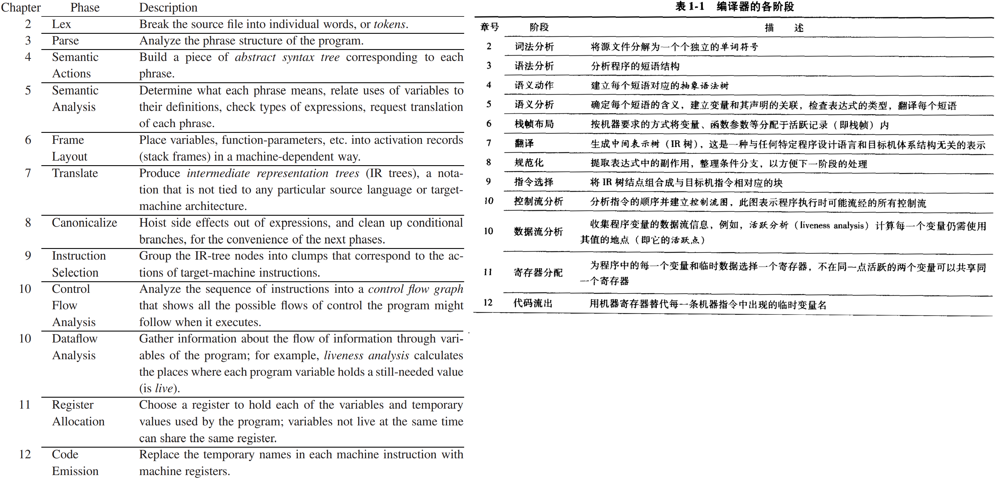

## 目录

[toc]

## 1.1 模块与接口

对于任何的大型软件系统，仔细设计系统的基本抽象和接口，有助于后续的理解和实现。

下图是编译器的各个模块（方框内部）与接口（方框之间），将编译器分成这样多个阶段是为了组件重用。

其中的接口有几种存在形式：

* 数据结构形式，如抽象语法（Abstract Syntac）、IR 树（IR Tree）和汇编（Assem）
* 抽象数据类型，如转换（Translate）、单词符号（Token）

在实践中，编译器的各个组件可以整合、调序、扩展优化，本书只是一个标准案例。




## 1.2 工具和软件

现代编译器中两种最有用的抽象工具是

* 上下文无关文法 
  * 用于语法分析
  * 工具 Yacc，将文法转换为语法分析器
* 正则表达式
  * 用于词法分析
  * 工具 Lex，将说明性规范转换为词法分析器 

## 1.3 树语言的数据结构

编译过程中会产生许多**中间表示**（intermediate representations），这些表示常以树结构存在，用于 [1.1 模块与接口](#1.1 模块与接口)中的接口。

本节构建一个简单的编程语言来介绍这些概念。

### 1.3.1 直线式程序语言 - 语法

该语言的语法如下，其包含语句（statement，执行无结果）和表达式（expressions，执行有数值），但没有循环和判断。

| 语法                                                | 名称                 | 说明                                                         |
| --------------------------------------------------- | -------------------- | ------------------------------------------------------------ |
| $Stm\rightarrow Stm\;;\;Stm$                        | $\text{CompoundStm}$ | 复合语句，$s_1;s_2$ 先执行 $s_1$，再执行 $s_2$               |
| $Stm\rightarrow \mathrm{id}:=Exp$                   | $\text{AssignStm}$   | 复制语句，$i:=e$ 先计算 $e$ 的值，然后存入 $i$ 中            |
| $Stm\rightarrow \mathrm{print}\left(ExpList\right)$ | $\text{PrintStm}$    | 输出语句，$\text{print}(e_1,e_2,\dots,e_n)$ 从左到右输出 $e$ 值，空格分开，换行结束 |
| $Stm\rightarrow \mathrm{id}$                        | $\text{IdExp}$       | 标识符表达式，$i$ 表示当前变量的内容                         |
| $Stm\rightarrow \mathrm{num}$                       | $\text{NumExp}$      | 数值表达式                                                   |
| $Stm\rightarrow Exp \; Binop \; Exp$                | $\text{OpExp}$       | 操作符表达式，$e_1 \; \text{op} \; e_2$ 先计算 $e_1$ 再计算 $e_2$，然后应用于二元操作符 $\text{op}$ |
| $Stm\rightarrow \left(Stm, Exp\right)$              | $\text{EseqExp}$     | 表达式序列，$(s,e)$ 在计算 $e$ 前先计算 $s$ 的**副作用（变量更新、类型变化）** |
| $ExpList\rightarrow Exp \;,\; ExpList$              | $\text{PairExpList}$ |                                                              |
| $ExpList\rightarrow Exp$                            | $\text{LastExpList}$ |                                                              |
| $Binop\rightarrow +$                                | $\text{Plus}$        |                                                              |
| $Binop\rightarrow -$                                | $\text{Minus}$       |                                                              |
| $Binop\rightarrow \times$                           | $\text{Times}$       |                                                              |
| $Binop\rightarrow /$                                | $\text{Div}$         |                                                              |

<u>例：直线式程序语言的中间表示</u>

```
a := 5 + 3 ; b := ( print ( a , a - 1 ) , 10 * a ) ; print ( b )
>> 8 7
>> 80
```

在编译器中，该源代码表示会转换为易于处理的树数据结构：


### 1.3.2 直线式程序语言 - 定义

```c
typedef char *string;
typedef struct A_stm_ *A_stm;
typedef struct A_exp_ *A_exp;
typedef struct A_expList_ *A_expList;
typedef enum {A_plus,A_minus,A_times,A_div} A_binop;

// 语句
struct A_stm_ {enum {A_compoundStm, A_assignStm, A_printStm} kind;	// 语句类型指示变量
               union {struct {A_stm stm1, stm2;} compound;			// 复合语句的存储值
                      struct {string id; A_exp exp;} assign;		// 赋值语句的存储值
                      struct {A_expList exps;} print;				// 输出语句的存储值
                     } u;
              };
A_stm A_CompoundStm(A_stm stm1, A_stm stm2);						// 复合语句构造函数
A_stm A_AssignStm(string id, A_exp exp);							// 赋值语句构造函数
A_stm A_PrintStm(A_expList exps);									// 输出语句构造函数

// 表达式
struct A_exp_ {enum {A_idExp, A_numExp, A_opExp, A_eseqExp} kind;			// 表达式类型指示变量
               union {string id;											// 标识符表达式的存储值
                      int num;												// 数值表达式的存储值
                      struct {A_exp left; A_binop oper; A_exp right;} op;	// 操作符表达式的存储值
                      struct {A_stm stm; A_exp exp;} eseq;					// 表达式序列的存储值
                     } u;
              };
A_exp A_IdExp(string id);													// 标识符表达式构造函数
A_exp A_NumExp(int num);													// 数值表达式构造函数
A_exp A_OpExp(A_exp left, A_binop oper, A_exp right);						// 操作符表达式构造函数
A_exp A_EseqExp(A_stm stm, A_exp exp);										// 表达式序列构造函数

struct A_expList_ {enum {A_pairExpList, A_lastExpList} kind;
                   union {struct {A_exp head; A_expList tail;} pair;
                          A_exp last;
                         } u;
                  };
```

【注1】程序设计风格

 

【注2】C 程序的模块化规则

 

## 1.4 直线式程序解释器

最后一节是自主练习，尝试去解释直线式程序语言。这里<u>先避免对语言的分析</u>，而将程序写成：

```c
// a := 5 + 3 ; b := ( print ( a , a - 1 ) , 10 * a ) ; print ( b )
A_stm prog = A_CompoundStm(
    A_AssignStm("a", A_OpExp(A_NumExp(5), A_plus, A_NumExp(3))),
    A_CompoundStm(
        A_AssignStm(
            "b",
            A_EseqExp(
                A_PrintStm(A_PairExpList(
                    A_IdExp("a"),
                    A_LastExpList(A_OpExp(A_IdExp("a"), A_minus, A_NumExp(1))))),
                A_OpExp(A_NumExp(10), A_times, A_IdExp("a")))),
        A_PrintStm(A_LastExpList(A_IdExp("b")))));
```

1. 编写函数 `int maxargs(A_stm)`，计算给定语句中所 `print` 语句的最大参数数量

   * 要注意表达式与语句的嵌套情况

2. 编写函数 `void interp(A_stm)`，对直线式程序语言进行解释

   * 建立一张表——将标识符映射到相应的整数值，形成 $(\mathrm{id}, int)$ 的列表

     ```c
     typedef struct table *Table_;
     struct table {string id; int value; Table_ tail};			// 表的数据结构
     Table_ Table(string id, int value, struct table *tail) {	// 表的构造函数，空表为 NULL
         Table_ t = malloc(sizeof(*t));
         t->id=id; t->value=value; t->tail=tail;
         return t;
     }
     ```

      

   * 构造两个互相递归的函数 `interpStm` 和 `interpExp`

     ```c
     // interpStm 详解
     // 函数输入为语句 s 和表 t，内部根据语句 s 的结果，在表中追加结点，最后输出新表。
     Table_ interpStm(A_stm s, Table_ t);	// interpStm 的函数声明
     ```

     ```c
     // interpExp 详解
     // 表达式有返回值和副作用，因此设计数据结构 IntAndTable。
     // 函数输入为表达式 e 和 表 t，内部完成表达式运算，修改表和返回值，输出 IntAndTable
     struct IntAndTable {int i; Table_ t;};
     struct IntAndTable interpExp(A_exp e, Table_ t) ···
     ```