### 1 使用 BDSP

#### 1 使用 hdfs url 格式

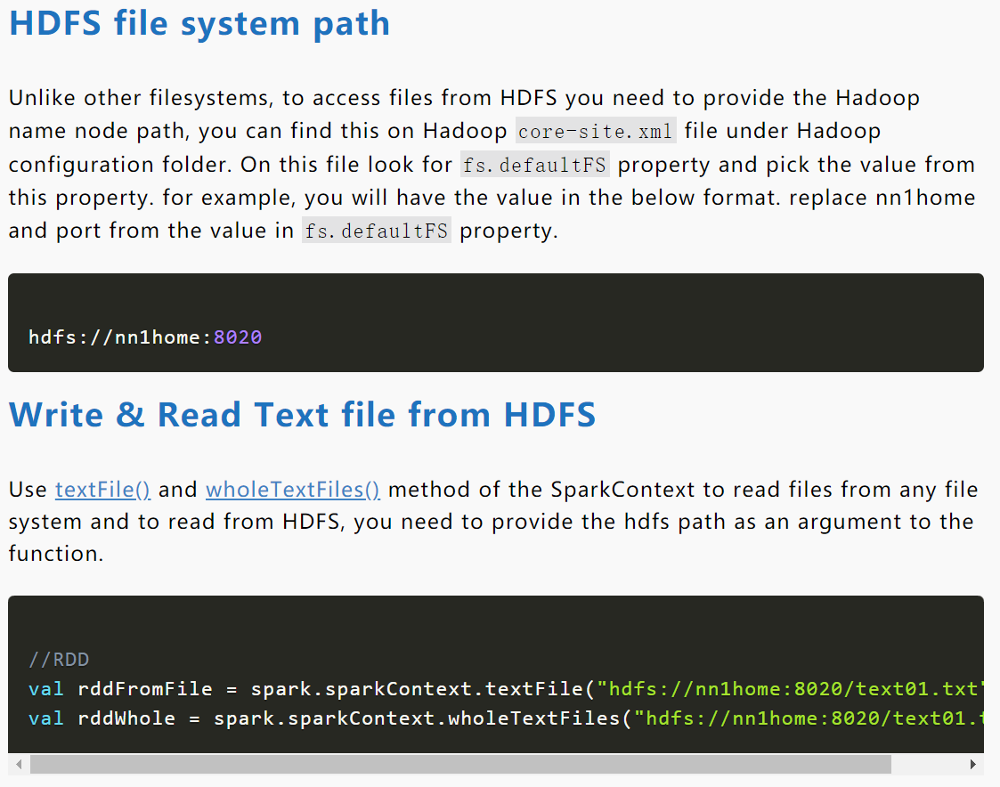

```scala
"hdfs://<ip:port>/user/Cloudera/Test"
```

来源：https://sparkbyexamples.com/spark/spark-read-write-files-from-hdfs-txt-csv-avro-parquet-json/

#### 2 去掉 hdfs 前缀

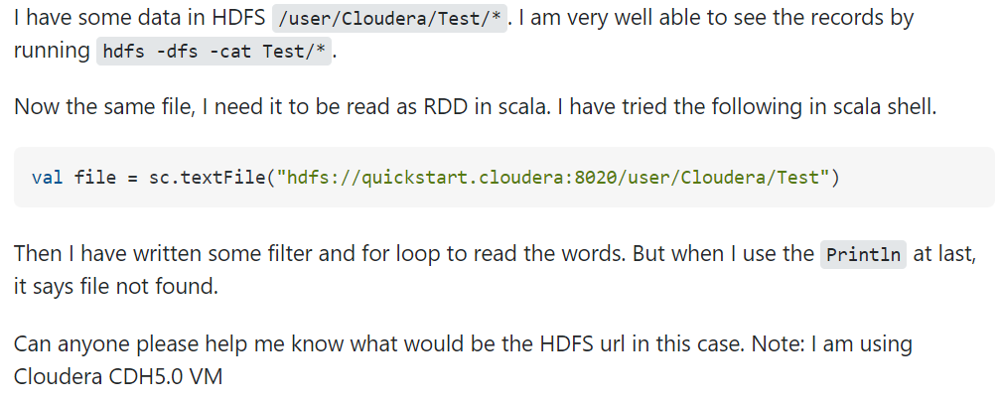

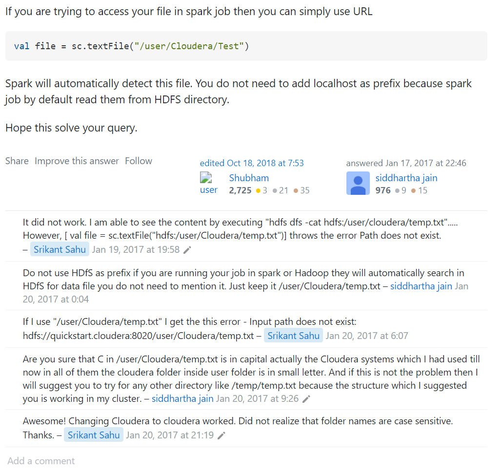

来源：https://stackoverflow.com/questions/41706343/url-for-hdfs-file-system

#### 3 查找 hdfs url 的方法

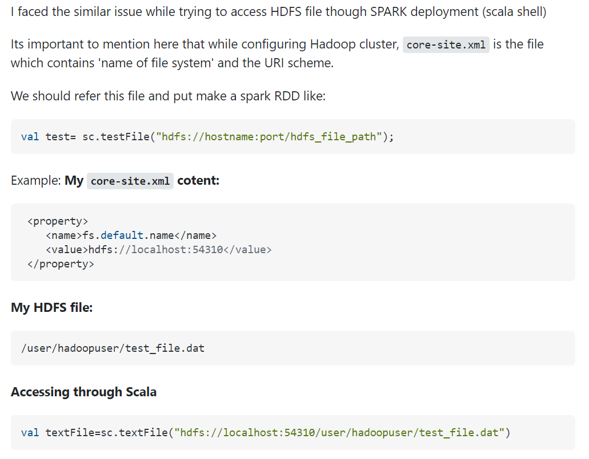

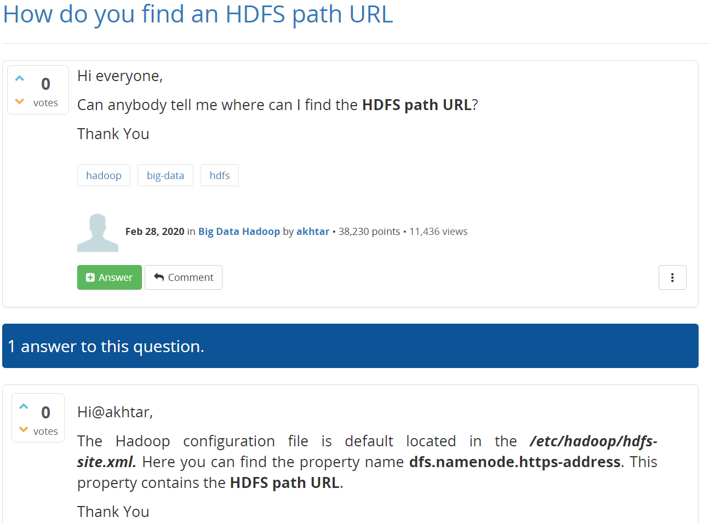


---

#### hadoop 配置文件详解

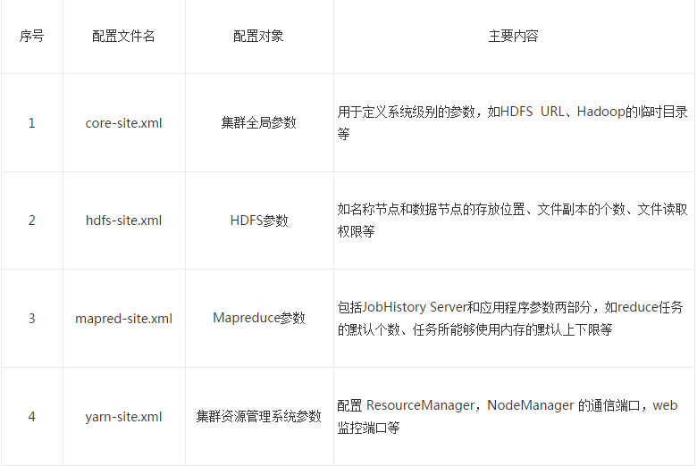

1. `core-site.xml`

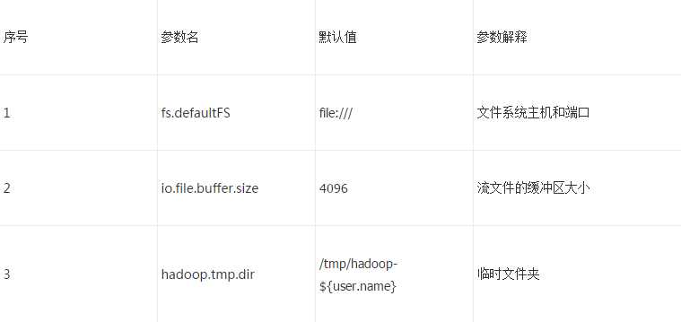

2. `hdfs-site.xml`

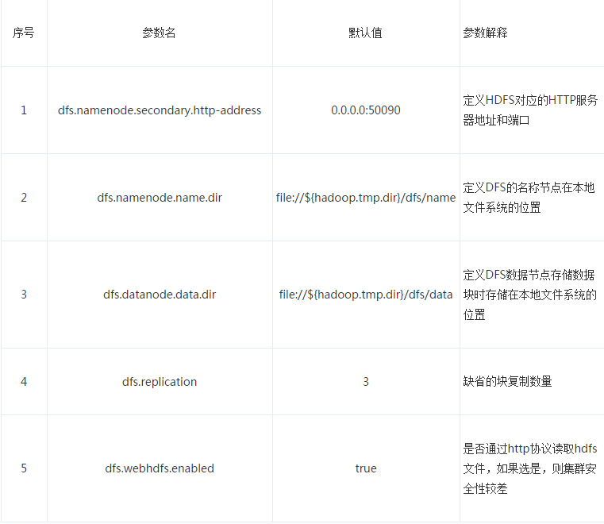

3. `mapred-site.xml`

 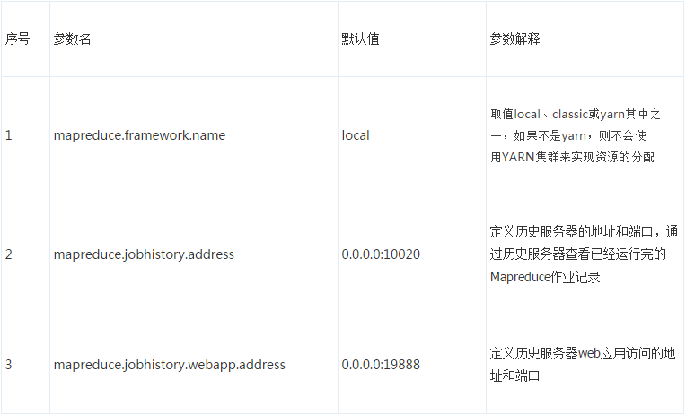

4. `yarn-site.xml`

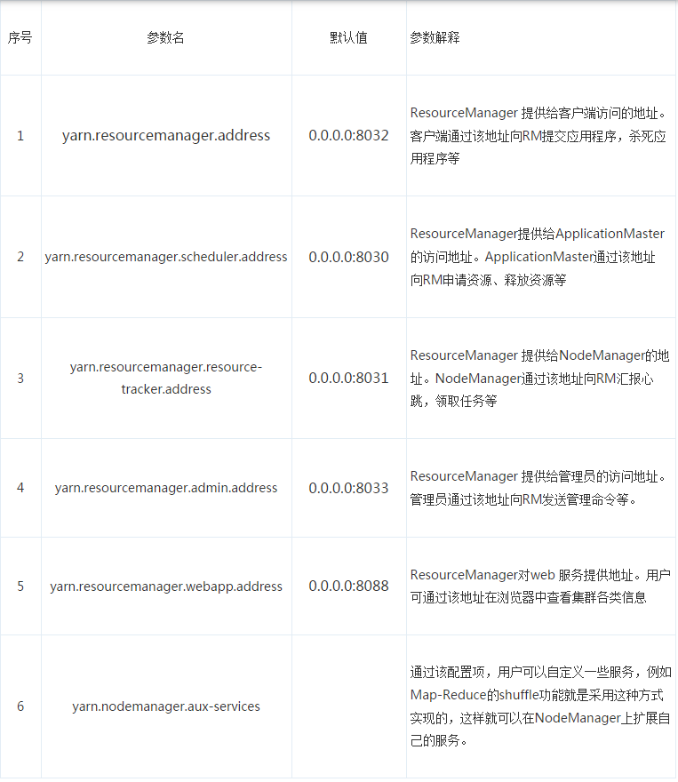

### 2 尝试更小的数据

### 3 直接用 Spark 分布式存储

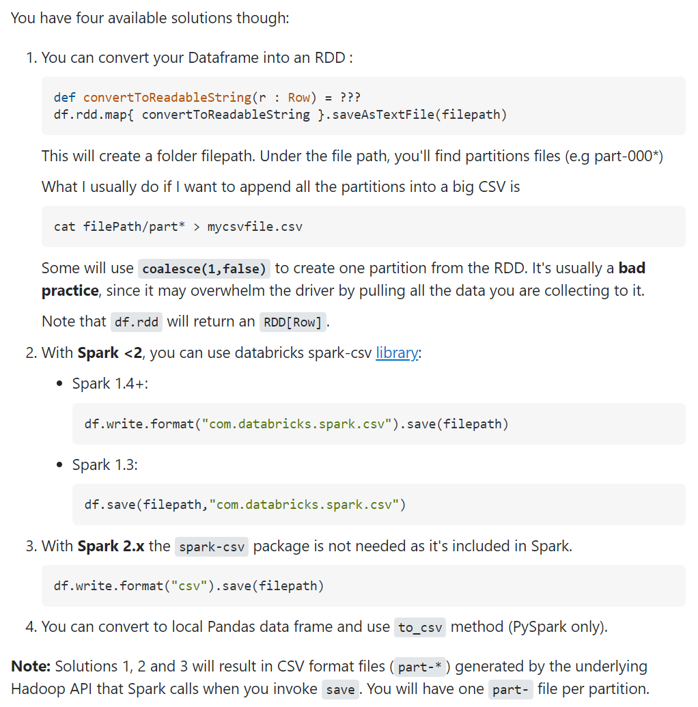

来源：https://stackoverflow.com/questions/33174443/how-to-save-a-spark-dataframe-as-csv-on-disk

**使用 parquet**

https://stackoverflow.com/questions/57155855/how-we-save-a-huge-pyspark-dataframe

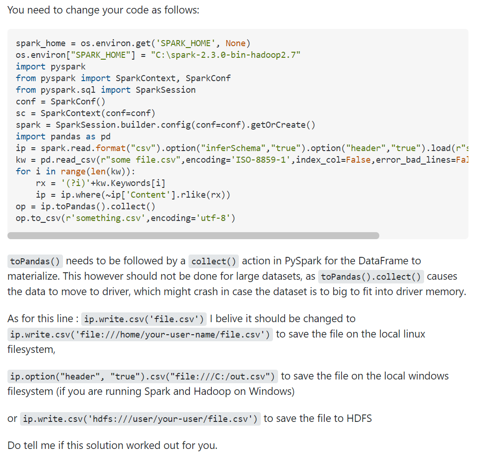

来源：https://stackoverflow.com/questions/50754517/df-topandas-failed-to-locate-the-winutils-binary-in-the-hadoop-binary-path

**曲线救国**


来源：https://stackoverflow.com/questions/69900672/conversion-issue-for-spark-dataframe-to-pandas

### 4 在 spark 上使用 pyspark api

**Pandas API on Spark**

https://spark.apache.org/docs/latest//api/python/user_guide/pandas_on_spark/index.html
